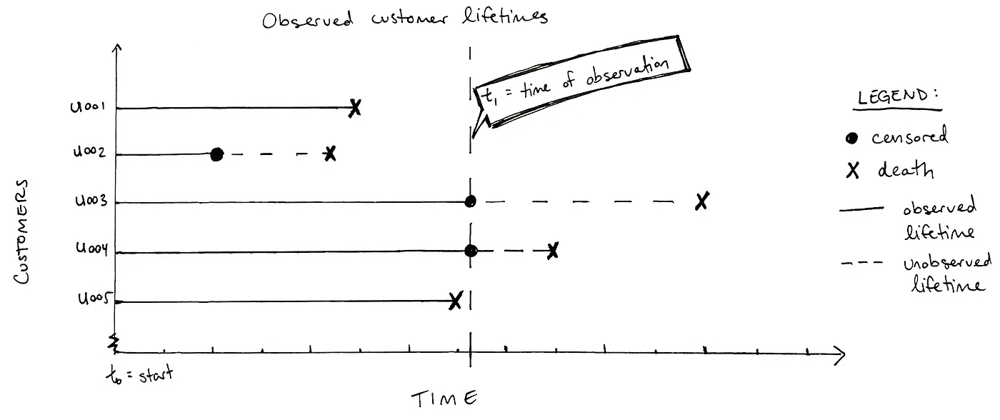
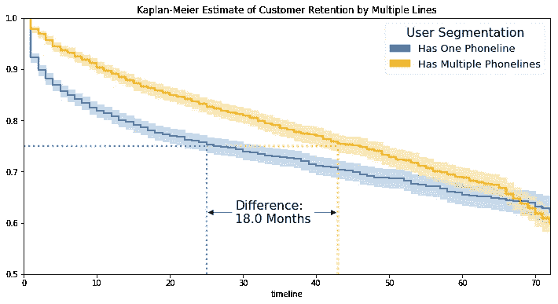

# 探索 Python 中客户流失的生存分析

> 原文：<https://towardsdatascience.com/survival-analysis-in-python-a-model-for-customer-churn-e737c5242822?source=collection_archive---------2----------------------->

生存分析是指一套统计技术，用于推断*、【寿命】、*或事件时间序列，而无需观察训练集中每个受试者感兴趣的事件。感兴趣的*事件*有时被称为受试者的*【死亡】*，因为这些工具最初被用于在临床试验中分析药物治疗对患者存活率的影响。

同时，*客户流失*(定义为 c *客户保持*的反义词)是许多面向客户的企业渴望最小化的关键成本。没有[预测哪些客户会流失的银弹方法](https://www.kdnuggets.com/2017/03/datascience-building-predictive-churn-model.html)(在[如何定义客户是否已经流失非订阅产品](https://www.datascience.com/blog/intro-to-predictive-modeling-for-customer-lifetime-value)时，必须小心谨慎)，但是*生存分析*为探索时间-事件系列*提供了有用的工具。*

# 为什么我们不能用 OLS 线性回归呢？

OLS 通过绘制最小化误差平方和的回归线来工作。然而，对于未观察到的数据，误差项是未知的，因此不可能使这些值最小化。

简单地将审查的日期作为所有受试者已知的有效最后一天，或者更糟的是，删除所有被审查的受试者会使我们的结果产生偏差。

Not all deaths have been observed by t1, the time of observation. Image by author.

在上图中，U002 从损失到跟进都经过了审查(例如，可能是由于账户上的一个未解决的技术问题导致客户在数据提取时的状态未知)，而 U003 和 U004 经过了审查，因为它们是当前客户。截止到 *t1* ，只有 U001 和 U005 都观察到了出生和死亡。如图所示，删除未观察到的数据会低估客户的寿命，并使我们的结果产生偏差。

生存分析处理事件*审查*完美无缺。被审查的客户，是死亡没有被观察到的客户。发生这种情况的主要原因是在观察时客户的生命周期尚未结束。(注意:在临床试验中，*失访*或退出研究的患者也被视为审查对象。)

# 卡普兰-迈耶曲线

对于每个主体(或顾客，或用户)只能有一个“出生”(注册、激活或签约)和一个“死亡”(不管是否被观察到)的任何问题，第一个也是最好的起点是卡普兰-迈耶曲线。这将允许我们估计一个或多个队列的“生存函数”,这是生存分析中最常用的统计技术之一。

生存分析可以作为一种探索性的工具，用来比较不同群体、不同客户群或不同客户原型之间的客户寿命差异。在 Python 中，我们可以使用 Cam Davidson-Pilon 的[生命线](https://github.com/CamDavidsonPilon/lifelines)库来开始。

以这个 [IBM Watson telco 客户演示数据集](https://www.ibm.com/communities/analytics/watson-analytics-blog/predictive-insights-in-the-telco-customer-churn-data-set/)为例。通过对单条电话线与多条电话线的二元特征进行分段，我们得到以下 Kaplan-Meier 曲线。

Customers with one phone line have a steeper survival curve initially, but by ~4 years 3 months customer lifetime the error bars make the two groups indistinguishable. Image generated using matplotlib by author.

我们可以看到，在只有一条电话线的用户中，有 1/4 的用户在第 25 个月时发生了变化。相比之下，在拥有多条电话线路的用户中，1/4 的用户在 43 个月前流失，相差 18 个月(额外 1.5 年的收入！)

相关性不是因果关系，因此这张图本身不能被认为是“可操作的”。然而，我们可能会看到这一点，并开始怀疑一些可能性，如拥有多条电话线的客户更“固定”，因此比单电话线用户更不容易流失。另一方面，也许更忠诚的客户首先倾向于选择多条电话线。

谁应该得到更多的投资？如果这两个集团的利润相当，那么花更多的钱来让单线电话用户满意可能是值得的，因为他们目前倾向于更快地流失。或者，一个实验性设计可以揭示一些激励措施可以使*所有客户、*的生命周期翻倍，并且由于多线路用户的生命周期最初往往更长，这种倍增效应实际上会为该细分市场带来更多利润。

如果没有更多的背景，以及可能的实验设计，我们无法确定。

# 卡普兰-迈耶曲线的利弊

**优点:**

*   需要最少的功能集。Kaplan-Meier 只需要事件发生的时间(死亡或审查)和出生与事件之间的生命周期。
*   许多时间序列分析很难实现。卡普兰-迈耶只需要所有的事件都发生在感兴趣的同一时间段内
*   自动处理类别不平衡(死亡与审查事件的任何比例都可以)
*   因为它是一种非参数方法，所以很少对数据的基本分布进行假设

**缺点:**

*   无法估计感兴趣的生存-预测关系差异的*大小*(无风险比或相对风险)
*   无法在事件发生时间研究中同时考虑每个受试者的多个因素，也无法控制混杂因素
*   假设删截和存活之间是独立的，这意味着在时间【that，那些已经删截的人应该和那些没有删截的人有相同的预后。
*   因为它是一个非参数模型，在底层数据分布已知的问题上，它不如竞争技术有效或准确

# 现在自己试试吧！

要查看我是如何制作这个卡普兰-迈耶图的，并开始你自己的生存分析，从我的 Github 账户下载 [jupyter 笔记本](https://github.com/loldja/loldja.github.io/blob/master/assets/code/blog/Kaplan%20Meier%20demo.ipynb)。

[*Lauren Oldja*](http://laurenoldja.net) *是纽约布鲁克林的一名数据科学家。*