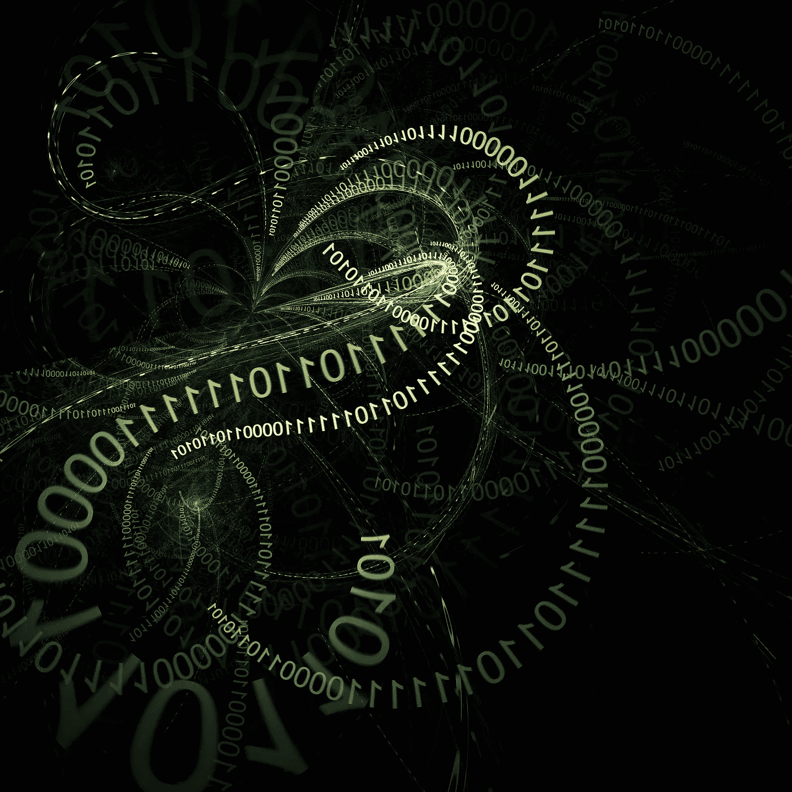
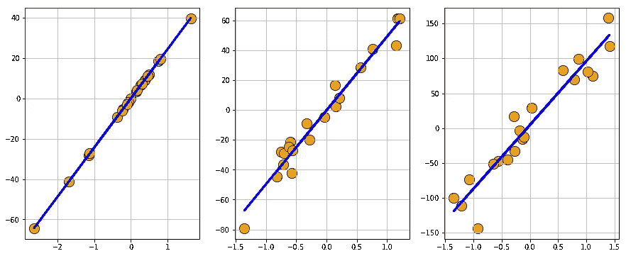
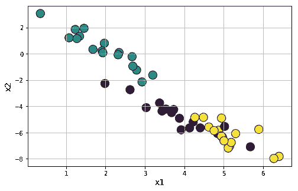
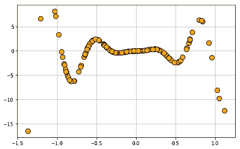
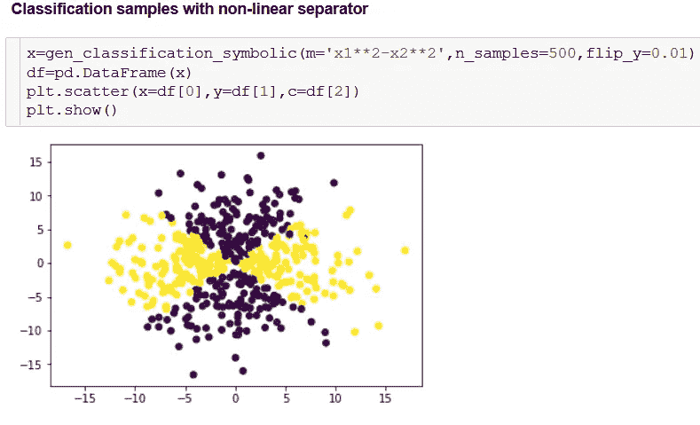
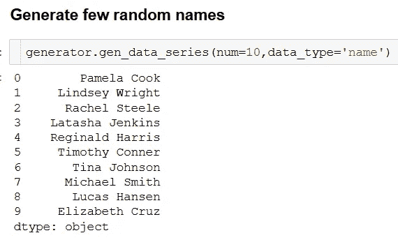
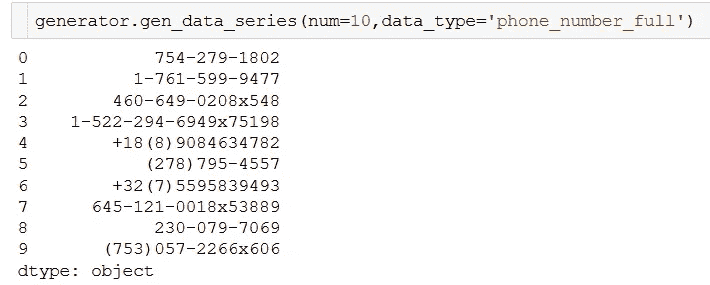

# 合成数据生成—新数据科学家的必备技能

> 原文：<https://towardsdatascience.com/synthetic-data-generation-a-must-have-skill-for-new-data-scientists-915896c0c1ae?source=collection_archive---------1----------------------->

## 简要概述为自驱动数据科学项目生成合成数据的方法/包/想法，并深入研究机器学习方法。

## 介绍

数据是新的石油，说实话，只有少数几个大玩家对这种货币拥有最强的控制力。这个世界的谷歌和 Facebooks 对他们最新的机器学习算法和软件包如此慷慨(他们免费提供这些)，因为算法世界的**准入门槛现在相当低**。开源已经走过了漫长的道路，从被史蒂夫·鲍尔默等人称为邪恶的 T4 到成为微软不可或缺的一部分。大量开源项目正在推动数据科学、数字分析和机器学习的发展。

> 站在 2018 年我们可以有把握地说， [**算法、编程框架、机器学习包(甚至是如何学习这些技术的教程和课程)都不是稀缺资源而优质数据才是**。](https://hbr.org/2015/03/data-monopolists-like-google-are-threatening-the-economy)

对于数据科学和机器学习的初学者来说，这通常会产生一个复杂的问题。几年前，当我开始这条道路的旅程时，我自己也面临着这个问题。

让我也非常清楚地表明，在这篇文章中，**我只是在谈论用于学习目的的数据的稀缺性，而不是用于运行任何商业操作。**这不是关于如何为你正在开发的酷炫旅行或时尚应用获取优质数据的讨论。这种消费者、社会或行为数据收集有其自身的问题。然而，即使是像访问高质量数据集这样简单的事情，以开始一个人的数据科学/机器学习之旅，最终也不是那么简单。

## 对自驱动数据科学至关重要

[数据科学热销](https://www.forbes.com/sites/quora/2017/10/25/why-data-science-is-such-a-hot-career-right-now/#3b003c35106b)。而且，[人们正在转向数据科学](https://www.infoworld.com/article/3233275/data-science/thinking-about-a-career-switch-to-data-science.html)。他们正在改变职业，支付新兵训练营和在线 MOOCs 的费用，在 LinkedIn 上建立关系网。但是，一旦他们通过了正规的课程，进入了一个不确定的领域，许多这样的新人就很难保持学习新技能的动力。

> 解决什么问题？[关注哪个 MOOC](/how-to-choose-effective-moocs-for-machine-learning-and-data-science-8681700ed83f)？参加什么高尔夫球比赛？学什么新 ML 包？[在 Github 上展示什么样的项目](https://www.quora.com/What-should-a-data-scientists-GitHub-account-look-like)？[需要掌握多少数学技能](/essential-math-for-data-science-why-and-how-e88271367fbd)？

基本上，**如何建立一个伟大的数据科学组合**？— [根据一篇非常受欢迎的文章，答案是通过做公共工作](/how-to-build-a-data-science-portfolio-5f566517c79c)，例如，为开源做贡献，展示创新思维和对数据建模、辩论、可视化或机器学习算法的原创贡献。

 [## 如何构建数据科学产品组合

### 数据科学怎么找工作？了解足够的统计，机器学习，编程等，能够得到一个…

towardsdatascience.com](/how-to-build-a-data-science-portfolio-5f566517c79c) 

但可悲的是，往往没有仁慈的指导或导师，往往，一个人必须自我推动。

据说，能够成功穿越这一灰色地带的人已经在**自驱动数据科学**领域找到了他/她的魔力。那个人会走得很远。但是，为了使这一旅程卓有成效，他(她)必须能够访问高质量的数据集进行实践和学习。

## 丰富的学习体验可能需要什么样的数据？

想象一下，你正在摆弄一个很酷的机器学习算法，比如 SVM 或深度神经网络。你应该在什么样的数据集上练习它们？如果您是从零开始学习，建议您从简单的小规模数据集开始，您可以在二维空间中绘制这些数据集，以便直观地理解模式，并以直观的方式亲自查看 ML 算法的工作情况。例如，这里有一篇关于各种数据集的[优秀文章，你可以在不同的学习水平上尝试](https://www.analyticsvidhya.com/blog/2018/05/24-ultimate-data-science-projects-to-boost-your-knowledge-and-skills/)。

 [## 24 个终极数据科学项目，提升您的知识和技能(可以免费访问)

www.analyticsvidhya.com](https://www.analyticsvidhya.com/blog/2018/05/24-ultimate-data-science-projects-to-boost-your-knowledge-and-skills/) 

这是一个很好的开始。但这还不是全部。

当然，你可以更上一层楼，给自己找一个真实的大型数据集来练习算法。

但那仍然是一个固定的数据集，有固定的样本数，固定的模式，固定的正负样本的类分离度(如果我们假设是分类问题)。

你在学习算法的所有复杂之处吗

*   [样本复杂度](https://en.wikipedia.org/wiki/Sample_complexity)，
*   计算效率，
*   处理[阶层失衡](https://machinelearningmastery.com/tactics-to-combat-imbalanced-classes-in-your-machine-learning-dataset/)的能力，
*   面对不同程度的类分离时度量的稳健性
*   [偏差-方差权衡](/understanding-the-bias-variance-tradeoff-165e6942b229)作为数据复杂性的函数

大概不会。没有一个数据集能够为给定的 ML 算法提供所有这些深刻的见解。但是，要成为一名真正的机器学习专家，这些都是非常重要的见解。

> 因此，你将需要一个极其丰富和足够大的数据集，它足够适合所有这些实验。

## 你能做什么？

那么，在这种情况下你能做什么呢？在互联网上搜寻更多的数据集，并希望其中一些能够揭示与特定算法相关的限制和挑战，并帮助你学习？

**是的，这是一种可能的方法，但在时间和精力方面可能不是最可行或最佳的方法**。好的数据集可能不干净或不容易获得。你可能会花更多的时间去寻找、提取和讨论一个合适的数据集，而不是花更多的时间去理解 ML 算法。

> 搜索现实生活中的数据集、提取它、运行探索性数据分析，并与它争论以使其为基于机器学习的建模做好适当准备的经历是无价的。我目前正在写一个关于这个主题的课程/书。

但这可以单独教授和练习。然而，在许多情况下，你可能只是想访问一个灵活的数据集(或几个数据集)来“教”你 ML 算法的所有血淋淋的细节。

令人惊讶的是，在许多情况下，这种教学可以用合成数据集来完成。

## 什么是合成数据集？

顾名思义，非常明显，合成数据集是以编程方式生成的数据的存储库。所以，它没有被任何现实生活中的调查或实验所收集。因此，它的主要目的是足够灵活和丰富，以帮助 ML 从业者用各种分类、回归和聚类算法进行引人入胜的实验。期望的特性是，

*   它可以是数字、二进制或分类(序数或非序数)，
*   特征的**数量和数据集的长度**应该是任意的
*   优选地，它应该是**随机的**，并且用户应该能够选择各种各样的**统计分布**作为该数据的基础，即，潜在的**随机过程可以被精确地控制和调整**，
*   如果用于分类算法，那么**类别分离度**应该是可控的，以使学习问题容易或困难，
*   **随机噪声**可以可控方式插入
*   对于回归问题，一个复杂的**非线性生成过程**可用于获取数据

虽然在本文中，我们的讨论仅限于更好的 ML 算法的合成数据，但在它**有助于解决真实数据集**的安全和隐私问题的情况下，它的目的可能是深远的，因为真实数据集不能用于或获取学习目的。例如，想想医疗或军事数据。这里有一篇关于这些方法的精彩总结文章。

在接下来的几节中，我们将展示一些快速生成合成数据集的方法，用于实践统计建模和机器学习。

演示笔记本可以在我的 Github 库 这里找到 [**。**](https://github.com/tirthajyoti/Machine-Learning-with-Python/blob/master/Synthetic_data_generation/Synthetic-Data-Generation.ipynb)

## 使用 scikit-learn 方法生成数据

Scikit-learn 是一个了不起的 Python 库，用于经典的机器学习任务(即，如果你不特别关心深度学习)。然而，尽管它的 ML 算法被广泛使用，但它提供的很酷的合成数据生成功能却不太受欢迎。

 [## sci kit-learn:Python 中的机器学习

scikit-learn.org](https://scikit-learn.org/stable/) 

这里是一个快速纲要，

[**回归问题生成**](https://scikit-learn.org/stable/modules/generated/sklearn.datasets.make_regression.html) : Scikit-learn 的`**dataset.make_regression**` 函数可以创建任意数量的输入特征、输出目标以及它们之间的信息耦合度可控的随机回归问题。它也可以混合高斯噪声。

**Fig**: Random regression problem generation using scikit-learn with varying degree of noise.

[**分类问题生成**](https://scikit-learn.org/stable/modules/generated/sklearn.datasets.make_classification.html#sklearn.datasets.make_classification) :类似于上面的回归函数，`**dataset.make_classification**`生成一个随机的多类分类问题(数据集)，具有可控的类分离和添加的噪声。如果需要，还可以随机翻转任意百分比的输出符号来创建更难的分类数据集。

**Fig**: Random classification problem generation using scikit-learn with varying class separation.

[**聚类问题生成**](https://scikit-learn.org/stable/modules/generated/sklearn.datasets.make_blobs.html#sklearn.datasets.make_blobs) :生成有趣聚类的函数相当多。最直接的方法是`datasets.make_blobs`，它可以生成任意数量的簇，并且距离参数是可控的。

**Fig**: Simple cluster data generation using scikit-learn.

**各向异性集群生成**:通过使用矩阵乘法的简单转换，您可以生成沿某个轴对齐或各向异性分布的集群。

**Fig**: Anisoproically aligned cluster data generation using scikit-learn.

[**同心环簇数据生成**](https://scikit-learn.org/stable/modules/generated/sklearn.datasets.make_circles.html#sklearn.datasets.make_circles) :对于测试基于相似性的聚类算法或高斯混合模型，以特殊形状生成簇是很有用的。我们可以使用`**datasets.make_circles**`函数来完成。

当然，我们可以在数据中混入一些噪声来测试聚类算法的鲁棒性，

[**月形聚类数据生成**](https://scikit-learn.org/stable/modules/generated/sklearn.datasets.make_moons.html#sklearn.datasets.make_moons) :我们也可以使用`**datasets.make_moons**`函数生成用于测试算法的月形聚类数据，噪声可控。

## 用任意符号表达式生成数据

虽然前面提到的函数从一开始就很棒，**用户不容易控制数据生成的底层机制，回归输出也不是输入的决定性函数，它们确实是随机的**。虽然这对于许多问题来说可能已经足够了，但人们可能经常需要一种可控的方式来基于明确定义的函数产生这些问题(*涉及线性、非线性、理性甚至超越项*)。

例如，我们想要评估各种[内核化](https://www.cs.cmu.edu/~ggordon/SVMs/new-svms-and-kernels.pdf) [SVM 分类器](https://en.wikipedia.org/wiki/Support_vector_machine)在具有越来越复杂分隔符(线性到非线性)的数据集上的功效，或者想要证明[线性模型对于由理性或超越函数](https://github.com/tirthajyoti/Machine-Learning-with-Python/blob/master/Function%20Approximation%20by%20Neural%20Network/Function%20approximation%20by%20linear%20model%20and%20deep%20network.ipynb)生成的回归数据集的局限性。使用 scikit-learn 的这些功能很难做到这一点。

此外，用户可能只想输入一个符号表达式作为生成函数(或分类任务的逻辑分隔符)。仅仅使用 scikit-learn 的实用程序很难做到这一点，必须为每个新的实验实例编写自己的函数。

为了解决符号表达式输入的问题，人们可以很容易地利用[惊人的 Python 包 SymPy](https://www.sympy.org/en/index.html) ，它允许理解、渲染和评估符号数学表达式，达到相当高的复杂程度。

在[我以前的一篇文章](/random-regression-and-classification-problem-generation-with-symbolic-expression-a4e190e37b8d)中，我已经详细阐述了如何在 SymPy 库的基础上构建并创建类似于 scikit-learn 中可用的函数，但可以生成具有高度复杂性的符号表达的回归和分类数据集。查看这里的文章和我的 Github 仓库中的实际代码 。

 [## 用符号表示的随机回归和分类问题生成

### 我们描述了如何使用 SymPy，我们可以为多项式(和非线性)回归和…

towardsdatascience.com](/random-regression-and-classification-problem-generation-with-symbolic-expression-a4e190e37b8d) 

例如，我们可以将一个符号表达式作为平方项( ***x*** )和正弦项(如***sin*(*x*)**)的乘积，并从中创建一个随机回归数据集。

**Fig**: Randomized regression dataset with symbolic expression: ***x².sin(x)***

或者，可以生成基于非线性椭圆分类边界的数据集，用于测试神经网络算法。**注意**，在下图中，用户如何输入**一个符号表达式** `m='x1**2-x2**2'` 并生成这个数据集。

**Fig**: Classification samples with non-linear separator.

## 使用“pydbgen”库生成分类数据

虽然网上有许多高质量的真实数据集可用于尝试很酷的机器学习技术，但从我的个人经验来看，我发现在学习 SQL 时并非如此。

对于数据科学专业知识来说，基本熟悉 SQL 几乎与知道如何用 Python 或 r 编写代码一样重要。但是访问一个足够大的数据库，其中包含真实的分类数据(如姓名、年龄、信用卡、SSN、地址、生日等)。)远不如访问 Kaggle 上专门为机器学习任务设计或管理的玩具数据集常见。

除了数据科学的初学者之外，即使是经验丰富的软件测试人员也会发现拥有一个简单的工具是有用的，在这个工具中，通过几行代码，他们可以生成任意大的数据集，其中包含随机的(伪造的)但有意义的条目。

输入 **pydbgen** 。[在这里看文档](http://pydbgen.readthedocs.io/en/latest/#)。

这是一个[轻量级的纯 python 库](https://github.com/tirthajyoti/pydbgen)，用于生成随机有用的条目(如姓名、地址、信用卡号、日期、时间、公司名称、职位、车牌号等)。)并将它们保存在 Pandas dataframe 对象中，或者作为数据库文件中的 SQLite 表，或者保存在 MS Excel 文件中。

 [## pydbgen 简介:一个随机数据帧/数据库表生成器

### 一个轻量级的 Python 包，用于生成随机数据库/数据帧，用于数据科学、学习 SQL、机器…

towardsdatascience.com](/introducing-pydbgen-a-random-dataframe-database-table-generator-b5c7bdc84be5) 

你可以阅读上面的文章了解更多细节。这里，我将通过截图展示几个简单的数据生成示例，

**Fig**: Generate random names using pydbgen library.

**生成几个国际电话号码，**

**Fig**: Generate random phone numbers using pydbgen library.

**生成一个完整的数据帧，随机输入姓名、地址、SSN 等。，**

**Fig**: Generate full data frame with random entries using pydbgen library.

# 总结和结论

我们讨论了在进入令人兴奋的数据科学和机器学习世界的旅程中，访问高质量数据集的重要性。通常，缺乏足够灵活和丰富的数据集限制了人们深入研究机器学习或统计建模技术内部工作的能力，并使理解变得肤浅。

在这方面，合成数据集可以提供极大的帮助，并且有一些现成的函数可以尝试这种方法。然而，有时希望能够基于复杂的非线性符号输入生成合成数据，我们讨论了一种这样的方法。

要为计算机视觉和复杂的人工智能模型生成合成数据，请查看这篇文章。

 [## 人工智能和计算机视觉综合数据终极指南

### 人工智能和计算机视觉的合成数据终极指南什么是合成数据？合成数据是…

www.simerse.com](https://www.simerse.com/synthetic-data/) 

此外，我们还讨论了一个令人兴奋的 Python 库，它可以为数据库技能练习和分析任务生成随机的真实数据集。

[**相关代码在此。**](https://github.com/tirthajyoti/Synthetic-data-gen/tree/master/Notebooks)

> 本文的目标是展示年轻的数据科学家不必因为没有合适的数据集而陷入困境。相反，他们应该寻找和设计自己的编程解决方案，为他们的学习目的创建合成数据。

一路上，他们可能会学到许多新技能，打开新的机会之门。

喜欢这篇文章吗？成为 [***中等会员***](https://medium.com/@tirthajyoti/membership) *继续* ***无限制学习*** *。如果您使用下面的链接，* ***，我将收取您的一部分会员费，而不会对您产生额外费用*** *。*

 [## 通过我的推荐链接加入媒体

### 作为一个媒体会员，你的会员费的一部分会给你阅读的作家，你可以完全接触到每一个故事…

medium.com](https://medium.com/@tirthajyoti/membership)