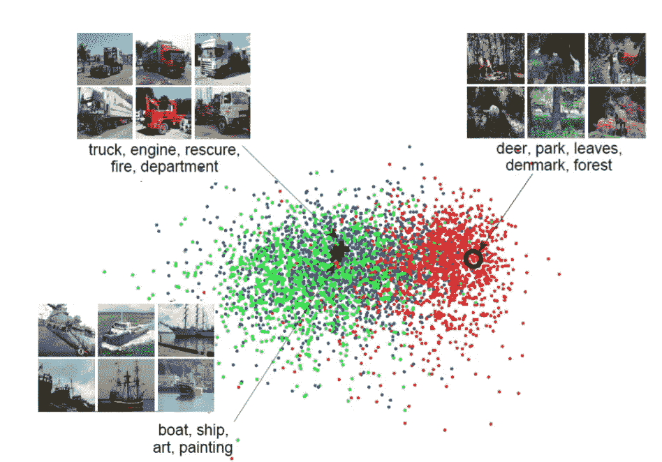
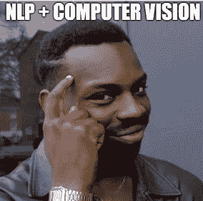
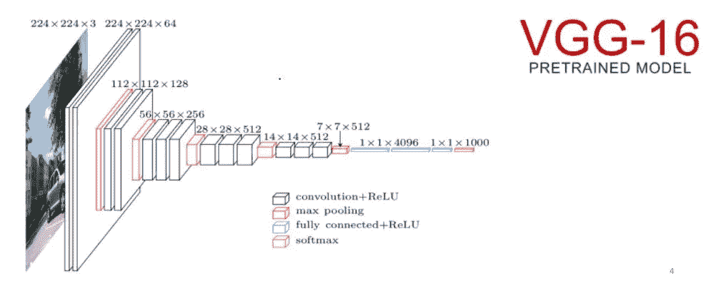
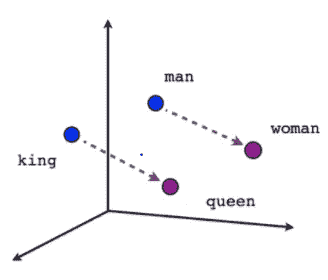
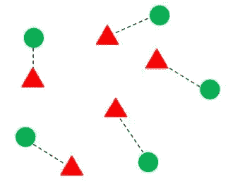
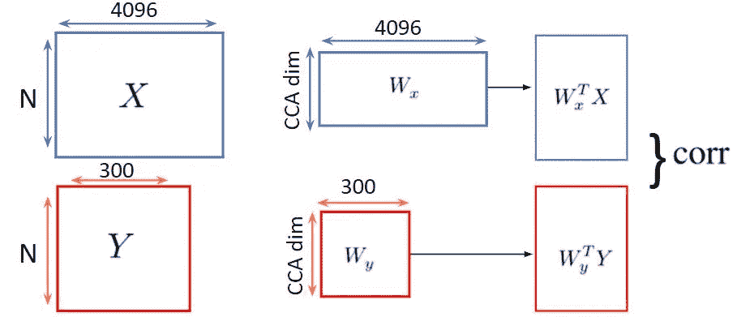
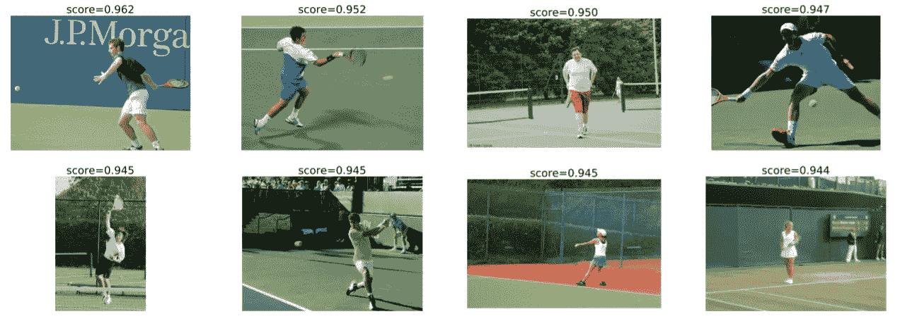
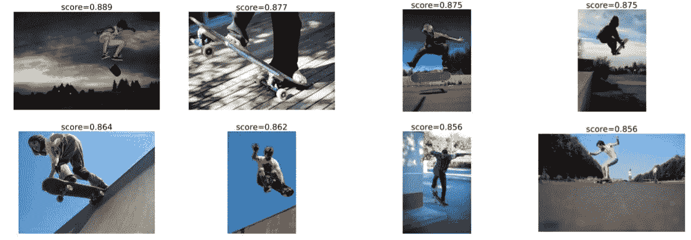
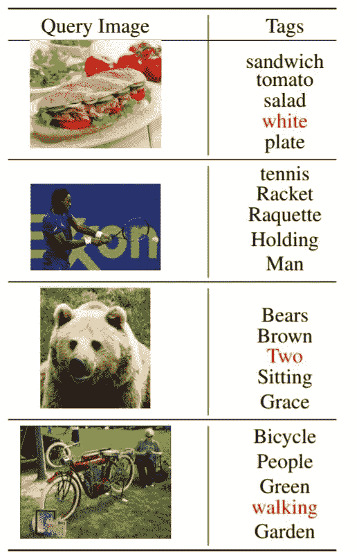

# Tag2Image 和 Image2Tag —图像和文本的联合表示

> 原文：<https://towardsdatascience.com/tag2image-and-image2tag-joint-representations-for-images-and-text-9ad4e5d0d99?source=collection_archive---------4----------------------->

对人类来说，解析一个复杂的场景并描述其内容并不是一项复杂的任务。的确，人们可以用几句话迅速概括一个复杂的场景。但是对计算机来说要复杂得多。为了生产能够实现这一点的系统，我们需要结合计算机视觉和自然语言处理领域的最新技术。

作为第一步，我们将了解如何为视觉图像和文本数据生成特征向量。然后描述 CCA 算法，它将帮助我们在一个公共空间中连接构造的特征。最后，在[微软 COCO 数据集](http://cocodataset.org/#home)上呈现两条流水线( **Text2Image** 和 **Image2Text** )的结果。

# 迁移学习

## 图像特征

卷积神经网络(CNN)可用于从图像中提取特征。在 ImageNet 上预训练的 16 层 VGGNet 就是一个例子。这是 2014 年 ImageNet 挑战赛中最先进的模型。我们只需要移除最后一个完全连接的层，并将 CNN 的其余部分视为数据集的固定特征提取器。这将为每个图像计算 4096-D 向量。

VGG-16 Architecture

## 标签功能

单词嵌入是一组自然语言处理工具，旨在将单词映射到一个高几何空间。换句话说，单词嵌入功能将文本语料库作为输入，并产生单词向量作为输出，使得任意两个向量之间的距离将捕获两个相关单词之间的部分语义关系。

例如，“学生”和“飞机”是语义不同的词，所以合理的嵌入空间应该将它们表示为相距很远的向量。但是“早餐”和“厨房”是有关联的词，所以需要紧密嵌入。

Word embedding space example

为了实现这种映射，我们可以使用任何最先进的预训练模型:Word2Vec(在谷歌新闻数据集上预训练的 300 维单词向量)或 GLOVE(在带有 1.9M vocab 的普通爬行数据集上预训练的 300 维单词向量)

# 典型相关分析

现在，我们将给出一个流行的和成功的方法，将视觉和文本特征映射到同一个潜在空间。

Two-view CCA minimizes the distance (equivalently, maximizes the correlation) between images (triangles) and their corresponding tags (circles)

给定 2 组 N 个向量: **X** 表示图像特征， **Y** 表示文本特征。分别设它们的协方差**σ**xx 和**σ**YY，设**σ**xy 为互协方差。

线性典型相关分析(CCA)寻找使两个视图的相关性最大化的线性投影对:

CCA 目标可以写成以下优化问题:

设 x 和 y 分别是表示文本和视觉数据的点。为了比较 x 和 y，我们可以使用余弦相似度:

Similarity function

# 定性结果

在 MS COCO 数据集中，每幅图像由 5 个标题描述。第一步包括通过删除所有停用词来预先拥有这些标题，然后将它们连接起来以获得一个单词包(BoW)。然后，我们使用 TF-IDF 技术对所有嵌入的单词进行加权平均，该技术基于单词在每个字幕中出现的频率对单词进行加权。

Example of an image and its corresponding captions

## tag 2 图像

对于这个任务，我们的目标是检索由给定查询文本描述的图像。给定一个查询文本，我们首先将其特征向量投影到 CCA 空间，然后用它从数据库中检索最相似的图像特征。

质疑 1:“**一个打网球的人”。**

质疑 2: **“一个人踩着滑板在空中跳跃”。**

我们可以清楚地注意到，检索到的图像与查询图像非常接近。

## 图像 2 标签

这里，我们的目标是找到一组正确描述查询图像的标签。给定一个查询图像，我们首先将其特征向量投影到 CCA 空间，然后用它来检索最相似的文本特征。

通常，检索到的关键字很好地描述了查询图像。但是，我们可以识别一些错误(红色)。例如，在最后一个例子中，单词“walking”被错误地检索到。我们认为这可能是由于训练集中有许多图像同时包含“人”和“行走”。

# 结论

典型相关分析可以用来建立多模态检索的管道。给定图像及其标签的数据集，CCA 将它们对应的特征向量映射到相同的潜在空间，在该潜在空间中，可以使用公共相似性度量来执行图像 2 标签和标签 2 图像搜索任务。

请继续关注，如果你喜欢这篇文章，请留下👏！

# 参考

[1] [CCA:一个多视图嵌入空间，用于对互联网图像、标签及其语义进行建模。](http://slazebni.cs.illinois.edu/publications/yunchao_cca13.pdf)