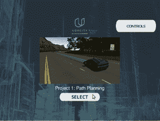
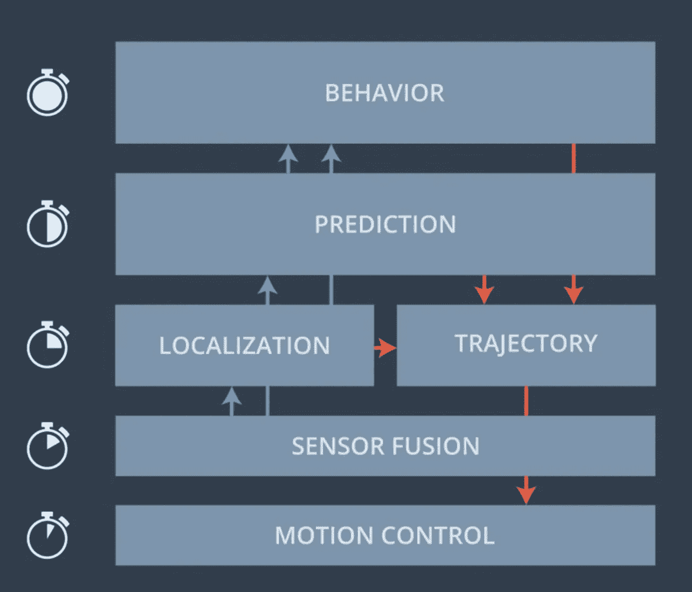
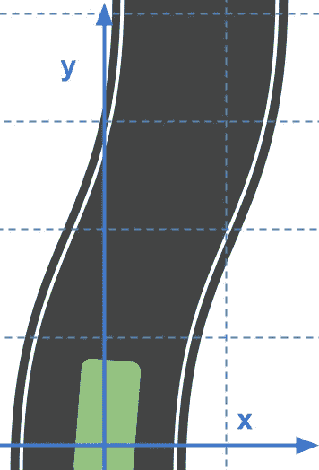
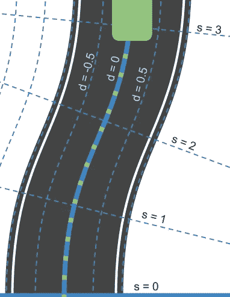
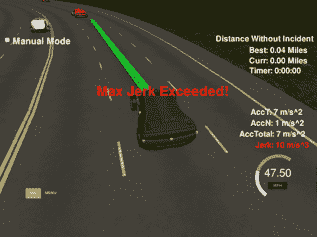
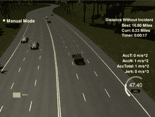
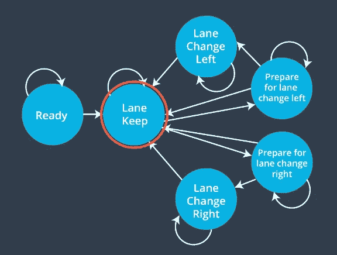

# 教汽车驾驶——高速公路路径规划

> 原文：<https://towardsdatascience.com/teaching-cars-to-drive-highway-path-planning-109c49f9f86c?source=collection_archive---------4----------------------->


Car Driving On Highway

*这是* [*Udacity 自动驾驶汽车工程师纳米学位*](https://www.udacity.com/course/self-driving-car-engineer-nanodegree--nd013) *第三学期的第一个项目。你可以在*[*github*](https://github.com/kenshiro-o/CarND-Path-Planning-Project)*上找到与这个项目相关的所有代码。你也可以阅读我以前项目的帖子:*

*   *项目一—项目一:* [*利用计算机视觉检测车道线*](https://medium.com/computer-car/udacity-self-driving-car-nanodegree-project-1-finding-lane-lines-9cd6a846c58c)
*   *术语 1 —项目 2:* [*利用深度学习的交通标志分类*](https://medium.com/towards-data-science/recognizing-traffic-signs-with-over-98-accuracy-using-deep-learning-86737aedc2ab)
*   *期限 1 —项目 3:* [*利用深度学习进行转向角度预测*](https://medium.com/towards-data-science/teaching-cars-to-drive-using-deep-learning-steering-angle-prediction-5773154608f2)
*   *术语 1 —项目 4:* [*使用计算机视觉的高级车道检测*](https://medium.com/towards-data-science/teaching-cars-to-see-advanced-lane-detection-using-computer-vision-87a01de0424f)
*   *术语 1 —项目 5:* [*利用机器学习和计算机视觉进行车辆检测*](/teaching-cars-to-see-vehicle-detection-using-machine-learning-and-computer-vision-54628888079a)

规划一条既安全又高效的路径是自主车辆开发中最困难的问题之一。事实上，这一步被称为*路径规划*，仍然是一个活跃的研究领域。路径规划之所以是一项如此复杂的任务，是因为它涉及到自动驾驶车辆的所有组件，从低级执行器、融合以创建世界“快照”的传感器，以及定位和预测模块，以准确了解我们在哪里，以及我们世界中的不同实体(其他车辆、人类、动物等)在接下来的几秒钟内更有可能采取什么行动。另一个显而易见的组件是轨迹生成器，它可以计算规划者要评估的候选轨迹。

在这篇文章中，我们将重点描述我们如何实现一个 C++高速公路路径规划器，它能够使用加加速度最小化技术在模拟器中生成安全有效的轨迹。该项目的制约因素如下:

*   **任何时候都不与其他车辆发生碰撞**
*   **最高时速 50 英里(约 80 KMH)**
*   **最大加速度 10 米/秒**
*   **最大加加速度为 10 米/秒**
*   **车辆不能处于车道之间超过 3 秒钟**
*   **车辆不能出高速公路三车道**
*   **车辆不能在高速公路上逆向行驶**

我们在完成这个项目时遇到了很多麻烦，下面的 gif 显示了我们早期的一些约束违反



Rough Start

首先，让我们仔细看看路径规划中涉及的不同层次。

# 自动驾驶汽车中的功能层



Layers involved in path planning — from Udacity

如前所述，路径规划需要自动驾驶汽车不同*层*的合作。上图概述了在给定的自动驾驶系统中，这些组件可能如何分层:

*   ***运动控制:*** 负责移动小车并尽可能接近地跟随*参考*轨迹。该层以最快的时间尺度运行
*   ***传感器融合:*** 负责融合传感器输出(如雷达+激光雷达)。
*   ***定位:*** 负责尽可能精确地了解我们的车辆在地图上的位置，以及其他实体(如其他汽车)相对于我们的车辆的位置
*   ***预测:*** 负责识别用传感器检测到的实体的性质(又名*感知*)以及基于汽车当前轨迹、其他车辆的轨迹和场景中的其他元素(如交通灯)预测场景中近期的变化。这一层的一个重要任务是预测碰撞。
*   ***行为:*** 协调层，接受来自较低层的所有信息，并决定未来状态以及要采用的轨迹
*   ***轨迹:*** 负责计算给定一组约束条件下的轨迹(如速度、距离、车道、加加速度等)。)

轨迹生成有许多方法，在这个项目中，我们选择在 *Frenet* 坐标系中计算轨迹。

# 理解传感器融合数据

模拟器中的车辆配备了一系列传感器，这些传感器的输出经过融合，可以产生更精确的测量结果。大多数从事第 4 级自动驾驶的公司都在他们的传感器套件中使用了雷达、激光雷达和摄像头。拥有多种不同类型的传感器至关重要，因为每种传感器都有各自的[优势和劣势](https://www.templetons.com/brad/robocars/cameras-lasers.html)。此外，拥有同一传感器的多个实例对于减少给定传感器中的硬件故障也很重要。

在我们的例子中，模拟器从其传感器融合模块提供以下信息:

*   我们车辆的位置、速度和方向
*   传感器范围内其他车辆的位置和速度(我们可以用一点三角学计算方位——见[反正切](https://www.khanacademy.org/math/geometry/hs-geo-trig/hs-geo-solve-for-an-angle/a/inverse-trig-functions-intro))
*   要执行的先前提交轨迹的剩余部分

有了这些信息，我们就能计算出本车与所有其他车辆的距离。我们进一步采取这许多步骤，并试图根据我们车辆的轨迹和其他车辆的推断轨迹来预测碰撞。我们在稍后定义的成本函数中利用这些信息。

# 轨迹生成

## 弗雷内坐标系

我们经常使用传统的笛卡尔坐标系来表示平面上的给定点 *(x，y)* ，这实际上是模拟器中用于识别道路上的汽车的默认系统。然而，在现实世界中，道路并不总是笔直的，因此人类执行的“简单”操作(如识别汽车在哪个车道上)很难用笛卡尔系统复制给计算机。下图说明了我们在传统的 *(X，Y)* 坐标系中面临的问题:



Curvy road in a Cartesian system (taken from Udacity lesson)

如果我们的坐标系支持道路的曲率，那么在这个新的坐标系中，我们的汽车前进并停留在车道内的轨迹将显示为一条直线，如下所示，这不是更容易吗？


Trajectories in Frenet (left) and normal Cartesian (right) coordinate systems

这正是 Frenet 坐标系所提供的:在这样一个系统中，我们将我们的平面分成纵向的*轴*和横向的*轴*，分别表示为 *S* 和 *D.* 如何获得这样一个系统背后的数学是相当复杂的，所以我们不会在本文中全部展示出来。但是你可以想象穿过道路中心的曲线决定了 *S* 轴，并指示我们在道路上走了多远。 *D* 轴映射到汽车的横向位移。下图显示了该系统在弯道上的表现:



Curvy Road Captured In Frenet Coordinates — from Udacity

## 冲击最小化

加加速度定义为加速度随时间的变化率。同时，加速度被定义为速度随时间的变化率。基本上加加速度和加速度分别是加速度和速度的导数。作为乘客，车辆中加速度的突然变化导致高的颠簸，最终使乘坐不舒适。因此，在规划轨迹时，最大限度地降低加加速度至关重要。

事实证明，通过扩展[运动学方程](https://physics.info/kinematics-calculus/)来计算给定我们的当前位置 *s_0、*当前速度 *s_0_v、*和当前加速度 *s_0_a.* 的轨迹，对于给定的时间帧 *T* (例如 1 秒)*、*，计算一维的加加速度最小轨迹是相对容易的，我们可以表示为:

*   期望的最终位置(在时间 *t* ) *s_f*
*   期望最终速度 *s_f_v*
*   期望最终加速度 *s_f_a*

使用达到加加速度二阶导数的五次多项式(即 5 次)。关于起始值的等式如下:


Jerk Minimizing Trajectory equations — from Udacity

*等于*符号左侧的值是位置、速度和加速度在时间 *t ≤ T* 的预计值。在我们的例子中， *t* 被设置为控制器的更新速率，即 20 毫秒(0.02 秒)。我们可以通过设置适当的*边界条件*将所有这些插入多项式解算器。在我们的例子中，我们将期望的加速度设置为 0，因为我们希望降低加加速度。不幸的是，这仅设置了 *t=T* 的最终加速度，当*T*≦*T 时，我们无法控制车辆的加速度。因此，我们需要试验不同的 *T* 值，以确定选择哪个时间范围来生成平滑的加加速度最小化轨迹。在我们的例子中，我们选择 T = 1.7 秒。另一个问题是，我们有一个*完美的*控制器，它可以将车辆移动到轨迹中的任何下一点，而不管物理定律如何(例如，可以在 20 毫秒内再移动 1 公里)，因此我们需要对我们提交的轨迹保持高度警惕。*

*由于我们使用 Frenet 坐标，我们可以分别在 *s* 和 *d* 维度*中*生成一维加加速度最小轨迹。Werling 和 Kammel 的这篇论文是一篇很好的阅读材料，可以让你更熟悉这个话题。*

*由于模拟器不接受以 Frenet 坐标表示的轨迹，我们从 Frenet 坐标转换回真实世界坐标，以计算映射到给定的 *(s，d)* Frenet 点的 *(x，y)* 点。*

# *改进本地化*

## *创造更平滑的轨迹*

*我们假设赛道已经预先绘制好，并提供有*个路点*，这些路点沿着中间的黄线延伸，黄线将公路两侧分开。这有助于我们根据最近的路点确定我们的位置。*

*不幸的是，我们得到的地图航路点非常稀疏，当我们试图从 Frenet 转换回现实世界坐标时，可能会产生非常“有角度”的轨迹。这反过来导致加速度和冲击的突然峰值。由于函数 *toRealWorld* (s，d)——>(x，y)使用两个路点之间的基本插值来寻找 x 和 y 的最佳近似值，我们总是冒着生成不平滑轨迹的风险。*

**

*Lane Change With Coarse Waypoints*

*我们能做些什么来改善这一点呢？从以前的一些项目中，我们已经看到从多项式中导出的直线趋向于产生非常平滑的轨迹。因此，我们应该采用这种技术，而不是目前使用的基本插值。我们求助于使用通过采用 Frenet 坐标中的位置 s 创建的样条来获得真实世界的坐标 *x* 、 *y* ，以及偏移量 *dx* 和 *dy* 。然后，我们插入这个公式以获得最接近的真实世界坐标*

```
*x = spline_s_x(s) + d * spline_s_dx(s)
y = spline_s_y(s) + d * spline_s_dy(s)*
```

*现在我们可以看到我们的轨迹变得多么的平滑。*

**

*Smooth Driving From Better Waypoints*

# *二维状态机*

*思考驾驶的最直观的方式之一是，我们人类根据我们的驾驶风格、我们捕捉的外部信息以及我们心目中的目的地，将我们的车辆转换到不同的状态。事实证明，我们可以为机器编写状态，并根据当前状态和我们的自动驾驶汽车堆栈的其他层，指示它们可以移动到哪些状态。*

*在我们的例子中，我们的有限状态机非常简单，如下所示:*

**

*Final State Machine For Path Planning — from Udacity*

*最常见的状态将是*保持车道*，但每当我们希望改变车道时，汽车将首先转换到*准备左/右变道*状态，并在确保车道开关安全后，将移动到实际变道状态。我们在变换车道前进入的中间状态类似于车辆在变换车道前打开左/右信号灯(当然，司机也要确保变道是安全的)。*

*关于我们的状态机的实现，我们从 Frenet 坐标中得到灵感来设计这个方法。我们决定将给定的状态拆分成其纵向*和横向*组件。这样做的原因是，我们认为它简化了我们在可能变道的高速公路上驾驶的想法。*

*基本上，横向状态决定了我们可能发现的下一个潜在状态，而代价函数可能选择一个纵向状态而不是另一个。状态机的实现可以在下面的要点中找到:*

# *成本函数*

*考虑到我们通常会返回多个候选的下一个状态以及它们的轨迹，我们必须找到一种方法来选择要采取的“最佳”行动。这就是成本函数有用的地方。成本函数是必要的，以“教导”车辆我们想要鼓励哪些行为，以及我们通过不同的权重对哪些行为进行较轻或较重的惩罚。*

*我们所有的成本函数都遵循我们在项目存储库中的文件 *cost_functions.h* 中定义的接口:*

```
*typedef function<double (const Vehicle&, const vector<Vehicle>&,  const Trajectory&, const State&, const double&)> CostFunction;*
```

*这使得添加成本函数变得非常简单(权重是最后一个参数)。我们定义了以下成本函数，其中权重完全可调:*

*   ****【speedCostFunction】***:如果我们的车辆行驶缓慢，该功能将对其进行处罚*

*   ******laneChangeCostFunction***:该功能*总是*惩罚变道，因为变道通常比在同一车道上行驶更危险***

*   **********averageLaneSpeedDiffCostFunction***:根据本车道前方车辆的平均速度，对车辆想要进入的车道进行处罚的功能*******

*******我们尝试了许多不同的重量配置，但最终决定，由于我们不希望在安全性上妥协，我们将*碰撞时间功能*的最高重量指定为 10000。其他成本函数的权重变化很大，但我们给了 *speedCostFunction* 很小的权重，因为高速固然很好，但远不如无碰撞重要。*******

# *******决赛成绩*******

*******当前路径规划器执行得相当好，使车辆能够围绕轨道*行驶多次*。然而，它可以通过更多地调整权重和改进一些成本函数来改进。此外，我们相信，通过将一些机器学习纳入我们的预测层，我们可以消除一些可能导致碰撞的边缘情况。我们的规划器的一个有趣的行为是，它能够快速多次改变车道。我们最初认为这是我们最终状态机设计的一个错误，但结果是一个有趣的副作用！*******

**************

*******Smooth Double Lane Change (second time because of red car ahead)*******

*******你也可以观看上传到 YouTube 的全程视频:*******

*******Video Of Full Lap In Simulator*******

# *******丰富*******

*******当前的路径规划器相对保守，没有针对最高速度进行优化。这意味着虽然速度有时可以高达 48 英里/小时(~77.2 公里/小时)，但它通常会低于这个速度，几乎永远不会达到 50 英里/小时(~80.4 公里/小时)的法定速度限制。这是一个折衷方案，我们现在很乐意接受，但还需要努力让汽车以接近 50 英里/小时的速度行驶。*******

*******此外，规划者仅考虑车辆的相邻车道，因此从未“看到”非相邻车道何时会是更好的选择(例如，汽车在车道 1 上，规划者仅评估车道 1 和 2，而最右侧的车道 3 可能是自由的，因此是移动的良好候选车道)。这将需要更复杂的路径评估方法，其中规划者评估所有车道，并最终决定移动到哪个相邻车道，这是基于这样的事实，即一旦车辆到达相邻车道，与相邻车道相邻的车道将成为移动到的可行候选车道。我们对这种方法的另一个担心与安全性有关，因为执行这样一个大胆的动作更加危险和棘手，因为必须覆盖的横向距离以及预测道路上其他车辆行为的难度。*******

*******我们应该研究的另一个改进是采用统计技术来更好地预测其他车辆的行为，特别是预测他们何时并入我们的车道，因为这增加了致命碰撞的风险。我们可以从使用朴素贝叶斯开始，但没有足够的时间来专门测试，然后为我们的预测器选择最具区分性的特征。*******

*******最后，我们当前的规划器只为给定的可能的下一个状态生成单个轨迹，这意味着我们可能会忽略相同未来状态的更好的轨迹(例如，在给定车道的更远/更后面，或者更左或更右)。我们有这样的每状态多轨迹方案的实现，其假设所有最终的 Frenet 位置 *s* 和 *d* (通过计算加加速度最小轨迹获得)遵循高斯分布，对于 G(s)和 G(d)分布分别具有给定的平均值和标准偏差(mean_s，std_s)和(mean_d，std_d)。然而，我们必须为标准偏差选择适当的值，同时平均值将保持固定在最初期望的终点位置 *end_s* 和 *end_d* 。*******

# *******承认*******

*******毫无疑问，这是迄今为止我作为无人驾驶汽车 nanodegree 的一部分承担的最困难的项目，涵盖所有三个项目。我不确定我能不能完成它，甚至不知道从哪里开始！*******

*******大卫·西尔弗和亚伦·布朗的小视频帮助我开始。因为我选择了加加速度最小化方法来生成轨迹，所以我没有找到太多选择这种技术的学生的博客帖子或参考资料，因为大多数文章都是关于在 David 和 Aaron 的教程中使用样条技术的。但是 Werling 和 Kammel 关于在 Frenet 框架下动态街道场景的最优轨迹生成的论文真的帮助提高了我对这项技术的直觉(尽管我并没有完全理解所有的东西)。*******

*******此外，我特别喜欢米蒂在这个项目上的[文章](https://medium.com/@mithi/reflections-on-designing-a-virtual-highway-path-planner-part-2-3-392bc6cf11e7)，以及其他学生的帖子，并从中受到了启发。最后，我要感谢 Udacity 的所有团队和他们在戴姆勒的合作伙伴，是他们将如此伟大的内容和具有挑战性的项目整合在一起！*******

********感谢你阅读这篇文章。希望你觉得有用。我现在正在建立一个新的创业公司，叫做* [*EnVsion*](https://envsion.io) *！在 EnVsion，我们正在为 UX 的研究人员和产品团队创建一个中央存储库，以从他们的用户采访视频中挖掘见解。当然我们用人工智能来做这个。).********

********如果你是一名 UX 研究员或产品经理，正忙于从你与用户和客户的视频通话中提取真知灼见，那么 EnVsion 就是你的选择！********