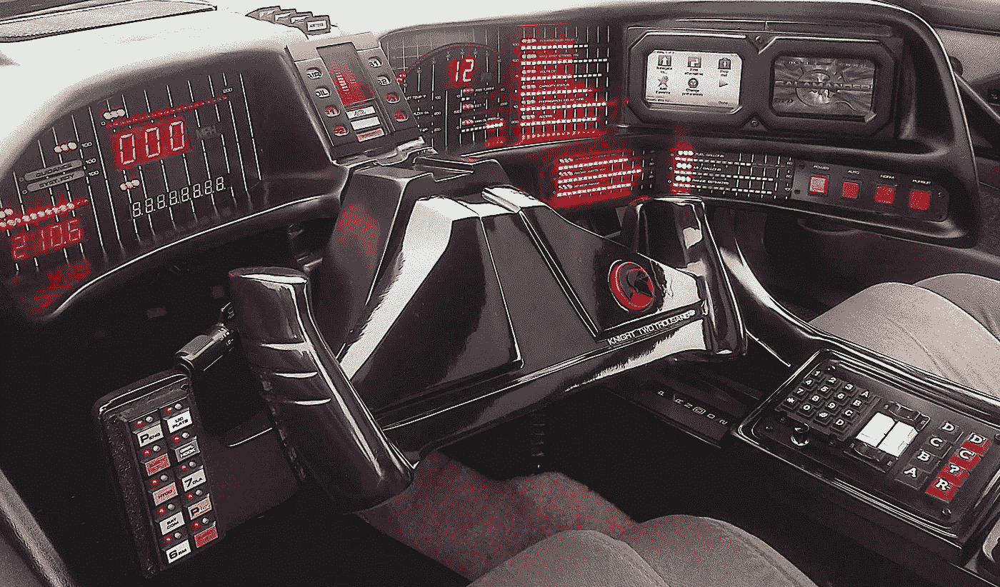
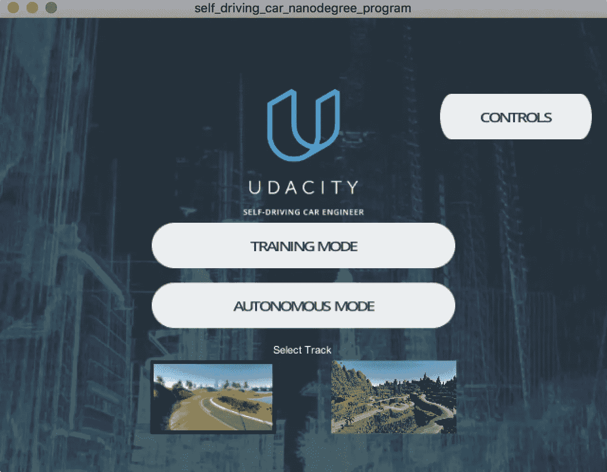
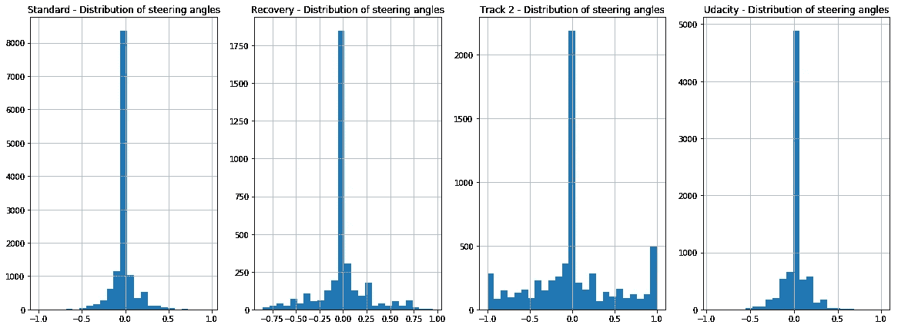
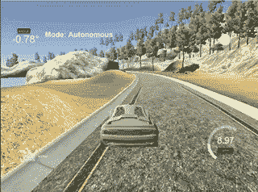
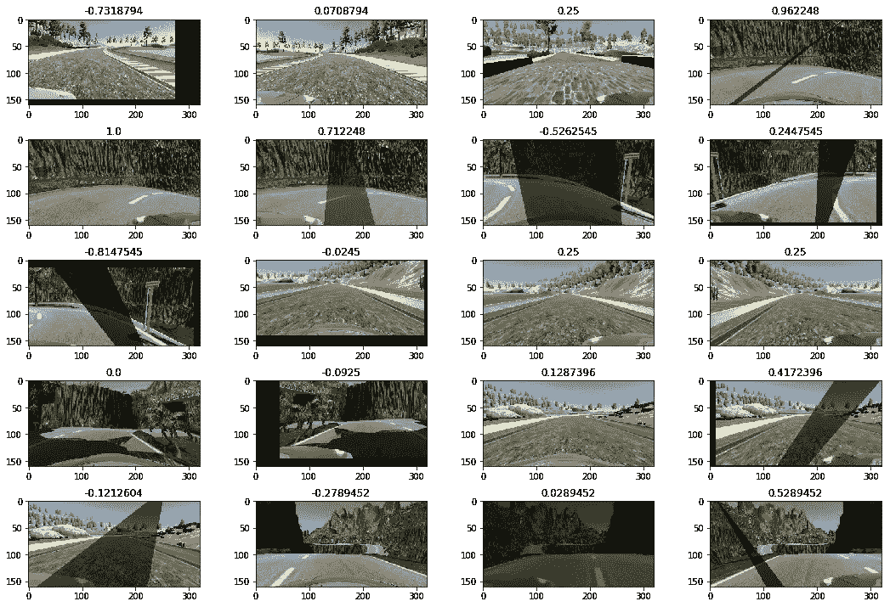
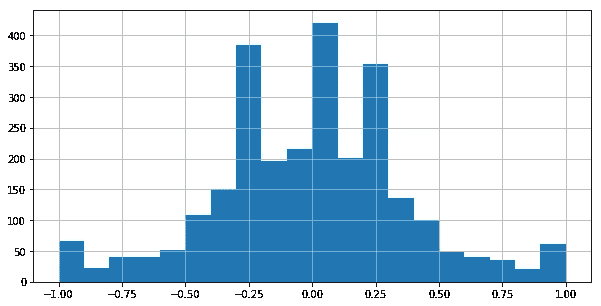
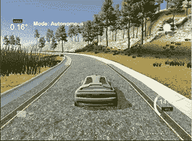
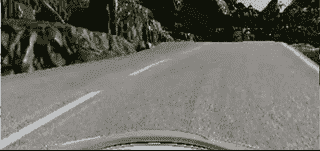

# 使用深度学习教授汽车驾驶-转向角度预测

> 原文：<https://towardsdatascience.com/teaching-cars-to-drive-using-deep-learning-steering-angle-prediction-5773154608f2?source=collection_archive---------0----------------------->



The car of the past… or the future?

*这是* [*Udacity 自动驾驶汽车工程师纳米学位*](https://www.udacity.com/course/self-driving-car-engineer-nanodegree--nd013) *第一学期的项目 3。你可以在*[*github*](https://github.com/kenshiro-o/CarND-Behavioral-Cloning-P3)*上找到与这个项目相关的所有代码。你也可以阅读我以前项目的帖子:*

*   *项目 1:* [*利用计算机视觉检测车道线*](https://medium.com/computer-car/udacity-self-driving-car-nanodegree-project-1-finding-lane-lines-9cd6a846c58c)
*   *项目二:* [*交通标志分类使用深度学习*](https://medium.com/towards-data-science/recognizing-traffic-signs-with-over-98-accuracy-using-deep-learning-86737aedc2ab)

近年来，尤其是自从十年前 Darpa 大挑战大赛取得成功以来，全自动驾驶汽车的发展速度大大加快。许多组件组成了一辆自动驾驶汽车，其中一些最关键的组件是传感器和为其提供动力的人工智能软件。此外，随着计算能力的增加，我们现在能够训练复杂和深度的神经网络，这些网络能够*学习*视觉和视觉以外的关键细节，并成为汽车的*大脑*，了解车辆的环境并决定接下来要采取的决定。

在这篇文章中，我们将讲述如何训练深度学习模型来预测方向盘角度，并帮助虚拟汽车在模拟器中自动驾驶。该模型使用 [Keras](https://keras.io/) 创建，依靠 [Tensorflow](https://www.tensorflow.org/) 作为后端。

# 项目设置

作为这个项目的一部分，我们提供了一个用 Unity 编写的模拟器，它有两种模式:

*   *训练模式:*我们手动驾驶车辆并收集数据
*   *自主模式:*车辆根据从收集的数据训练的模型自动驾驶

数据记录保存在 csv 文件中，包含图像路径以及方向盘角度、油门和速度。我们只关心这个项目的方向盘角度和图像。

如下图所示，模拟器包含两条轨道。右侧的赛道(赛道 2)比赛道 1 更难，因为它包含斜坡和急转弯。



The Udacity Simulator

这个项目实际上是受 NVIDIA 研究人员的论文“[自动驾驶汽车的端到端学习](https://arxiv.org/abs/1604.07316)”的启发，NVIDIA 研究人员通过训练卷积神经网络来预测方向盘角度，根据安装在汽车前面的三个摄像头(左、中、右)捕捉的转向角度数据和图像，成功让汽车自动驾驶。经过训练的模型能够仅使用中央摄像头准确驾驶汽车。下图显示了创建这种高效模型的过程。


NVIDIA process for training their CNN based on 3 cameras and steering wheel angle data

与 NVIDIA 不同，他们在现实世界中进行自动驾驶，我们将在模拟器中教会我们的汽车驾驶。然而，同样的原则也应该适用。由于最近报道了模拟在为 [Waymo](https://www.theatlantic.com/technology/archive/2017/08/inside-waymos-secret-testing-and-simulation-facilities/537648/) 等公司开发自动驾驶技术中如何发挥关键作用，我们进一步支持了这一说法。

# 数据集

我们最终使用了 4 个数据集:

1.  轨道 1 上的 Udacity 数据集
2.  轨道 1 上手动创建的数据集(我们将其命名为*标准*数据集)
3.  另一个手动创建的数据集在赛道 1 上，我们开车接近界限，*恢复*以教导模型如何避免出界——在现实世界中，这将被称为鲁莽驾驶或酒后驾驶
4.  轨道 2 上手动创建的数据集

请注意，在我们所有手动创建的数据集中，我们在两个方向上驱动，以帮助我们的模型一般化。

# 数据集探索

然而，在分析我们的数据集捕捉到的转向角度时，我们很快意识到我们有一个问题:数据非常不平衡，绝大多数方向盘数据是中性的(即 0)。**这意味着，除非我们采取纠正措施，否则我们的模型将偏向直线行驶。**



Distribution of steering wheel angles across datasets

然而，请注意，轨道 2 上的数据显示了更多的可变性，有许多*急转弯*，正如我们对这种轨道的预期。即使在这种情况下，人们仍然强烈倾向于直行。

# 数据集分割

最后，我们决定创建一个*集合*训练数据集，由 Udacity 数据集、我们的*恢复*数据集和来自 track 2 的数据集组成。我们决定使用来自路线 1 的*标准*数据集作为验证集。

```
frames = [recovery_csv, udacity_csv, track2_csv]
ensemble_csv = pd.concat(frames)
validation_csv = standard_csv
```

这帮助我们从近 55K 训练图像和潜在的 44K 验证图像开始。

# 数据扩充

我们有大量的数据点，但遗憾的是，大多数数据显示汽车以中性方向盘角度行驶，我们的汽车倾向于直线行驶。下面的示例显示了我们的第一个模型，其中没有对训练数据集进行平衡:



first stab at getting the car to drive autonomously…

此外，轨道上也有阴影，可能会使模型陷入混乱。该模型还需要学会正确驾驶，无论汽车是在道路的左侧还是右侧。因此，我们必须找到一种方法来人为地增加和改变我们的图像和转向角度。为此，我们求助于数据增强技术。

# 摄像机和转向角度校准

首先，我们将*转向角校准偏移*添加到由左或右摄像机捕获的图像:

*   对于左边的摄像机，我们希望汽车转向右边(正偏移)
*   对于右边的摄像机，我们希望汽车转向左边(负偏移)

```
st_angle_names = ["Center", "Left", "Right"]
st_angle_calibrations = [0, 0.25, -0.25]
```

以上值是根据经验选择的。

# 图像水平翻转

因为我们希望我们的汽车无论在路上的位置如何都能够自动转向，所以我们对一部分图像应用了水平翻转，并自然地反转了原始转向角度:

```
def fliph_image(img):
    """
    Returns a horizontally flipped image
    """
    return cv2.flip(img, 1)
```


Original vs flipped image

# 变暗图像

由于阴影或其他原因，我们的轨道的某些部分变得更暗，我们还通过将所有 RGB 颜色通道乘以从一个范围内随机选取的标量来使图像的一部分变暗:

```
def change_image_brightness_rgb(img, s_low=0.2, s_high=0.75):
    """
    Changes the image brightness by multiplying all RGB values by the same scalacar in [s_low, s_high).
    Returns the brightness adjusted image in RGB format.
    """
    img = img.astype(np.float32)
    s = np.random.uniform(s_low, s_high)
    img[:,:,:] *= s
    np.clip(img, 0, 255)
    return  img.astype(np.uint8)
```


Original vs darkened image

# 随机阴影

由于我们有时会有被阴影覆盖的轨迹，我们还必须训练我们的模型来识别它们，并且不被它们吓到。

```
def add_random_shadow(img, w_low=0.6, w_high=0.85):
    """
    Overlays supplied image with a random shadow polygon
    The weight range (i.e. darkness) of the shadow can be configured via the interval [w_low, w_high)
    """
    cols, rows = (img.shape[0], img.shape[1])

    top_y = np.random.random_sample() * rows
    bottom_y = np.random.random_sample() * rows
    bottom_y_right = bottom_y + np.random.random_sample() * (rows - bottom_y)
    top_y_right = top_y + np.random.random_sample() * (rows - top_y)
    if np.random.random_sample() <= 0.5:
        bottom_y_right = bottom_y - np.random.random_sample() * (bottom_y)
        top_y_right = top_y - np.random.random_sample() * (top_y) poly = np.asarray([[ [top_y,0], [bottom_y, cols], [bottom_y_right, cols], [top_y_right,0]]], dtype=np.int32)

    mask_weight = np.random.uniform(w_low, w_high)
    origin_weight = 1 - mask_weight

    mask = np.copy(img).astype(np.int32)
    cv2.fillPoly(mask, poly, (0, 0, 0))
    #masked_image = cv2.bitwise_and(img, mask)

    return cv2.addWeighted(img.astype(np.int32), origin_weight, mask, mask_weight, 0).astype(np.uint8)
```


Original vs shadowed image

# 向左/向右/向上/向下移动图像

为了应对大量的中性角，并为数据集提供更多的变化，我们对图像应用随机偏移，并为横向偏移的每个像素的转向角添加给定的偏移。在我们的例子中，我们根据经验决定对每个向左或向右移动的像素加(或减)0.0035。向上/向下移动图像应该使模型相信它是在向上/向下的斜坡上。从实验中，我们相信这些横向移动可能是让汽车正常行驶所需的最重要的增强。

```
# Read more about it here: http://docs.opencv.org/3.0-beta/doc/py_tutorials/py_imgproc/py_geometric_transformations/py_geometric_transformations.html
def translate_image(img, st_angle, low_x_range, high_x_range, low_y_range, high_y_range, delta_st_angle_per_px):
    """
    Shifts the image right, left, up or down. 
    When performing a lateral shift, a delta proportional to the pixel shifts is added to the current steering angle 
    """
    rows, cols = (img.shape[0], img.shape[1])
    translation_x = np.random.randint(low_x_range, high_x_range) 
    translation_y = np.random.randint(low_y_range, high_y_range) 

    st_angle += translation_x * delta_st_angle_per_px translation_matrix = np.float32([[1, 0, translation_x],[0, 1, translation_y]])
    img = cv2.warpAffine(img, translation_matrix, (cols, rows))

    return img, st_angle
```


Original vs shifted image

# 图像增强管道

我们的图像增强功能很简单:每张提供的图像都经过一系列的增强，每一次增强都以 0 到 1 之间的概率 *p* 发生。增强图像的所有代码都被委托给上述适当的增强器函数。

```
def augment_image(img, st_angle, p=1.0):
    """
    Augment a given image, by applying a series of transformations, with a probability p.
    The steering angle may also be modified.
    Returns the tuple (augmented_image, new_steering_angle)
    """
    aug_img = img

    if np.random.random_sample() <= p: 
        aug_img = fliph_image(aug_img)
        st_angle = -st_angle

    if np.random.random_sample() <= p:
        aug_img = change_image_brightness_rgb(aug_img)

    if np.random.random_sample() <= p: 
        aug_img = add_random_shadow(aug_img, w_low=0.45)

    if np.random.random_sample() <= p:
        aug_img, st_angle = translate_image(aug_img, st_angle, -60, 61, -20, 21, 0.35/100.0)

    return aug_img, st_angle
```

# Keras 图像生成器

由于我们在训练模型时会动态生成新的和增强的图像*，因此我们创建了一个 Keras 生成器来生成每批的新图像:*

```
*def generate_images(df, target_dimensions, img_types, st_column, st_angle_calibrations, batch_size=100, shuffle=True, 
                    data_aug_pct=0.8, aug_likelihood=0.5, st_angle_threshold=0.05, neutral_drop_pct=0.25):
    """
    Generates images whose paths and steering angle are stored in the supplied dataframe object df
    Returns the tuple (batch,steering_angles)
    """
    # e.g. 160x320x3 for target_dimensions
    batch = np.zeros((batch_size, target_dimensions[0],  target_dimensions[1],  target_dimensions[2]), dtype=np.float32)
    steering_angles = np.zeros(batch_size)
    df_len = len(df)

    while True:
        k = 0
        while k < batch_size:            
            idx = np.random.randint(0, df_len)                   for img_t, st_calib in zip(img_types, st_angle_calibrations):
                if k >= batch_size:
                    break

                row = df.iloc[idx]
                st_angle = row[st_column]            

                # Drop neutral-ish steering angle images with some probability
                if abs(st_angle) < st_angle_threshold and np.random.random_sample() <= neutral_drop_pct :
                    continue

                st_angle += st_calib                                                                
                img_type_path = row[img_t]  
                img = read_img(img_type_path)                

                # Resize image

                img, st_angle = augment_image(img, st_angle, p=aug_likelihood) if np.random.random_sample() <= data_aug_pct else (img, st_angle)
                batch[k] = img
                steering_angles[k] = st_angle
                k += 1

        yield batch, np.clip(steering_angles, -1, 1)*
```

*请注意，我们能够在每批中减少一定比例的中性角度，并保持(即不增加)一定比例的图像。*

*下图显示了一批图像中的一小部分增强图像:*

**

*Some augmented images from a batch*

*此外，那些增强图像的转向角的伴随直方图显示了更多的平衡:*

**

*Distribution of steering angles over batch*

# *模型*

*我们最初尝试了 VGG 架构的一个变体，层次更少，没有迁移学习，但努力获得令人满意的结果。最终，我们选定了 NVIDIA 白皮书中使用的架构，因为它为我们提供了最佳结果:*

**

*NVIDIA CNN Architecture*

# *模型调整*

*然而，我们对模型做了一些细微的调整:*

*   *我们裁剪图像的顶部以排除地平线(它在*立即*确定转向角度时不起作用)*
*   *我们在模型中将图像的大小调整为 66x200 *，作为早期图层之一，以利用 GPU 的优势**
*   *我们在每个激活函数后应用[批处理标准化](https://www.quora.com/Why-does-batch-normalization-help)以加快收敛*
*   *第二密集层的输出大小为 200，而不是 100*

# *模型架构*

*该模型的完整架构如下:*

*   *输入图像为 160x320(高 x 宽格式)*
*   *通过移除一半高度(80 像素),图像在顶部被垂直裁剪，从而生成 80x320 的图像*
*   *裁剪后的图像被归一化，以确保我们的像素分布的平均值为 0*
*   *使用 Tensorflow 的[*TF . image . resize _ images*](https://www.tensorflow.org/api_docs/python/tf/image/resize_images)将裁剪后的图像*调整为 66x200**
*   *我们采用一系列 3×5×5 的卷积层，步长为 2×2。每个卷积层之后都有一个批处理标准化操作，以改善收敛性。随着我们深入网络，每层的深度分别为 24、36 和 48*
*   *我们应用 2 个连续的 3×3 卷积层，深度为 64。每个卷积层之后紧接着是批处理标准化操作*
*   *我们在这一阶段拉平输入，进入完全连接阶段*
*   *我们应用了一系列完全连接的层，尺寸逐渐减小:1164、200、50 和 10*
*   *输出层的大小显然是 1，因为我们只预测一个变量，方向盘角度。*

# *激活和正规化*

*除了最后一层，所有层使用的激活函数是 [ReLU](https://stats.stackexchange.com/questions/226923/why-do-we-use-relu-in-neural-networks-and-how-do-we-use-it) 。我们也尝试了 [ELU](https://www.quora.com/How-does-ELU-activation-function-help-convergence-and-whats-its-advantages-over-ReLU-or-sigmoid-or-tanh-function) ，但是用 ReLU + BatchNormalization 得到了更好的结果。我们对输出层使用[均方误差](https://en.wikipedia.org/wiki/Mean_squared_error)激活，因为这是一个回归问题，而不是分类问题。*

*如前一节所述，我们使用批处理规范化来加速收敛。我们确实尝试了某种程度的辍学，但没有发现任何明显的差异。我们相信，我们在每一批生成新图像并丢弃一些中性角图像有助于减少过度拟合。此外，我们没有对我们的 NVIDIA 网络应用任何 [MaxPool](http://cs231n.github.io/convolutional-networks/#pool) 操作(尽管我们尝试了 VGG 启发的操作),因为这需要对架构进行重大改变，因为我们会更早地降低维度。此外，我们没有时间尝试 L2 的正规化，但计划在未来尝试。*

# *培训和结果*

*我们使用[亚当](https://www.quora.com/Can-you-explain-basic-intuition-behind-ADAM-a-method-for-stochastic-optimization)作为优化器来训练模型，学习率为 0.001。经过大量的参数调整和多种模型的实验，我们最终找到了一种能够让我们的虚拟汽车在两条赛道上自动驾驶的模型。*

**

*Self-driving around track 1*

*我们可以看到车辆如何有效地在赛道 2 上驶下陡坡。*

**

*Self-driving around track 2*

*我们还展示了在赛道 2 上自动驾驶时前置摄像头看到的内容。我们可以看到汽车如何试图坚持在车道上行驶，而不是在中间行驶，因为我们自己在数据收集阶段努力只在道路的一侧行驶。这表明该模型确实学会了保持在自己的车道内。*

**

*What the car sees on track 2*

## *录像*

*最重要的是，我甚至为你创建了一个视频蒙太奇，使用 Tron Legacy 的 *The Grid* 作为背景音乐。尽情享受吧！*

*Video of behavioural cloning*

# *结论*

*我们已经表明，使用深度神经网络和大量的数据增强技术来创建可靠地预测车辆方向盘角度的模型是可能的。虽然我们已经取得了令人鼓舞的成果，但我们希望在未来探索以下方面:*

*   *在模型中考虑速度和油门*
*   *让汽车以 15-20 英里/小时的速度行驶*
*   *通过迁移学习实验基于模型的 VGG/ResNets/Inception*
*   *使用来自使用 Udacity 数据集的人的递归神经网络，就像这篇[论文](http://cs231n.stanford.edu/reports/2017/pdfs/626.pdf)中那样*
*   *通过 comma.ai 阅读 [*学习驾驶模拟器*](https://arxiv.org/abs/1608.01230) 论文并尝试实现他们的模型*
*   *强化学习实验*

*可以看出，我们可以探索许多领域来进一步推动这个项目，并获得更有说服力的结果。从这个项目中最重要的一点是**数据为王:**如果没有所有这些图像和转向角度，以及它们潜在的无限扩展，我们就无法建立一个足够强大的模型。*

*从个人角度来看，我非常喜欢这个项目，这是迄今为止最难的项目，因为它使我能够获得更多关于超参数调整、数据扩充和数据集平衡以及其他重要概念的实践经验。我觉得我对神经网络架构的直觉也加深了。*

# *承认*

*我还要感谢我的 Udacity 导师 Dylan，感谢他的支持和合理的建议，也感谢我的同学之前的 Udacity 学生，他们通过博客帖子解释了他们是如何着手这个项目的。我从阅读他们的帖子中受到启发:他们无疑帮助我更好地理解了成功完成这个项目所需的概念。*

**感谢你阅读这篇文章。希望你觉得有用。我现在正在建立一个新的创业公司，叫做* [*EnVsion*](https://envsion.io) *！在 EnVsion，我们正在为 UX 的研究人员和产品团队创建一个中央存储库，以从他们的用户采访视频中挖掘见解。当然我们用人工智能来做这个。).**

**如果你是 UX 的研究人员或产品经理，对与用户和客户的视频通话感到不知所措，那么 EnVsion 就是为你准备的！**

**你也可以关注我的* [*推特*](https://twitter.com/Ed_Forson) *。**