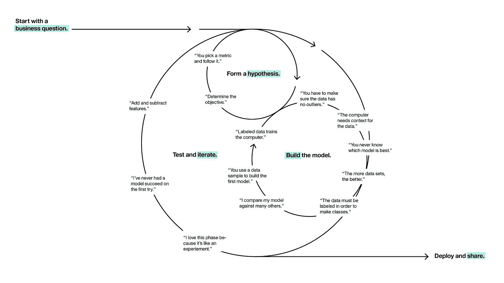
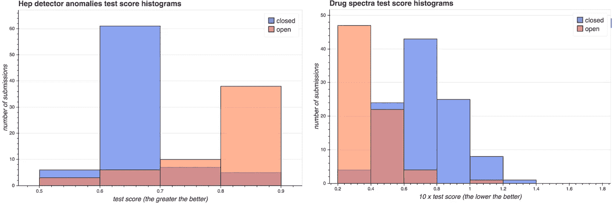
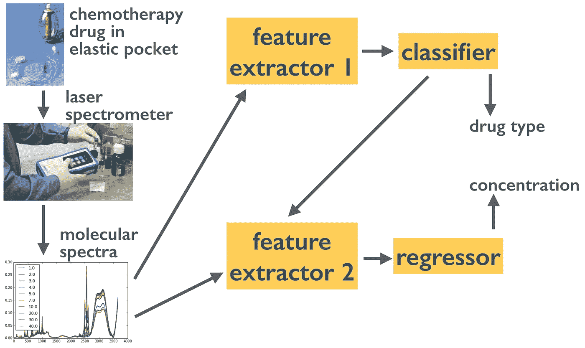

# 教授数据科学过程

> 原文：<https://towardsdatascience.com/teaching-the-data-science-process-f1e9d6f87ad5?source=collection_archive---------3----------------------->

The cyclical process of data science ([source](http://datascience.ibm.com/blog/finding-the-user-in-data-science/)).

教授机器学习的课程已经存在了几十年，甚至更近的技术学科(深度学习或大数据架构)都有几乎标准的课程大纲和线性化的故事情节。另一方面，**对数据科学*过程*的教学支持一直难以捉摸**，尽管过程的[大纲自 90 年代就已经存在。理解这一过程不仅需要机器学习的广泛技术背景，还需要企业管理的基本概念。在之前的一篇文章](https://en.wikipedia.org/wiki/Cross_Industry_Standard_Process_for_Data_Mining)中，我已经详细阐述了由这些复杂性引发的数据科学转型的组织困难；在这里，我将分享我教授数据科学过程的经验。

The data science ecosystem. Data scientists “B” is in key position in formalizing the business problem and designing the data science workflow.

## 围绕工作流构建

最近，我有机会在大约 100 名来自巴黎综合理工学院的顶尖工科学生身上尝试一些实验性的教学技巧。课程的中心概念是数据科学工作流程。

1.  ***设计*工作流**，其元素，要优化的分数，将工作流连接到业务数据科学家端。
2.  ***优化*工作流程**，将其连接到技术数据科学家端。

这两者都不能在基于幻灯片的讲座中使用线性化叙述来教授。我用我们的[平台](http://www.ramp.studio)围绕我们的[坡道](https://drive.google.com/file/d/0BzwKr6zuOkdRNmQ0Q3djMTBzY2s/view?usp=sharing)概念建造了这个球场。为了学习工作流优化，学生们参与了五个斜坡，旨在**挑战他们不同的科学工作流和不同的数据科学问题**。为了学习工作流设计，我讲述了几个**数据驱动的业务案例**，给学生提供了一个需要回答具体问题的线性指南，并要求他们在小组项目中构建业务案例和数据科学工作流。我使用 RAMP starting 工具包作为样本:限制无限的设计空间有助于学生构建项目。

# 使用坡道作为教学支持

[RAMP](https://drive.google.com/file/d/0BzwKr6zuOkdRNmQ0Q3djMTBzY2s/view) 最初是为一个**协作原型**工具设计的，该工具可以有效利用数据科学家的时间来解决领域科学或业务问题的数据分析部分。然后，我们很快意识到，这对培训数据科学家新手同样**有价值**。我们需要改变的主要设计特征是完全的开放性。为了能够根据个人表现给学生打分，我们需要关闭排行榜。在封闭阶段，学生们看到彼此的分数，但看不到彼此的代码。我们使用分数的上限线性函数来给他们评分。这个通常持续 1-2 周的封闭阶段之后是一个“经典”的开放阶段，在这个阶段中，我们根据学生的活动和他们创造多样性的能力以及提高他们自己的封闭阶段分数来给他们打分。

学生们的集体表演堪称壮观。在所有五个斜坡中，他们不仅超过了基线，还超过了我们组织的测试工作流的单日 hackaton 分数，通常有 30-50 名顶级数据科学家和领域科学家参与。

Score vs submission timestamp of the first classroom RAMP. Blue and red circles represent submissions in the closed and open phases, respectively. The pink curve is the current best score and the green curve is the performance of the best model blend. The top 10% of the students outperformed both the data science researchers (single day hackaton) and the best deep neural nets, even in the closed phase. They then outperformed state-of-the-art automatic model blending when combining each other’s solutions in the open phase.

我也很高兴地看到，在开放阶段**新手/普通学生通过学习和重用封闭阶段来自前 10-20%学生的解决方案赶上了前 11 名。另一个惊喜是**直接盲目抄袭非常罕见**:学生们真诚地试图改进彼此的代码。**

Score distributions in classroom RAMPs. The blue and red histograms represent submissions in the closed and open phases, respectively (the darker histogram is the overlap). The histograms indicate that novice/average students catch up to the top 10% in the open phase by profiting from the open code.

我们将分析这些丰富的结果，并在**领域科学**(第一个例子见[本文](https://www.overleaf.com/read/ntrsnyvpqnsg))**数据科学**和**管理科学**中撰写论文。这份[技术报告](https://drive.google.com/file/d/0BzwKr6zuOkdRNmQ0Q3djMTBzY2s/view)包含了更多的细节，这里有[我的幻灯片](https://www.slideshare.net/balazskegl/ramp-data-challenges-with-modularization-and-code-submission)来自最近[关于数据科学过程](http://dalimeeting.org/dali2017/the-data-science-process.html)的 DALI 研讨会。

# 使用业务案例进行工作流设计教学

正如我在[之前的文章](https://medium.com/@balazskegl/the-data-science-ecosystem-industrial-edition-938582427466)中解释的那样，非 IT 公司启动数据科学项目的主要障碍不是缺乏准备充分的数据，不是基础设施，甚至不是缺乏训练有素的数据科学家，而是**缺乏定义良好的数据驱动的业务案例**。更糟糕的是:这个问题通常是在对数据湖、Hadoop 服务器和数据科学团队进行初始投资之后*才发现的。一个准备充分的数据(流程)科学家，如果能够尽早进入这一过渡阶段并彻底改变项目，甚至可以为一家中型公司节省数百万美元。*

为了培养学生胜任这一角色，我在课程开始时对[模型预测性维护案例](https://docs.google.com/document/d/1FKsnUy-nJgBd4DC1yoNQwq7y6gS27dQ5twI7HkSPWN4/edit?usp=sharing)进行了深入讨论。每个人在他们的项目中需要回答的标准化问题帮助学生从广泛描述的业务案例走向明确定义的预测分数、误差测量和数据收集策略。

1.  我们想要预测什么，我们如何衡量预测的质量？
2.  更好的预测将如何改进选定的 KPI？
3.  你想有决策支持，一个完全自动化的系统，还是只想知道哪些因素是重要的？代理将如何使用该系统？
4.  定量预测应该是什么？
5.  我们如何(使用什么分数)衡量成功？(可能不对称的)预测误差如何转化为成本或降低的 KPI？
6.  我们需要什么数据来开发一个预测器？
7.  我们需要做哪些工作来收集这些数据？
8.  给定数据源和预测目标，工作流和工作流元素是什么？
9.  该模型需要多长时间重新培训一次？

我进一步组织了他们的项目，让他们按照他们遇到的五个斜坡制作一个启动工具包。每个起始套件包含

1.  一个数据集，
2.  填充设计工作流的示例工作流元素，
3.  实现工作流的单元测试，可用于测试工作流元素，以及
4.  Jupyter 笔记本，描述科学或商业问题(回答上述问题)，读取、操作、探索和可视化数据，解释数据分析工作流，并提供和解释每个工作流元素的初始工作解决方案。

该课程包含大量问答，讨论其他业务案例(包括成功和失败的案例)，并解释各种可能的工作流和工作流元素。

A time series forecasting workflow for predicting El Nino.

A multi-criteria workflow for classifying and quantifying chemotherapy drugs for noninvasive quality control.

由于学生可以自由选择任何可用的数据集，数据收集基本上不成问题。工作流相对简单，所以几乎所有的团队都交付了工作启动工具包。另一方面，很多时候，学生们陷入了试图为“好的”数据集寻找商业案例的陷阱。大约一半的团队至少试图设计一个有意义的商业案例。前 3 名团队(共 22 个)交付了顶级产品:

1.  一个**制造过程控制**产品，使用精确校准的维护成本、生产成本、满意度成本和利润，计算出误报和漏报的不对称成本。团队在几个基线上显示了改进(不检查、检查所有、随机检查)。
2.  一款卖给**大型多人在线游戏**的产品。目标是预测玩家是人类还是机器人。当机器人与他们自己的线下业务竞争时，这些游戏会赔钱，这些业务通过自动收集游戏中的角色和功能并在黑市上出售来出售真钱。该团队通过考虑不对称分类错误，制定了商业案例。
3.  一种可以卖给出租车公司或优步的产品，**预测每小时和曼哈顿地区的出租车需求**。该团队通过估计可用乘坐次数乘以每次乘坐的利润，将预测转化为价值。

## 如果你喜欢你读的东西，在[中](https://medium.com/@balazskegl)、 [LinkedIn](https://www.linkedin.com/in/balazskegl/) 、& [Twitter](https://twitter.com/balazskegl) 上关注我。