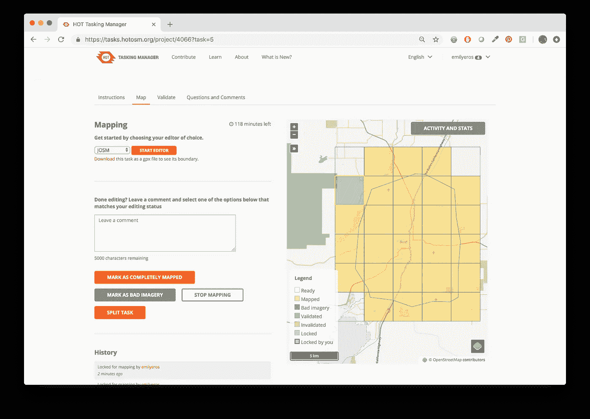
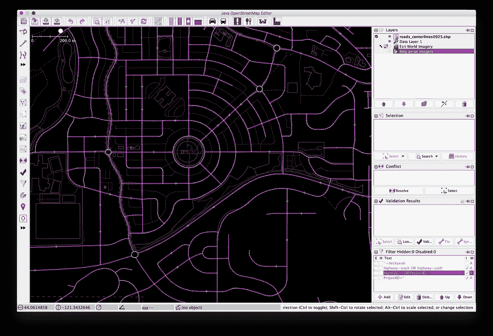
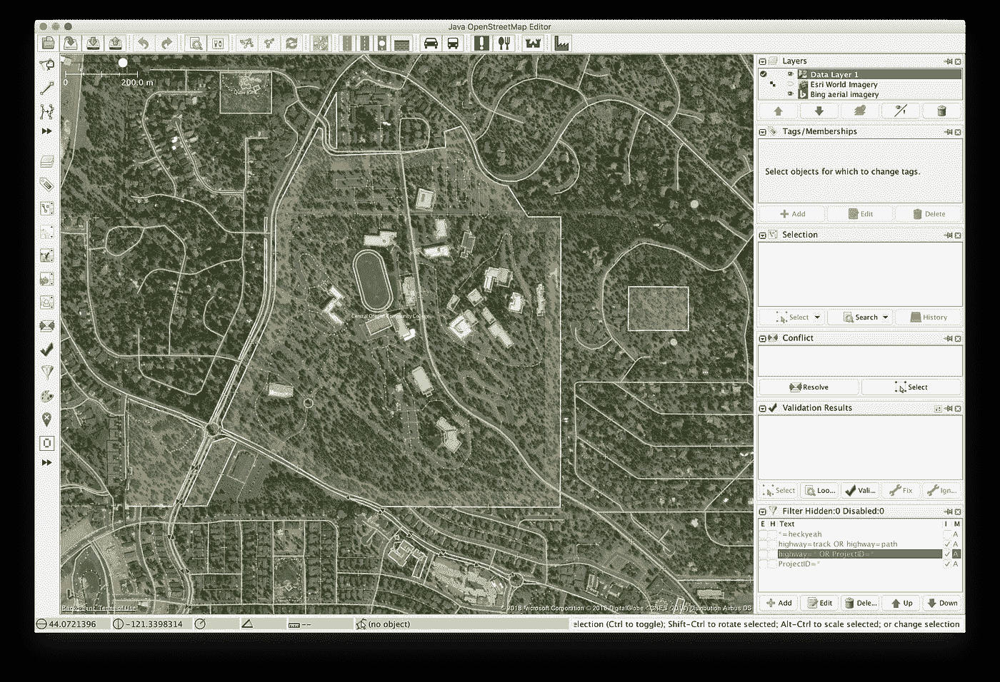
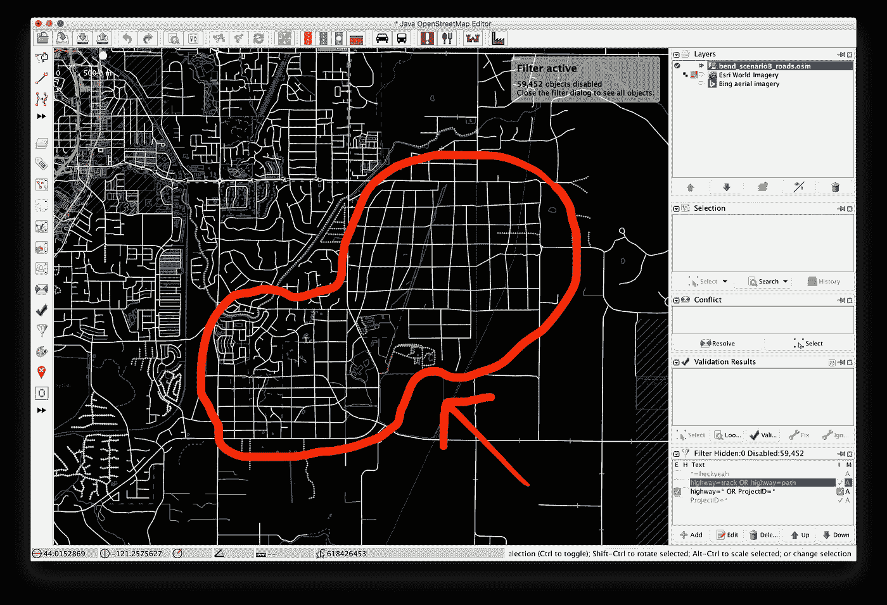
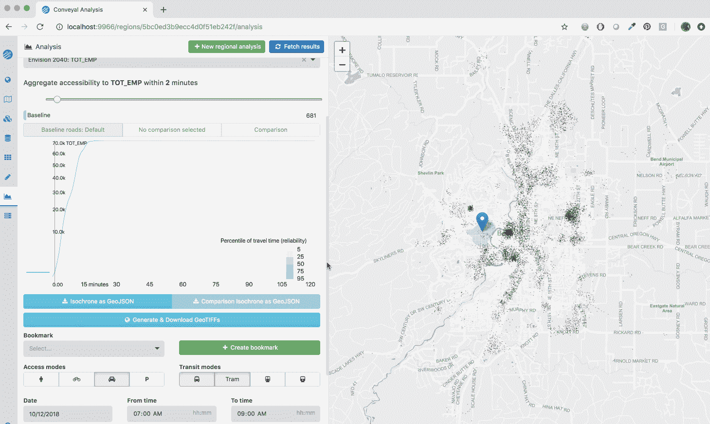
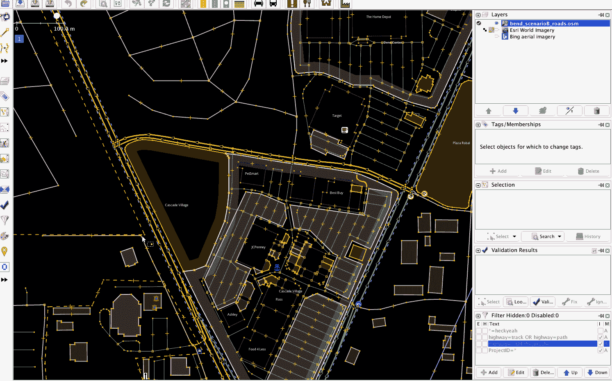
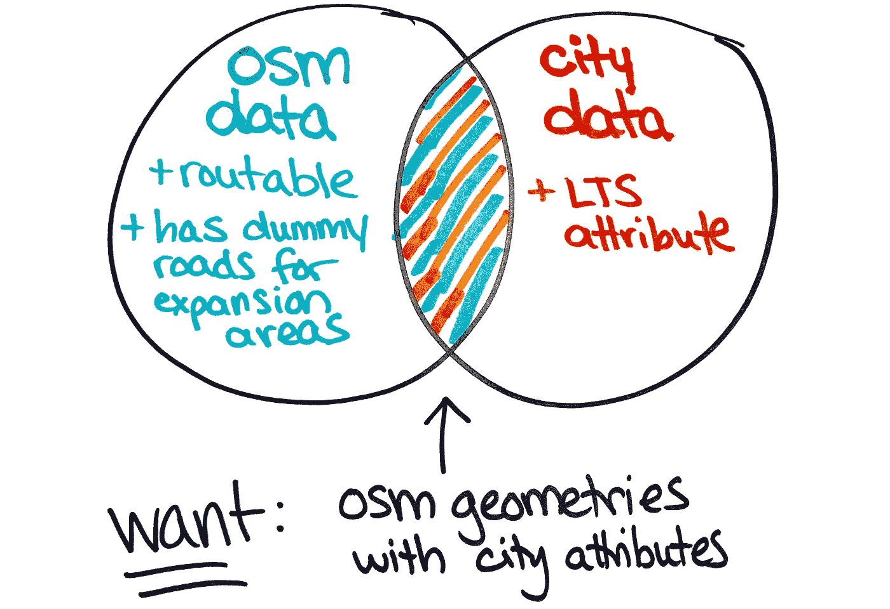

# 技术工作流程:为可达性分析构建交通场景

> 原文：<https://towardsdatascience.com/technical-workflow-building-transportation-scenarios-for-accessibility-analysis-419e927ca92f?source=collection_archive---------13----------------------->

## 逐步文档

在[的前一篇文章](https://medium.com/@emilyeros/tools-for-analyzing-employment-accessibility-a-review-6f6466402224)中，我记录了我使用一系列工具来衡量各种交通方式下的工作可达性。我最终使用了[传送带的分析](https://www.conveyal.com/analysis/)工具。然而，即使有了这个专门的软件，我的分析也需要大量的数据争论来构建未来的场景。

# 问题是

即使是最好的软件工具似乎也是为大城市设计的——像纽约和旧金山这样的地方，那里的道路或多或少都是固定的，所以规划增长通常意味着关注城市交通系统的变化。几个可达性分析工具使得用户可以很容易地开发和比较交通场景。能够在其他环境中利用这些工具是一个巨大的优势。但较小的城市有额外的需求，这些工具不容易解决。

在像本德这样的地方，增长规划主要集中在新的基础设施上:建设新的道路、自行车和行人设施。我考虑过的辅助工具都没有内置的添加或修改道路的功能；用户只能在当前道路网络*上运行场景。此外,(在我看来)没有基于道路交通压力的[水平来评估自行车网络的功能，以便了解骑自行车的*平均*人的连通性。为了将可访问性分析整合到我们的过程中，我们需要能够处理这些类型的场景。](https://blog.altaplanning.com/level-of-traffic-stress-what-it-means-for-building-better-bike-networks-c4af9800b4ee)

**注意:这不适用于更技术性的、自己动手的工具(即任何在 Github 上以代码形式存在的、不能通过用户友好的 GUI 访问的东西)。这些可能很棒，但是对于大多数在城市工作的城市规划者来说是不可用的(更不用说小城市了)。*

# **解决方案**

使用多种工具的组合，可以准备用于评估的自定义道路和自行车网络。这篇文章记录了我为了将分析应用于我们的特定需求而使用的工作流程。这种方法本质上是关于使用 [OpenStreetMap](https://www.openstreetmap.org) (OSM)数据构建场景，因此它也适用于使用 OSM 数据作为输入的其他规划工具(这相当常见，尤其是对于开源工具)。

这篇文章记录了 Bend 的工作流程——部分供我们内部参考，也可能对其他人有用。

# 更广泛的要点

除了技术工作流程本身，该流程还强调了几点:

*   好的地图合并工具将为这样的项目带来真正的好处。手动操作不同格式的数据集需要花费大量的时间和精力。
*   如果情景规划工具能够让用户模拟未来状态的道路变化，那么它们对较小的城市更有用。输送机的分析工具允许用户输入 OSM 数据的自定义 PBF 文件，这就是为什么我们能够使用我们的目的的工具。不过，这仍然很难，并且需要大量关于处理 OSM 数据的技术知识。如果有一个使用户能够修改道路网络的功能，小城市可能会更好地利用分析等工具——类似于对场景进行本地更改的 [iD 编辑器](https://learnosm.org/en/beginner/id-editor/)界面。
*   在 OSM 拥有一个 LTS 标签将为当前状态的 LTS 数据提供一个栖身之所，这将实现更好的分析，并可以避免像我这样的人在未来不得不经历复杂的手动数据过程(或者，该过程可能必须使用一次来获取数据，但随后将可供其他人使用)。

事不宜迟…以下是我使用的工作流程:

# 1.准确的 OSM 基线数据

许多此类工具使用 OpenStreetMap (OSM)作为本地道路网的输入数据。我想检查 OSM 对于我所在地区的准确性，并绘制出任何缺失的道路。

了解 OSM 以及如何编辑它的一个很好的方式是 learnosm.org 的[。对于那些刚到 OSM 的人，我不建议对你所在城市的道路网进行大的改变(比如删除或移动现有的要素)——它可能已经足够接近现状了……而且很容易损坏东西。不过，添加缺失的道路可能会有所帮助。](https://learnosm.org/en/)

我使用[热门任务管理器](https://tasks.hotosm.org/)将网格划分成合理的块(“任务”)。对于每个任务，我使用 [JOSM](https://josm.openstreetmap.de/) (带有 shapefile 插件)将城市的 GIS 数据与 OSM 和卫星图像进行比较，并添加任何缺失的路径、道路等。我把它标记为“完成”，然后继续下一个任务。虽然我肯定有一个更技术性的、GIS 式的方法来做这种比较，但这个城市足够小，我可以很快完成。

The HOT Tasking Manager makes it easy to systematically map, validate, or update an area of interest

Comparing county roads data (fuschia, yellow) to OSM data (grey)

OSM 对大部分弯道都非常准确；我只找到了少数尚未绘制的新道路，其中包含了详细的小巷和便道。不过，我加了很多人行道。这些对于像当地社区学院这样的地区来说尤其重要，它坐落在一大片土地上，那里有许多纵横交错的小径(又名“社交小径”)。虽然不是官方路线，但这是许多人进入大学的现实途径。如果不追踪这些进入 OSM 的路径，行人可及性将会非常低(尤其是如果您使用的工具使用基于质心的方法来定位宗地、街区或区域内的工作)。

Adding footpaths (dashed lime green lines) in JOSM, especially for really large parcels

系统地检查整个城市意味着我对当地 OSM 数据的准确性非常有信心。但是花了很多时间(会议期间 8 小时以上的多任务处理)却没有多少改变。如果我再做一次，我仍然会手动查看数据，但我将只关注检查 OSM 最近开发的区域和拥有大片土地的区域。

我保存了我的更改并上传到 OSM。输送机的分析工具要求 OSM 数据以 PBF 格式提供，这只是 OSM 数据的压缩版本。有几种方法可以达到这个目的:

*   保存在 JOSM 的更改，并转换为 PBF 格式(更多信息如下。未来的场景需要这种方法，所以您最好熟悉它。)
*   等待更改到达服务器，并通过传输分析用户界面下载
*   等待更改到达服务器，并从[热导出工具](https://export.hotosm.org/en/v3/)下载 PBF 格式

# 2.“基线”场景中还有什么？

这是添加其他项目或链接的时候了，这些项目或链接目前还不存在，但是会成为基线分析的一部分。

对本德来说，这意味着在大片未开发的土地上进行新的开发。我在模拟一个 20 年的场景，其中有相当大的人口增长和向新区域的扩张，这些区域刚刚被添加到本德的城市增长边界中。新的家园和工作岗位将位于这些地区，当地的街道将被修建。规划这些街道的确切走向将作为局部区域规划过程的一部分。与此同时，我需要在扩展区域中添加一些本地街道，以便允许模型中的“人”从扩展区域连接到城市，反之亦然。为了做到这一点，我使用 JOSM 绘制了扩展区域的道路，并将它们标记为`highway=residential`。这些道路并不是特别真实或精确，我也不会在地图上将它们显示为“潜在道路”，但它们确实可以作为数据输入。

Adding placeholder local roads for currently-unbuilt areas that are projected to develop housing

在 JOSM，我把这些保存为一个单独的文件`baseline_roads.osm`。我复制了几份用于场景。这个数据**不应该上传到 OSM** ，因为“虚拟道路”实际上并不存在。

# **3。转换成 PBF 格式**

传送带公司的分析要求 OSM 数据采用一种叫做 PBF 的压缩格式。为此，我[安装了 osmium](https://github.com/osmcode/osmium-tool) 作为命令行工具，导航到带有`.osm`文件的目录，并使用
`osmium cat <baseline_roads.osm> -o <baseline_roads.pbf>`进行转换

这个 PBF 文件现在可以用于可访问性分析了。

# 4.准备其他数据输入，测试工具

其他输入包括[公开可用的 GTFS 数据](https://transitfeeds.com/)，人口和就业的土地使用数据，以及分析区域的边界。

**对于土地使用数据:**由于该建模侧重于 2040 年的情景，我没有使用可通过 Conveyal 接口访问的矿脉普查数据。相反，我上传了一个包含未来各州人口和就业预测的地块 shapefile。在 GIS 中，我对这些数据进行了分解，使其仅包含人口和就业字段，并确保其在 WGS84 中进行了投影。

我在这里遇到了一个小障碍，因为数据包含一些非常非常小的宗地(小于 0.00001 英亩)，必须先从 shapefile 中删除这些宗地，然后工具才会接受它们作为输入。

Some of these teeny parcels needed to be deleted.

使用这些输入和基线 OSM 数据，我建立了一个超出我的兴趣范围的分析区域。我运行了分析工具，以确保这些数据是可行的，并且该工具按预期工作。

Inspecting point-based accessibility for cars and pedestrians

**分析区域:**然后，我通过上传本德市城市范围的 shapefile，加上扩展区域和预计未来人口增长和就业的其他区域，对结果进行约束。我检查了结果，以确保它们有意义，然后转向场景。

Inspecting regional results for cars. The gist: the average person in a car can reach all jobs in half an hour (or less). This is what I would expect to see.

Inspecting regional results for bikes. The gist: the average person on a bike could access about 60% of future jobs in half an hour. This doesn’t account for the level of traffic stress of the roads. This result seems pretty reasonable based on local conditions; seems like everything is working properly.

# 5.构建道路场景

这部分不是很复杂，但是很快。根据我拥有的数据格式，构建新道路场景的最简单方法是:

1.  将基线 OSM 文件的副本保存为`scenarioA_roads.osm`，并在 JOSM 打开它。
2.  使用我为潜在的新道路准备的 Shapefile，确保它在 WGS84 投影中，将它作为一个单独的图层加载到 JOSM(使用 shapefile 插件)
3.  交替查看两个不同的图层，并根据它们的位置和我的描述追踪新的道路(这会影响道路是否应该标记为`highway=residential`或`highway=secondary`等)。我还标记了潜在的项目(例如`scenario=A`)来跟踪它们——数据将保留在我的本地机器上，所以我不担心用非标准的标记弄乱数据。
4.  将文件保存在 JOSM 本地。**不要将更改上传到 OSM。**
5.  使用第 3 节中的过程转换到 PBF(见上一节)
6.  对任何其他场景重复此过程

然后，道路场景就可以载入分析并运行了。

Example: Tracing a new road into JOSM.

# 6.自行车网络:局限于低压力路线(很多兔子洞和麻烦)

对于骑自行车的普通人来说，并不是所有的道路都是安全舒适的。为了模拟普通人*的可达性，根据 ODOT 的分类系统，我将分析仅限于模拟 LTS 1 号或 LTS 2 号公路。我用这个低压力网络为自行车开发了不同的场景。*

我们已经有了 Bend 道路交通压力水平的内部 GIS 数据。这一信息还有另一个来源； [PeopleForBikes](https://bna.peopleforbikes.org/#/) 使用 OpenStreetMap 数据生成美国 500 多个城市道路的 LTS 估计值。这些数据可以从他们的网站上免费下载(旁注:如果 LTS 能作为 OSM 的一个标签被添加进去，那就太好了，这样这些信息就更容易获得了)。这不如基于当地详细信息的数据准确，质量取决于当地 OSM 数据的完整性；此外，它可能不遵循构成新 LTS 协议的特定分类标准，等等(在我们的案例中，我们使用了 ODOT 的指导方针)。也就是说，这些数据是一个非常好的开始，其背后的方法在网站上有非常好的记录，所以你可以告诉为什么事情会以这种方式分类。我将本德市的 LTS 数据与 PeopleForBikes 的 LTS 数据进行了比较，结果基本相当接近——见下文。在某些情况下，城市数据更准确或更新。在其他情况下(比如高速公路入口和出口)，PeopleforBikes 的方法会产生更真实的(高压力)结果。

This map shows both LTS datasets on the same map. Zoom in to see the different datasets side-by-side. High-stress roads are shown in shades of red; low-stress roads are shown in shades of blue. City data are represented by darker and bolder lines than PeopleforBikes data. Matching data looks like two parallel lines of the same-ish colour; mismatching data will have a red line parallel to a blue line.

这是我遇到障碍的地方。我至少有两种不同格式的不同数据集。我的城市 GIS 数据不可选择路线，也没有在之前步骤中创建的“虚拟”道路。我的 OSM 数据没有 LTS 属性。

Why is this so hard?

## 首先，我试图变得老练

合并来自不同机构/来源、不同格式的数据，对世界各地的城市来说都是一个挑战。为了避免手动过程，我尝试了几个地图合并工具:[hootenny](https://github.com/ngageoint/hootenanny)和 [SharedStreets](https://sharedstreets.io/) 。SharedStreets 并没有不符合我当时的需求(但我对未来寄予厚望)。Hootenanny 目前正在被 NGA 使用，看起来是为 OSM 和 GIS 合并而设计的，所以我充满希望。我设置了一个本地版本的 Hootenanny，并尝试加载我的数据集。我在这里遇到了很多障碍，并认为这可能只是一个巨大的兔子洞(我的截止日期很紧)，所以我现在放弃了这一努力。

我还尝试在 GIS 中混合我的数据集，转换成 OSM 格式，并加载到 JOSM。这涉及到重复的功能。我在 JOSM 检查了这些，看到了不应该存在的路径之间杂乱无章的连接。我将结果作为输入数据进行分析，只是为了看看会发生什么，结果真的很奇怪。这个过程是一个“不”。

## **实际效果:**

最后，我不得不使用手动且相当繁琐的方法:

*   在 GIS 中，仅制作高应力道路的 shape file(LTS 3 或 4)
*   创建基线 OSM 数据(`baseline_bike.osm`)的副本，并在 JOSM 打开
*   将高应力形状文件作为图层加载到 JOSM 中(使用 JOSM 形状文件插件)
*   交替查看这两层。找出任何高应力的路段(路线),并从`baseline_bike.osm`文件中删除。几个小技巧可能会让这变得更容易——尝试过滤你的视图，只考虑高速公路和主干道`highway=primary`、`highway=secondary`等。其中大部分可能是高压力的，可以删除。接下来，过滤显示所有的道路和路径(`highway=*`，但没有其他功能。
*   将 JOSM 文件保存在本地。**不要将更改上传到 OSM。**
*   转换为 PBF 使用锇命令行工具(见第 3 节)

现在可以输入到分析中了。

为了创建新的场景，我使用了`baseline_bike.osm`文件作为基础，并在场景项目列表中包含的任何新的或修改的道路和自行车设施中进行跟踪——这与第 5 节的过程相同。我将这些标记为`highway=residential`，以确保它们被认为是可供自行车使用的街道。

在分析中，我把这些设定为新的区域。由于道路网络仅包括可供普通骑自行车者使用的道路，因此只能从自行车的角度进行分析。我没有使用这些数据对其他模式进行分析。

# 7.自行车网络:开发书立

我还分析了如果整个网络(所有合理的设施)是低压力的，自行车的可达性。这篇文章解释了为什么，以及它如何有助于围绕城市的自行车网络形成对话。

为此，我使用汽车场景输入(`baseline_roads.pbf`、`scenarioA_roads.pbf`等)来分析自行车的就业可达性。这产生的结果比只有低压力的自行车场景的结果高两倍。这表明自行车的壁垒将就业机会减少了一半。它还有助于隔离场景项目的潜在影响——在一个联系更紧密、压力更小的网络中，新的联系会产生更大的影响。