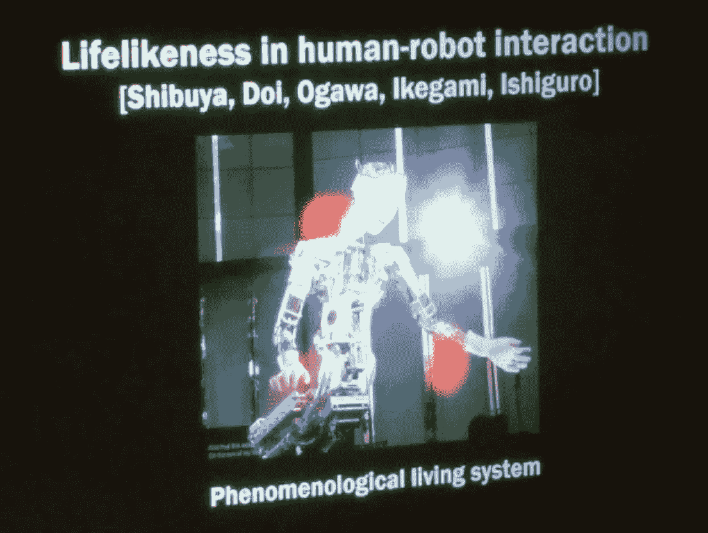

# 区分人工智能和人类#1:人类 VS 人形机器人

> 原文：<https://towardsdatascience.com/telling-apart-ai-and-humans-1-humans-vs-androids-bddeab54b0e2?source=collection_archive---------12----------------------->

ALife 2018 conference, © Lana Sinapayen

在一个视频中，人们认为一个人实际上是一个超现实的机器人，受此启发，我决定写一篇关于如何识别人形机器人的文章。这里有几个小技巧！

在花了这么多时间研究 Alter Android 和各种超现实机器人之后，我对你面对的是一个机器人而不是一个人的迹象略知一二。上面的视频是一个人类。这是机器人圣坛，由石黑浩实验室建造，由我的博士实验室 T2 池上实验室编程。

我们还远远不能制造出真正像人类一样的机器人；目前的技术还没有先进到足以愚弄一个 6 岁的孩子，让他认为机器人实际上是一个人。有趣的是，目前存在的动作最流畅、最无缝的机器人看起来一点也不像人类:它们要么是制造你的汽车的工厂机器人，要么是著名但非常像机器人的波士顿动力公司的生物。如果你认为一个机器人看起来像人类，它很可能是人类。在寻找下一个“非凡机器人”视频吗？这里有 6 点需要记住。

1.不要相信图片，找视频。看看机器人的皮肤，尤其是脖子。机器人皮肤扭曲不良，做 flappy 包。

2.注意关节。在上面的视频中，女子整个手臂都在摆动，而不仅仅是肘部以下的部分。机器人真正一次移动一个关节的能力暴露了他们。

3.寻找未完成的动作。她开始半眨眼。机器人的动作缓慢而谨慎。他们在光速下不会眨眼。

4.眼皮。机器人的眼睑通常是硬塑料。它们需要滑入眼睛的顶部。你总会在那里看到一条深深的线。

5.反射运动。她把注意力集中在摄影师以外的东西上。她有很多不自觉的眼跳。

6.最后，寻找完美。没有机器人能如此好地聚焦在它们面前的物体上。没有人能笑出美丽的笑容(即使是假笑)。

回到圣坛。再看一遍那个视频:Alter 有柔软的眼睑，但是看看他脖子的皮肤，他的手腕和肘部的运动。当然，Alter 是为了展示它的框架和机械部件而建造的……但是当你看到任何一个[石黑实验室机器人](http://www.geminoid.jp/en/index.html)时，请记住这个建议。