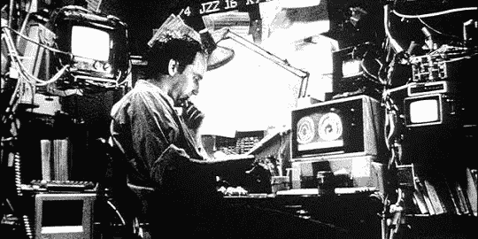
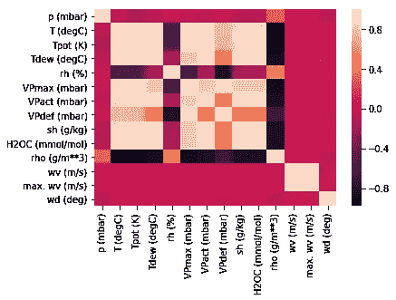

# 基于递归神经网络的温度预测

> 原文：<https://towardsdatascience.com/temperature-prediction-using-recurrent-neural-network-fd6b8436b9c9?source=collection_archive---------13----------------------->

试图预测未来一直是男人的遐想。当我们看到达伦·阿罗诺夫斯基导演的电影《圆周率》中的数学家伙陷入混乱时，这似乎是一个非常糟糕的主意；也就是说，直到递归神经网络来拯救。

Max analyzing the stock market

值得庆幸的是，与股票市场相反，季节性气候条件遵循一种自然模式。这里我们讨论一个可能解决 Max 问题的潜在工具；或者可能没有，因为它没有提供关于数字圆周率的神圣属性的线索，这是一个在电影中从未得到充分解释的谜。

传统的神经网络受到消失梯度问题的困扰；也就是说，灵敏度随时间呈指数衰减。对于从连续的时间相关数据中收集重要性来说，这是个坏消息。为了解决这个问题，你可以使用 LTSM，或 GRU，或类似的神经网络衍生工具，利用长期的依赖关系来保持头脑中的大画面。

> 数据描述:[https://www.kaggle.com/c/csc578f18-finalproj/data](https://www.kaggle.com/c/csc578f18-finalproj/data)

每小时记录 14 个不同的量(包括气温、气压和湿度)。原始数据可以追溯到 2003 年，但我们为这次比赛使用了一个子集，从 2009 年到 2016 年(含)。这本质上是一个多变量回归分析，因此变量之间的相关性很重要，为此我使用 Seaborn 来制作一个热图，以便简单地可视化。似乎大多数都是高度负相关或正相关，这使得预测模型有效。

Correlation heat map

然后，数据被分割成 24 小时窗口，然后根据预先指定的日期和时间进行解析，以创建训练和测试集。后来，标签的大小变得有点短，所以我将开头连接到结尾，以匹配训练集的大小，因为温度是及时的，这种方法匹配自然会发生的事情。我们必须记住将变量调整到 0 和 1 之间，以便它们一致地适合回归模型。需要从 2D 到 3D 的矢量整形，因为循环网络想要知道它工作的时间范围，在这种情况下是 24 小时。

我决定在最后的神经网络架构中使用 3 个卷积层，然后是 3 个 GRU 单元，然后是一个密集层。GRU 是一种时间敏感架构，使用更新门和复位门。决定应该输出什么信息的两个向量。他们可以被训练保留很久以前的信息，而不会随着时间的推移而稀释。更新门决定保留多少过去，重置门决定遗忘多少过去。

GRU cell

这种架构从头到尾都有 0.25 的压降，因为我发现否则它会由于捕捉的细节量而很快过度拟合。最终密集(分类)层的激活函数必须是“线性”函数，因为这本质上是复杂的线性回归。

在编译和运行模型之后，模型是如何随着时间的推移而改进的:

Loss over time

它相对较快地收敛到大约 0.02。总的来说，这是一次相当成功的实验。

试图预测未来是个好主意吗？似乎没有对黄金比例的神圣理解，或者其他超自然的洞察力，预测永远不会是 100%，特别是对于像股票市场这样的人造系统，尽管马克斯可能不同意。值得庆幸的是，自然是比较一致的。出于实用目的，这个模型对于捕捉天气模式中的异常、捕捉黑天鹅事件(如极端天气事件)非常有用。