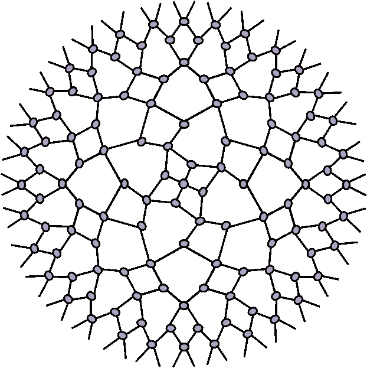

# 张量流:不知道从哪里开始？

> 原文：<https://towardsdatascience.com/tensorflow-no-idea-where-to-begin-b7b981d7321e?source=collection_archive---------1----------------------->

TensorFlow 是一个库，可以应用于所有的机器学习算法，特别是神经网络深度学习。机器学习就是那些被编写来处理大型数据集以从中发现模式并提取信息的程序。它实际上从数据中学习，以做出准确或接近准确的预测，并更好地自我修正。就像我们希望有人做的那样。图像识别及其增强甚至识别是 ML 的一些应用。这只是问题的一个范畴，分类。回归在图形中现有数据之间画一条线，并根据这条线对图形中的新数据进行分类。聚类是根据数据的相似性和差异性来划分数据。规则提取是寻找如果“这个”那么“我会做那个”的模式。ML 算法查看已经被正确标记整批数据或预先存在的数据的语料库，并从该语料库中提取有意义的信息。利用这一点，分类器将找出新样本所属的类别。分类器的准确性主要取决于我们给算法的语料库。分类器是通过向分类算法提供语料库(正确标记的数据集)并训练自己输出分类器而制成的。与早期的基于规则的分类器相比，基于 ML 的分类器总是学习和动态的。特征向量是分类器的输入，标签是分类器的输出。表示基于 ML 的系统指出应该注意什么特征。这些是特征选择算法。

> 深度学习系统是一种表示系统

深度学习算法学习重要的特征，以便使预测变得重要。

神经网络是一类侧重于特征选择的深度学习算法。神经网络是由称为神经元的核心学习元素构成的。神经元是学习或理解其可用语料库中模式的最简单的元素。(深入:神经元看起来是什么样子，以及它如何与数据交互)。深度学习算法基于层，其中每层识别一个特征。每一层将它们的数据传递给下一层，下一层关注于寻找另一个特征，并继续下去。最后一层把所有东西放在一起，找到物体。我们向其提供输入或输出的那些层被称为可见层，而在它们之间的那些层被称为隐藏层。之所以这样称呼它们，是因为它们的输入和输出对我们来说是隐藏的。

世界上所有的问题都可以用图来建模。这些图形被称为计算图或数据流图，它在数据流经图形时转换数据，并实现非常复杂的数字计算。TensorFlow 可以在一个机器集群上运行。将问题建模为图形也可以进行大规模并行操作。TensorBoard 是浏览器中的一个可视化工具，用于在屏幕上查看图形模型，以了解数据如何流动以及如何被它转换。它还能够预测你建立的模型非常迅速和容易。TF 对于新的最大似然算法的 R&D 非常有用。可以在集群中的不同机器上计算图形的不同部分，从而允许我们处理巨大的数据集。

在 TensorFlow 中，一切都是图形。python 设置在图表中形成节点和边。TensorFlow 中的编程包括为您的解决方案构建一个名为 network 的图形模型。每个节点都是一次计算。数据是连接节点的边。这些边叫做张量。张量在图形中流动，并在途中转换。当输入可用时，计算每个节点。(解释一个张量流问题的模型)。

计算图是张量流表示现实世界中任何模型的方式。在这里，我们将对计算图中的节点、边和依赖关系进行建模，并用 TensorBoard 对其进行可视化。边是那些连接节点的线。这些计算图形中的数据称为张量(端维矩阵)。有向无环图是(无环)这样的图，其中每条边都有一个指向前方的箭头来给出结果。它可以向多个节点发送和接收数据。从其他节点接收数据节点被称为相关性。终端节点被称为间接节点，因为它们要么直接接受输入，要么直接给出输出。有圈的图永远不会完成计算。因此只有 tensorflow 只能计算有向无环图。

最大似然算法有反馈回路，这是一个行动的循环。为了解决这个问题，tensorflow 引入了一种不形成循环的工作方法。Tensorflow 通过在第一个图形的末尾创建一个图形副本，并将数据发送到该副本来实现这一点。原始图形将经历循环。它可以根据需要创建任意多副本。这个算法迭代多次。

现在我们要做一个张量流程序。第一步是建立一个图表。这里我们指定数据和操作。然后我们将执行图形来获得结果。

TensorFlow 库生成数千个节点来执行计算。确保在激活安装在您机器上的 TensorFlow 后，您正在终端中运行以下程序。

## [续上 TensorFlow 新手上手。](https://medium.com/@nidhinmahesh/hands-on-tensorflow-for-beginners-95b550969994)