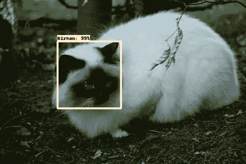
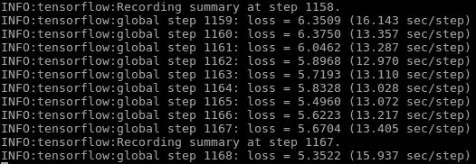
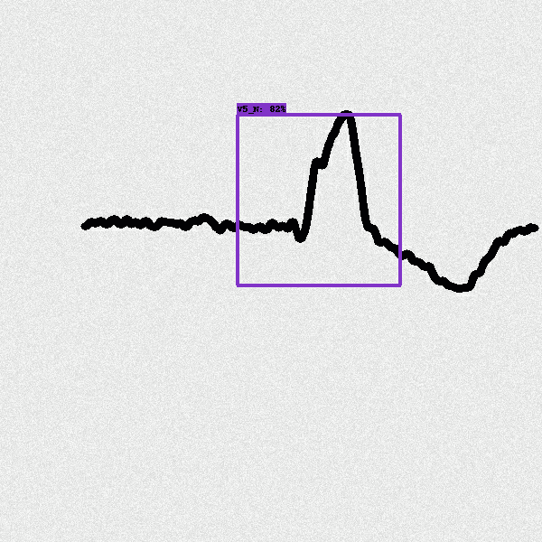
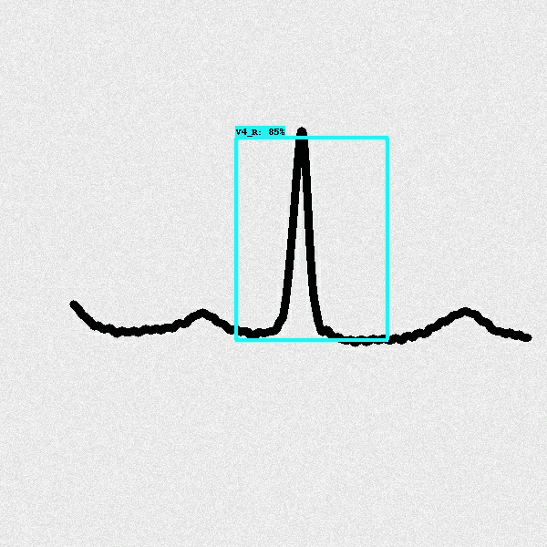

# Tensorflow 对象检测 API —心电图分析

> 原文：<https://towardsdatascience.com/tensorflow-object-detection-api-ecg-analysis-8f456d563dfa?source=collection_archive---------6----------------------->

由于对象检测 API 是由 Tensorflow 团队发布的，因此训练一个具有相当高级架构的神经网络只需遵循几个简单的教程步骤。

但它毕竟是一种设计用来检测矩形框上带有颜色信息的对象的架构。我们究竟如何用它来分析 ECG 信号，这是一项与目标检测问题尽可能不同的任务？一种方法是将架构重新设计成某种序列到序列的观察器，它滑过信号，提取有趣的信息，关注，记住过去，预测未来，并充分探索机器学习彻底改变医疗过程的巨大可能性。

但由于这听起来真的很难，我会用 QRS 节拍将这些信号分割成小片段，并将其绘制到 2D 图像上。为了减少训练过程对网络的压力，我们将用一个漂亮的、平静的、7 像素宽的蓝绿色画笔在一个矩形画布上绘制它们，并使用低水平的红绿蓝噪声。

It’s not really turquoise.

这种方法可以自动生成一整套带有心电图搏动的图片数据集。事实证明，这些搏动有多种类型，如*室性早搏*或*房性早搏。*这些信号是通过连接到人体不同部位的电极获得的，事实证明，来自胸部的信号看起来与来自腿部的信号非常不同(心脏执行相同的动作)。对于不太著名的麻省理工学院-BIH 心律失常数据集，这种双重区分产生了 21 个类别，超过 700 次出现。你可以 [**在这里**](https://github.com/Nospoko/qrs-object/blob/master/main.ipynb) 购买一台免费的笔记本，在你自己的机器上完成所有那些花哨的处理。

因此，随着令人印象深刻的数据重组，我们现在有了一个定义良好的对象检测问题，有大量的标记数据。为了提出一个解决方案，我们将遵循来自官方 Tensorflow 资源库的*牛津-IIIT 宠物* [教程](https://github.com/tensorflow/models/blob/master/research/object_detection/g3doc/running_pets.md)，该教程展示了如何通过重新训练的模型来识别不同品种的猫和狗。

Definitely a cat.

我们所需要做的就是[调整脚本](https://github.com/Nospoko/qrs-object/blob/master/create_tf_record.py)，该脚本将充满图像的目录转换成一对 *tensorflow 记录*，这是一种特殊的格式，可用于将数据输入预训练的模型。我们将使用 *ssd_inception_v2_coco* ，因为它拥有迄今为止最好的名字。

[再多几个步骤](https://github.com/tensorflow/models/blob/master/object_detection/g3doc/running_locally.md)，我们就可以从命令行消息开始监控进度了:

Make sure someone notices you intensively staring into those numbers popping up on your screen. You deserve to be recognized as a bona fide machine learning hacker.

如果你像我一样生活在第二世界国家，那里的计算能力和民主并不丰富，你可能需要在 2014 年的 4 个 CPU 内核的台式机上运行这个程序。几十个小时后，您可以运行评估脚本，并查看 Tensorboard 图像部分。

Normal beat on the V1 lead.

希望现在很明显我不是一个真正的医生(因为没有一个有博士学位的人是)，现在仔细检查评估程序似乎太费力了，所以我真的不能从心脏病学的角度判断这些类别预测是否正确。因此，我直言不讳地提出另外两种节拍，它们似乎被归类为具有相当高的可信度。

**Left**: Normal beat on a V5 lead (allegedly). **Right**: Bundle branch block beat on a V4 lead (maybe).

所有用于生成这些突破性结果[的代码都在这里](https://github.com/Nospoko/qrs-object)。一旦训练程序完成加热我的电脑两千个纪元，我将添加一个更合适的分数评估。