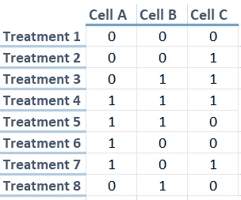

# 使用假设检验来学习

> 原文：<https://towardsdatascience.com/testing-to-learn-part-1-16a7968d2ba3?source=collection_archive---------6----------------------->

我在过去的 6 年里一直忙于测试。无论是电子邮件活动的表现，以推动健康成果，产品的变化，网站的变化，该名单继续下去。其中一些测试是 A/B(可能有多个测试单元)，还有一些是全因子 MVT 测试(我的最爱)。

我想分享一些测试的最佳实践，这样你就可以对你如何设计和思考测试充满信心。

作为一名数据科学家，你可能被期望成为如何正确测试的主题专家。或者，您可能刚刚构建了一个产品推荐引擎(或一些其他模型)，并且您希望看到与以前使用的模型或业务逻辑相比，您的性能提高了多少，因此您将测试新模型与当前生产中的任何模型。

测试的世界远不止这里所包含的，但我希望在这里涵盖的是:

*   确定测试和控制**群体**
*   启动前的测试范围
*   一个**测试设计**，它将允许我们读取我们希望测量的结果
*   测试分析
*   关于**自动化**测试分析的思考

**选择测试和控制群体**

这是魔法开始的地方。确定因果关系的唯一方法是随机分组(和正确的测试设计)。因此，如果我们想了解任何东西，我们的人口必须被正确地划分出来。一般来说，你的目标人群将会是你所测试的特定人群。如果这是一个电子商务公司的网站测试，你希望访问者在访问网站时被随机测试和控制。如果您正在运行一个电子邮件活动或一些其他类型的测试，那么您将从数据库或 BigData 环境中找出所有符合参与测试标准的相关客户/人员。

如果这是一个很大的列表，你可能需要在一段时间内对客户进行随机抽样。这叫做简单随机抽样。一个简单的随机样本是总体的一个子集，其中每个成员被选入样本的概率是相等的。

这里有一篇关于如何从 Hive 中随机抽取样本的文章:[这里](http://www.joefkelley.com/736/)

*另外，需要明确的是，在 SQL 中编写“select top 1000 * from table”并不是一个随机样本。有几种不同的方法可以在 SQL 中获得随机样本，但是如何做将取决于您所使用的 SQL 的“风格”。*

这里有一篇关于在 SQL server 中抽取随机样本的文章:[这里](http://afana.me/archive/2010/12/01/random-rows-efficiently-in-sql-server.aspx/)

现在你已经有了你的样本，你可以将这些人随机分配到测试组和控制组。

有时候，我们需要变得更老练一点。

假设您想了解推动行业参与度的能力(并且您有行业数据)。一些行业可能会比其他行业包含更少的成员。也就是说，如果你只是将一部分人分成两组，你可能在某些你关心的行业中没有足够高的样本量来确定统计显著性。

与其竭尽全力进行测试，发现你无法了解你所关心的行业，不如使用**分层抽样**(这将涉及在每个感兴趣的群体中进行简单的随机抽样)。

**发布前的范围界定**

我在实践中看到，当人们没有看到他们想要的结果时，他们会说“我们将让这个测试再运行两周，看看会发生什么”。特别是对于站点测试，如果你运行的时间足够长，微小的影响也会变得很大。你应该知道你得到了多少流量，在你发布之前测试应该运行多长时间。否则，是什么阻止我们运行测试，直到我们得到我们想要的结果呢？

在测试开始之前，与其他利益相关者坐下来，了解业务含义，他们希望了解什么，他们在测试谁，以及他们如何测试。根据我的经验，当你被视为帮助构建测试的思想伙伴，并且在启动之前就分析的范围达成一致时，每个人都为成功做好了准备。

**测试设计**

对于测试中的每个单元格，您只能进行一次更改。例如，如果我们有:

*   单元格 A:15 美元的价位
*   单元格 B:25 美元的价位
*   单元格 C: UI 更改和 30 美元的价格点

你只是丢失了信息。添加一个 UI 更改和一个不同的价格选项使得无法解析 UI 更改或 30 美元的价格点会产生什么影响。我们只能知道这些细胞的总体表现。

迭代测试是当你从一个测试中获得获胜者，并把它作为后续测试的控制。这种方法会导致信息丢失。如果测试 1 的输家和测试 2 的赢家的组合实际上是赢家呢？我们永远不会知道！

有时像这样的迭代是有意义的(也许你没有足够的流量来容纳更多的测试单元)，但是我们想要提前讨论所有潜在的让步。

另一种类型的测试设计是 MVT(多变量)。在这里，我们将看到一个全因子 MVT。有更多类型的多变量测试，但全因子是最容易分析的。

*   对于更微妙的优化，MVT 更好(如果您认为测试会有巨大的影响，应该使用 A/B)
*   经验法则是每月至少有 100，000 个独立访问者。
*   您需要知道如何使用 ANOVA 进行分析(我将在后续文章中提供关于如何进行这种分析的代码和解释，并在稍后链接到这里)

MVT 测试的一个示例如下。左边(下面)是对照实验，右边是 3 个试验处理。这导致 2 = 8 个处理，因为我们将查看测试和控制的每个可能的组合。

我们可以了解所有的互动！了解相互作用并在改变多个项目时找到最佳处理方法是 MVT 测试的最大优势。下图显示了每个人将如何被分配到 8 种治疗方法中的一种。

在以后的文章中，我会用 R 代码写一篇我以前分析过的 MVT 测试。

**测试分析**

测试分析最重要的部分之一是在我们如何分析测试的业务中保持一致性。你不想说某事有因果关系，如果另一个人分析了同样的测试，他们可能会得出不同的结论。除了有一致的方法来确定结论，您还希望有一致的方法来与业务的其他部分交流这些结果。“我们会分享 p 值大于 0.05 的结果吗？”也许我们会，也许不会，但要确保整个团队在沟通上保持一致。

**应该总是给定置信区间！**你不想说“哇！这相当于每年 70 万美元”，而实际上它的价值在 10 万美元到 130 万美元之间。这是一个很大的差异，可能会对是否推出变革的决策产生影响。

让我们实现自动化吧！

当我们可以:

*   自动去除异常值
*   如果样本还不够大，内置**而非**计算统计显著性
*   使用置信区间和引人入胜的图表确定指标的统计显著性
*   查看发布后不久测试的执行情况，以确保没有任何错误干扰我们的结果或收入大幅下降。
*   这也减少了分析中出错的机会

只需输入几个数据和按几个按钮！

这需要一段时间来构建，并且不会对所有的测试都适用。即使是部分自动化也可以大大减少分析测试所花费的时间！

我希望这篇文章能给你一些测试时需要注意的事情。如果你还在上学，想成为一名数据科学家，参加一门普通的统计学课程，包括使用哪些统计数据以及如何计算置信区间，这将使你在数据科学的职业生涯中受益匪浅。否则，互联网上肯定有大量的信息给你如何计算这些统计数据的概述。我个人更喜欢 [Coursera](https://click.linksynergy.com/link?id=qBzelsuolGo&offerid=467035.10269398288&type=2&murl=https%3A%2F%2Fwww.coursera.org%2Flearn%2Fhypothesis-testing-confidence-intervals) ，因为可以高枕无忧地观看内容上的视频，知道内容来自知名大学，这种感觉很好。

通过正确执行测试，您可以学到很多东西。快乐学习！

访问[我的网站](https://datamovesme.com/)获取更多文章:)