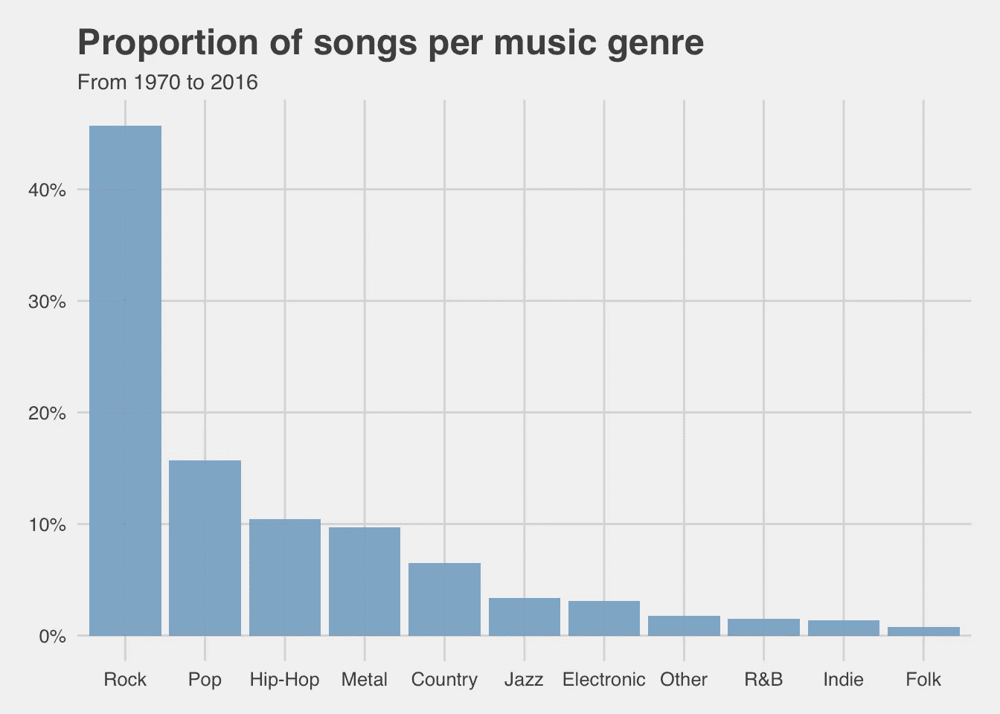
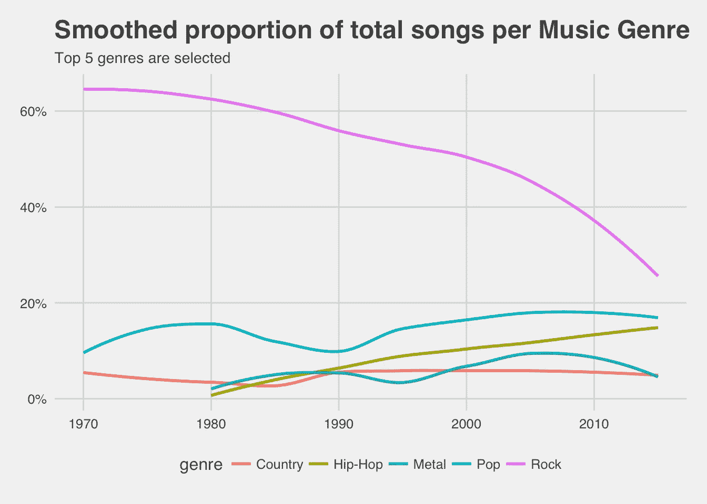
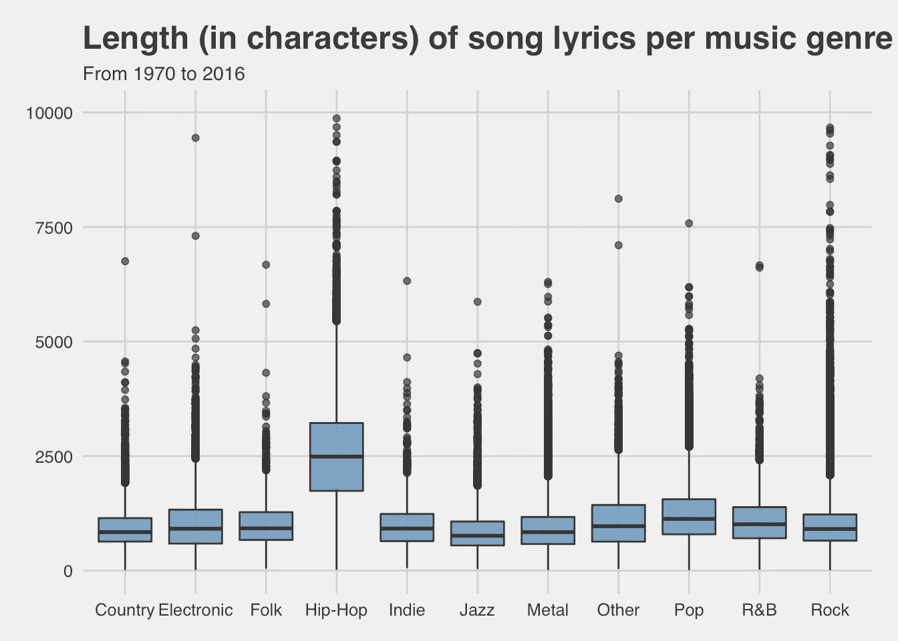
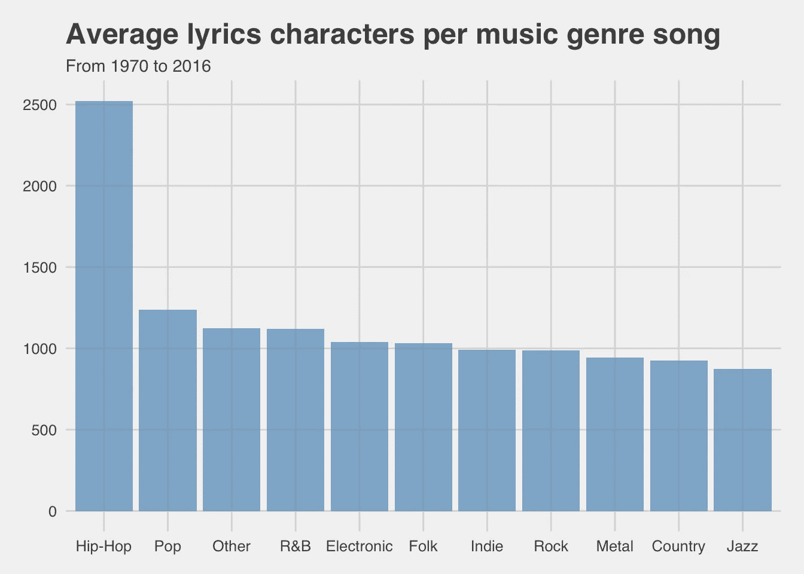
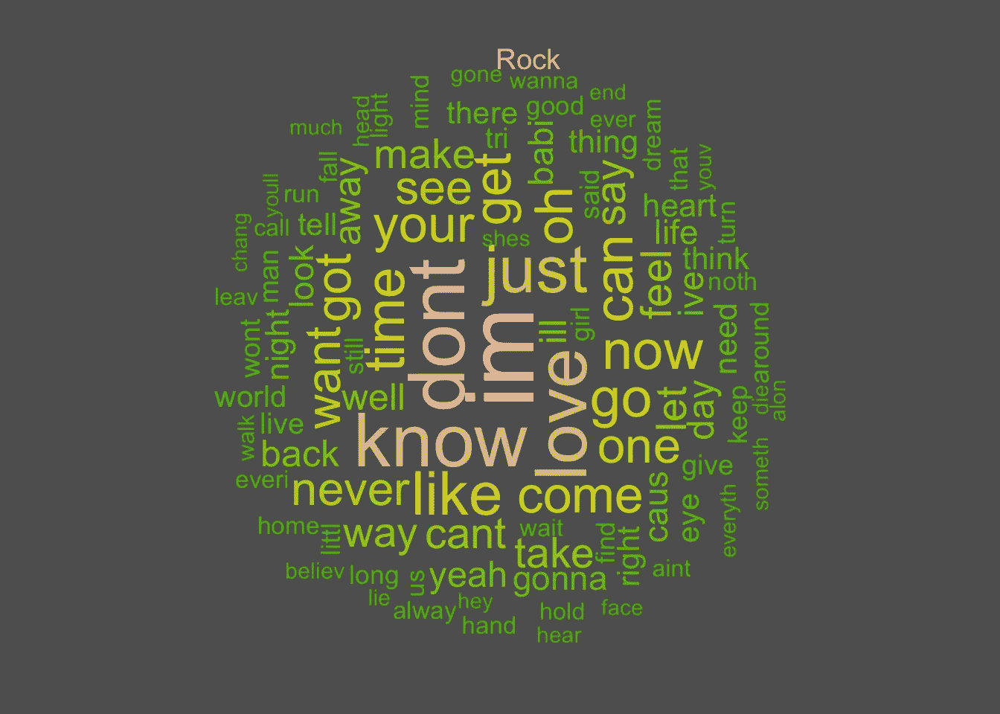
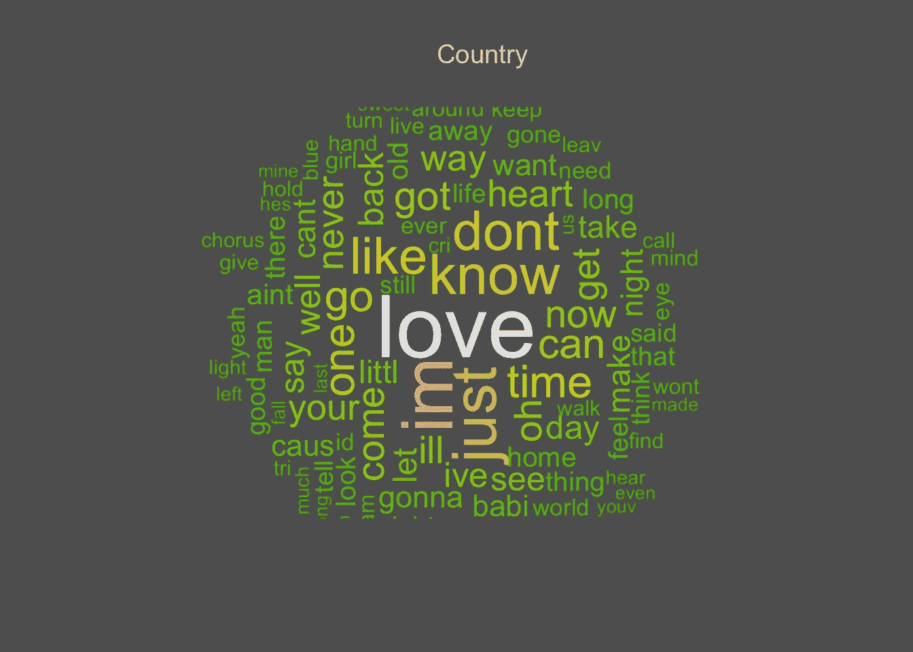
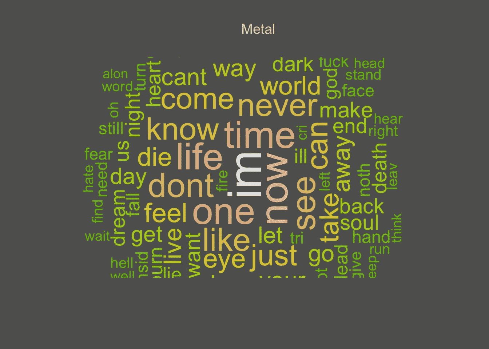
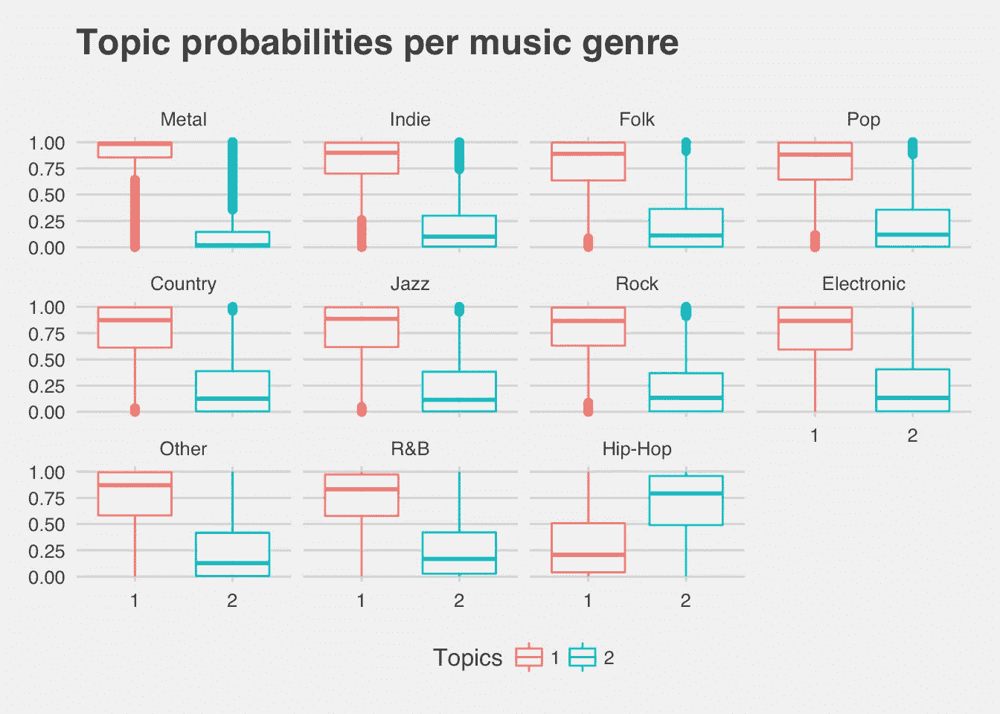

# 音乐流派歌词的文本分析和主题建模

> 原文：<https://towardsdatascience.com/text-analytics-topic-modelling-on-music-genres-song-lyrics-deb82c86caa2?source=collection_archive---------8----------------------->

这项分析使用了自 1970 年以来发表在 [kaggle](https://www.kaggle.com/gyani95/380000-lyrics-from-metrolyrics/data) 上的超过 38 万首歌曲的数据集。主要目标是根据歌词开发音乐类型的集群，步骤如下:

*   数据准备(清理、转换等。)
*   探索性分析
*   主题建模

使用了各种 R 库，但主要是基于 [#tidytext](https://twitter.com/hashtag/tidytext?src=hash) 和 [#tidyverse](https://twitter.com/hashtag/tidyverse?src=hash) 环境。

数据准备是分析的一个非常重要的部分。第一步是排除所有歌词文本字段长度小于 10 个字符的歌曲。
然后，在查看歌词文本字段后，似乎出现了大量非英文歌曲。决定在最终的数据集中只包括英语歌曲。因此，通过使用 cld3 库，歌曲的来源被检测到&被添加到数据集中。语言检测并不完美，因为它错误地分类了一些歌曲。但由于原始数据集很大，我决定使用它，并从数据集中删除所有非英文歌曲。最后，所有音乐类型缺失或未知的歌曲都被删除。所有年份输入无效(小于 1970 年)的歌曲也被删除。

关于这些步骤的更多细节可以在文章末尾的实际代码中找到。

# 主要分析

下面有一个频率图来表示音乐流派之间的差异。

大多数歌曲属于摇滚类型，几乎是这个数据集中所有歌曲的 50%。前五大音乐流派是摇滚、流行、嘻哈、金属和乡村音乐。

看看这是否会随着时间的推移而保持不变会很有趣。下面有一个图表显示了这些年来的变化。

这里有一些发现。起初，摇滚音乐在歌曲中所占的比例下降了(从 60 %下降到 25 %)。另一方面，hip-hop 逐渐上升(目前接近 20 %)。Pop 在 20 %左右，并且多年来相当稳定。

现在让我们试着找出哪种音乐类型使用了更多的歌词。

Hip-Hop 似乎是一种明显不同的音乐类型，因为它比其他类型的歌曲使用更多的歌词。

# WORDCLOUD

看看每种音乐类型中使用最多的单词是很有趣的。下面是排名前五的音乐类型的单词云。词云(也称为文本云或标签云)以一种简单的方式工作:特定的词在文本数据源中出现得越多，它在词云中出现得就越大、越粗。
下面是排名前 5 的音乐流派的词云。

# 主题建模

例如，考虑这样一种情况，您面对一大堆文档，但不知道它们是关于什么的。您可能想做的第一件事是将这些文档按主题分类。除此之外，这将帮助你找出是否有任何感兴趣的东西，同时也将你引向语料库的相关子集。对于小的集合，人们可以通过简单地浏览每个文档来做到这一点，但是对于包含数千个文档的语料库来说，这显然是不可行的。

主题建模处理将文档集自动分类到主题中的问题。选择的算法是潜在的狄利克雷分配或 LDA，它本质上是一种便于在文档集合中自动发现主题的技术。

LDA 背后的基本假设是，集合中的每个文档都由集合范围内的主题组成。然而，实际上我们只观察文档和单词，而不是主题——后者是文档隐藏(或潜在)结构的一部分。目的是根据给定的单词和文档推断潜在的主题结构。LDA 通过反复调整文档中主题和主题中单词的相对重要性来重建语料库中的文档。

在我们的案例中，开发了具有两个主题的 LDA 模型。在计算了所有歌曲的主题概率之后，我们可以看到这种无监督的学习是否能够区分或揭示音乐流派之间的关联(关于它们的歌词)。下面的方框图显示了每首音乐类型的歌曲属于这三个主题的概率。

Hip-Hop 流派几乎被唯一地确定为一个单独的主题(主题 2)。其余的音乐流派似乎被确定为另一个主题。
所以我们可以说 Hip-Hop 绝对是一种音乐流派，它在歌词中使用了与其他流派明显不同的语言。
开发了更多的 LDA 模型(三个&四个主题)，但初始模型(两个主题)的结果更相关、更重要。

**结论**
最后我们可以得出这样的结论:
-有一种音乐类型，Hip-hop，与其他类型的音乐明显不同，因为它使用了更多&不同的歌词。随着歌曲的减少和新音乐类型的出现，摇滚音乐的受欢迎程度逐渐下降。

**硬件环境
有些任务可能要求很高(对于包含文本数据的大型数据集)。例如，LDA 建模任务大约需要 7-8 分钟才能完成。**

[全 R 码](https://github.com/mantoniou/Blog/blob/master/content/post/2018-06-text-analytics-song-lyrics.Rmd)