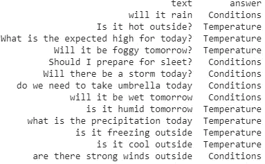

# 基于 K 近邻的文本分类

> 原文：<https://towardsdatascience.com/text-classification-using-k-nearest-neighbors-46fa8a77acc5?source=collection_archive---------6----------------------->

我们将使用 Python 为文本分类定义 K 近邻算法。通过在训练数据中找到 K 个最接近的匹配，然后使用最接近匹配的标签进行预测，使用 KNN 算法进行分类。传统上，诸如欧几里得距离被用来寻找最接近的匹配。


对于文本分类，我们将使用 nltk 库来生成同义词，并使用文本之间的相似性得分。我们将识别在训练语料库中具有最高相似性得分的 K 个最近邻。

在这个例子中，为了简单起见，我们将使用 K = 1

算法:

**步骤 1:** 让我们先导入库:

**第二步:**

我们实现了 KNN_NLC_Classifier()类，使用标准函数‘fit’进行训练，使用‘predict’对测试数据进行预测。KNN 使用懒惰训练，这意味着所有的计算都推迟到预测。在 fit 方法中，我们只是将训练数据分配给类变量— xtrain 和 ytrain。不需要计算。

请注意，类接受两个超级参数 k 和 document_path。参数 k 与传统的 KNN 算法相同。k 表示将使用多少个最近邻居来进行预测。首先，我们用 k=1。另一个参数解释两个文本之间使用的距离类型。

在预测函数中，对于每一行文本数据，我们将文本与每一行训练数据进行比较，以获得相似性得分。因此预测算法是 O(m * n ),其中 m =训练数据中的行数，n 是需要进行预测的测试数据的行数。

当我们遍历每一行训练以获得相似性得分时，我们使用自定义函数 document_similarity，该函数接受两个文本并返回它们之间的相似性得分(0 & 1)。相似性得分越高，表明它们之间的相似性越大。

**第三步:**接下来，我们实现文档相似度函数。为了实现这一点，我们对每个文本/文档使用 synsets。

我们通过函数 doc_to_synsets 将每个文档文本转换成 synset。这个函数返回文本中每个单词的同义词集列表。

**步骤 4:** 现在，我们实现函数相似性得分，它使用两个文本/文档的同义词集来提供它们之间的得分:

此函数接受超参数 distance_type，其值可以是“path”、“wup”或“jcn”。根据这个参数，从 nltk 库中调用适当的相似性方法。

**可选:**请注意，我们可以按照下面的代码片段实现其他方法来计算 nltk 库中的相似性得分。不同的函数基于不同的语料库，如 brown、genesis 等。并且可以使用不同的算法来计算相似性得分，例如 jcn、wup、res 等。这些函数的文档可以在 nltk.org 找到

**步骤 5:** 现在，我们可以实现文档相似度，它计算文档 1 &文档 2 之间的相似度，反之亦然，然后对它们进行平均。

**可选:**下面是到目前为止检查代码的测试:

**第六步:**现在我们可以使用分类器来训练和预测文本。为此，首先导入一个数据集。我们将使用 Watson NLC 分类器演示中提供的演示数据集。数据集将文本分为两类——温度和条件。数据集非常小 appx。只有 50 条短信。

**第七步:**对数据进行预处理。我们将做以下预处理—

1.  删除停用词(常用词，如“the”、“I”、“me”等。).为此，我们将从 nltk 下载停用词列表，并添加额外的停用词。
2.  将所有文本/文档转换成小写
3.  忽略数字内容等，只考虑文本数据。

我们将最终的训练数据加载到 X_train 中，并将标签加载到 y_train 中

```
**import** **re**
nltk.download('stopwords')
s = stopwords.words('english')
*#add additional stop words*
s.extend(['today', 'tomorrow', 'outside', 'out', 'there'])ps = nltk.wordnet.WordNetLemmatizer()
**for** i **in** range(dataset.shape[0]):
    review = re.sub('[^a-zA-Z]', ' ', dataset.loc[i,'text'])
    review = review.lower()
    review = review.split() review = [ps.lemmatize(word) **for** word **in** review **if** **not** word **in** s]
    review = ' '.join(review)
    dataset.loc[i, 'text'] = reviewX_train = dataset['text']
y_train = dataset['output']print("Below is the sample of training text after removing the stop words")
print(dataset['text'][:10])
```

**步骤 8:** 现在，我们创建之前创建的 KNN 分类器类的实例，并使用定义的方法“fit”来训练(lazy)，然后使用 predict 函数进行预测。我们将使用一些示例文本来进行预测。

我们得到以下依赖于训练数据的预测。



因此，我们定义了使用 nltk 进行文本分类的 KNN 最近算法。如果我们有好的训练数据，这将非常有效。在这个例子中，我们只有 50 个文本的非常小的训练数据，但是它仍然给出了不错的结果。当我们使用 nltk synsets(同义词)时，即使预测中使用的单词/文本不在训练集中，该算法也能很好地执行，因为该算法使用同义词来计算相似性得分。

**未来的改进:**这个算法使用 K = 1。可以对该算法进行进一步的改进，以实现 K 个一般变量。我们也可以在类中实现“proba”函数来提供概率。我们将在这个算法的下一个版本中实现这些特性:-)

参考资料和进一步阅读:

CourseRA——Python 中的应用文本挖掘