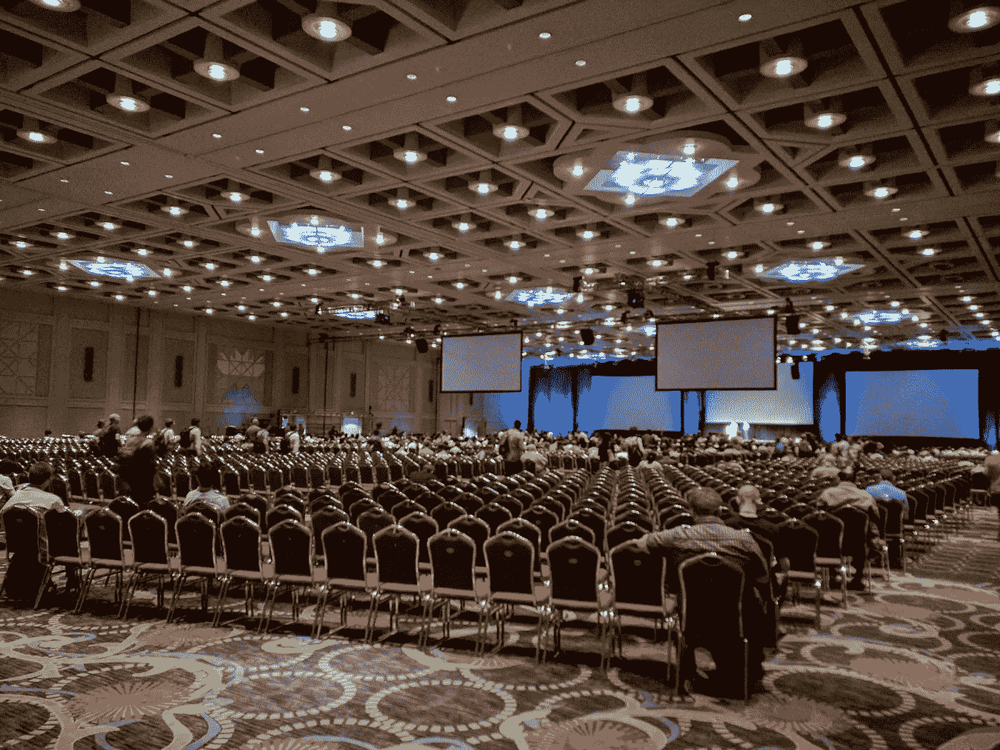
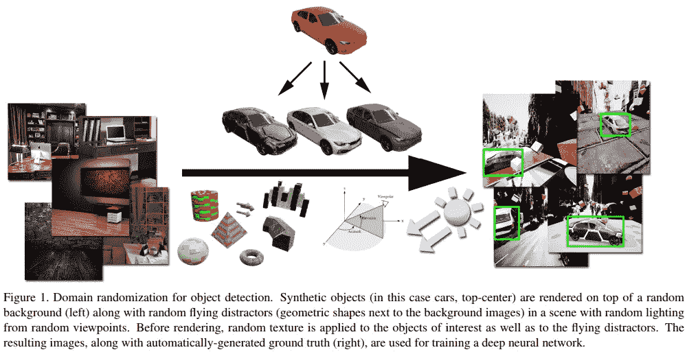
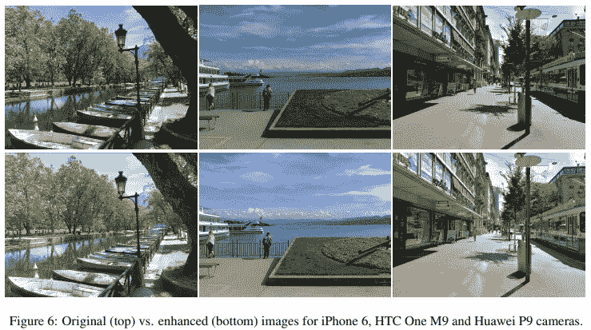
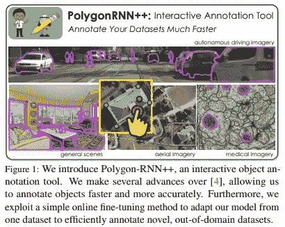
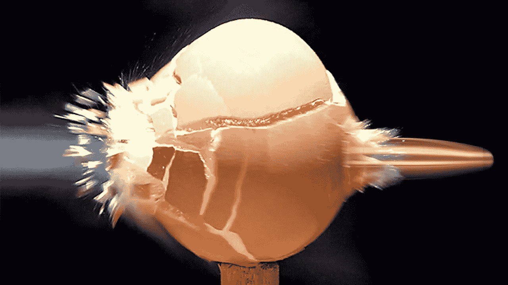
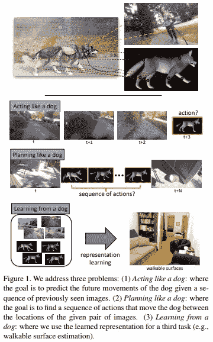
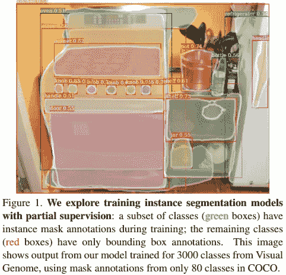
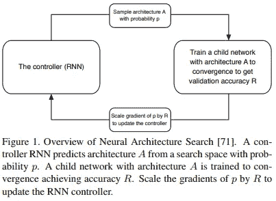

# 2018 年 CVPR 十大最酷论文

> 原文：<https://towardsdatascience.com/the-10-coolest-papers-from-cvpr-2018-11cb48585a49?source=collection_archive---------2----------------------->

> 想获得灵感？快来加入我的 [**超级行情快讯**](https://www.superquotes.co/?utm_source=mediumtech&utm_medium=web&utm_campaign=sharing) 。😎

2018 年计算机视觉和模式识别大会(CVPR)于上周在美国盐湖城举行。这是计算机视觉领域的世界顶级会议。今年，CVPR 收到了 3300 份主要会议论文，接受了 979 份。超过 6500 人参加了会议，好家伙，这是史诗！6500 人挤进了这个房间:

CVPR 2018 Grand Ballroom

每年，CVPR 都会带来伟大的人和他们伟大的研究；总有新的东西可以看和学。当然，总会有一些论文发表新的突破性成果，并为该领域带来一些伟大的新知识。这些论文通常会在计算机视觉的许多子领域中塑造新的艺术状态。

然而最近，真正有趣的是那些开箱即用的和创造性的文件！随着最近计算机视觉深度学习的热潮，我们仍然在发现所有的可能性。许多论文将呈现深度网络在视觉中的全新应用。它们可能不是最基本的突破性作品，但它们看起来很有趣，并为该领域提供了一个创造性和启发性的视角，往往会从它们呈现的新角度引发新的想法。总而言之，他们很酷！

在这里，我将向你展示我认为 2018 年 CVPR 最酷的 10 篇*论文。我们将看到最近才通过使用深度网络成为可能的新应用，以及其他提供如何使用它们的新方法的应用。你可能会在这个过程中获得一些新的想法；).不多说了，我们开始吧！*

## [用合成数据训练深度网络:通过领域随机化弥合现实差距](https://arxiv.org/abs/1804.06516)

这篇论文来自英伟达，并全力使用合成数据来训练卷积神经网络(CNN)。他们为虚幻引擎 4 创建了一个插件，可以生成合成的训练数据。真正的关键是它们随机化了训练数据可能具有的许多变量，包括:

*   对象的数量和类型
*   干扰物的数量、类型、颜色和比例
*   感兴趣的物体上的纹理和背景照片
*   虚拟摄像机相对于场景的位置
*   摄像机相对于场景的角度
*   点光源的数量和位置

他们展示了一些非常有希望的结果，证明了用合成数据进行预训练的有效性；这是以前从未达到过的结果。如果您缺少这一重要资源，它可能会对如何生成和使用合成数据有所启发。

Figure from the paper: Training Deep Networks with Synthetic Data: Bridging the Reality Gap by Domain Randomization

## [WESPE:用于数码相机的弱监督照片增强器](http://www.vision.ee.ethz.ch/~ihnatova/wespe.html)

这个很聪明！他们训练一个生成对抗网络(GAN)来自动增强照片的美感。酷的地方在于它是*弱监督*；你不需要输入输出图像对！训练网络所需的只是一组“好”的图像(用于输出地面实况)和一组要增强的“坏”的图像(用于输入图像)。然后，GAN 被训练以生成输入的美学增强版本，通常会大大增强图像的颜色和对比度。

它使用起来既快速又简单，因为你不需要精确的图像对，最后你会得到一个“通用的”图像增强器。我也喜欢这是一种弱监督的方法。无监督学习似乎很遥远。但对于计算机视觉的许多子领域来说，弱监管似乎是一个有前途和有利可图的方向。

Figure from the paper: WESPE: Weakly Supervised Photo Enhancer for Digital Cameras

## [用多边形高效交互标注分割数据集——RNN++](https://arxiv.org/abs/1803.09693)

深度网络工作得如此之好的主要原因之一是大型和完全注释的数据集的可用性。然而，对于许多计算机视觉任务来说，获取这样的数据既耗时又昂贵。特别地，分割数据需要对图像中的每个像素进行**的分类标记。**可以想象…..对于大型数据集来说，这可能需要很长时间！

多边形-RNN++允许你在图像中的每个物体周围设置粗糙的多边形点，然后网络会自动生成分割标注！该论文表明，这种方法实际上推广得相当好，可以用来为分割任务创建快速而简单的注释！

Figure from the paper: Efficient Interactive Annotation of Segmentation Datasets with Polygon-RNN++

## [根据时尚图片制作胶囊衣柜](https://arxiv.org/abs/1712.02662)

今天我该穿什么？如果每天早上有人或事能替你回答这个问题，那不是很好吗？这样你就不用回答了。那就跟胶囊衣柜打个招呼吧！

在本文中，作者设计了一个模型，给定一个候选服装和配饰的库存，可以组装一个最小的项目集，提供最大的混搭服装。它基本上是使用目标函数训练的，这些目标函数旨在捕捉视觉兼容性、多功能性和用户特定偏好的关键要素。有了衣柜胶囊，你就能轻松从衣柜里找到最适合你品味的衣服！

Figure from the paper: Creating Capsule Wardrobes from Fashion Images

## [Super SloMo:用于视频插值的多个中间帧的高质量估计](https://arxiv.org/abs/1712.00080)

有没有想过用超慢动作拍摄超酷的东西？那就看看 Nvdia 的*超级 SloMo* 吧！他们的 CNN 估计中间视频帧，能够将标准的 30fps 视频转换成 240fps 的令人敬畏的慢动作！该模型估计帧之间的光流，并使用它来干净地插值视频帧，以便慢动作视频看起来清晰锐利。

A bullet going through an egg, super SloMo!

## [谁把狗放出来了？从视觉数据中模拟狗的行为](https://arxiv.org/abs/1803.10827)

可能是有史以来最酷的研究论文名称！这里的想法是试图模拟狗的思想和行为。作者在狗的四肢上安装了许多传感器来收集它的运动数据；他们还在狗的头上安装了一个摄像头，以获得与狗相同的第一人称视角。一组 CNN 特征提取器用于从视频帧中获取图像特征，然后与传感器数据一起传递给一组 LSTMs，以学习和预测狗的动作。非常新的和创造性的应用，以及独特的任务设计和执行方式，使得这篇论文非常值得一读！希望它可以通过我们收集数据和应用深度学习技术的方式来激发未来的研究创造力。

Figure from the paper: Who Let The Dogs Out? Modeling Dog Behavior From Visual Data

## [学习分割每一个事物](https://arxiv.org/abs/1711.10370)

在过去的几年里，来自何的团队(之前在微软研究院，现在在人工智能研究院)有很多伟大的计算机视觉研究。他们论文的伟大之处在于创造性和简单性的结合。ResNets 和 Mask R-CNN 都不是最疯狂或最复杂的研究想法。它们简单易行，但在实践中非常有效。这里的这个也没什么不同。

*学习分割每样东西*是 Mask R-CNN 的扩展，它赋予网络从训练期间看不到的类中分割对象的能力！这对于快速、廉价地获取数据集的注释非常有用。由于在这样的环境中可能有许多看不见的对象类别，所以它能够获得看不见的对象类别的一些通常很强的基线分段的事实对于能够在野外部署这样的分段网络是至关重要的。总的来说，这无疑是朝着正确的方向迈出的一步，让我们能够思考如何最大限度地利用我们的深度网络模型。

Figure from the paper: Learning to Segment Every Thing

## [你桌面上的足球](https://arxiv.org/abs/1806.00890)

这篇论文应该赢得最佳时机奖，因为它正好在国际足联世界杯开幕时出版！这确实是计算机视觉在 CVPR 的“更酷”的应用之一。简而言之，作者训练了一个模型，给定一个足球比赛的视频，可以输出该比赛的动态 3D 重建。这意味着你可以使用增强现实在任何地方观看它！

真正聪明的部分是结合使用许多不同类型的信息。使用视频游戏数据来训练网络，从视频游戏数据中可以相当容易地提取 3D 网格。在测试时，提取玩家的边界框、姿态和轨迹(跨多个帧),以便分割玩家。这些 3D 片段可以很容易地投影到任何平面上(在这种情况下，您可以创建任何虚拟足球场！)因为在 AR 看足球赛！在我看来，这是一种使用合成数据进行训练的聪明方式。无论如何，这是一个有趣的应用程序！

Figure from the paper: Soccer on Your Tabletop

## [布局网络:从单个 RGB 图像重建 3D 房间布局](https://arxiv.org/abs/1803.08999)

这是一个计算机视觉应用，我们很多人可能都曾经想到过:用相机拍下某样东西的照片，然后用数字 3D 重建它。这正是本文的目的，特别是三维重建房间。他们使用全景图像作为输入，以便获得房间的全景。输出是一个三维重建的房间布局，具有相当好的准确性！该模型足够强大，可以推广到不同形状的房间，并包含许多不同的家具。这是一个有趣的应用程序，你不会看到太多的研究人员在计算机视觉领域工作，所以很高兴看到。

Figure from the paper: LayoutNet: Reconstructing the 3D Room Layout from a Single RGB Image

## [学习可扩展图像识别的可转移架构](https://arxiv.org/abs/1707.07012)

最后但并非最不重要的是许多人认为是深度学习的未来:神经架构搜索(NAS)。NAS 背后的基本思想是，我们可以使用另一个网络来“搜索”最佳模型结构，而不是手动设计网络体系结构。搜索将巧妙地基于一个奖励函数，该函数奖励在数据集上表现良好的模型。作者在论文中表明，这种架构可以实现比手动设计的模型更好的准确性。这在未来将是巨大的，特别是对于设计特定的应用，因为我们必须真正关注的是设计一个好的 NAS 算法，而不是为我们的特定应用手动设计特定的网络。一个设计良好的 NAS 算法足够灵活，可以为任何特定的任务找到一个好的网络。

Figure from the paper: Learning Transferable Architectures for Scalable Image Recognition

# 喜欢学习？

在 twitter 上关注我，我会在这里发布所有最新最棒的人工智能、技术和科学！也在 [LinkedIn](https://www.linkedin.com/in/georgeseif/) 上和我联系吧！