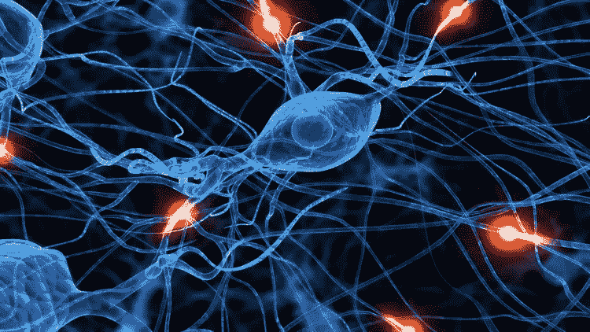

# 深度学习的 3 门热门课程

> 原文：<https://towardsdatascience.com/the-3-popular-courses-for-deeplearning-ai-ac37d4433bd?source=collection_archive---------0----------------------->

> 在过去的两年里，我一直积极专注于深度学习。我个人对深度学习的兴趣始于 2015 年左右，当时谷歌开源了 Tensorflow。快速尝试了 Tensorflow 文档中的几个例子，感觉深度学习很难，部分原因是该框架是新的，需要更好的硬件和大量的耐心。

快进到 2017 年，我已经花了 100 个小时在深度学习项目上，由于软件(易用性——[Keras](https://keras.io/)、 [PyTorch](http://pytorch.org/) )、硬件(GPU 对像我这样坐在印度的人来说变得商业可行——并不便宜)、数据可用性、好书和 MOOCs 的几项进步，技术变得越来越容易获得。在完成了来自 [Fast.ai](http://www.fast.ai/) 、[deeplearning.ai/Coursera](https://www.deeplearning.ai/)(尚未完全发布)和 [Udacity](https://in.udacity.com/) 的深度学习 3 门最受欢迎的 MOOCS 之后，我相信一篇关于你可以从这 3 门课程中期待什么的帖子会对未来的深度学习爱好者有用。

在这篇文章中，我将谈论每门课程的 5 个方面来帮助你做出决定。

1.  **关于古鲁:**每门课程都由有着非常不同经历的了不起的人来教授。我相信这些经历对教学风格有很大的影响。因此，我们将看看我们的课程大师的背景。
2.  **关于课程:**课程的高层次概述。
3.  **亮点:**要点突出课程让你觉得 wow 的地方。
4.  **限制:**我想对这个词非常挑剔，因为我知道他们所有人都为如何让内容易于访问付出了巨大而真诚的努力。我想把这部分理解为，我们在课程中错过的内容。某些限制可能是因为课程的设计。
5.  **费用:**参加课程产生的费用。

# Fast.ai:

在 [KDNudggets](http://www.kdnuggets.com/) 看一篇文章的时候偶然发现了这个课程。第一次听说[杰瑞米·霍华德](https://medium.com/u/34ab754f8c5e?source=post_page-----ac37d4433bd--------------------------------)，在[维基百科](https://en.wikipedia.org/wiki/Jeremy_Howard_(entrepreneur))上搜索他，印象深刻。查看了杰里米和雷切尔·托马斯教授的 MOOC 课程。看完了第一课，对他们的教学风格印象深刻。

> 在几个小时内，你学会了如何在不到几美元的时间内建立一个最先进的图像分类器。

## 关于[古鲁](https://en.wikipedia.org/wiki/Guru):

杰里米来自一个与通常的教授非常不同的背景，他没有任何顶级大学的博士学位，也没有为任何顶级公司工作，如谷歌，百度，微软，等等。他是一个自学成才的 kaggle master，企业家，目前是 Fast.ai 的 CEO，唯一的目的就是**让** **深度学习再次不酷**。他的独特性为这门课程增添了巨大的优势，因为他教授不同背景的人如何在没有大量数据或计算能力的情况下使用深度学习。

## 关于课程:

课程分为两部分，每部分 7 周。课程的第一部分教授如何在计算机视觉和自然语言处理(NLP)领域使用深度学习。第二部分教授前沿研究工作，如生成网络、GANs、序列序列模型、如何阅读研究论文，以及许多关于如何在高速发展的深度学习领域保持领先的实用技巧。

这门课程以独特的方式教授。该课程的作者相信一种独特的方法。

> 你不会在阅读了速度、动量、分析等知识后学习打板球(或任何游戏),然后在 18 岁就去球场。相反，我们去球场，拿着球或球棒，然后在飞行中学习其余的。

通过这种独特的方法，您可以开始学习在云上设置工作站，安装软件，并使用深度学习快速构建解决方案。每周杰里米都会挑选一个新问题，然后他会教授一些技巧来提高模型的性能。他教授一些实用的东西，比如使用预卷积特征、伪标注和许多非常有用的技巧。在第一部分结束时，你将能够使用深度学习在你工作的领域中构建有用的应用程序。

课程的第二部分通过帮助你阅读、理解和实现生成模型、图像分割和序列 2 序列模型领域的各种研究论文，介绍前沿研究。您将学习构建有趣的项目，如样式转换、低分辨率图像到高分辨率图像、GAN、图像分割、语言翻译，以及如何对结构化数据应用 DL。第 2 部分最重要的部分是建立自己的工作站。如果你对深度学习充满热情，并希望构建各种 DL 应用程序，这被证明是非常有用的。

## 亮点:

1.  能够在视觉和自然语言处理方面建立先进的系统。
2.  理解并使用支持大量深度学习应用的现代架构。
3.  当你的数据和计算能力有限时，如何快速应用 DL 的大量实用技巧。
4.  一个庞大的社区，在您学习和实施解决方案的不同阶段为您提供支持。
5.  能够熟练使用 3 种流行的 DL 框架，即 Keras、TensorFlow 和 PyTorch。
6.  在课程结束时，你将能够自如地阅读研究论文、构建新项目、写博客，以及整个社区对你的支持。

## 局限性:

1.  由于本课程遵循自上而下的方法，你将严重依赖框架来抽象底层数学。如果你打算找工作或者在这个领域做更多的研究，理解驱动 DL 的数学是有帮助的。
2.  一些机构可能重视证书作为课程完成的证明，但我猜杰里米认为我们是成熟的孩子，不提供任何形式的证书。代替传统的证书，杰里米和雷切尔鼓励写博客，建立项目，并在会议上发言。我个人认为这非常有用。

## 成本:

MOOC 没有相关费用。但是为了实践这些项目，你将最终花费在 AWS 上，或者你可能设置你自己的机器，这将是昂贵的。但是家里有一个功能强大的工作站非常有帮助。

# Deeplearning.ai:

我最近在吴恩达发微博的时候偶然看到了这个课程。我从 2014 年初开始跟踪他，我从他在 Coursera 上的一门课程中学习机器学习背后的数学。来自工程背景的他发现他的第一门课非常有趣，同时有点难以完成。快进到 2017 年，吴恩达离开了他作为首席科学家工作的百度，并于 8 月 8 日启动了新的深度学习专业化。我想在今年晚些时候做这件事，因为我已经忙于其他一些项目。然后我读了一篇来自 Fast.ai [Arvind N](https://medium.com/u/6e6d06d4b300?source=post_page-----ac37d4433bd--------------------------------) 的学生的[博客](https://medium.com/towards-data-science/thoughts-after-taking-the-deeplearning-ai-courses-8568f132153)关于他如何在 4 天内完成所有 3 个部分以及他对 Fast.ai 和 deeplearning.ai 的看法

> 我想挑战自己，如果我能在不到 4 天的时间内完成同样的课程，是的，我在 3 天内完成了 3 门课程。

## 关于上师:

吴恩达是斯坦福大学的教授，共同创立了 Coursera，创立并领导了谷歌大脑深度学习项目，并且是百度的首席科学家。这门课程反映了他从大规模解决各种问题中学到的很多东西。

> 该课程帮助您理解深度学习所需的数学，到课程 2 结束时，您将从零开始构建深度学习算法的几个关键组件。

## 关于课程:

本课程分为 5 个部分。在撰写本报告时，前三个版本已经发布。吴恩达对这门课程采取自下而上的方法。在他之前的课程中，他选择 octave 作为编程作业，但他选择 python 作为这门课程的作业。

1.  在课程 1 中，他仔细讲述了深度学习中许多概念所需的数学和直觉。他小心翼翼地平衡课程内容，只教授数学，这是理解深度学习的基础。作业课对于以程序化的方式练习数学非常有用。所有的公式都提供了，所以你可以专注于实现它们，即使你没有太多的数学专业知识。
2.  课程 2 涵盖了许多技术，如正则化、动量、批量归一化和剔除，以提高你的 DL 模型的性能。本课程最精彩的部分是你使用 python 和 NumPy 实现所有的技术。
3.  在课程 3 中，他解释了许多他从多年经验中学到的技巧和诀窍。在第 3 门课程的最后，他介绍了 DL 框架。课程 3 以如何使用张量流的作业结束。这个作业被设计得非常直观。
4.  课程 4 将在 CNN 播出。一旦课程发布，将更新此部分。
5.  课程 5 将是关于 RNN 或序列数据。一旦课程发布，我将更新这一部分。

## 亮点:

1.  当你完成 3 门课程时，你的基础将会非常扎实。
2.  首先，3 门课程采用独立于框架的方法，这将使你准备好轻松使用任何框架。
3.  关于如何设计评估指标、如何为训练拆分数据集以及避免方差和偏差问题的大量实用技巧。
4.  课程 3 最精彩的部分是一个案例研究，在这里你有机会验证你对如何成功执行深度学习项目的理解。
5.  不需要担心基础设施，因为所有的作业都以 jupyter 笔记本的形式在 Coursera 服务器上运行。
6.  在令人惊叹的 3 门课程后，等待接下来的 2 个部分。
7.  每周都有一个以“深度学习英雄”命名的演讲。这是了解深度学习背后的历史和灵感的一个很好的来源。

## 局限性:

1.  对于完全不熟悉深度学习或机器学习的人来说，从头开始构建每个组件并理解其背后的数学原理可能是一项挑战。
2.  因为它遵循自下而上的方法，所以即使在第三个课程结束后，你也会发现很难在你的领域中使用 DL 构建解决方案。
3.  由于提供了基础设施，您将错过如何自己管理工作站的学习。如果你想使用你学到的很多技术，能够在云上或者在家里/办公室设置你的机器是非常重要的。
4.  提供了许多样板代码来简化任务。但是要真正掌握一项技能，不使用样板代码重新实现整个任务是必不可少的。这可能不是课程的限制，但如果你想充分利用它，这真的很重要。

## 成本:

所有的课程内容都是免费的。然而，我不确定这些作业是否也是免费的。如果你使用付费版本，那么你每个月大约要花费 3800 卢比或者 55 美元。

# Udacity 的 Siraj Raval 深度学习纳米学位基金会:

我是 Udacity 的超级粉丝。他们有非常棒的课程，涉及广泛的主题。因此，当我今年早些时候读到他们关于深度学习课程的公告时，我非常兴奋，并注册了第一批。

## 关于古鲁的:

课程的一些部分包括来自 Siraj Raval 的视频，其余部分来自 Udacity。我是从他在 youtube 上的一些有趣的视频中知道 Siraj Raval 的。他是一个多技能的人，通过将教育视频与音乐和视频混合在一起，以有趣的格式巧妙地传递教育视频。课程的某些部分也由安德鲁·W·特拉斯克和伊恩·古德费勒教授。

## 关于课程:

与其他两门课程不同，这门课程没有明确的自下而上或自上而下的方法。该课程分为 5 个部分，并给予 100 美元的亚马逊学分。它涵盖了许多深度学习技术，如 CNN、RNN、GAN 和自动编码器。

## 亮点:

1.  在课程的前几周，您将学习如何使用 python 构建神经网络，课程的其余部分将重点介绍 TensorFlow 的使用。
2.  课程中提交的所有项目都有个性化的项目评论。
3.  在课程结束时，您会对使用 TensorFlow 感到舒适，就像在所有项目中使用 TensorFlow 一样。
4.  了不起的社区和论坛导师，他们随时准备帮助你。

## 局限性:

1.  没有关注如何优化运行 DL/获得最先进的性能结果的实用技巧。
2.  有些项目太简单，不适合在现实世界中使用。这个项目使用的数据集非常小。
3.  样板文件抽象出了构建 DL 应用程序的许多复杂性。但是如果您专注于学习它在现实世界中的应用，建议您自己实现项目，而不要使用样板代码。

## **成本:**

课程费用偏高。没有免费版本。当我参加这个课程时，报价有限，所以花费大约 2500 卢比或 350 美元。

## 建议:

如果有人今天开始深度学习[自学]，我会建议完成 fast.ai，因为它有最低的先决条件，并按顺序或并行继续 Coursera 深度学习专业化。感谢所有为这项技术的普及做出真诚努力的人们。

这个博客还出现在[的 KDnuggets](https://www.kdnuggets.com/2017/10/3-popular-courses-deep-learning.html) 上。

# 行动呼吁

如果你喜欢这篇文章，**只要你认为这篇文章有价值，就按住那个拍手图标**。我总是在寻找反馈来改进我的文章。如果你有建议或问题，请随时回复。