# 4 个卷积神经网络模型可以对你的时尚图片进行分类

> 原文：<https://towardsdatascience.com/the-4-convolutional-neural-network-models-that-can-classify-your-fashion-images-9fe7f3e5399d?source=collection_archive---------0----------------------->

买衣服是一件很累人的事情。我的眼睛被太多的信息轰炸。销售、优惠券、颜色、蹒跚学步的孩子、闪烁的灯光和拥挤的过道只是传递给我的视觉皮层的所有信号的几个例子，不管我是否积极地试图注意。视觉系统吸收大量的信息。我应该选那条 H&M 卡其布裤子吗？那是耐克背心吗？那些阿迪达斯运动鞋是什么颜色？

计算机能自动检测衬衫、裤子、连衣裙和运动鞋的图片吗？事实证明，给定高质量的训练数据，准确地对时尚物品的图像进行分类是非常简单的。在本教程中，我们将通过构建一个机器学习模型来使用时尚-MNIST 数据集识别时尚对象的图像。我们将介绍如何训练模型，设计类别分类的输入和输出，并最终显示每个模型的准确性结果。

## **图像分类**

图像分类的问题是这样的:给定一组图像，所有这些图像都标有一个类别，我们被要求为一组新的测试图像预测这些类别，并测量预测的准确性。存在与该任务相关的各种挑战，包括视点变化、尺度变化、类内变化、图像变形、图像遮挡、照明条件、背景混乱等。

我们该如何着手编写一个算法，将图像分成不同的类别呢？计算机视觉研究人员已经提出了一种数据驱动的方法来解决这个问题。他们不是试图直接在代码中指定每一个感兴趣的图像类别看起来像什么，而是为计算机提供每个图像类别的许多示例，然后开发学习算法，查看这些示例并了解每个类别的视觉外观。换句话说，他们首先积累一个标记图像的训练数据集，然后将其输入计算机，以便它熟悉这些数据。

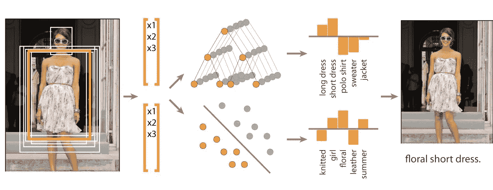

鉴于这一事实，完整的图像分类管道可以形式化如下:

*   我们的输入是一个由 *N* 幅图像组成的训练数据集，每幅图像都标有 *K* 个不同类别中的一个。
*   然后，我们使用这个训练集来训练一个分类器，以学习每个类的样子。
*   最后，我们通过要求分类器预测一组它以前从未见过的新图像的标签来评估分类器的质量。然后，我们将这些图像的真实标签与分类器预测的标签进行比较。

## **卷积神经网络**

**卷积神经网络(CNN)**是用于图像分类问题的最流行的神经网络模型。CNN 背后的大想法是，本地对图像的理解已经足够好了。实际好处是，参数越少，学习时间就越短，训练模型所需的数据量也就越少。CNN 不是一个由每个像素的权重组成的完全连接的网络，它只有足够的权重来查看一小块图像。就像用放大镜看书一样；最终，你读完了整页，但在任何给定的时间里，你只能看到页面的一小部分。

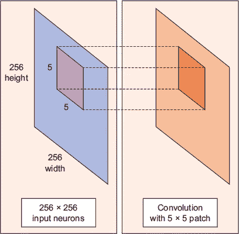

考虑一个 256 x 256 的图像。CNN 可以有效地逐块扫描——比如说，一个 5 × 5 的窗口。5 × 5 窗口沿图像滑动(通常从左到右，从上到下)，如下所示。它滑行的“快”称为它的**步幅**。例如，步长为 2 意味着 5 × 5 滑动窗口一次移动 2 个像素，直到它跨越整个图像。

当窗口滑过整个图像时，**卷积**是图像像素值的加权和。结果是，整个图像与权重矩阵的卷积过程产生了另一个图像(大小相同，取决于约定)。卷积是应用卷积的过程。

滑动窗口恶作剧发生在神经网络的**卷积层**。典型的 CNN 有多个卷积层。每个卷积层通常生成许多交替卷积，因此权重矩阵是 5 × 5 × n 的张量，其中 n 是卷积的数量。

举个例子，假设一个图像在 5 × 5 × 64 的权重矩阵上经过一个卷积层。它通过滑动一个 5 × 5 的窗口产生 64 个卷积。因此，该模型有 5 × 5 × 64 (= 1，600)个参数，比全连接网络的 256 × 256 (= 65，536)个参数少得多。

CNN 的妙处在于参数的数量与原始图像的大小无关。你可以在 300 × 300 的图像上运行同样的 CNN，在卷积层中参数的数量不会改变。

## **数据增强**

影像分类研究数据集通常非常大。然而，数据扩充经常被用来提高泛化性能。通常，使用随机裁剪重新缩放的图像以及随机水平裁剪和随机 RGB 颜色和亮度偏移。存在不同的重新缩放和裁剪图像的方案(即单尺度对多尺度训练)。测试期间的多作物评估也经常使用，尽管计算成本更高且性能改善有限。请注意，随机缩放和裁剪的目标是了解每个对象在不同比例和位置下的重要特征。Keras 没有实现所有这些现成的数据扩充技术，但是它们可以通过 ImageDataGenerator 模块的预处理功能轻松实现。

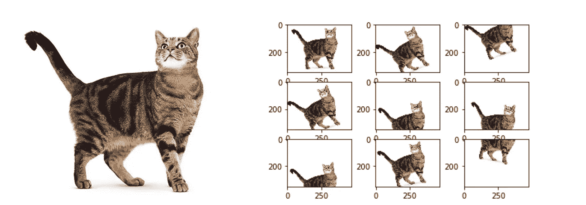

## **时尚 MNIST 数据集**

最近，Zalando research 发布了一个新的数据集，它与众所周知的 [MNIST 手写数字数据库](https://yann.lecun.com/exdb/mnist/)非常相似。该数据集是为机器学习分类任务而设计的，总共包含 60 000 个训练图像和 10 000 个测试图像(灰度),每个图像为 28×28 像素。每个训练和测试案例都与十个标签(0–9)中的一个相关联。到目前为止，Zalando 的数据集基本上与原始手写数字数据相同。然而，Zalando 的数据包含了 10 种不同时尚产品的图像，而不是数字 0-9 的图像。因此，该数据集被称为[时尚-MNIST 数据集](https://github.com/zalandoresearch/fashion-mnist)，可以从 [GitHub](https://github.com/zalandoresearch/fashion-mnist) 下载。这些数据也出现在 [Kaggle](https://www.kaggle.com/zalando-research/fashionmnist) 上。下图显示了几个示例，其中每行包含一个时尚项目。

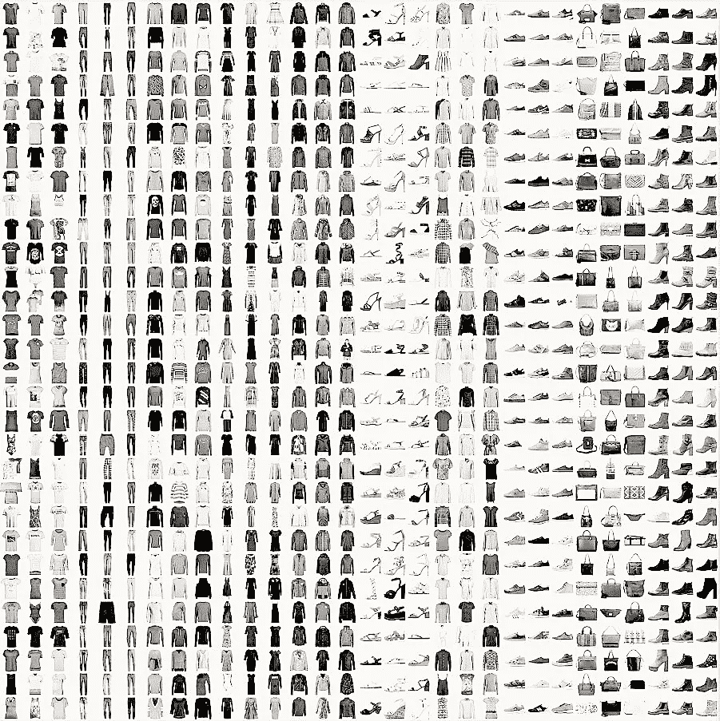

10 种不同的分类标签是:

*   0 T 恤/上衣
*   1 条裤子
*   2 件套头衫
*   3 连衣裙
*   4 件外套
*   5 凉鞋
*   6 衬衫
*   7 运动鞋
*   8 袋
*   9 踝靴

根据作者的说法，时尚-MNIST 数据旨在直接取代旧的 MNIST 手写数字数据，因为手写数字存在几个问题。例如，只需看几个像素就可以正确区分几个数字。即使使用线性分类器，也有可能实现高分类精度。时尚 MNIST 的数据有望更加多样化，因此机器学习(ML)算法必须学习更高级的特征，以便能够可靠地区分各个类别。

## **嵌入时尚 MNIST 可视化**

嵌入是映射离散对象(图像、文字等)的一种方式。)到高维向量。这些向量中的各个维度通常没有内在含义。相反，机器学习利用的是向量之间的位置和距离的整体模式。因此，嵌入对于机器学习的输入是重要的；因为更一般地，分类器和神经网络对实数的向量起作用。它们在密集向量上训练得最好，其中所有值都有助于定义一个对象。

TensorBoard 有一个内置的可视化工具，称为 [*嵌入投影仪*](https://www.tensorflow.org/versions/r1.1/get_started/embedding_viz) ，用于交互式可视化和分析嵌入之类的高维数据。嵌入投影仪将从我的模型检查点文件中读取嵌入内容。虽然它对嵌入最有用，但它可以加载任何 2D 张量，包括我的训练权重。

在这里，我将尝试使用 TensorBoard 来表示高维时尚 MNIST 数据。在读取数据并创建测试标签之后，我使用这段代码来构建 TensorBoard 的嵌入式投影仪:

嵌入式投影仪有三种降低数据集维数的方法:两种线性方法和一种非线性方法。每种方法都可以用来创建二维或三维视图。

**主成分分析:**一种直接的降维技术是主成分分析(PCA)。嵌入投影仪计算前 10 个主成分。这个菜单让我可以将这些组件投射到两个或三个组件的任意组合上。PCA 是一种线性投影，通常在检查全局几何时很有效。

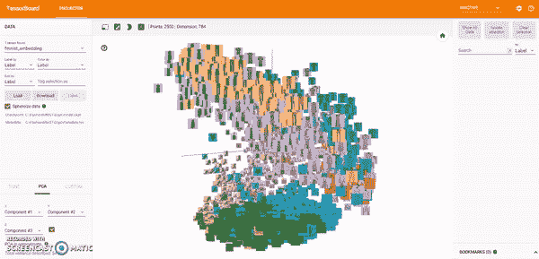

t-SNE:t-SNE 是一种流行的非线性降维技术。嵌入式投影仪提供二维和三维 t-SNE 视图。布局是在客户端执行的，为算法的每一步制作动画。因为 t-SNE 经常保留一些局部结构，所以它对于探索局部邻域和寻找聚类很有用。

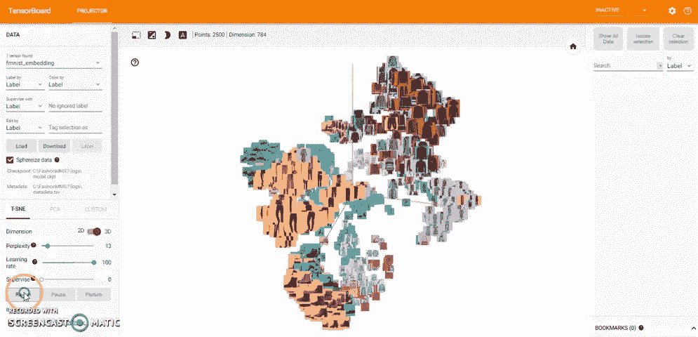

我还可以基于文本搜索构建专门的线性投影，以便在空间中找到有意义的方向。要定义投影轴，请输入两个搜索字符串或正则表达式。该程序计算标签与这些搜索匹配的点集的质心，并使用质心之间的差向量作为投影轴。

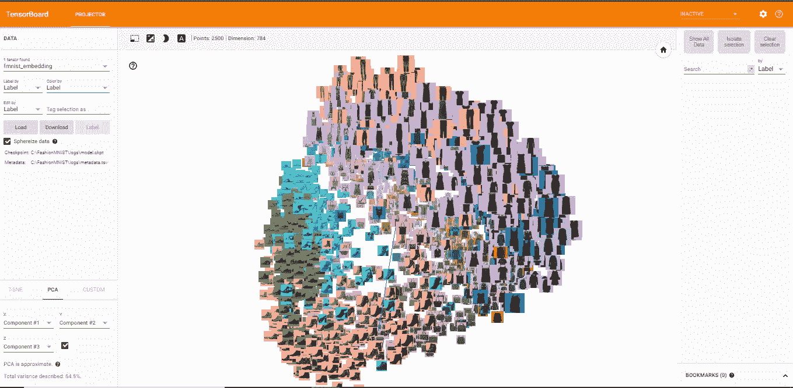

你可以在这个笔记本上查看可视化步骤的完整代码:[tensor board-visualization . ipynb](https://github.com/khanhnamle1994/fashion-mnist/blob/master/TensorBoard-Visualization.ipynb)

## **在时尚 MNIST 培训 CNN 模特**

现在让我们进入有趣的部分:我将创建各种不同的基于 CNN 的分类模型来评估时尚 MNIST 上的表演。我将使用 Keras 框架构建我们的模型。关于这个框架的更多信息，你可以在这里参考文档[。以下是我将尝试并比较其结果的模型列表:](https://keras.io/)

1.  具有 1 个卷积层的 CNN
2.  具有 3 个卷积层的 CNN
3.  具有 4 个卷积层的 CNN
4.  VGG-19 预训练模型

对于所有模型(除了预先训练的模型)，我的方法如下:

*   将原始训练数据(6 万张图像)拆分成 **80%训练**(4.8 万张图像)和 **20%验证** (12000 张图像)优化分类器，同时保留测试数据(1 万张图像)最终评估模型在它从未见过的数据上的准确性。这有助于查看我是否过度拟合训练数据，以及如果验证准确度高于训练准确度，我是否应该降低学习率并训练更多的时期，或者如果训练准确度高于验证，我是否应该停止过度训练。
*   用**分类 _ 交叉熵**损失函数和 **Adam** 优化器编译，训练 10 个时期的模型，批量为 256。
*   然后，添加**数据扩充**，通过对训练样本进行旋转、移位、缩放生成新的训练样本，再用更新后的数据训练模型 50 个历元。

下面是加载和分割数据的代码:

在加载和分割数据之后，我对它们进行预处理，将它们重新整形为网络期望的形状，并对它们进行缩放，以使所有值都在[0，1]区间内。例如，以前，训练数据存储在 uint8 类型的 shape (60000，28，28)数组中，其值在[0，255]区间内。我将它转换成一个形状为(60000，28 * 28)的 float32 数组，其值介于 0 和 1 之间。

## **1—1——conv 有线电视新闻网**

下面是 CNN 的代码，带有一个卷积层:

训练完模型后，下面是测试损耗和测试精度:

应用数据扩充后，以下是测试损失和测试准确性:

出于视觉目的，我绘制了训练和验证准确性和损失:

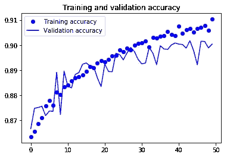

你可以在这个笔记本上查看这个模型的完整代码: [CNN-1Conv.ipynb](https://github.com/khanhnamle1994/fashion-mnist/blob/master/CNN-1Conv.ipynb)

## **2 — 3 日——conv 有线电视新闻网**

以下是 CNN 的代码，具有 3 个卷积层:

训练完模型后，下面是测试损耗和测试精度:

应用数据扩充后，以下是测试损失和测试准确性:

出于视觉目的，我绘制了训练和验证准确性和损失:

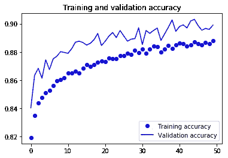

你可以在这个笔记本上查看这个模型的完整代码: [CNN-3Conv.ipynb](https://github.com/khanhnamle1994/fashion-mnist/blob/master/CNN-3Conv.ipynb)

## **3-4-conv CNN**

以下是具有 4 个卷积层的 CNN 的代码:

训练完模型后，下面是测试损耗和测试精度:

应用数据扩充后，以下是测试损失和测试准确性:

出于视觉目的，我绘制了训练和验证准确性和损失:

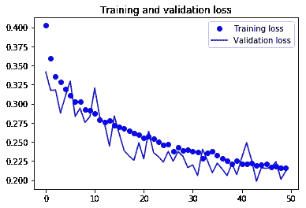

你可以在这个笔记本上查看这个模型的完整代码: [CNN-4Conv.ipynb](https://github.com/khanhnamle1994/fashion-mnist/blob/master/CNN-4Conv.ipynb)

## **4 —迁移学习**

对小图像数据集进行深度学习的一种常见且高效的方法是使用预训练的网络。**预训练网络**是之前在大型数据集上训练过的保存的网络，通常是在大规模图像分类任务上。如果这个原始数据集足够大并且足够通用，那么由预训练网络学习的特征的空间层次可以有效地充当视觉世界的通用模型，因此它的特征可以证明对于许多不同的计算机视觉问题是有用的，即使这些新问题可能涉及与原始任务完全不同的类。

我试图实现 VGG19 预训练模型，这是一个广泛用于 ImageNet 的 ConvNets 架构。以下是您可以遵循的代码:

训练完模型后，下面是测试损耗和测试精度:

出于视觉目的，我绘制了训练和验证准确性和损失:

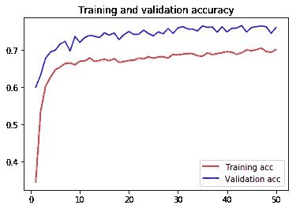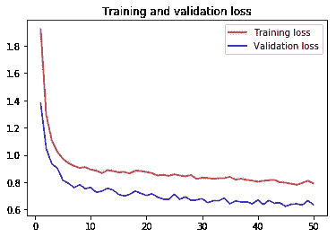

你可以在这个笔记本上查看这个型号的完整代码: [VGG19-GPU.ipynb](https://github.com/khanhnamle1994/fashion-mnist/blob/master/VGG19-GPU.ipynb)

## **最后一次外卖**

时尚领域是机器学习和计算机视觉应用的一个非常受欢迎的领域。由于所涉及的特征的高度主观性和语义复杂性，该领域中的问题具有挑战性。我希望这篇文章有助于你了解 4 种不同的方法来构建你自己的卷积神经网络来对时尚图像进行分类。你可以在这个链接查看我的 GitHub repo [中的所有源代码。如果您有任何问题或改进建议，请告诉我！](https://github.com/khanhnamle1994/fashion-mnist)

— —

*如果你喜欢这首曲子，我希望你能按下鼓掌按钮*👏*这样别人可能会偶然发现它。你可以在* [*GitHub*](https://github.com/khanhnamle1994) *上找到我自己的代码，在*[*【https://jameskle.com/】*](https://jameskle.com)*上找到更多我的写作和项目。也可以在* [*推特*](https://twitter.com/@james_aka_yale) *，* [*上关注我直接发邮件给我*](mailto:khanhle.1013@gmail.com) *或者* [*在 LinkedIn*](http://www.linkedin.com/in/khanhnamle94) *上找我。* [*注册我的简讯*](http://eepurl.com/deWjzb) *就在你的收件箱里接收我关于数据科学、机器学习和人工智能的最新想法吧！*