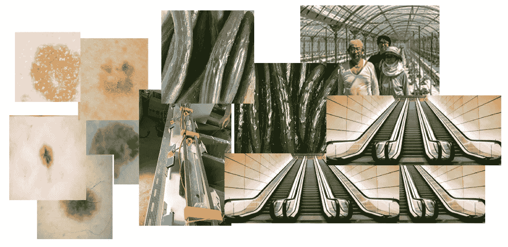
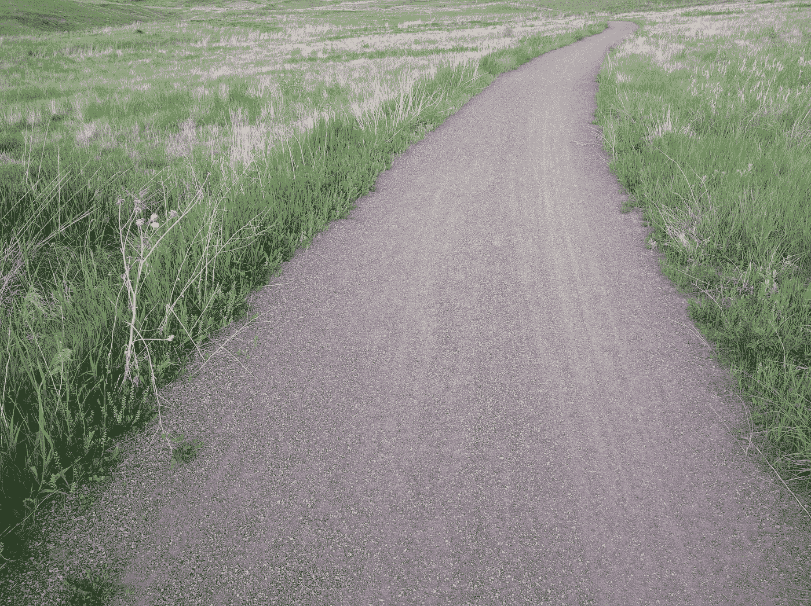
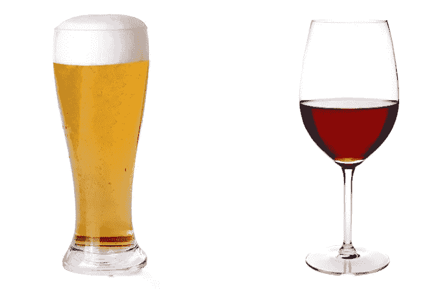
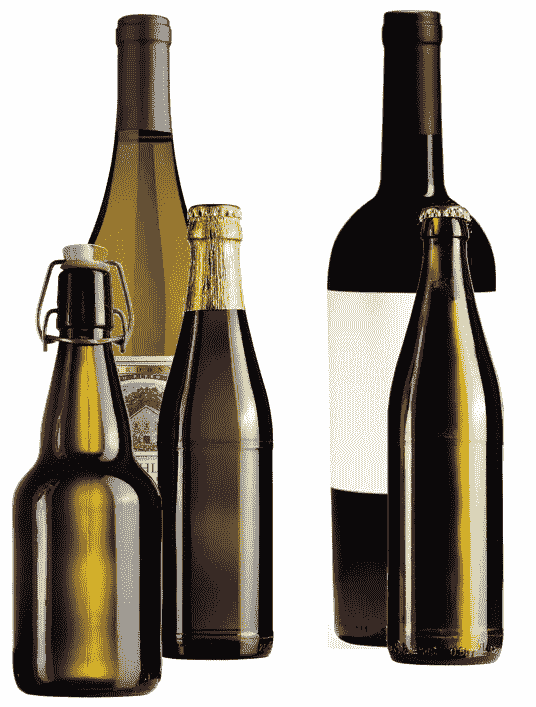

# 机器学习的 7 个步骤

> 原文：<https://towardsdatascience.com/the-7-steps-of-machine-learning-2877d7e5548e?source=collection_archive---------0----------------------->

从检测皮肤癌，到分拣黄瓜，到检测需要维修的自动扶梯，机器学习赋予了计算机系统全新的能力。

但是它在引擎盖下是如何工作的呢？让我们看一个基本的例子，并以此为借口，谈谈使用机器学习从你的数据中获得答案的过程。

L 假设我们被要求创建一个系统来回答一种饮料是葡萄酒还是啤酒的问题。我们构建的这个问答系统被称为“模型”，这个模型是通过一个称为“训练”的过程创建的。训练的目标是创建一个准确的模型，在大多数情况下正确地回答我们的问题。但是为了训练一个模型，我们需要收集数据来进行训练。这是我们开始的地方。

如果你是机器学习的新手，想先快速浏览一下，请先看看这篇文章，然后再继续:

 [## 什么是机器学习？

### 这个世界充满了数据。很多很多数据。从图片、音乐、文字、电子表格、视频到…

medium.com](https://medium.com/towards-data-science/what-is-machine-learning-8c6871016736) 

This is just the beginning

# 葡萄酒还是啤酒？

O 我们将从葡萄酒和啤酒中收集你的数据。我们可以从饮料的很多方面收集数据，从泡沫的数量到杯子的形状。

出于我们的目的，我们将只选择两个简单的:颜色(作为光的波长)和酒精含量(作为百分比)。希望我们可以根据这两个因素来划分我们的两种饮料。从现在开始，我们称这些为我们的*特征*:颜色和酒精。

我们流程的第一步将是跑到当地的杂货店，买一堆不同的啤酒和葡萄酒，以及一些设备来做我们的测量——测量颜色的分光计和测量酒精含量的比重计。我们的杂货店有一个电子硬件部分:)

## 收集数据

一旦我们有了设备和酒，就该开始机器学习的第一步了:**收集数据**。这一步非常重要，因为您收集的数据的质量和数量将直接决定您的预测模型的好坏。在这种情况下，我们收集的数据将是每种饮料的颜色和酒精含量。

这将产生一个颜色、酒精百分比以及是啤酒还是葡萄酒的表格。这将是我们的**训练数据。**

## **数据准备**

几个小时的测量之后，我们已经收集了我们的训练数据。现在到了机器学习的下一步:**数据准备**，我们把我们的数据加载到一个合适的地方，准备在我们的机器学习训练中使用。

我们将首先把所有的数据放在一起，然后随机排序。我们不希望数据的顺序影响我们的学习，因为这不是决定一种饮料是啤酒还是葡萄酒的一部分。换句话说，我们决定饮料是什么，与之前或之后的饮料无关。

这也是对数据进行任何相关可视化的好时机，有助于您了解不同变量之间是否有任何相关的关系可以利用，以及向您显示是否有任何数据不平衡。例如，如果我们收集的关于啤酒的数据点比葡萄酒多得多，我们训练的模型就会偏向于猜测它看到的几乎所有东西都是啤酒，因为大多数时候它都是对的。然而，在现实世界中，模型可能会看到等量的啤酒和葡萄酒，这意味着猜测“啤酒”有一半是错误的。

我们还需要将数据分成两部分。第一部分用于训练我们的模型，将是数据集的主要部分。第二部分将用于评估我们的训练模型的性能。我们不想使用模型被训练用于评估的相同数据，因为它可能只是记住“问题”，就像你不会在考试中使用数学作业中的相同问题一样。

有时我们收集的数据需要其他形式的调整和处理。像去杜平、规范化、纠错等等。这些都发生在数据准备阶段。在我们的例子中，我们没有任何进一步的数据准备需求，所以让我们继续。

## 选择模型

我们工作流程的下一步是选择模型。多年来，研究人员和数据科学家创建了许多模型。有些非常适合图像数据，有些适合序列(如文本或音乐)，有些适合数字数据，有些适合基于文本的数据。在我们的例子中，因为我们只有两个特征，颜色和酒精百分比，我们可以使用一个小的线性模型，这是一个相当简单的模型，应该可以完成这项工作。

## 培养

现在我们进入通常被认为是机器学习的主体部分——训练。在这一步中，我们将使用我们的数据逐步提高模型预测给定饮料是葡萄酒还是啤酒的能力。

在某些方面，这类似于某人第一次学开车。起初，他们不知道踏板、旋钮和开关是如何工作的，也不知道什么时候应该使用它们。然而，经过大量的实践和纠正他们的错误，一个有执照的司机出现了。此外，经过一年的驾驶，他们已经变得相当熟练。驾驶行为和对现实世界数据的反应改变了他们的驾驶能力，磨练了他们的技能。

我们将在更小的范围内用我们的饮料来做这件事。具体来说，直线的公式是 y=m*x+b，其中 x 是输入，m 是直线的斜率，b 是 y 截距，y 是直线在 x 位置的值。我们可以用来调整或“训练”的值是 m 和 b。没有其他方法可以影响直线的位置，因为其他变量只有 x(我们的输入)和 y(我们的输出)。

在机器学习中，有许多 m，因为可能有许多特征。这 m 个值的集合通常形成一个矩阵，我们将 W 表示为“权重”矩阵。同样对于 b，我们把它们放在一起，称之为偏差。

训练过程包括为 W 和 b 初始化一些随机值，并尝试用这些值预测输出。正如你所想象的，它做得很差。但是我们可以将我们的模型的预测与它应该产生的输出进行比较，并调整 W 和 b 中的值，这样我们将有更正确的预测。

然后重复这个过程。更新权重和偏差的每次迭代或循环被称为一个训练“步骤”。

让我们更具体地看看这对于我们的数据集意味着什么。当我们第一次开始训练时，就像我们在数据中画了一条随机的线。然后，随着训练的每一步进行，这条线一步一步地移动，更接近葡萄酒和啤酒的理想分离。

## 估价

一旦训练完成，就该用**评估**来看看这个模型是否好了。这就是我们之前搁置的数据集发挥作用的地方。评估允许我们用从未用于训练的数据来测试我们的模型。这一指标使我们能够看到模型对尚未看到的数据的表现。这代表了模型在现实世界中的表现。

我在培训评估中使用的一个很好的经验法则是 80/20 或 70/30。这在很大程度上取决于原始源数据集的大小。如果您有大量数据，也许您不需要评估数据集的大部分。

## 参数调谐

一旦你做了评估，你可能想看看你是否能以任何方式进一步提高你的训练。我们可以通过**调整我们的参数**来做到这一点。我们在进行培训时隐含地假设了一些参数，现在是回过头来测试这些假设并尝试其他值的好时机。

一个例子是我们在训练中运行训练数据集的次数。我的意思是，我们可以多次向模型“展示”我们的完整数据集，而不仅仅是一次。这有时会导致更高的精度。

另一个参数是“*学习率*”。这定义了根据前一个训练步骤的信息，我们在每一步中移动直线的距离。这些值在我们的模型可以变得多精确以及训练需要多长时间方面都起着作用。

对于更复杂的模型，初始条件在确定训练结果时可以发挥重要作用。根据模型开始训练时是否将值初始化为零，而不是值的某种分布，可以看出差异，这导致了使用哪种分布的问题。

The potentially long journey of parameter tuning

正如你所看到的，在训练的这个阶段有很多需要考虑的事情，重要的是你要定义一个“足够好”的模型，否则你可能会发现自己要调整很长时间的参数。

这些参数通常被称为“*超参数*”。这些超参数的调整仍然是一门艺术，更像是一个实验过程，在很大程度上取决于数据集、模型和训练过程的细节。

一旦您对您的训练和超参数感到满意，在评估步骤的指导下，是时候最终使用您的模型做一些有用的事情了！

## 预言；预测；预告

机器学习是[用数据回答问题](https://medium.com/towards-data-science/what-is-machine-learning-8c6871016736)。所以**预测**，或者说推理，是我们回答一些问题的步骤。这是所有这些工作的重点，也是机器学习的价值得以实现的地方。

我们最终可以使用我们的模型来预测给定的饮料是葡萄酒还是啤酒，给定它的颜色和酒精百分比。

# 整体情况

机器学习的力量在于，我们能够使用我们的模型来确定如何区分葡萄酒和啤酒，而不是使用人类的判断和手动规则。您也可以将今天提出的想法推广到其他问题领域，这些领域也适用相同的原则:

*   收集数据
*   准备这些数据
*   选择模型
*   培养
*   估价
*   超参数调谐
*   预测。

# 张量流游乐场

F 或更多训练和参数玩法，查看 [TensorFlow 游乐场](http://playground.tensorflow.org)。这是一个完全基于浏览器的机器学习沙箱，在这里你可以尝试不同的参数，并针对模拟数据集进行训练。

# 下一步是什么？

虽然我们将来会遇到更多的步骤和细微差别，但这是一个很好的基础框架，可以帮助我们思考问题，让我们有一个共同的语言来谈论每个步骤，并在将来更深入地探讨。

下一次，我们将使用代码构建我们的第一个“真正的”机器学习模型。再也不用画线和复习代数了！