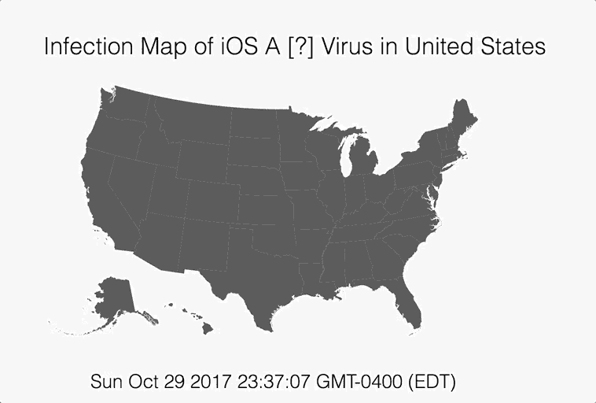
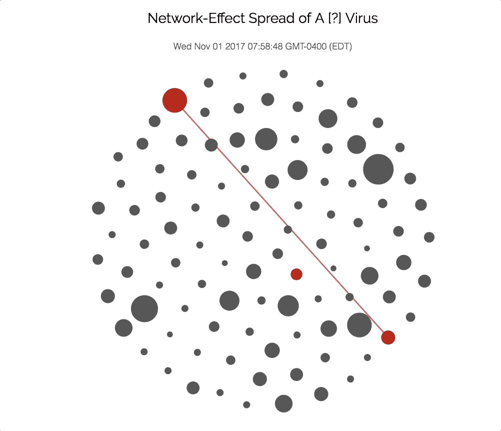

# “一个[？]“iPhone Bug 像病毒一样传播

> 原文：<https://towardsdatascience.com/the-a-iphone-bug-spread-like-a-virus-8731f447b959?source=collection_archive---------1----------------------->

## tldr:A[？]影响 iPhone 用户的漏洞可能是一种在用户间传播的病毒。我分析了 Twitter 上受感染的用户来研究这个问题，展示了病毒的 3 个特性:指数增长、以位置为中心的传播和以网络边缘为中心的传播(通过朋友传播)。

Analysis of 2.5M tweets from 1M infected users

# The A[？] Bug

苹果于 11 月 1 日推出了 iOS 11.1，发布了大量问题和漏洞。但是没有什么能与 A [?] bug 在过去的一周收到了这个。

对于门外汉，A[？] bug 影响试图键入字母“I”的 iOS 用户，他们的键盘会自动将“I”更正为“A [？]".随着人类最古老也是最重要的文字之一被破坏，这个 bug 可以理解地[把](http://appleinsider.com/articles/17/11/09/origin-of-apples-a-quicktype-bug-a-mystery-but-notoriety-grows-with-spread-of-memes-tweets) [人](http://www.nydailynews.com/life-style/apple-iphone-glitch-driving-texters-crazy-article-1.3615008) [逼疯了](http://nymag.com/selectall/2017/11/apples-ios-11-bug-wouldnt-let-users-type-the-letter-i.html)。下面是这个 bug 的截图:

这个错误是如此严重，以至于许多人倒退到石器时代，“我”再次成为自我认同的首选术语。

# 理论形成了

关于是什么导致了这个 bug，以及为什么它没有影响到所有用户，有很多猜测。最有趣的猜测是，关于这种病毒的报道似乎每天都在增加，好像它正在传播。有一种理论认为，只有当自动更正软件看到 A [？]字符。基本上:如果有人发给你，你就被感染了。

这完全符合病毒的模式(尽管我确信苹果不会使用这个术语)。然而，所有这些都只是猜测，所以我开始通过跟踪这个 bug 在 Twitter 上的传播来定量地回答这个问题。

The bug frustrating users on both Twitter and Snapchat.

# Unicode、表情符号和一个[？]

问题中的角色实际上不是一个[？]，但实际上是一系列 unicode 表情符号字符“\x49\xEF\xB8\x8F”。一些软件将其渲染为“A [？]”，有些软件把这个渲染成“我”。有趣的是，许多用户并没有意识到这个错误，因为 unicode 字符对他们来说是“I”。正因为如此，他们发送了许多损坏的信息，推文等，没有编辑字符。

# 推特数据

过去一周，我使用 Twitter API 搜索并下载了约 250 万条包含违规字符的推文，以调查关于该漏洞传播的 3 个关键问题。

# 1.病毒呈指数增长

当观察这些推文的分布时，一些事情立即变得显而易见:它们的频率正在加快。受感染的推文数量实际上每天都在翻倍，呈指数级病毒式增长。这种关系也适用于被感染用户的数量。

# 2.病毒通过位置传播

病毒通常以地理方式在人群中传播。在这里，我展示了随着时间的推移，病毒在美国的传播情况。注意在最初的感染点周围是如何形成集群并向外扩散的。

# 3.病毒在朋友间传播

任何感染过单核细胞增多症的人都知道，病毒通过密切接触传播。我调查了朋友的关系网，以了解 A [?] bug 在网络间传播。这个动画是由 100 个 twitter 好友组成的(互相关注)。每个节点都是用户，每条边都是友情连接。只有当两个朋友都感染了病毒时，优势才会显现。请注意病毒如何在有许多受感染朋友的节点中传播得最快。该动画还显示了病毒的总体增长模式，最初很少有人被感染，并通过网络呈指数级传播。

# 是 A [？] Bug 一个病毒？

## 可能吧(见更新)。

这项调查表明 A [？]病毒以病毒般的方式传播。这种影响可能是由于 11.1 更新的逐步采用，但这应该显示线性增长，而不是指数增长。苹果已经在最新的 11.1.1 更新中修补了这个错误，但没有发布关于最初错误原因的声明。重要的是要记住，在苹果发布关于问题的官方报告之前，我们不能确定任何事情。在那之前，我们只能猜测。

# 更新:

许多人强烈怀疑病毒会在用户之间传播，所以我录制了一段我的 iPhone 通过被感染的短信感染病毒的视频。

在这个视频的开始，我的 iPhone 可以输入正常的 I。首先，我收到一条带有正常“I”的消息。这不影响我的自动更正。接下来，我收到一条带有畸形“I”的消息。看到这种畸形的字符导致错误在我的 iPhone 上出现。这让我更加确信这个漏洞主要是以用户对用户的方式传播的。

Screencast of user acquiring the bug via text.

## 使用的工具:

python，matplotlib，numpy，d3，twitter api…代码即将发布

# 喜欢这篇文章吗？

如果你喜欢这篇文章，请用*拍手* *或分享来帮助你的朋友。黑客新闻链接:*【https://news.ycombinator.com/item?id=15681249 