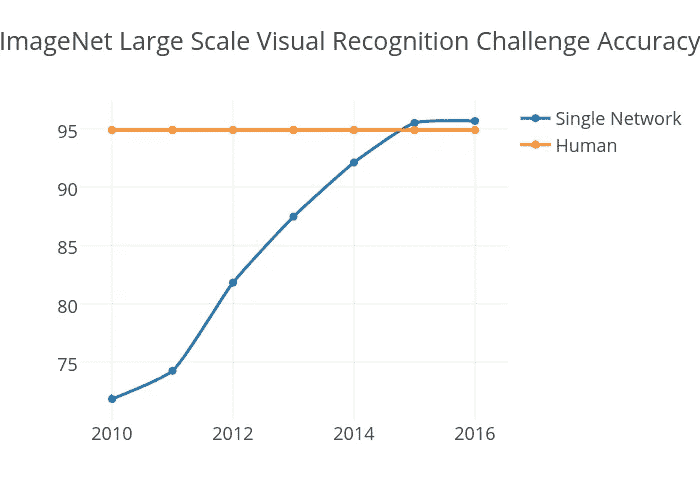
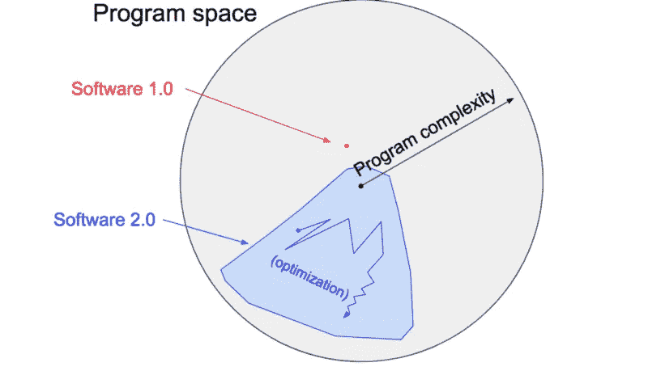

# 人工智能中的访问问题

> 原文：<https://towardsdatascience.com/the-access-problem-in-ai-edcc50b82578?source=collection_archive---------16----------------------->

## 我们应该担心的不是工作的自动化，而是人工智能技术的可及性

# T 何范式

1965 年，英特尔的联合创始人发表了一篇观察到一个奇怪现象的论文。每一年，每个集成电路的元件数量似乎都翻了一番。这意味着电路越来越小，越来越便宜，而计算速度越来越快。在接下来的几十年里，这一趋势将成为技术革命的基石。

四年后的 1969 年，一个由美国国防部资助的小组开始致力于多个网络的互联，以创建一个更大的网络。1990 年，这个项目导致了我们今天所称的互联网的诞生，通信革命由此诞生。

2012 年，ImageNet 挑战赛中的一项重大突破大幅提升了计算机视觉领域的性能。这种性能的飞跃是以技术革命(2012 年是 ImageNet 首次使用 GPU)和通信革命(长达数十年的机器学习研究国际合作)为前提的。计算机视觉社区的这一胜利很快转化为自然语言处理、生成任务、音频处理和其他多种任务的性能改善。

20-point performance jump in 5 years

2018 年，我们仍然在努力挖掘机器学习的巨大潜力。我们正在学习这对编程的未来意味着什么，并且在这个过程中发现了一个新的软件范例。开发 ML 密集型软件需要一个完全不同的工作流程，一系列新颖的技术和实践。特斯拉人工智能总监安德烈·卡帕西(Andrej Karpathy)说得好。

> “神经网络不仅仅是另一个分类器，它们代表了我们编写软件方式的根本转变的开始。它们是软件 2.0。”

该领域的巨头、现任谷歌人工智能负责人杰夫·迪恩(Jeff Dean)认为，深度学习正在改变系统工程的格局。在 SysML 2018 主题演讲中，他指出:

> 深度学习正在改变我们设计计算机的方式。

# 问题是

在狭义的任务上，机器学习算法比专家表现得更好，劳动力市场自然会关注自动化。当深度学习在读取心电图方面比心脏病专家表现得更好，在检测肺炎方面与人类放射科医生不相上下，在识别对话语言方面几乎与人类一样好时，对教育和人力资源就业的急剧转变的担忧似乎是合理的，“工作的未来”似乎处于混乱状态，没有一份工作看起来不会受到干扰。

Source: [Andrej Karpathy](https://medium.com/@karpathy/software-2-0-a64152b37c35)

但是这些关于自动化和随之而来的失业的观点是短视的。他们没有考虑到这些技术进步所创造的新工作。新的范式将优化置于编程的中心，这意味着调整超参数，设计有代表性的损失函数，确保干净准确的数据，并检查公平性。所有这些都从根本上背离了传统程序员的工作和思考方式。难怪[福布斯认为人工智能领域严重人手不足](https://www.forbes.com/sites/forbestechcouncil/2017/12/21/13-top-tech-skills-in-high-demand-for-2018/#16a37d7b1e5c)，人工智能专业知识需求巨大。

> T2:问题不在于自动化，而在于享受不到科技进步的好处。

也许我们不必担心自动化带来的失业的最好证据是过去 50 年美国经济的**劳动生产率**(每小时劳动的商品&服务产出)和**生产率增长**(长期劳动生产率)的趋势。虽然前者稳步上升，后者却在下降。事实上，生产率增长在全球范围内大幅下降。或许这其中最令人吃惊的暗示是**虽然技术让我们的个人生活变得更好，但它并没有对劳动力市场的生产率增长产生大的影响**。如果我们想想过去十年里手持设备对生活和个人生产力的影响，这是很有意义的。我们所做的工作，我们的生产力，都得到了提高。但是今天我们有更多的工作，而不是更少。所以失业并不是我们最大的问题。

另一方面，令人担忧的是美国普通家庭的收入。我们在技术上越进步，利益似乎就越集中在这部分人口中最上层的 20%身上。我们看到劳动生产率的提高，但事实是这种提高的好处并没有被广泛分享。一种天真的思考方式是，注意到上层 20%的人拥有现有的资本来实际执行和利用这些新的技术创新来为个人谋利。这导致了一种强大的复合效应，使技术成为富人变得更富、穷人停滞不前的手段。**这是 AI 今天面临的接入问题**。用几句话来说:

> 人工智能和自动化有可能扩大美国社会的社会和经济流动性差距，原因很简单，因为下层阶级无法获得成为新劳动力一部分所需的教育和技术。

# 解决方案

NimbleBox 是一个云平台，旨在将人工智能带给大众。它允许用户以比任何其他平台都更便宜的价格租用 GPU，并具有即使对于初学者来说也能让构建人工智能项目成为直观体验的功能。Nimblebox 采取的以教育为重点的方法来解决这个问题，这对于让新来者能够访问人工智能以及让有经验的用户很快轻松部署是至关重要的。

凭借直观的 UX 和反应灵敏的支持团队，NimbleBox 旨在实现人工智能的民主化。我们在这里帮助每个人更快更好地实现他们的人工智能目标。我们相信人工技术是软件历史上的决定性时刻，确保我们以包容和共享的方式分享这一进步的好处是一项集体责任。

这是我们的使命。我们希望[你能加入我们的 NimbleBox.ai](https://www.nimblebox.ai)

PS:谢谢 Arjun Bahuguna 帮我写这篇文章:)