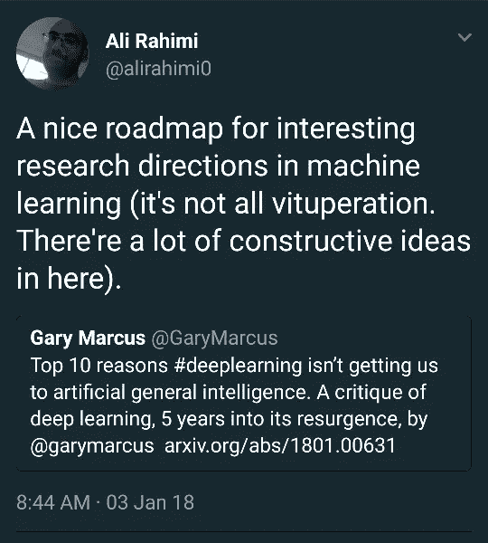
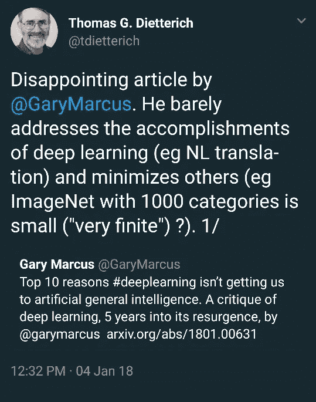

# 人工通用智能

> 原文：<https://towardsdatascience.com/the-agi-deep-learning-connection-57442f4d1059?source=collection_archive---------5----------------------->

我最喜欢的讲师之一莱克斯·弗里德曼(Lex Fridman)即将在麻省理工学院开设一门关于 AGI 的精彩课程(或者在这篇文章发表时可能已经开始了)，我想就这个我已经阅读了几个月的主题写点东西。

> “几乎所有从事人工智能工作的年轻人都会环顾四周，然后说——流行什么？统计学习。所以我会这么做。那正是科学的自杀方式。”
> 
> ——2011 年，马文·明斯基在麻省理工学院开设名为“心智社会”的课程。

美国著名认知科学家、麻省理工学院人工智能实验室的联合创始人马文·明斯基从来不同意对 AGI 采取过于简单的方法，也不同意复制大脑的功能。但我们仍然不能否认深度学习在该领域带来的进步。大脑很有可能不做梯度下降之类的事情，但在此基础上破坏深度学习是不公平的。

在创造大脑的复制品时，有许多关于大脑的东西是我们不具备的。此外，深度学习肯定会被证明是创造真正智能机器的重要组成部分，但光靠它可能还不够。

可以说，本·高尔策尔作品背后的核心思想是绝大多数好奇的人很久以前就会想到的；通过使用认知协同的概念，有计划地将人的部分设计为 AGI 的组成部分，以创造接近人类的智能，如果不是与人类不相上下的话。但是没有人能够将这个想法变成现实...他做到了。有许多伟大的研究人员值得一提，比如马库斯·哈特(艾西)和汪裴(NARS)。

尽管存在缺陷，也可能没有谷歌、脸书和特斯拉等科技巨头提供的足够资金，但 OpenCog 对创造 AGI 的贡献无论如何都不能被忽视。

你猜怎么着？就连 Ben 的作品都用了深度学习！深度学习不能被抛弃的原因有很多。正如 Geoff Hinton 自己所说，有必要重新思考反向传播，但没有人能否认这是一个巨大的成功。也许有人会为深度学习，特别是反向传播提出一个更明智的替代方案，因为它在过多的应用程序中使用。

*没有看过电影《Ex 玛奇纳》的人应该——
I)跳到下一段
ii)尽快看这部电影！*

我清楚地记得艾娃奔向她自己的创造者内森去杀他的场景。它确实让观众不寒而栗。

这种事情已经在各种科幻电影中一次又一次地出现，也得到了该领域非常著名的人的支持，他们警告我们注意人工智能。如果我们的创造成为我们死亡的原因呢？这就提出了在机器人中包含共存和“仁慈”的需要，这样它们就不会害怕我们。但话说回来，有人强烈声称，今天的人工智能甚至还没有达到老鼠的智能水平。

我非常相信 Ben Goertzel 关于认知协同需要的观点。那是什么？它是设计为智能的不同组件的组合，以形成一个认知系统，其中它们将相互帮助来执行它们各自的任务，以便该系统能够被称为真正智能的，而不管它以前是否在现实世界中面临过特定的情况。

人们可以以迁移学习为例，其中只有最后几层被改变和训练，而模型的大部分保持不变。

人们也可以想象用它来完成几个需要预测的任务。基于系统的要求，可以训练模型来学习哪种情况需要使用哪种类型的最后层来比人类更有效地成功完成任务(因为如果不需要，那么嗯...有什么意义？)

Yann LeCun’s post about Sophia

我显然不能保证 Sophia 实际上有多真实，这个使用机器人的 Twitter 有多接近智能，它实际上执行了多少功能，而不是来自开发团队的人，但我真的很欣赏这个想法和为实现它付出的努力，不管最终产品和它的可行性。

既然提到了 Yann LeCun 的帖子，我还想提一下他和 Gary Marcus ( [@GaryMarcus](https://twitter.com/GaryMarcus?s=09) )那场著名的辩论。他回应加里观点的一句话，我个人认为是最重要的一句话

> “AI 需要更多的先天机械吗？答案可能是肯定的，但也有可能，不像加里想的那么多。”
> 
> -扬·勒昆，费尔和 NYU

虽然 Gary 提出了一些非常有趣的观点供大家思考，但有些时候它们听起来有些极端。另一方面，脸书的艾导演非常冷静，非常理智地处理了所有的争论。

Ali Rahimi’s view on Gary Marcus’s Paper on drawbacks of Deep Learning

诚然，这两位备受尊敬的个人所同意的事情是当前全球人工智能状态的非常基本的问题，但 Yann LeCun 关于辩论主题的立场仍然是更可接受的，也是合乎逻辑的，而 Gary Marcus 则因他在最近的论文中发表的某些言论而受到批评。

One of the most well received views on Gary’s paper by Thomas Dietterich

我绝对没有资格去评论或抛出非理性的观点，或支持在我出生前几十年就已经诞生的伟大思想进程，但请把这些看作是某个一直密切关注该领域先驱作品的人的想法。

我只是相信这样一个想法，如果 AGI 在未来的某一天能够被创造出来，那么深度学习肯定会在它的正常运行中发挥重要作用。像 OpenAI 这样的公司激励我和许多其他人相信，投入数小时研究和思考人工智能的应用肯定会产生惊人的结果，这将彻底改变我们的生活方式。

它将是结合不同研究领域的东西，如神经科学、哲学、数学、物理、计算机科学等，它们将共同贡献于一部杰作，这部杰作将被证明是人类最伟大的创造。

事实上，人工智能领域分裂成不同的团体，他们相信以不同的方式接近 AGI 问题的解决方案，而且没有一个看起来是错误的。

这些团体(对 AGI 有象征性的或行为性的或任何其他的方法)有着不同的意识形态，并且在他们的方法中有相当多的缺点，需要以某种方式结合起来，每个团体都可以抵消另一个团体的缺点，这又把我们带回了认知协同的概念。你看，没有一个想法可以完全忽略。为成功实现 AGI 而编写的每一种方法、每一次尝试、每一行代码都很重要。

与此同时，即使是为各国使用 AGI 制定治理原则，也应该制定并集成到机器中，以便它们不会被用于错误的目的，这正是伦理人工智能的全部内容。

有几个类似这样的问题笼罩着 AGI 的概念，需要加以解决，以便在该领域实际取得更实质性和突破性的成果。让我们希望，如果 AGI 是可能的，那么我们都在正确的轨道上走向 AGI，如果不是，至少最终找到正确的方式走向人类和机器人共存的想法，让世界成为一个更好的地方，为我们和未来的几代人生活！

我分享了一些链接和视频，有兴趣了解 AGI 的人一定要看看

*   [辩论:“AI 是否需要更多的先天机器？”(扬·勒昆和加里·马库斯)](https://youtu.be/vdWPQ6iAkT4)
*   [AGI——温柔的介绍](https://sites.google.com/site/narswang/home/agi-introduction)
*   [超智能——科学还是虚构？(埃隆·马斯克、戴密斯·哈萨比斯、雷·库兹韦尔和许多其他伟大的头脑)](https://youtu.be/h0962biiZa4)
*   麻省理工学院。S099:人工通用智能

你可能喜欢的其他文章—【https://medium.com/@raksham_p 

请继续关注即将发布的更多关于人工智能的帖子！:)