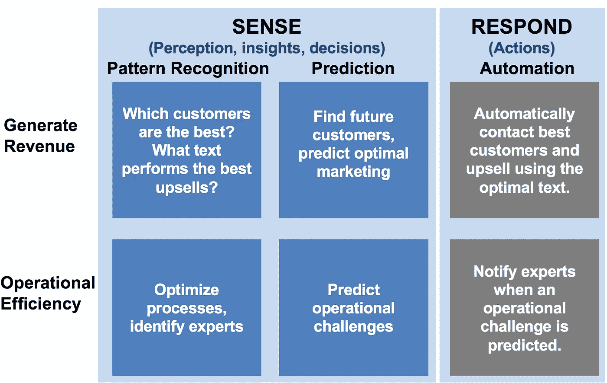

# 人工智能感知和响应框架:为高管和企业家寻找人工智能机会的方法

> 原文：<https://towardsdatascience.com/the-ai-sense-and-respond-framework-a-way-to-find-ai-opportunities-for-executives-and-entrepreneurs-a24aa56b4bff?source=collection_archive---------6----------------------->

高管和企业家问我，他们应该对人工智能(AI)做些什么。我就这个主题发表演讲，我认为我已经为高管和企业家如何找到近期人工智能机会提供了一个框架。人工智能感知和响应框架将人工智能目前可以做的事情提炼为高管或企业家可以做的可操作的业务事情。

该框架将人工智能能力分解为三组盒子(为简单起见):

1.  **模式识别**
2.  **预测**
3.  **自动化**

注意:第三项(自动化)不一定涉及人工智能算法本身，但它只是基于前两项(模式识别和预测)的结果可以采取的行动。

# 感觉:模式识别和预测

模式识别和预测被归入我称之为 Sense 的部分。在 Sense 部分，我们有您的数据输入、经过训练的模型以及可以推动洞察力和决策的输出。输入数据可能来自您当前的数据集、其他公司的数据集、传感器等。您可以获得的数据是基于您自己的业务，每个人都会有所不同。感觉部分(模式识别和预测)的目标是感知一些可以由人工智能模型解释的世界。模式识别(包括分类)和预测是 AI 相关模型现在能做的合理的、应用的事情。模型接受输入，并感知足够好的东西，从而得出见解和决策。

# 回应:自动化

另一部分叫做自动化。它在一个叫做“回复”的部分。这些是计算机可以基于来自模式识别的发现(洞察力和决策)和从模式识别和预测生成的预测数据自行采取(自动化)的(可选)动作。

# 使用框架

要使用该框架，您需要在 x 轴上列出 3 个部分，并在 y 轴上列出您的业务类别。我用了一个非常简单的例子，所有企业都有的两个通用类别:创收和运营效率(你可以用营销、销售、会计、运营、销售等。—任何对你有用的东西。)

现在，填写每个模式识别和预测框。只要有正确的信息，应用人工智能现在就可以做这些事情。现在，一旦这些框被填满——你可以在那里结束——你将拥有人工智能的有用用例，以便产生可以导致决策的见解。你会想你会寻找什么样的模式来产生更多的钱(例如)，等等。这些是人工智能技术可以用来让你的业务受益的用例。然后，您也可以完成自动化框。通读模式识别和预测用例，并询问“接下来我们可以采取什么行动”。这将帮助你提出基于人工智能驱动的见解可以自动化的东西。

当然，围绕实施还有其他复杂因素。您可能会发现，为了创建您想要的软件，您需要清理旧数据或收集新数据。但是，这个框架将帮助你思考你能做什么以及它能如何帮助你。

# 建立感知和响应系统

最终，我们将建立一个感知和回应的世界。我可能会在以后的文章中写更多的内容。本质上，无论我们谈论物联网还是任何业务，我们都在谈论建立学习系统。具有模式识别、预测、观察和输出的输入。然后，在一个永无止境的学习循环中，从头再来。通过观察(感觉)理解输出，循环再次开始。同时允许人类输入/洞察，同时提供其自己洞察。我们所有的公司都在学习系统。有些人将来会做得更好。人工智能技术可以帮助所有企业，因为它非常适合系统需要理解模式或做出预测的情况。这两者都是让系统主动学习的关键。

我认为这个框架对大企业很有用，可以产生很多内部人工智能驱动的项目，可以给你的公司带来价值。此外，企业家可以使用这种模型来产生新的人工智能创业公司，通过将你从客户那里观察到的需求与人工智能可以提供的能力进行匹配，来满足客户的需求。所以，祝你好运，构建你自己的人工智能感知和响应用例。

在 Twitter 上关注我: [@willmurphy](https://twitter.com/willmurphy)

多产上关注我:[@威尔](https://prolific.bio/will)