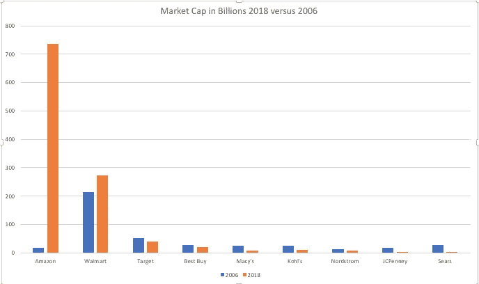

# 支付的算法化

> 原文：<https://towardsdatascience.com/the-algorithmization-of-payments-how-algorithms-are-going-to-change-the-payments-industry-5dd3f266d4c3?source=collection_archive---------2----------------------->

## 算法将如何改变支付行业

Algorithms…

就在不久前，首席执行官和大型银行还相信，银行的位置永远是服务客户所必需的。然而，在过去的十年中，我们已经看到了数字银行的出现，这些银行从来没有也可能永远不会拥有物理位置，但仍然设法扩大了他们的用户群，并增加了包括保险、抵押贷款和贷款在内的附加服务。

在支付行业，我们看到像 Chase 和 First Data 这样的公司统治了四十多年。然而，就像银行业的数字化迫使现任者改变他们的战略一样，支付的数字化使 WorldPay、Vantiv 以及最近甚至 Stripe、PayPal/Braintree 和 Adyen 等公司占据了很大一部分市场份额，不是通过专注于传统业务，而是专注于已经发展到让传统业务黯然失色甚至破产的初创公司。想想百视达对网飞，出租车对优步，或者传统商店对亚马逊。

Market Cap of Amazon versus Traditionals 2006 versus 2018

但随着越来越多的企业认识到数字是新的传统，我经常会问支付行业的下一步是什么？

就像在 20 世纪 70 年代和 80 年代对采用计算机和数据库持开放态度的公司，或者在 20 世纪 90 年代和 21 世纪初互联网泡沫破裂后理解互联网将成为游戏规则改变者的公司一样，我相信那些理解算法化将改变行业并积极投资于它的公司，最有可能在 2010 年和 2020 年成为幸存者。

## 流程的数字化

为了理解什么是算法化，我们需要两步回到传统的业务流程。数百年来，传统的业务流程是由人们创造产品或提供服务的劳动以及伴随而来的支持业务流程组成的。

例如，提供医疗服务的医生会有办公时间，在那里病人可以走进来或者预约。传统上，登记病人、更新他们的档案或写处方的过程都是用手写在纸上完成的。随着这些过程的数字化，计算机进入了医生的办公室，文件以数字方式存储，预约在数字日历中进行，处方通过电子邮件发送给药剂师。

直到今天，企业仍在通过开发移动应用程序或为客户提供基于云的解决方案来改善流程的数字化，以更好地访问或存储来自实际业务流程的数据。

## 算法化

当我们谈论算法化时，我们谈论的是使用数字化标签数据的过程，这些数据作为数据集存储在数据库中，并使用自动化过程来创建用户可以从中获取信息的分析。大多数公司都经历过这个过程，但这只是算法化的第一步。每当数据集(N)可以用于创建用户从中获取信息的分析时，下一步就是使用机器学习和人工智能来创建新的过程(N=N+1)，这本身就提供了新的数据集，从而完成了算法化循环。

## 支付服务提供商示例

举例来说，设想一家支付服务提供商每天处理数百万笔交易。商家提交的每笔交易都包含与交易相关的信息，如 PAN(个人账号)、CVC(卡验证码)、截止日期、客户姓名和电子邮件地址。通过浏览器，PSP 能够收集附加数据，如日期和时间、设备指纹、浏览器类型和版本、IP 地址和一些其他数据点(N)。

随着交易被处理，它们被存储在数据库中。大多数 PSP 将使用这些数据为他们的商家提供特定一天的交易的标准报告。有些人甚至会汇总数据以提供数据摘要。如果他们想变得更有创意，他们会开发可以通过 UI 访问的仪表板和图表，以显示事务如何随着时间的推移而进展。

随着计算能力、云计算和分布式存储技术的进步，包括 PSP 在内的许多公司都在尝试改进现有流程的方法。因此，举例来说，前面提到的 PSP 可以决定研究是否大量的历史数据可以帮助他们防止即将到来的交易欺诈。通过使用机器学习和人工智能，数据科学家可以创建一种算法，能够使用交易中的许多变量，并预测新提交的交易存在欺诈的可能性。

基于卡的支付的伟大之处在于，持卡人可以在特定的时间内对交易提出异议。每当欺诈性交易被报告时，发行者向该方案发送消息以拒付交易。每当 PSP 接收到这个信息，他们就能够把它存储在他们的数据库中。这使他们有能力学习他们最初预测的准确性。通过使用人工智能，他们可以调整原始算法，通过增加或减少算法中考虑的变量的权重来提高得分，实际上创建了一个新的过程(N=N+1)。

## 算法化将如何影响支付？

上面的例子只是算法化如何用于改进现有流程的一个用例，关于上面的例子，有趣的是，这是大多数欺诈解决方案多年来处理该问题的方式，但是欺诈者也变得越来越聪明，这意味着欺诈仍然会发生。

但是支付不仅仅是防止欺诈。成本、转换、连接、计费和支出是新的 PSP 能够使用算法来发挥作用的一些领域。随着越来越多的公司开始习惯于 PSP 的商品化，作为 PSP 保持成功的唯一方法不是专注于减少欺诈或降低每笔交易的成本，而是展示 PSP 能够为你带来更多业务的价值。

销售人员比财务部门更受欢迎的原因是，创造更多的收入等于增长，而降低成本可能会提高利润，但不会增加收入。

## 智能采集路由

相同的交易数据可用于基于性能、功能或价格优化获取途径。一个很好的方法是实现多臂 bandit 算法，这是一种“更智能”或更复杂的 A/B 测试版本，它使用机器学习算法来动态地将流量分配给表现良好的变体，同时将较少的流量分配给表现不佳的变体。通过连接多个收单机构，PSP 可以通过将交易路由到收单机构来改善他们的商户结果，收单机构为他们提供该商户的最佳结果，最好是性能、价格或功能。

## 动态 3D 安全

通过额外的两步验证措施，如 Visa 验证或万事达卡的 3DSecure，许多 PSP 仍然会看到高下降率，因为发行商要求两步验证交易。通过使用决策树学习，PSP 可以预测交易是否需要路由到 3DSecure 页面进行额外的两步验证，或者继续传统流程是否会导致成功的交易。

## 不要被别人的想象力所限制

当然，使用支付中可用的交易数据来提高商户绩效还有许多其他方式。PSP 将能够获取几十年来生成的相同数据，并思考如何通过使用今天可用的工具来改进流程，以创建更适合甚至尚不存在的商家和商业模式的 PSP。

## 感谢阅读；)，如果你喜欢它，请点击下面的掌声按钮，这对我意义重大，也有助于其他人了解这个故事。让我知道你的想法，联系推特或 T2 的 Linkedin。