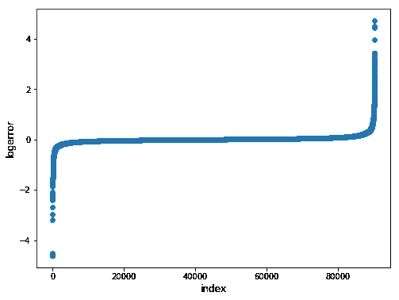
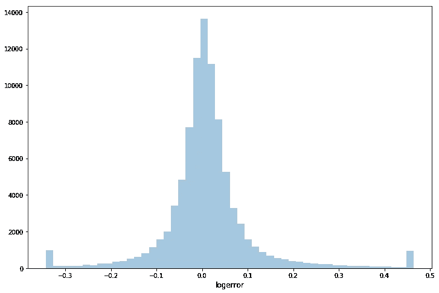

# 清理数据的艺术

> 原文：<https://towardsdatascience.com/the-art-of-cleaning-your-data-b713dbd49726?source=collection_archive---------2----------------------->

## 像奥巴马放弃麦克风一样放弃那些糟糕的数据

> 想获得灵感？快来加入我的 [**超级行情快讯**](https://www.superquotes.co/?utm_source=mediumtech&utm_medium=web&utm_campaign=sharing) 。😎

清理数据应该是数据科学(DS)或机器学习(ML)工作流程的第一步。没有干净的数据，你将很难看到探索中真正重要的部分。一旦你最终开始训练你的 ML 模型，它们将不必要地变得更具挑战性。最主要的一点是，如果你想充分利用你的数据，它应该是干净的。

在数据科学和机器学习的背景下，数据清理意味着过滤和修改数据，以便更容易探索、理解和建模。*过滤掉*你不想要或不需要的部分，这样你就不需要查看或处理它们。*修改*您*确实需要*的部件，但这些部件不是您需要的格式，因此您可以正确地使用它们。

在这里，我们将看看一些我们通常想要在我们的数据中清理的东西，以及可以用来做这件事的 pandas 代码！

# 缺失数据

大型数据集很少完全填满。我所说的完整是指所有的数据点都有其所有特征变量的值。通常会有一些缺失的值，当在 pandas 中加载类似于`pd.read_csv()`的东西时，这些值会被标记为 NaN 或 None。这类数据丢失有许多实际原因。收集数据的人可能只是忘记了，或者他们直到数据收集过程进行到一半才开始收集该特征变量。

在处理数据集之前，绝对需要处理缺失数据。例如，假设您正处于数据探索过程中，您发现了来自某个特征变量(比如“变量 F”)的数据的一些关键信息。但是后来你发现数据集中“变量 F”的 95%的值都是 NaNs 你不可能从一个仅仅代表数据集 5%的变量中得出任何关于数据集的具体结论！当你开始训练你的 ML 模型时，NaNs 也可能被你的程序当作 0 或无穷大，完全打乱了你的训练！

有几种方法可以处理熊猫丢失的数据:

*   **检查 nan:**`pd.isnull(object)`检测数据中缺失的值；这将检测“NaN”和“None”
*   **删除缺失数据:** `df.dropna(axis=0, how='any')`返回包含 nan 的数据点已被删除的数据框。
*   **替换缺失数据:** `df.replace(to_replace=None, value=None)`用“值”替换“to_replace”中给定的值。如果你知道你希望这个特征变量是什么值，这是很有用的。
*   **删除一个特征:** `df.drop('feature_variable_name', axis=1)`如果您发现某个特征变量在数据集中有> 90%的 NaN 值，那么从您的数据中删除整个东西是有意义的。


Drop those bad features like an Obama mic drop

# 极端值

数据集中的异常值是一个大杂烩。一方面，它们可能包含关键信息，因为它们与主要群体有很大不同。另一方面，它们让我们看不到主要群体，因为我们必须看得很远才能看到离群值！在最大似然方面，包含离群值的训练可能会让你的模型更好地泛化，但也会把它从你的大部分数据所在的主要组中分离出来。

一般来说，通常建议两面看。探索有无异常值的数据。如果您决定您的 ML 模型需要它们，那么选择一个足够健壮的方法来处理它们。如果您发现这些异常值确实存在，并且对获取大图信息和数据建模没有用处，那么最好就像上一节所示的那样丢弃它们。

此外，如果您想要过滤掉那些异常值，您可以使用以下方法:

```
# Get the 98th and 2nd percentile as the limits of our outliers
upper_limit = np.percentile(train_df.logerror.values, 98) 
lower_limit = np.percentile(train_df.logerror.values, 2) # Filter the outliers from the dataframe
data[‘target’].loc[train_df[‘target’]>upper_limit] = upper_limit data[‘target’].loc[train_df[‘target’]<lower_limit] = lower_limit
```



A plot with outliers included (left) and a histogram with outliers removed (right)

# 错误数据和重复数据

坏数据是指任何不应该存在的数据点或值，或者完全错误的数据点或值。例如，假设您的一个特征变量称为“性别”，其中大部分值为“男性”或“女性”。但是当你浏览数据集时，你会注意到有几个数据点的性别值为 67.3！显然，67.3 在这个变量的上下文中没有任何意义。此外，如果您尝试将“性别”特征变量转换为分类浮点数:男性= 0.0，女性= 1.0，您将得到一个额外的数字:67.3 = 2.0！

重复只是数据集中完全重复的数据点。如果有太多这样的问题，就会影响你的 ML 模型的训练。就像我们之前看到的那样，可以简单地从数据中删除重复项。

可以通过丢弃或使用一些智能替换来处理坏数据。例如，我们可能会查看性别值为 67.3 的数据点，并看到所有这些数据点的正确值都应该是“女性”。因此，我们可以简单地将所有 67.3 的值转换为“女性”。这样做的好处是，我们有效地为 ML 训练获得了这些数据点，而不是把它们扔掉。你可以在熊猫身上做这样的转换:

```
value_map = {'male': 'male', 'female': 'female', '67.3': 'female'}pd_dataframe['gender'].map(value_map)
```


Watch out for that duplicate Loki data

# 无关的特征

并非所有功能都是相同的。有些东西你可能根本不需要！例如，您可能正在查看过去一年从 Amazon 购买的图书数据集，其中一个特征变量称为“font-type ”,表示书中使用的字体类型。这与预测一本书的销量完全无关！您可以像这样安全地删除所有这些特性:

`df.drop('feature_variable_name', axis=1)`

这样做可以让你的数据探索变得更容易，因为你不需要浏览太多的东西。这也有助于训练你的 ML 模型更容易和更快，因为你不需要处理太多的数据。如果您不确定变量是否重要，那么您可以等到开始研究数据集时再做决定。计算特征变量和目标输出之间的相关矩阵有助于确定变量的重要性。


When your feature variable is useless …

# 标准化

每个特征变量中的所有数据都应该采用相同的标准化格式。它将使数据探索和建模的技术方面变得更加容易。例如，让我们再次以值为“男性”或“女性”的“性别”变量为例。如果数据是由一个人收集的，您可能会得到许多您没有预料到的不同值:

*   男，女(这个不错)
*   男性，女性(输入时大写锁定)
*   男性，女性(有些人会大写)
*   Make，Femall(错别字！)

如果我们继续将特征变量转换成分类浮点数，我们将得到比我们想要的 0 和 1 更多的值！我们实际上会得到这样的结果:

```
{
    'male': 0,
    'female': 1,
    'MALE': 2,
    'FEMALE': 3,
    'Male': 4,
    'Female': 5,
    'Make': 6,
    'Femall': 7
}
```

有几种方法可以处理这种情况。如果事情很简单，比如全部小写或首字母大写，就像这样做:

```
# Make the whole string lower case
s.lower()# Make the first letter capitalised
s.capitalize()
```

如果有错别字，您需要使用我们之前看到的映射功能:

```
value_map = {'Make': 'male', 'Femall': 'female'}pd_dataframe['gender'].map(value_map)
```

# 喜欢学习？

在 [twitter](https://twitter.com/GeorgeSeif94) 上关注我，我会在那里发布所有最新最棒的人工智能、技术和科学！