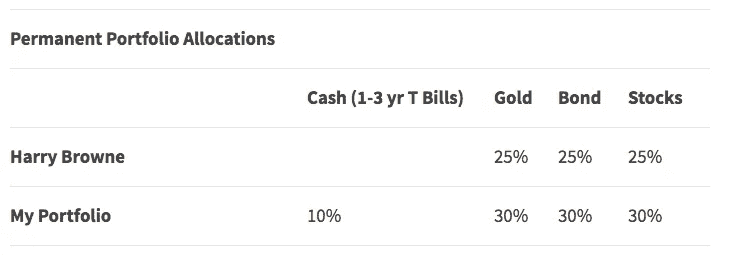
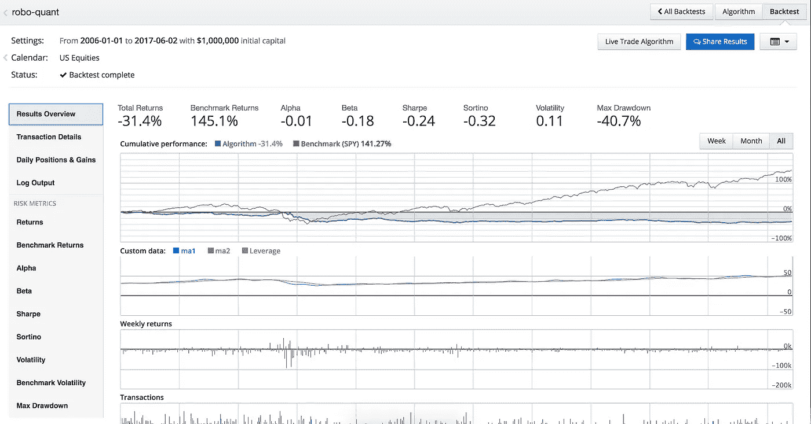
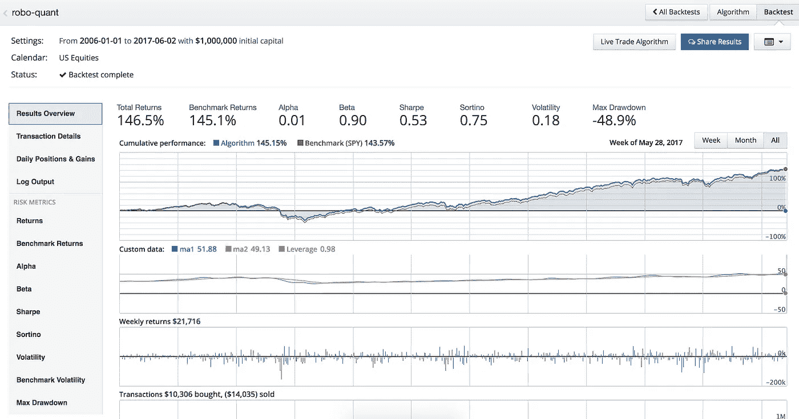
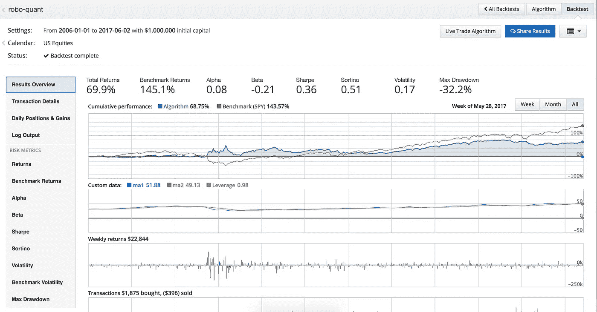
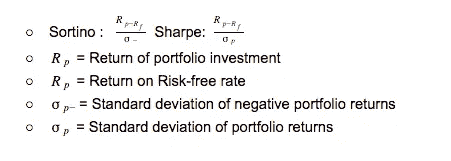

# 我的机器学习交易算法如何超过 SP500 10 年

> 原文：<https://towardsdatascience.com/the-austrian-quant-my-machine-learning-trading-algorithm-outperformed-the-sp500-for-10-years-bf7ee1d6a235?source=collection_archive---------4----------------------->

## 我使用 python 和 Quantopian 创建了一个机器学习交易算法，以击败股票市场超过 10 年。


Permanent Portfolio Fund on [Quantopian](https://www.quantopian.com/) : January 1, 2006 until June 2, 2017


Dutch Golden Age. Origins of Tulip Mania, The first investment bubble. 17th Century.
Source: Jan Claesz Rietschoof [Public domain], via Wikimedia Commons

# 介绍

大致来说，我一般会花大部分时间思考两件事，技术和投资。更具体地说，我经常问自己什么是我可以用软件(或者偶尔用硬件)构建的有用的东西，什么是我应该投资的有用的东西。算法交易是这两个学派的完美结合，我已经花了一些时间来理解这个领域。这是一个有趣的领域，我学到了一些有趣的东西，我决定与大家分享。

**你可以阅读** [**原文**](https://blog.tomiwa.ca/austrian-quant/) **e 上** [**我的博客**](https://blog.tomiwa.ca/) **。**

# 奥地利 Quant

奥地利经济学家是以奥地利经济学院命名的，这个学院启发了我如何构建投资组合。我设计了一个由 3 种不同投资基金组成的交易策略，以更好地理解投资、机器学习和编程，以及它们如何在金融和技术世界中结合在一起。

该策略中使用的 3 种不同的基金包括:永久投资组合基金、投机基金和基础基金。整个投资组合的 70%投资于永久投资组合，投机基金和基本面基金各占 15%的权重。基本面基金仍在建设中，所以我可能会在后面添加一个基金业绩的后续文章。然而，本文的其余部分是基于 85%的永久投资组合基金和 15%的投机基金的投资组合权重。

我也在我的 Github 上分享了这个项目的代码。

# 永久投资组合基金

永久投资组合是哈里·布朗的一个想法，基于奥地利经济学派，一个坚实的经济框架和一个非常有用的看待生活的方式。永久投资组合不适合寻求跑赢市场的投资者，他们持有大量现金和黄金就是明证；这是给有长期投资眼光的人的，它很好地描述了我的投资风格，因此是我最大的配置。

该基金的灵感来自 quantopian 上的[永久投资组合 Quantopian 笔记本](https://www.quantopian.com/posts/risk-parity-slash-slash-all-weather-portfolio)和 Rahim Reghezda 等人的[奥地利投资者学校](https://www.amazon.com/Austrian-School-Investors-Investing-Inflation/dp/3902639334)的书。艾尔。这是我强烈推荐的另一本书。这个投资组合的部分灵感也来自雷伊·达里奥布里奇沃特的[全天候原则](https://www.bridgewater.com/resources/engineering-targeted-returns-and-risks.pdf)，它是一个有用的框架，用来管理我的风险敞口，同时追求高回报。

在该基金中，30%的投资组合投资于股票、债券和黄金，10%投资于现金(或更具体地说，1-3 年期国库券)。奥地利学派投资者手册中的分配建议每个资产类别之间的权重相等，为 25%,但由于我年轻，责任不多，我认为我可以更激进一点，承担更多风险。因此，我降低了现金配置，增加了其他资产配置。



使用 [Markowitz 式优化](https://blog.quantopian.com/markowitz-portfolio-optimization-2/)算法重新平衡投资组合，以找到风险(标准差)和回报之间最有效的前沿比率。Markowitz 优化是一个有趣的算法，因为它是基于正态分布的回报，然而股票市场的回报服从幂律和厚尾。因此，人们不得不怀疑诸如马科维兹优化这样的算法实际上有多精确；也许它只是用来作为简化非常复杂的问题的启发。

进行了相当广泛的回溯测试，跟踪了该基金从 2006 年 1 月 1 日到 2017 年 6 月 2 日的表现。

*更新:这是 Quantopian 开始* [*计算风险相关数据*](https://www.quantopian.com/posts/new-tool-for-quants-the-quantopian-risk-model) *之前的回测。*


永久投资组合的目的不是跑赢指数，而是产生长期稳定的回报。考虑到这一点，我对回溯测试的结果非常满意。尽管该基金的表现比 SPY 基准低了约 500 个基点，但它的风险要小得多。更具体地说，它在 2006-2007 年和 2010-2017 年的牛市中实现了增长，同时在 2008/09 年的熊市中避免了亏损。

我在研究算法交易时学到的一个非常有见地的事情是，好的策略往往是非常短暂的。投资者往往非常精明，因此，如果一种资产类别表现良好，随着其他投资者蜂拥而至，这种交易策略很快就会被套利。我不认为永久投资组合会吸引太多的模仿者，因为它即使在牛市中也会采取谨慎的态度；投资者似乎忽视了它提供的重大下行保护。令人惊讶的是，这只基金一直跑赢指数，而且领先优势没有被套利交易抵消。

我现在正在一个真实的交易环境中测试这个，看起来在做出任何结论性的观察之前，必须使用一个更长的测试周期。然而，根据过去的数据，结果似乎很有希望，这是一个让我认真考虑在游戏中使用一些皮肤并用真钱测试的交易策略。

# 投机基金

如前所述，我有更高的风险承受能力，所以我想我可以把我投资组合的一小部分用于纯粹的投机。赌博严格违反了我的投资原则，然而，我在构建这个投资组合时获得的知识和乐趣是我虚伪的理由。这让我想起了杰克·博格尔(Jack Bogle)在解释为什么投资他儿子的主动投资公司的时候，一边宣扬指数投资的福音；"如果不一致，那么生活也不总是一致的."

投机基金的灵感来自于 [Python 编程 quantopian 教程](https://pythonprogramming.net/finance-programming-python-zipline-quantopian-intro/)，我强烈推荐给任何学习 Python 的人，哈里森·金利是一位非常好的老师。

投机基金使用相对简单的机器学习支持向量分类算法。该算法使用历史股价数据进行训练，通过查看股票在过去 10 天的价格变化，并学习股票价格在第 11 天是上涨还是下跌。然后，该算法可以根据股价在过去 10 天的上涨情况来预测股价是否会上涨。

使用支持向量机(SVM)分类器而不是 K-最近邻分类器，因为 Quantopian 中所需的计算密集型过程使得速度成为高优先级，并且这可以用支持向量机来最好地实现。下面是代码的摘要，为了节省空间删除了一些行，但是完整的代码可以在[这个文件中找到:](https://github.com/ademidun/austrian-quant/blob/master/quantopian/speculation_fund.py)

```
for _ in range(context.feature_window):
                        price = price_list[bar - (context.feature_window - xx)] # 10-(10-i) i++, get the trailing 10 day prices
                        pricing_list.append(price)
                        xx += 1 # if tomorrow's price is more than today's price
                    # label the feature set (% change in last 10 days)
                    # a 1 (strong outlook, buy) else -1 (weak outlook, sell)
                    if end_price > begin_price:
                        label = 1
                    else:
                        label = -1 bar += 1
                    X.append(features)
                    y.append(label) clf1 = RandomForestClassifier()
            # ...
            clf4 = LogisticRegression()

            clf1.fit(X, y)
            # ...
            clf4.fit(X, y) p1 = clf1.predict(current_features)[0]
	# ...
            p4 = clf4.predict(current_features)[0] # if all the classifiers agree on the same prediction we will either buy or sell the stock
            # if there is no consensus, we do nothing if Counter([p1, p2, p3, p4]).most_common(1)[0][1] >= 4:
                p = Counter([p1, p2, p3, p4]).most_common(1)[0][0] else:
                p = 0 speculations_allocation = 0.2
            # Based on the voted prediction and the momentum of the moving averages,
            # We will either buy or short the stock (or do nothing). if p == 1 and ma1 > ma2:
                order_target_percent(stock, 0.11 * speculations_allocation)
            elif p == -1 and ma1 < ma2:
                order_target_percent(stock, -0.11 * speculations_allocation)
```

尽管算法复杂，但结果非常糟糕:



Speculation Fund[/caption]

这让我很失望，因为我使用的所谓的复杂算法甚至不能打败一个简单的动量策略。事实上，当投机基金与动量策略结合时，它减少了超过 5000 个基点(50%)的回报。



势头基金



投机+动量基金

我还预计纯投机基金的波动性和最大提取量会更高，因为我对 Nassim Taleb 的工作非常着迷，我非常担心“黑天鹅”效应会抹去我的投资组合。[马克·斯皮兹纳戈尔](https://en.wikipedia.org/wiki/Mark_Spitznagel)[有一篇关于这个话题的非常好的论文](http://www.universa.net/UniversaSpitznagel_research_201205.pdf)，它帮助我理解了尾部风险事件在金融市场中被低估的影响。

简而言之，通过投机短期价格变化，我获得了约 1-2%的短期收益，但却让自己暴露在可能迅速亏损 50%以上的情况下。查理·芒格称之为在压路机前捡硬币。)然而，做空和对冲我的头寸的能力在 2009 年 3 月被证明非常有用。当市场有最大的损失时，我有最大的收益。尽管我的杠杆率从未超过 4%，但这是另一个需要在真实环境中进行适当测试的策略，因为利率支出和做空溢价可能会对回报产生重大影响。长话短说，我学到了很多，我真的很喜欢在一个实际的交易例子中使用机器学习，但不要在家里尝试。

# 基础基金[ [在建工程](https://github.com/ademidun/austrian-quant/blob/master/fundamental_fund.py)

该基金背后的想法是着眼于公司基本面，看看哪些财务指标最能预测股价的上涨。训练一个机器学习算法来预测什么样的公司基本面特征会提出一个令人信服的购买论点，并投资于这些证券。有趣的是，我在我的命令行上让算法在我的 Python 环境中工作，但我仍然试图让程序在 Quantopian 中工作，以便我可以做一些更严格的回溯测试。

主要的基金

虽然我的初步测试结果很有希望，但我还没有太兴奋，因为在适当的回溯测试环境中缺乏严格的测试，这意味着很难衡量我的投资组合作为真实交易策略的实际表现如何。然而，算法背后的理论和数学似乎是合理的，这是一个好迹象。

# 把它放在一起

在看到永久投资组合和动量基金与投机基金的糟糕表现相比表现如何之后，将这些基金结合起来似乎有些疯狂。但同样，目的不是最大化回报，而是学习更多关于投资和编程的知识。观察投资组合在其他指标中的表现很有趣。


我决定关注索提诺比率，而不是更传统的夏普比率，因为夏普比率惩罚上涨和下跌波动，而索提诺比率只惩罚下跌波动。然而，这两者之间的实际差别并不清楚，因为夏普比率和索蒂诺比率具有完全相同的平凡性。如果创建了两个列表，一个以降序排列夏普比率，另一个以降序排列索提诺比率(见表)；两个列表将具有相同的排序。[/ref]



严格来说，投机和时刻基金有最大的累积回报，所以它似乎是最好的策略。但是，我确定我的目标是长期交易策略，风险相对较小，投机+动量基金违反了这一原则，最大亏损为-48.90%，排序比率为 0.75。

在奥地利量化基金和永久投资组合之间做出选择是一个例子，说明了为什么人们认为投资更像是一门艺术而不是一门科学。虽然永久投资组合比奥地利量化投资组合高出约 13，000 个基点，但奥地利量化投资组合的波动性要小得多，下行保护也更好。由于不对称的收益，我对奥地利量化基金的短期交易并不完全满意；而永久投资组合基金提供了一个简单的，购买，持有和睡眠容易的策略。因此，我倾向于选择永久投资组合基金。虽然我认为我应该等着看这两个基金在真实交易环境中的数据，然后再下结论。

> 对知识的投资回报最高。
> 
> 本杰明·富兰克林

# 结论

在建设这个项目的过程中，我学到了很多东西，也获得了很多乐趣，这是最重要的事情。顺便说一下，我在研究这个项目时学到的另一件有趣的事情是，金融领域有变得过于理论化和方程式驱动的趋势。这在生物或物理等自然科学中没问题，但金融一般是社会科学，对黑天鹅事件和尾部风险的暴露更大。

我提醒每个人都要谨慎，记住不要混淆精确和准确。最后，我以睿智的本杰明·富兰克林来结束我的演讲，他提醒我们，“对知识的投资会带来最大的收益。

**你可以阅读** [**原文**](https://blog.tomiwa.ca/austrian-quant/) **e 上** [**我的博客**](https://blog.tomiwa.ca/) **。**

***来自《走向数据科学》编辑的提示:*** *虽然我们允许独立作者根据我们的* [*规则和指导方针*](/questions-96667b06af5) *发表文章，但我们并不认可每个作者的贡献。你不应该在没有寻求专业建议的情况下依赖一个作者的作品。详见我们的* [*读者术语*](/readers-terms-b5d780a700a4) *。*