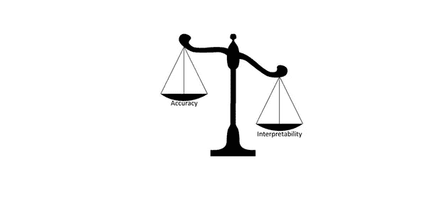
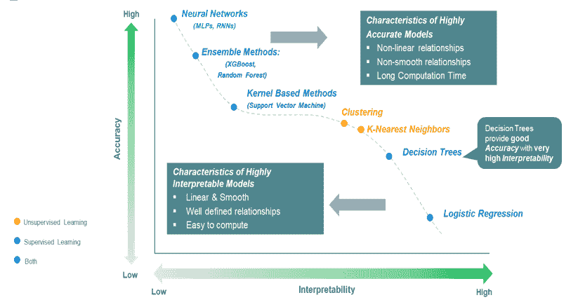

# 平衡:准确性与可解释性

> 原文：<https://towardsdatascience.com/the-balance-accuracy-vs-interpretability-1b3861408062?source=collection_archive---------12----------------------->

有多少次你努力实现一个高性能的算法，其可解释性和回归模型一样高？几乎每次我向商业客户交付项目时，我都会经历这种挣扎。每个人都想知道为什么一个顾客比另一个顾客更受重视，或者为什么一个病人比另一个病人更容易被诊断出疾病？随着越来越多的公司开始使用数据科学技术来推动增长，以及首席管理人员越来越依赖于这些技术的使用，理解*准确性和可解释性*之间的权衡对于分析的成功变得更加重要。

那么准确性和可解释性之间的权衡是什么呢？许多深度学习技术在预测方面做得最好，但解释起来非常困难和复杂。对于商业用户来说，这些独立变量之间的复杂交互很难理解，并且可能不总是有商业意义。

作为数据科学顾问，如果我们的业务客户不太理解我们的算法方法，我们应该树立信心。此外，拥有可解释的模型将证明数据科学技术的价值主张。业务用户将开始欣赏使用这些技术来解决实际业务用例的价值。

此外，现在所有的热门词汇:人工智能，神经网络，机器学习等。被广泛使用，客户在项目开始时会问一些问题，比如*“我们会实现神经网络算法吗？”*因此，解释准确性和可解释性之间的冲突，以及解释为什么某种模型最适合特定情况变得更加重要。

下面是我通常用来向业务用户解释特定算法的选择，以及算法的选择如何与我们试图解决的用例以及我们想要实现的业务目标相关联。

有很多其他算法可以适用于这个范围，但这些算法与我通常处理的用例最相关。此外，就 y 轴而言，算法可能上下波动，但这是典型的趋势。

话虽如此，我们可以使用许多技术在更复杂的模型中加入可解释性。在我的下一篇博客中，我将解释我们最近用来解释 XG-Boost 模型的技术之一。

这些内容最初发表在我的个人博客网站:[http://datascienceninja.com/](http://datascienceninja.com/)。点击[此处](http://datascienceninja.com/2019/07/01/the-balance-accuracy-vs-interpretability/)查看并订阅即时接收最新博客更新。