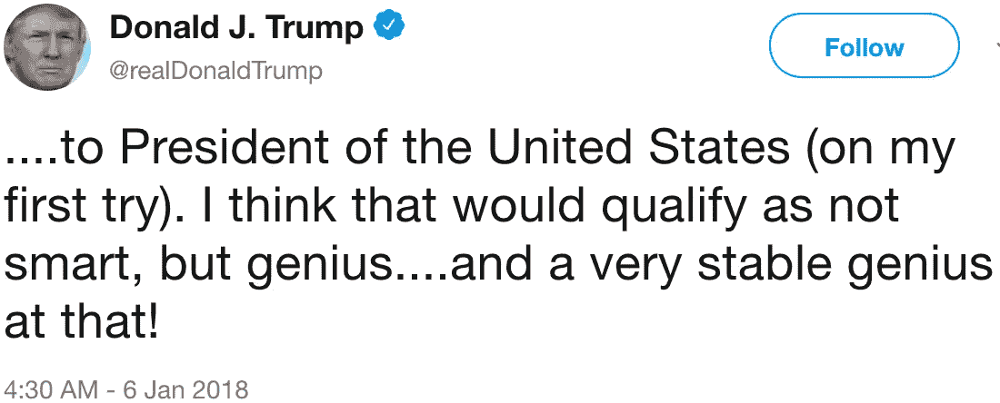
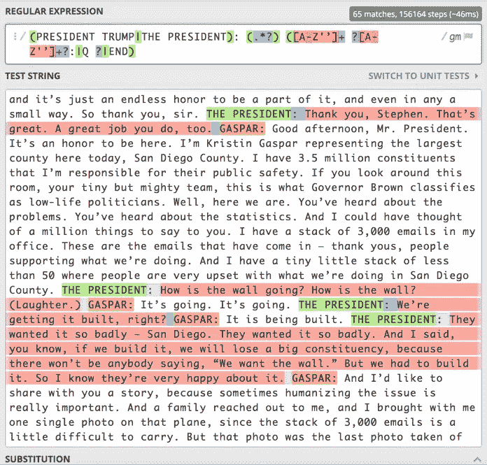

# 最好的话

> 原文：<https://towardsdatascience.com/the-best-words-cf6fc2333c31?source=collection_archive---------8----------------------->

## 使用递归神经网络模仿唐纳德·特朗普的风格

Photo by [History in HD](https://unsplash.com/@historyhd?utm_source=medium&utm_medium=referral) on [Unsplash](https://unsplash.com?utm_source=medium&utm_medium=referral)

> “我认识字。我有最好的话。”

2015 年 12 月 30 日，在南卡罗来纳州竞选集会的高潮中，这一声明只是我们现任总统唐纳德·j·特朗普越来越多的“特朗普主义”的又一个例子。这些声明既让唐纳德更受其支持者的喜爱，成为他们值得信赖的总统，同时也是似乎所有人嘲笑的原因。

不管人们对这个人的个人看法如何，不可否认唐纳德有一种独特的说话方式，那就是，嗯，如此独特的*他——*他对最高级词语的一知半解，以及明显无视传统句子结构的限制，这只是使他的演讲**与他的前任或同行的演讲立刻**可辨认的几个方面。

正是这种独特的风格吸引了我，我开始尝试使用机器学习来捕捉它——生成看起来和听起来像唐纳德·特朗普可能会说的话的文本。

# 数据收集和处理

为了了解特朗普总统的风格，我首先必须收集足够多的例子。我把精力集中在两个主要来源上。

## 推特

One of many examples of unconventional sentence structure.

显然，唐纳德·特朗普的第一个关键词是他的推特信息。现任总统在利用这个平台作为与美国人民的直接和未经过滤的联系方面是独一无二的。此外，作为一个有趣的人物，他的话自然被[收集和整理供后人使用，](http://www.trumptwitterarchive.com/)省去了我使用千变万化和限制性的 [Twitter API](https://developer.twitter.com/en.html) 的麻烦。总的来说，有不到 31000 条推文可供我使用。

## 总统讲话和演讲

然而，除了他在网上的角色，我还想一瞥他作为总统的更正式的角色。为此，我求助于白宫简报档案。在一些 Python 工具的帮助下，我很快就收集了一张大约有 420 份总统演讲和其他评论的表格。这些文字记录涵盖了各种活动，如与外国政要的会晤、与国会议员的圆桌会议以及颁奖仪式。

与每一个字都由特朗普本人书写或口述的推文不同，这些文字记录涉及其他政客和好奇的记者。将唐纳德的话与其他人的区分开来似乎是一项艰巨的任务。

Regular expressions are magic. Trust me.

输入**正则表达式**——一个功能强大且绝对不无聊的工具的无聊名字。

正则表达式允许您指定要搜索的模式；该模式可以包含任意数量的非常具体的约束、通配符或其他限制，以准确返回您想要的结果，仅此而已。

经过反复试验，我能够生成一个复杂的正则表达式，只返回总统所说的**和**的单词，留下并丢弃任何其他单词或注释。

## 打扫，还是不打扫？

通常，处理文本的第一步是将其规范化。这种标准化的程度和复杂性根据个人的需要而变化，从简单地删除标点符号或大写字母，到[将一个单词的所有变体简化为一个基本词根](https://nlp.stanford.edu/IR-book/html/htmledition/stemming-and-lemmatization-1.html)。这个工作流程的例子可以在[这里](/into-a-textual-heart-of-darkness-39b3895ce21e)看到。

然而，对我来说，在规范化中会丢失的特定特质和模式正是我需要保留的。因此，为了让我生成的文本更加可信和真实，我选择绕过大多数标准的规范化工作流程。

# 文本生成

## 马尔可夫链

在深入研究深度学习模型之前，我好奇的探索了另一种常用的文本生成方法，即[马尔可夫链](https://en.wikipedia.org/wiki/Markov_chain)。马尔可夫链长期以来一直是笑话文本生成的首选——快速搜索就会发现[星际迷航、](https://twitter.com/captain_markov?lang=en) [前总统](https://hackernoon.com/automated-text-generator-using-markov-chain-de999a41e047)、[辛普森一家](https://github.com/cshenton/simpsons_markov)、以及[许多其他](https://www.reddit.com/r/SubredditSimulator/)的马尔可夫链。

马尔可夫链的快速和肮脏之处在于，在确定下一步应该做什么时，它只关心当前的单词。这种算法关注特定单词出现的每一次，以及紧随其后的每个单词。随机选择下一个单词，其概率与其频率成比例。让我用一个简单的例子来说明:

Simplified Markov chain example, in which the only 3 follow-ups to “taxes” are “bigly,” “soon,” and end of sentence.

唐纳德·特朗普说了“税收”这个词。如果在现实生活中，在他说“taxes”之后的 70%的时间里，他接着说“bigly”，马尔可夫链将在 70%的时间里选择下一个单词为“bigly”。但有时，他不说“大”有时他会结束这个句子，或者换一个词。这个链*最有可能*选择“bigly”，但也有可能会选择任何其他可用的选项，从而在我们生成的文本中引入一些变化。

并且令人作呕地重复，或者直到句子结束。

这对于快速而肮脏的应用程序来说非常好，但是很容易看出哪里出错了。由于马尔可夫链只关心当前的单词，所以它很容易被转移。一句以谈论国内经济开始的话，很容易以谈论《飞黄腾达》结束。

由于我的文本数据集有限，我的马尔可夫链输出大部分都是无意义的。但是，偶尔也有一些辉煌和欢乐的闪光:

Tweet-trained Markov chain given the seed “FBI”

## 递归神经网络

然而，对于还算真实的文本，我需要更复杂的东西。递归神经网络(RNNs)已经成为许多基于文本或序列的应用的首选架构。RNNs 详细的内部工作超出了这篇文章的范围，但是一个强大的(相对)初学者友好的介绍可以在这里找到。

这些神经单元的显著特征是它们有某种内部“记忆”。单词的选择和语法在很大程度上取决于周围的环境，因此这种“记忆”在通过跟踪时态、主语和宾语等来创建连贯的思想方面非常有用。

这些类型的网络的缺点是它们的计算非常昂贵——在我的笔记本电脑上，通过模型运行一次我的全部文本将需要一个多小时，考虑到我需要这样做大约 200 次，这是不好的。

这就是云计算的用武之地。许多老牌科技公司都提供云服务，最大的是[亚马逊](https://aws.amazon.com/)、[谷歌](https://cloud.google.com/)和[微软](https://azure.microsoft.com/en-us/)。在一个[高 GPU 计算实例上，](https://aws.amazon.com/ec2/instance-types/p3/)每个周期一个多小时的时间变成了**90 秒**，时间缩短了 40 多倍！

# 估价

你能说出下面的陈述是真是假吗？

> 加州终于值得一个伟大的政府，让美国再次伟大！#特朗普 2016

这是因特朗普支持共和党州长候选人而产生的文本，但它可能会被视为特朗普在 2016 年大选前发的推文。

我实现的更复杂的神经网络，在递归层之前和之后隐藏了完全连接的层，能够生成内部一致的文本，给定 40 个字符或更少的任何种子。

> 我希望他们都聚在一起，我希望人们可以看看农场。
> 
> 中国已经同意购买世界上大量的东西——并停止美国的大交易。

不太复杂的网络在一致性方面有些失误，但仍然抓住了特朗普总统演讲的基调:

> 奥巴马。我们会有很多人这样做——好吗？我会告诉你他们有一点点。

# 结束语

虽然这种尝试并没有让你我始终如一地产生文本，但它让我见识到了 RNNs 的力量。在短时间内，这些网络学会了拼写、语法的某些方面，在某些情况下，学会了如何使用标签和超链接——想象一下，一个设计更好的网络，有更多的文本可以学习，有更多的时间学习，会产生什么样的结果。

如果你对这些模型背后的代码感兴趣，[你可以在这里找到库](https://github.com/tetrahydrofuran/presidential-rnn)。此外，如果您有任何问题或反馈，请不要犹豫！