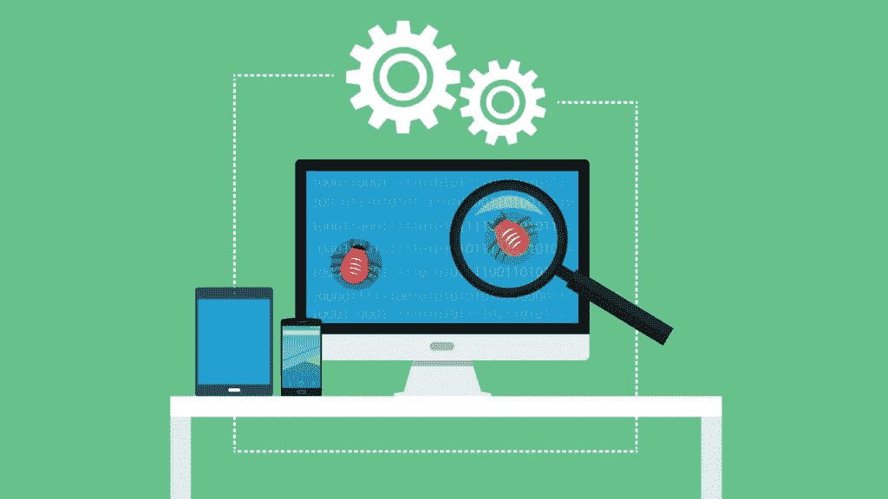

# 您应该了解的大数据测试挑战

> 原文：<https://towardsdatascience.com/the-big-data-testing-challenges-you-should-know-about-56db2d8da9a5?source=collection_archive---------7----------------------->

假设您必须测试 100TB 无缓存的非结构化、无索引数据。你能感受到这个项目中所有可能出错的事情带来的恐慌吗？瓶颈和缓慢的处理是首先想到的吗？加上未清理的数据，未知的错误，传输故障以及确保操作应用于整个卷，你甚至还没有接近大数据测试的含义。

# 大数据的 V 型

处理大数据揭示出[测试与常规软件相比](https://www.smartdatacollective.com/challenges-and-solutions-of-big-data-testing/)有所不同。这些挑战来自数据本身的属性。这就是所谓的三个 v，即数量、速度和多样性，通常以可变性和价值作为补充。它们中的每一个都提出了具体的挑战，它们也可能通过协同作用产生更多的问题。

## 卷

大的定义并不局限于一个特定的数字。有些人谈论以 GB 为单位的[大数据](https://www.lifewire.com/terabytes-gigabytes-amp-petabytes-how-big-are-they-4125169)，而其他项目处理 Pb 或 zettabytes，完全取决于它们的范围。事实上，任何不适合在单台机器上进行分析的数量都被认为是巨大的。为了克服这个问题，Hadoop 将数据分布在更多的计算中心。没有并行处理，就不可能遍历整个集合。想象一下，你必须在几秒钟内过滤整个脸书帖子数据库中的关键词。

## 速度

这不仅是体积的问题，也是速度的问题。例如，每分钟都有近[50 万条推文](https://blog.microfocus.com/how-much-data-is-created-on-the-internet-each-day/)和同样多的脸书帖子发布。这同样适用于 RFID 和来自物联网设备的数据。设计一个可以实时处理这些更新的测试算法是大数据测试的最大挑战之一。这一棘手问题也可以通过分布式计算和并行化来解决。所使用的方法应该侧重于提高性能。

## 多样性和可变性

大数据不能放在一个数据框里。它缺乏同质性和标准化，需要设计新的检索、查询和测试方法。文本、图像、声音、XML 等各种格式需要不同的验证方法，以防止错误从一个步骤传播到另一个步骤。

与多样性相关的另一个 V 是数据的可变性。并不是所有的数据都是相等的，或者以固定的时间间隔产生的，因此一组数据可能包含缺失值。这使得传统的分析工具毫无用处，需要不同的方法。

## 价值

评估数据的潜在应用是规划 it 投资所必需的。由于数据被认为是一种新的货币，每个数据集都应该进行评估。相同的数据可以有不同的用途，并与其他数据组合，以获得新的模式和见解。此外，来自一家公司的经过充分验证的记录可以通过销售给其他组织而成为新的收入来源。

# 测试类型并确定 Vs 的优先级

每种类型的数据需要[不同的测试方法](https://www.slideshare.net/TechWellPresentations/the-four-vs-of-big-data-testing-variety-volume-velocity-and-veracity)，充分适应其最重要的 V:

*   数据摄取测试—适用于数据库、文件和接近实时的记录。在基于文件的数据中，需要优先考虑多样性，在处理大量涌入的记录时，需要优先考虑速度。
*   数据迁移测试—这种测试类型在实时处理中不存在。所以优先考虑的是体积。
*   数据集成测试——侧重于识别不一致性。亮点在于可变性，因为来自不同来源的数据需要输入到一个存储库中。
*   数据同质化测试—在这种情况下，绝大多数大数据是非结构化或半结构化的，因此多样性要求创建规则。
*   数据标准化测试—数量是这里最重要的功能，以确保所有数据都符合要求并符合法规。

# 技术专长要求

简单的 excel 表格不再适合用于大数据测试。甚至连模拟器都不够用。只有像 Hadoop 这样实现 Map Reduce 和 ETL 过程验证的专用环境才能捕获该过程的所有复杂方面。ETL 过程意味着数据从其原始目的地(数据集市和数据仓库)提取出来，转换成分析所需的文件类型或格式，并加载到新的数据库中。测试的重点是每个步骤的质量，以确保在这个过程中不会丢失任何信息。

# 自动化

在传统的软件测试中，自动化被认为是一个不错的选择或捷径，但现在却成为了大数据测试的强制性要求。正如 A1QA 对[的描述，它缩短了上市时间，提高了产品质量。自动化确保了测试过程涵盖了所有的可能性，而不仅仅是一个样本。](https://www.a1qa.com/services/testing_automation/)

这种变化不会没有额外的麻烦，比如需要雇用专家和管理更多的软件。虽然手工测试人员需要很少的编程背景，并且可以在几周内完成培训，但是自动化测试人员需要有多年的经验。

# 虚拟化

尽管虚拟化为现实世界的版本提供了合适的替代方案，但它也带来了与虚拟机延迟相关的特定挑战。当[创建了太多的虚拟映像](http://www.dummies.com/programming/big-data/challenges-of-virtualization-for-big-data/)时，就会出现性能问题。无法管理虚拟化流程会导致成本增加，甚至带来安全风险。然而，可扩展性、弹性、成本效益和为应用程序创建沙盒环境的能力等优势，推荐将虚拟化作为大数据的另一个基础 V。

当将合规性要求添加到组合中时，这可能意味着测试还应该包括对虚拟机日志的仔细监控。

# 成本和基础设施

由于大数据测试人员的必要专业知识大大超过了人工测试人员，因此人员成本将推高预算。从好的方面来看，如果做得好，由于测试的自动化，必要的工时数应该会持续下降。事实上，从长远来看，这将降低成本。

此外，如果不通过云解决方案实施，必要的基础架构会对预算产生重大影响。

# 未来发展

大数据测试不同于常规的软件评估，因为它不太关注功能，而是更关注数据的质量，就像数据流经流程一样。大数据测试对软件开发最重要的贡献可能与开发理解大数据量的新方法有关。另一个将获得更多可见性的领域是优化，因为需要实时准确地处理数据，而当前的体系结构不适合处理未来几年的预测量。测试自动化很可能会从所创造的进步中受益匪浅，因为大数据实践可以复制到常规软件测试中，从而提高速度和准确性。