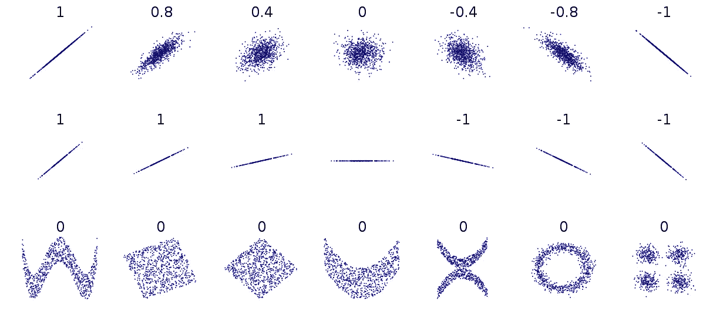

# 皮尔逊的相关性，线性回归，以及为什么“贝塔”大大低估了投资组合对市场回报的敏感性

> 原文：<https://towardsdatascience.com/the-black-swans-in-your-market-neutral-portfolios-part-i-7521683a7317?source=collection_archive---------11----------------------->

这是本文的第一部分，说明了在评估投资组合风险时，考虑非线性和时间相关性的实际重要性，而广泛采用的(皮尔逊)相关系数未能做到这一点。

在这篇文章中，我们提供了皮尔逊相关性的基本介绍，它与线性回归和投资组合 *beta* 的关系，以及它在衡量资产之间的相关性方面的局限性。

在第二部分中，我们提供了资产回报的独立同分布高斯假设不适用于美国股票和期货的经验证据，并且我们提出了皮尔逊相关性的替代方案，即 ***信息调整相关性*** ，它测量时间序列(非随机变量)之间的关联，同时充分捕捉非线性，更重要的是，时间结构。然后，我们使用信息调整相关性来构建投资组合的(CAPM 的) *beta* 的信息论替代方案，我们称之为 ***信息调整 beta*** 。

# 什么是相关性？

> 背景

广义地说，*相关性*(或 co-relation)是两个现象之间关联或依赖*的任何*度量，*每个用一个数字来表征。*

在实践中，感兴趣的现象通常过于复杂，无法用精确不变的确定性定律(如物理定律)来描述。相反，我们满足于将我们缺乏的粒度理解表达为随机性，我们转向数学的分支，即*概率论*来研究我们现象的*集合属性*。一个这样的系综性质是两个随机现象之间的关联。

在这篇文章的其余部分，我们认为每一个感兴趣的随机现象都是通过一个单一的数字来表现的，我们用相关的*随机变量*来表示它，我们用两个随机变量之间的*相关性*来表示相关随机现象之间的相关性。

> 皮尔逊相关

正如您所料，多年来，人们提出了许多测量两个随机变量之间相关性的方法。

皮尔逊相关系数(Pearson ' s correlation coefficient)是迄今为止最流行的相关性度量，是一个介于-1 和 1 之间的数字，它反映了两个随机现象具有线性关联的倾向。也就是说，皮尔逊相关性衡量的是，如果我们将一个随机变量的观察值与另一个随机变量的观察值绘制成散点图，该图看起来像一条直线的程度。

皮尔逊相关性越接近-1 或 1(分别为。0)，越强(resp。较弱)两个随机变量之间线性关联的证据。正的皮尔逊相关表明当一个随机变量取一个大的(相应的。小)值，另一个也是如此。负的皮尔逊相关表明当一个随机变量取大的(相应的。小)值，另一个取小(resp。大)值。

> 皮尔逊相关性为什么这么受欢迎？

皮尔逊相关性作为两个随机变量之间相关性的度量标准之所以流行，可以归因于其在[高斯分布](https://en.wikipedia.org/wiki/Normal_distribution)的特殊情况下的一般性质。

事实上，当两个随机变量是[联合高斯](https://en.wikipedia.org/wiki/Multivariate_normal_distribution)时，皮尔逊相关性完全捕捉到了它们之间*任何关联*(线性或非线性)的程度。而且，高斯分布在概率论及其应用中起着举足轻重的作用。

对数学家来说，它们是最容易处理的概率分布族，它们被广泛研究，它们经常在看似不相关的概率问题中意外出现，关于它们的结果在文献中比比皆是。

对于统计学家来说，高斯分布是一种福气，因为他们的分析能力，在估计未知分布*的性质时产生的误差通常*表现得像高斯分布——即使估计的分布不是高斯分布——这要归功于一族通常被称为[中心极限定理](https://en.wikipedia.org/wiki/Central_limit_theorem)的结果，以及他们属于[指数分布族](https://en.wikipedia.org/wiki/Exponential_family)的事实——这本身在贝叶斯统计中起着关键作用——等等。

对于机器学习研究人员来说，高斯分布作为概率分布上一些重要优化问题的解决方案自然出现。一个这样的问题是[最大熵问题](https://en.wikipedia.org/wiki/Maximum_entropy_probability_distribution)，其目的是在所有与观察到的经验证据一致的概率分布中，找到对其他一切最无知的那个。

> 皮尔逊相关和线性回归

皮尔逊相关性和线性回归可以被视为一枚硬币的两面。

在两个标量随机变量 ***x*** 和 ***y*** 已经[标准化](https://en.wikipedia.org/wiki/Standard_score)的情况下，*y***x***之间的皮尔逊相关系数***ρ***可以解释为 ***y*** 之间最佳线性拟合的斜率*

**

*事实证明，即使在随机标量*和随机向量*的 a 线性拟合的情况下，两个[都标准化了](https://en.wikipedia.org/wiki/Standard_score)，***

******

***提供最佳线性拟合的向量，即***【β】***，完全由向量*与输入*之间的皮尔逊相关系数以及坐标*之间的皮尔逊相关系数决定******

***当输入向量 ***X*** 的坐标去相关(皮尔逊相关为 0)时，通过将*的第 *i* 个坐标设置为 ***y*** 和 *i* 的第个坐标之间的皮尔逊相关来获得根据上述等式的最佳线性拟合****

**更一般地，线性拟合完全由皮尔逊相关系数和读数决定**

****

**其中每个 ***∑*** 是左索引(的坐标)和右索引(的坐标)之间的皮尔逊相关矩阵。**

***注意，当且仅当* ***X*** *的所有输入坐标与* ***y*** *解相关时，***β***的所有坐标为 0，由此可见，线性回归可以被认为是皮尔逊相关性的多元推广。***

> **金融中的线性回归**

**线性回归在金融界很普遍。从 [CAPM](https://en.wikipedia.org/wiki/Capital_asset_pricing_model) ，到 [APT](https://en.wikipedia.org/wiki/Arbitrage_pricing_theory) ，到 [Fama-French 因子模型](https://en.wikipedia.org/wiki/Fama%E2%80%93French_three-factor_model)，再到溢价商业因子模型，几乎所有在金融中使用的基于因子的风险模型都依赖于线性回归以及资产回报与时间同分布的假设。**

**定量分析师通常使用的预测模型也严重依赖线性回归，无论是在其原始公式中(如 [OLS](https://en.wikipedia.org/wiki/Ordinary_least_squares) 、[自回归](https://en.wikipedia.org/wiki/Autoregressive_model)和[向量自回归](https://en.wikipedia.org/wiki/Vector_autoregression)等)。)，或者规则化(如[脊回归](https://en.wikipedia.org/wiki/Tikhonov_regularization)、[套索](https://en.wikipedia.org/wiki/Lasso_(statistics))等)。)来处理相关输入变量和/或执行变量选择。**

**线性回归也可用于因果关系检测(如[格兰杰因果关系](https://en.wikipedia.org/wiki/Granger_causality))。**

> **皮尔逊相关性和投资组合的(CAPM**

**资本资产定价模型(CAPM)的概念来源于 *alpha* 、 *beta* 和*市场中性、*假设投资组合相对于无风险利率的超额收益可以分解为一个随机市场成分，其大小由系数 *beta* 驱动，一个确定性的特质平均超额收益项 *alpha* 和一个均值为零的特质剩余项。**

****

**根据定义，当 beta 为 0 时，投资组合被认为是市场中性的。可以证明，在资本资产定价模型下，**

****

**这意味着*一个投资组合是市场中性的，当且仅当它的回报率***与市场回报率*不相关。***

# **皮尔逊相关性在金融学中的局限性**

**皮尔逊相关性捕捉两个随机变量之间任何类型关联的独立同分布高斯假设在金融应用中存在严重的局限性。**

> **去相关并不意味着独立；所以市场中性的投资组合并不总是市场中性的！**

****

**Scatter plots of couples of random variables, labelled with the associated Pearson’s correlations. The last row shows random variables that, despite having 0 Pearson’s correlation, exhibit strong associations. Source: Wikipedia.**

**正如任何概率 101 课程所教导的那样，[去相关并不总是意味着独立](https://en.wikipedia.org/wiki/Correlation_and_dependence)！特别是，如果市场中性投资组合的回报与市场回报不一致，那么市场中性投资组合实际上可能依赖于市场！这是一个显而易见的说法，但却经常被从业者忽略。**

**最糟糕的是，在这种情况下，所谓的市场中性投资组合和市场之间的剩余耦合只能在尾部(分布的高阶矩)中表现出来——市场中性投资组合的回报与市场回报没有一阶关联，但不一定没有高阶/非线性关联。**

**市场中性的投资组合在正常市场条件下可能得到很好的对冲，但它可能会显著暴露于极端波动，也就是市场范围内的黑天鹅。**

> **一个伟大的基金经理总是假设线性，就像法国厨师保罗·博古塞要求他的食品供应商经营他的餐馆一样！**

**在金融中使用皮尔逊相关性的一个相关缺陷是，假设线性抓住了两个随机变量之间任何关联的本质。然而现实是所有的回归模型都是线性和非线性的，这取决于什么样的输入现象的观察被用作参考。**

**让我们考虑一下回归模型**

****

**其中 ***f*** 为非线性函数。显然，这个模型假定了在 ***y*** 和 ***x*** 之间的非线性关联。但是，同样的模型也可以看作是在 ***y*** 和 ***f(x)*** 之间放置一个线性关联。**

**也就是说，***【x】***和 ***f(x)*** 可以看作是观察同一随机现象的两种不同方式。观察潜在随机现象的过程通常由数据供应商承担，或者由任意约定(例如交换合同规范等)暗示。).总是假设你的数据供应商或交易所提供给你的表示是线性的，就像假设数据供应商或交易所做了你的(大部分)工作。如果他们擅长你的工作，他们会管理你的基金。**

**我们举一个具体的玩具例子。假设我们对研究澳元对美元的价值和新西兰元对美元的价值之间的关系感兴趣。假设我们决定使用线性回归。我们应该回归利率本身吗？比率的对数？他们的每日收益？还有其他的汇率变化吗？显然，每种情况都会导致完全不同的模型，不问这些问题就像让数据供应商和交易所为我们建立模型一样好。**

**为了使用线性模型，人们应该额外寻求理解，更好地从数据中学习，什么样的转换会使线性假设有用。**

**在这一点上，值得强调的是，经济学家所钟爱的 [t 检验](https://en.wikipedia.org/wiki/Student%27s_t-test)、**、*、*、**等具有统计显著性的检验，不能用来证明线性假设的有效性。他们测试(非零)一阶效应的存在，他们不测试(非零)高阶效应的不存在。**

***总之，我们都应该像已故的法国厨师保罗·博古兹(Paul Bocuse)一样:非常担心我们使用的食材的质量，但更担心如何将它们放在一起做出完美的饭菜(或预测/风险模型)。***

> **总是假设回报率是独立同分布的，就像发誓说市场是完全有效的，你仍然可以创造阿尔法！**

**追求阿尔法的本质是这样一个前提，不管怎样，过去与未来是相关的，未来是可以预测的，或者用数学术语来说，市场作为一个随机系统，表现出记忆。**

**因此，既寻求阿尔法，又假设市场动态是无记忆的，这是违背直觉的。如果市场是无记忆的，怎么可能从数据中学习系统的策略(例如，像量化基金一样赚钱)？然而，大量的风险模型都是基于因子模型，假设收益的时间序列是无记忆的。这个假设不仅与经验证据不一致，它还隐藏了很多尾部风险，我们将在第二部分*中看到。***

**要找到皮尔逊相关性的替代方法来衡量你的投资组合的风险，同时考虑非线性和时间相关性，以及 CAPM 的 beta 的类似替代方法，请阅读本文的第二部分，以及我们的[黄皮书](https://github.com/devisechain/Devise/blob/master/yellow_paper.pdf)进行更技术性的讨论。**