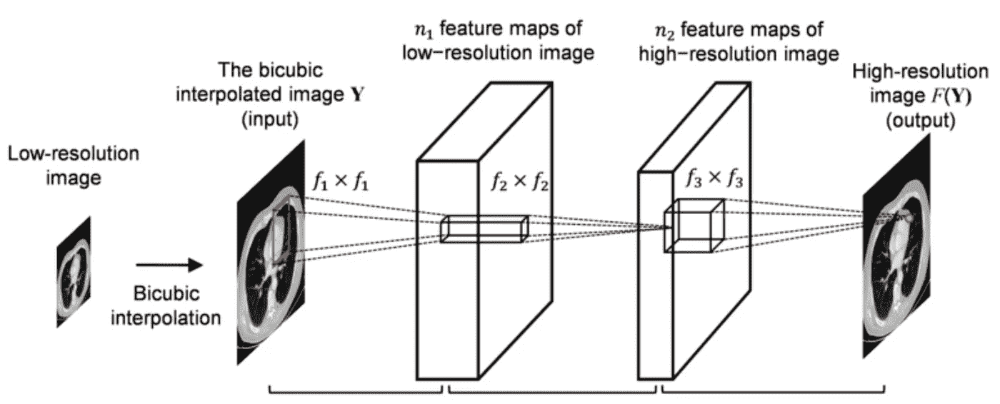

# 监督学习和非监督学习的模糊界限

> 原文：<https://towardsdatascience.com/the-blurry-lines-of-supervised-and-unsupervised-learning-b8a2aa04c8b0?source=collection_archive---------14----------------------->

## 自我监督、半监督和弱监督

当你进入机器学习领域时，你会很快听说监督学习和非监督学习。解决两种不同类型问题的两种不同方法。

由于机器学习，尤其是深度学习正在快速发展，事情变得更加复杂。有人监督和无人监督之间的界限似乎变得模糊了，目前有三种新的学习方式越来越受欢迎。在开始新的内容之前，让我们简要地浏览一下通常的两个疑点。

# 监督学习

监督学习就是寻找一个映射，将一组输入特征转换为一组预定义的输出特征。换句话说，我们明确地告诉模型，我们想要为训练数据预测什么。监督学习带来的问题是，我们需要手动标记我们的数据，以便为每个样本定义输出空间。

# 无监督学习

在无监督学习中，我们也对找到到输出空间的映射感兴趣，但是我们不知道这个输出看起来像什么。或者至少，我们不会将这些信息输入到算法中。无监督学习最常见的例子是聚类，其中我们根据样本最明显的特征将样本分组。

# 自我监督学习

自我监督学习指的是一种标签可以自动生成的方法。架构本身和学习过程是完全监督的，但我们不需要手动标记训练数据的步骤。

## 示例 1:自动编码器

这方面的一个经典例子是输入和输出数据完全相同的自动编码器。其架构的目的是首先将输入压缩为密集格式，然后重构原始信号。通过这样做，自动编码器学习特定于问题的有损数据压缩，这有助于特征提取或数据减少。

## 示例 2:图像超分辨率

另一个例子是图像超分辨率，其中我们放大图像，同时试图基于语义内容重建新的像素信息。如果你想为这样的问题建立一个数据集，你所需要的就是一个未标记图像的集合。要给它们加标签，你可以缩小原始图像的尺寸，并把它们作为你的输入。输出将是原始大小的图像。在这种情况下，您不需要手动标记任何内容。您从未标记的训练数据中自动生成了已标记的训练数据。

# 半监督学习

当你的训练数据只有**部分标注**时，半监督学习就发挥作用了。你会在网上找到很多数据集，除了带注释的样本之外，你还会得到其他没有标注的数据。因为所有数据都是好数据，这可能有助于您改进模型。

## 示例:伪标签

伪标注是为我们没有标签的数据预测标签，并使用这些预测作为基础事实标签来扩展数据集的过程。虽然这可能会在我们的数据中引入噪声，但实验表明，这有助于提高模型的准确性。如果你对此感到惊讶，你并不孤单。

# 弱监督学习

弱监督学习指的是一种模型，该模型根据它被训练的标签来预测**附加信息**。你可以认为这是监督学习之上的无监督学习。

## 示例:从分类标签中分割

假设您正在训练一个分类器来区分图像中某处包含的不同类型的对象。CNN 将学习为每个类创建热图，在那里它期望该对象在帧中。这样它就可以比较一个物体与其他物体的面积和可能性。虽然我们只根据整个帧的真实信息来训练网络，但我们也可以获得对象在帧中所处位置的信息。

-

*你会发现这些术语到处都有不同的定义。有些似乎不准确，因为它们已经过时，有些似乎结合了我明确区分的术语，还有一些陈述了我完全不同意的观点。如果你不同意我的观点，请留下你的评论。*