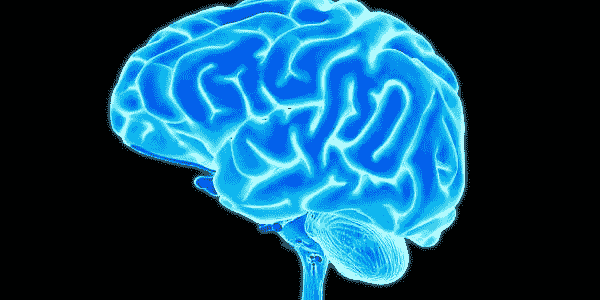
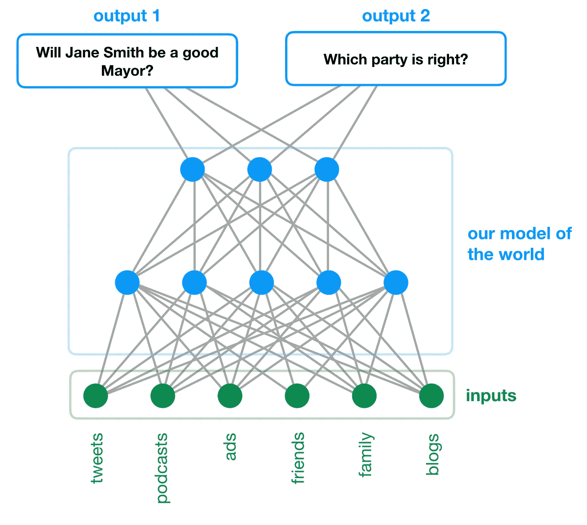
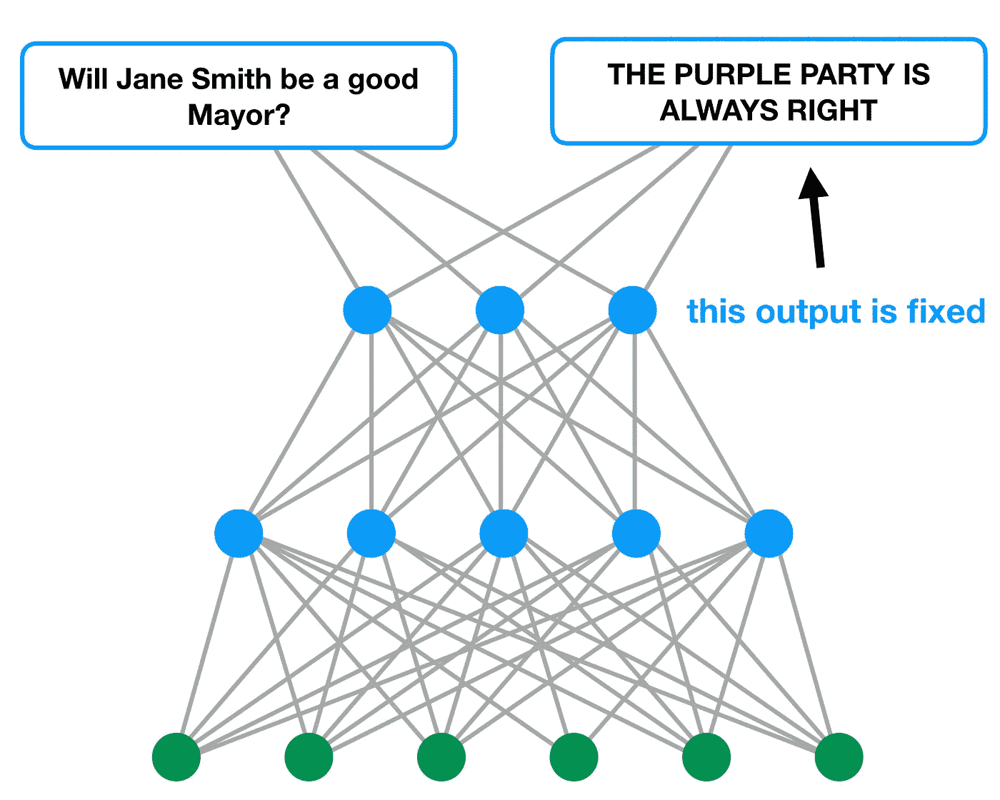
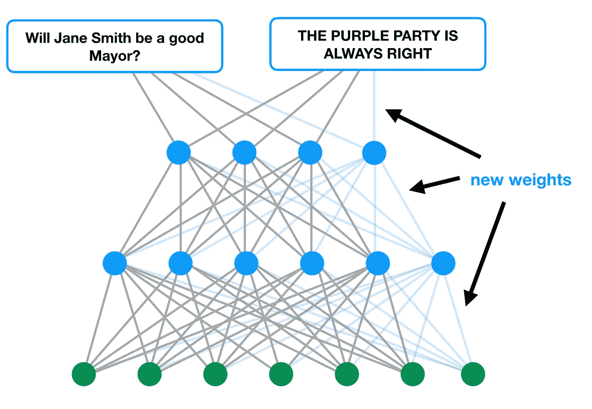

# 作为神经网络的大脑:这就是我们无法相处的原因

> 原文：<https://towardsdatascience.com/the-brain-as-a-neural-network-this-is-why-we-cant-get-along-bd94bc7e49cc?source=collection_archive---------11----------------------->

几个月前，我和我的同事们进行了一次谈话，并注意到一些奇怪的事情，这些事情改变了我对政治的看法，也改变了我自己的想法。

今天的话题是自省和政治。我们互相问了一些问题，比如，“作为一个自由主义者，你认为你的盲点是什么？”，以及“作为一名女权主义者，你的呢？”我忘记了时间——在这种情况下我经常这样做——在我意识到之前，已经过了凌晨 1 点，感觉我们才刚刚开始揭开世界问题的最初几层。

我们谈话的奇怪之处不在于话题本身。我喜欢激烈的哲学对话，这种对话无处不在，无处不在，我可能拥有的比我应该拥有的更多。不，奇怪的是我们讨论这个话题时使用的语言。

因为我们每个人都有机器学习的背景，所以我们分享了一个共同的词汇——其中包括像“决策面”和“过度拟合”这样的技术术语。随着我们整晚更深入地探索我们的偏见和观点，很明显，这个不寻常的词汇让我们对自己的思维过程获得了非常强大的洞察力。

在某些方面，这实际上很有意义:最成功的机器学习算法是神经网络，它们的结构和功能明显受到大脑的启发。因此，毫不奇怪，机器学习的词汇非常适合于提供关于我们如何思考或不善于思考世界问题的见解。

我想在这里与你分享其中的一个见解。还有很多其他的，但是你可能有其他的事情要做，如果我明天早上要赶火车的话，我真的需要在午夜之前完成这篇文章。

# 我们的大脑是一个神经网络

让我们把大脑想象成神经网络的集合。我们将想象这些网络中的每一个都负责做出(至少)一种类型的预测。

现在让我们想象一下，有一次城市选举，我们需要选择我们支持哪个候选人竞选市长。根据我们正在使用的模型，将会有一个神经网络负责做出有关政治的决策。

这个神经网络将接受各种输入:我们朋友的意见、我们看过的任何推文、我们看过的竞选广告、我们听过的播客等等。它将把我们的政治观点作为它的输出:我们认为哪个政党是“好”的，我们期望哪个候选人当选后表现最好，我们的税率应该有多高，等等。等。本质上，这个神经网络编码了我们的政治“世界模型”。

为了简单起见，让我们假设它只有两个输出:1)如果我们最喜欢的候选人(我们称她为简·史密斯)当选市长，她是否会做得很好，以及 2)哪个政党是“好”的政党。

这是一个大概的样子:

***先不说:**注意，这个模型的两个输出都建立在同一个底层模型之上。为了确保我们世界观的内在一致性，这是一个很重要的理想化。如果输出 1 和输出 2 是由完全独立的神经网络生成的，那么我们可能会遇到明显的矛盾，在这种情况下，我们在做出一种政治预测和做出另一种预测时会应用不同的规则。

假设我们预测简·史密斯会做得很好，但是后来证明我们的预测是完全错误的。如果我们完全理性，我们的下一步将非常简单:我们将通过我们的模型反向传播，调整其权重，以便下次我们遇到像 Jane 这样的候选人时，我们会更加怀疑。

但是这种反向传播也可能有其他后果。具体来说，它可能*也会*影响我们对哪一方是正确的预测。

现在，一个完全理性的人可能会说，“那又怎样？如果我不得不重新评估我的党派关系以适应事实，那就这样吧。”

但是人类不是理性的。我们深深地属于部落，我们中的许多人深深地认同我们的政治。在许多情况下，社会压力和条件作用直接影响与输出 2(我们党的从属关系)相关的损失函数，并要求输出 2 呈现某个特定值。

例如，语句“我是共和党人”必然要求输出 2 的值为“共和党是对的”。同样，“我是民主党人”是一个承诺，以确保输出 2 始终是“民主党是正确的”。

值得花点时间思考一下这种约束的后果。正如我们将看到的，通过这样做，我们可以学到很多非理性人类行为背后的数学知识。

# 过度契合=固执+现实

让我们假设简·史密斯是我们最喜欢的政党的成员。为了保持中立，我们称之为紫色党。让我们也假设我们是一个党派迷，有足够的社会和其他压力迫使我们支持紫色党，我们不愿意在我们的党派归属上让步。

在这种情况下，我们对简·史密斯在任期间表现的回应将是一种受约束的优化。一方面，我们显然有东西要学，因为我们支持简，而事实证明她终究不适合这份工作。另一方面，我们不能以这样一种方式更新我们的权重，以妥协我们的政党偏好。

使用我们之前的图片，这看起来是这样的:

然而，事情是这样的:根据我们的模型在开始时所处的状态，我们可能很难更新我们的权重，以便正确预测简在担任市长时的失败，而不在此过程中破坏我们亲紫色政党的立场。

如果发生这种情况，我们能做什么？我想到了一个选择:也许我们需要做的就是给我们的模型增加一些自由度，来绕过这个约束！

我认为，这正是我们所做的:我们不改变我们的党派关系或我们的世界观，而是简单地增加重量，并允许我们自己通过*过度适应*来保持产量 2:

过度适应是想要鱼与熊掌兼得的自然结果:如果我们要固执地坚持紫色党总是正确的，但我们也希望能够证明他们的候选人的糟糕表现，我们所能做的就是给自己更多的工作自由度。

# 过度合身是什么感觉？

到目前为止，我已经从理论上介绍过拟合。但是很难想象过度拟合实际上是如何在我们的思维中表现出来的，所以我们可能应该看一个具体的例子。

让我们回到简和她当市长时糟糕的工作上来。如果我们要过度适应这种情况，我们需要为我们的模型发明一些新的特征(也许是一些新的输入)，让我们能够解释她是如何失败的，而不会得出紫色党需要改变政策的结论。

这些特征可能是什么样的？在理想的情况下，它将是我们可以制造的东西，但不能被反驳或挑战。勾选所有这些框的一个很好的选择是读心术:我们可以想象简·史密斯的精神状态，并调整它，直到它让我们得到我们想要的两个结论:1)简·史密斯是一个糟糕的市长，2)紫色党仍然很棒。一个简单的方法是这样说，“当然，她是一个紫色的党员，但是简·史密斯从来没有真正的*相信*他们的平台。所以你不能根据她的行为来判断紫党。”

哲学迷可能会认为这只是“没有真正的苏格兰人”谬论的一个例子。据我所知,“没有真正的苏格兰人”的谬论正是过度适应*是*。这是一个简单的“是的，但是”的回答，旨在保留我们现有的偏见，而不损害我们根据需要发明新功能来解释现实的能力。(“是的，但简不是真正的*紫色党候选人，因为【发明了允许过度拟合的功能】。”)*

通过假设我们能够了解简·史密斯的精神状态，我们就能够随意拉动读心术杠杆，以确保我们从我们的世界模型中获得我们想要的结果，而不会牺牲我们解释我们观察到的她的候选人资格的能力。这个策略很棒，因为除了简·史密斯，没有人能够反驳我们，即使她反驳了，我们也可以告诉自己，“如果她不诚实，她就会这么说。”

一点内省可能会揭示出我们实际上有一个过拟合探测器硬连线到我们身上。这是因为过度拟合通常与一种感觉有关:那种*为* *找借口*的感觉。毕竟，如果不是我们引入到我们的世界模型中的一个新特征，允许我们在保留我们的教条的同时解释我们的观察，那么“借口”是什么？

# 如何对抗过度拟合

如果你想成为一个更理性的人，你可能会得出结论，你需要直面过度适应。您可能会认为，您可以在自己的头脑中解决过度拟合问题，就像您在数据科学项目的环境中一样:建立一个验证集，并根据它检查您的预测。

在实践中，这可能意味着对某些事件的发展方式做出预测，并让你的世界模型对这些预测的准确性负责。

但是这并不总是有效的，因为出于完全合理的原因，不得不为你的世界模型添加特性并不罕见。事实上，在很大程度上，当我们了解一个新问题，或一个新领域时，就会发生这种情况:我们在越来越高的维度上思考它，同时增加了我们模型的复杂性。

所以在一天结束的时候，你最好的选择可能就是密切关注你的思维过程，当你进入找借口的模式时，试着抓住你自己。因为这是过度拟合的迹象，这是你的世界模型可能需要多一点调整的第一个迹象。

如果你想聊天，在推特上用[@**jeremie charris**](https://twitter.com/jeremiecharris)**联系我！**