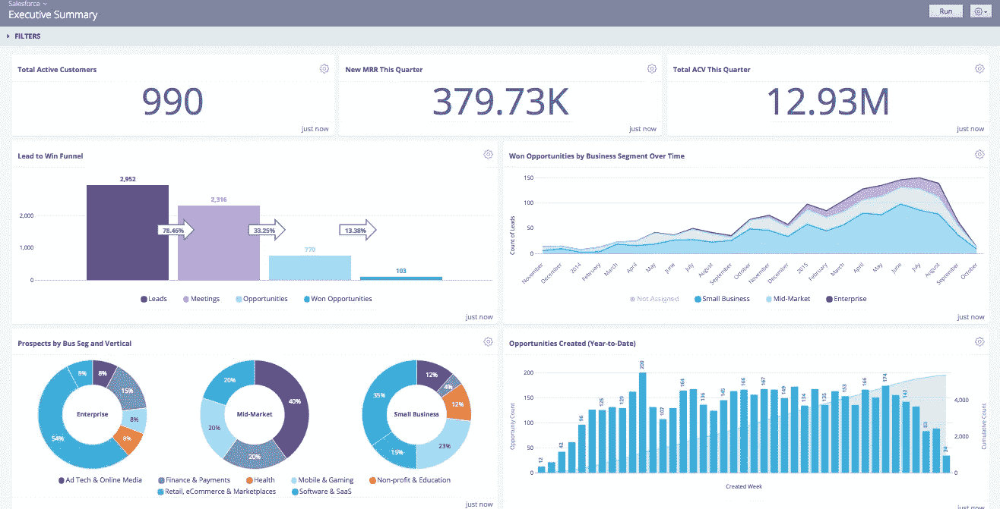

# 人工智能的冷启动问题

> 原文：<https://towardsdatascience.com/the-cold-start-problem-with-artificial-intelligence-49938ed3f612?source=collection_archive---------4----------------------->

# 为什么公司在实施人工智能方面举步维艰，以及如何克服它。

Humans are still necessary…right?

如果你在过去的三四年里成为了一名数据科学家，并且你没有经历过 20 世纪 90 年代或 21 世纪初，甚至 20 世纪 10 年代的大部分时间，有时很难想象事情发生了多大的变化。如今，我们使用 GPU 驱动的数据库来查询数十亿行，而我们过去如果能够生成每日汇总报告就已经很幸运了。

但是，随着我们已经习惯于拥有数据和商业智能/分析，一个新的问题正在阻止热切的数据科学家将他们正在使用的算法应用于玩具问题，并将它们应用于实际的现实生活中的商业问题。其他智慧被称为人工智能的冷启动问题。在这篇文章中，我讨论了为什么公司在实施人工智能上挣扎，以及他们如何克服它。

## 从数据开始

任何想要利用人工智能的公司，无论是初创公司还是企业，都需要确保他们有实际有用的数据来开始。一些公司可能满足于其应用程序或网站生成的简单日志数据，而希望能够使用人工智能来增强其业务/产品/服务的公司，应该确保他们正在收集的数据是正确的数据类型。根据您所在的行业和业务，正确的数据类型可以是日志数据、事务数据、数字数据或类别数据，这取决于处理数据的人员来决定需要什么样的数据。

除了收集正确的数据，另一个重要的步骤是确保你使用的数据是正确的。这意味着这些数据真实地代表了所发生的事情。如果我想要所有支付交易的计数，我需要知道交易的定义是什么，它是发起的交易还是处理的交易？一旦我回答了这个问题，并确保组织同意，我可以使用它来工作。

随着 SCRUM 的广泛采用和频繁发布，公司不得不投入资源来确保数据的正确性。公司可能会添加新的数据源、对记录的数据产生影响的代码更改，甚至是 GDPR 或 PSD2 等外部影响，这可能会导致数据被更改，因为数据需要更加安全或以不同的方式存储。通过确保在每个过程中确保数据的正确性，只有这样，您才能进入下一个分析阶段。

SQL Query Result a.k.a. Raw Data

## 将数据转化为分析

尽管人工智能目前是每个人都在谈论的话题，但在我们到达那里之前，我们仍然必须采取一个中间步骤，这就是分析。我所说的分析，是指对数据或统计数据进行系统的计算分析。在大多数公司中，实现数据可视化的过程可能鲜为人知，但它对每个部门的影响是巨大的。

> 分析是数据或统计的系统计算分析。

公司需要确定哪些关键绩效指标(KPI)真正推动了业务的发展。在支付行业工作，我的 KPI 包括已处理收入、交易成本、利润、授权率、退款率、欺诈和许多其他为我提供管理业务绩效信息的指标。对于打车应用，KPI 可能包括收入、利润、平均接车时间、平均乘车时间、活跃用户和活跃司机。

从这些 KPI 中，公司可以决定业务用户需要什么类型的报告或仪表板来做出明智的决策，并自动对数据或统计数据进行系统的计算分析。

但是，随着数据量从 KB 增加到 TB，并且业务用户越来越多地查看数据的汇总报告和可视化，检测较小问题的机会大大减少。只有到那时，实施人工智能才能成为一项值得投资的时间和资源。

Executive Summary Dashboard — Looker

## 从分析到人工智能

确定了有助于引导业务的 KPI 后，人工智能可以用来改进这些 KPI。在这种情况下，人工智能是理性的代理，它使用算法来实现特定场景的最佳结果。

例如，支付行业的授权率对于大型商家来说非常重要，因为他们每天处理数百万笔交易，拥有最高授权率的 PSP 可以决定一笔交易的成败，或者在大型商家获得流量与否的情况下。

通过每天跟踪授权率，我们能够计算出我们的性能随时间的变化情况。因为我们的分析已经确定，通过不同的收单银行进行交易会导致两种不同的 KPI。我们可以使用人工智能来学习在哪个场景中一家收单银行的表现优于另一家，并自动将交易路由到表现最佳的收单银行。

由于我们实施的人工智能模型和逻辑对授权率有积极影响，因此相关的 KPI 也会受到影响。因为较高的授权率导致较高的处理收入，从而导致较高的利润。

## 公司与人工智能斗争的原因

那么公司为什么要纠结 AI 呢？我认为，技术的快速发展已经导致许多公司有点不知道他们应该专注于什么。从数据中心到云，从网络到移动网络到原生应用，从大数据到人工智能，这种转变对企业公司来说并不容易。尤其是首席财务官和首席技术官之间的讨论，他们一方希望降低成本，另一方希望拥有尽可能好的技术供自己使用，这可能会导致优柔寡断，从而无法做出决策。

我认为公司与人工智能斗争的另一个原因是，缺乏人工智能可以产生影响的证据，导致很多人认为这只是一场炒作，最终会消失。包括金融服务、运输和保险在内的许多行业已经使用数据和计算机化的决策对其业务产生影响，但许多其他没有相同数据水平的行业更难相信人工智能能够对其业务产生影响。

## 如何克服人工智能的冷启动问题

正如业务的数字化需要不同的思维方式一样，算法化也需要不同的思维方式。随着每个人都可以使用技术，竞争加剧，许多行业已经商品化。作为一家公司，采用人工智能的思维模式，并采取相应的行动，是克服人工智能冷启动问题的第一步，但也是最关键的一步。

新技术创业公司更容易，因为没有历史，公司里没有人需要被说服这是必要的。因此，从初创公司设计和编写应用程序的那一刻起，采用人工智能思维将对将要做出的决策以及如何使用数据来建立更好的业务/产品/服务产生巨大影响。

现任者面临着更大的挑战。因为即使高层管理人员可能会相信，走谷歌、亚马逊和微软的路线，成为人工智能优先，是一条路要走，大多数员工不会轻易被说服。和任何项目一样，确保每个人都参与进来是成功的关键因素。

所以真正的问题变成了，我们该怎么办？

从过去的商业变革中，我们知道真正的变革来自内部。通过采用人工智能思维模式，管理可以对组织的其他部分产生重大影响。但是，实际的人工智能项目专注于使用人工智能来改变一个过程，在那里你将能够改变人们的看法。当然，启动一个不会影响你做生意的方式的一次性人工智能项目是不会成功的。最好是启动多个人工智能项目，处理业务的不同部分，对冲你的赌注，但也鼓励在整个组织内分享最佳实践。

## 人工智能和数据科学家的未来

随着数据科学和数据科学家的职业开始进入商业领域，我看到了很多机会。随着谷歌、亚马逊和微软等公司对云计算的访问越来越便宜，这一基础设施上的能力和工具不断增加，训练、部署和开发人工智能模型变得非常容易，数据科学家的真正角色将是真正理解你试图解决的问题，然后找出解决问题所需的工具和模型。这将产生数据科学家，他们必须成为领域专家，而不是只关注他们提出的解决方案的“数据科学”部分。

这并不意味着数据科学家不知道什么算法最适合某个特定的问题，这只是意味着他们需要完全理解这个问题，它与客户、业务目标和数据集的独特组成的关系，然后将数据科学和他们的领域专业知识结合起来，以改进 KPI 和底层业务。

## 感谢阅读；)，如果你喜欢它，请点击下面的掌声按钮，这对我意义重大，也有助于其他人了解这个故事。让我知道你的想法，联系推特或 T2 的 Linkedin。或者关注我，阅读我关于数据科学、支付和产品管理的每周帖子。