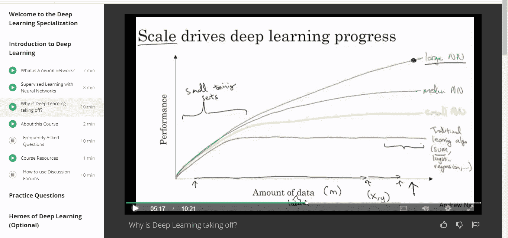
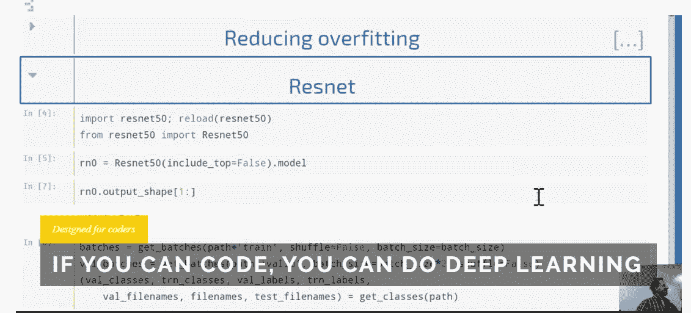
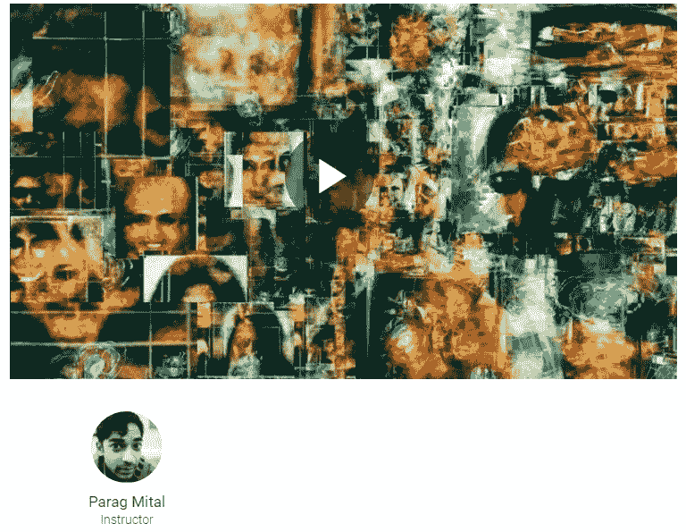
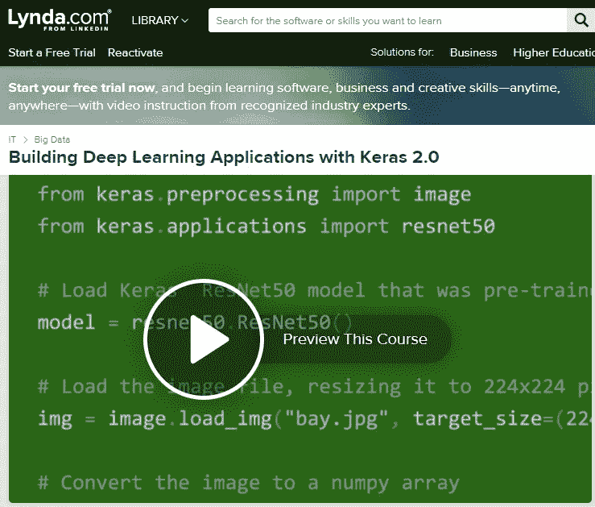
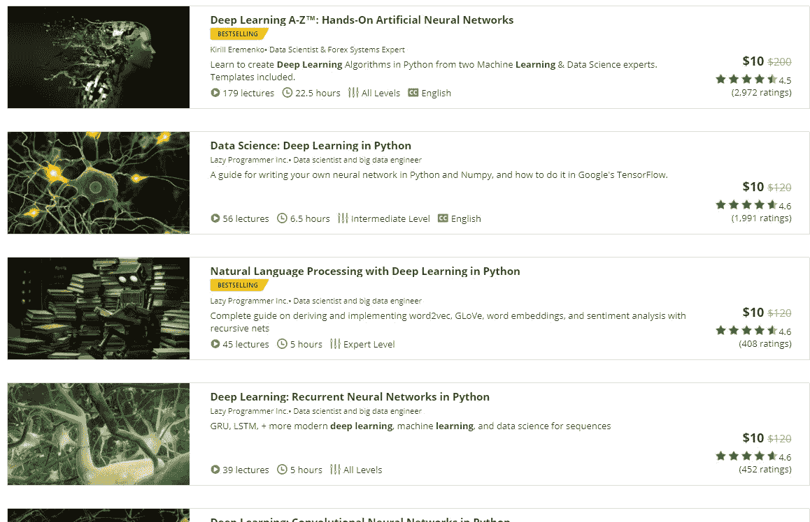

# 学习深度学习完全指南

> 原文：<https://towardsdatascience.com/the-complete-guide-on-learning-deep-learning-72cabb30d721?source=collection_archive---------4----------------------->

人工智能的兴起根植于深度学习的成功。神经网络是一个广泛的算法家族，形成了深度学习的基础。神经网络的早期工作实际上始于 20 世纪 50 年代和 60 年代。就在最近，随着深度学习取得了令人印象深刻的最新成果，人们对它的兴趣又有所抬头。从图像中的物体分类到快速准确的机器翻译，再到游戏性。

在总部位于多伦多的[***deep pixel***](http://deeppixel.ai/)**公司，我们致力于各种行业(目前是汽车、零售和金融)的这些新业务案例。**

**然而，深度学习有以下利弊。**

**优点:**

**-强大:深度学习在许多困难的学习任务上取得了比其他机器学习方法更大的进步，在许多不同的领域都取得了最先进的性能。**

**-深度学习进行有效的自动特征提取，减少了对这个关键问题的猜测和启发。**

**-当前的软件提供了灵活的架构，可以轻松适应新的领域。**

**缺点:**

**-深度学习可能需要大量的训练数据。**

**-深度学习可能需要巨大的计算能力。**

**-架构可能很复杂，通常必须针对特定应用进行高度定制。**

**-生成的模型可能不容易解释。**

**去年，[大卫·文丘里](https://medium.com/@davidventuri)发表了[深入学习 15 门免费在线课程](https://medium.freecodecamp.org/dive-into-deep-learning-with-these-23-online-courses-bf247d289cc0)，自从[吴恩达](https://www.deeplearning.ai/)周二通过 [Coursera](https://www.coursera.org/) 宣布了他新的深度学习专业，我觉得有必要将他的课程添加到这个广泛的列表中，再加上我最近遇到的几门课程。**

****

**Andrew Ng’s Course Page — Introduction Week**

**[***深度学习专精***](https://www.coursera.org/specializations/deep-learning)**

**[***骏马***](https://www.coursera.org/)**

**等待结束了， [deeplearning.ai](https://www.deeplearning.ai/) 是五个致力于传播人工智能知识的深度学习课程的所在地，并在 [Coursera](https://www.coursera.org/) 举办。周二开始了三个课程，未来几周还将增加两个课程。由深度学习顶尖头脑之一的[吴恩达](https://www.deeplearning.ai/)教授，专业包括最先进的深度学习模型，如卷积网络、RNNs、LSTM、Adam、Dropout、BatchNorm 和 Xaxier/He 初始化等等。涵盖医疗保健、自动驾驶、手语阅读、音乐生成和自然语言处理等行业。学生将在 Python 和 Tensorflow 中练习上述所有内容。**

****

**Udacity deep learning course page**

**[***深度学习基础纳米度***](https://www.udacity.com/course/deep-learning-nanodegree-foundation--nd101)**

****

***该计划与 [Siraj](https://www.youtube.com/channel/UCWN3xxRkmTPmbKwht9FuE5A) 一起，为具有一些数学和编程背景的人提供了深度学习领域的广泛概述。利用每周视频、独家项目以及专家反馈和评论，向学生教授这种塑造未来技术的基础。当前注册已结束，但您可以加入他们的等待列表，以便在下次注册开始时得到通知。***

******

***deep learning course at [fast.ai](http://www.fast.ai/)***

***[***程序员实用深度学习—第一部分***](http://course.fast.ai/)***

***[***面向编码人员的前沿深度学习—第二部分***](http://course.fast.ai/part2.html)***

***[***fast . ai***](http://www.fast.ai/)***

***由杰瑞米·霍华德和雷切尔·托马斯教授，这个 7 周的课程是为任何至少有一年编程经验的人设计的。本课程采用“代码优先”的方法，不假设任何超出高中数学的内容，但在需要时会介绍关键的数学工具。在完成第一部分的所有 7 门课程后，学生应该能够知道如何识别人工智能机会，并开始将解决方案付诸实践。他们最近推出了 Part-2，学生将学习深度学习的最新部署，如何阅读和实现新的学术论文，以及如何解决自然语言翻译等具有挑战性的端到端问题。整个课程是免费的，但准备花几百美元在 AWS 实例上，并花大量时间调试 AWS。***

******

****Creative Applications of Deep Learning with TensorFlow at Kadenze****

***[***深度学习与 TensorFlow 的创造性应用***](https://www.kadenze.com/courses/creative-applications-of-deep-learning-with-tensorflow/info)***

******

****本课程涵盖深度学习的基本组件，它意味着什么，它如何工作，并开发构建各种算法所需的代码，如深度卷积网络，变分自动编码器，生成对抗网络和递归神经网络。本课程的重点不仅在于理解如何构建这些算法的必要组成部分，还在于如何应用它们来探索创造性的应用。****

********

****Andrew Ng is interviewing Professor Hinton****

****[***用于机器学习的神经网络***](https://www.coursera.org/learn/neural-networks)****

*****4.5 颗星(1516 个评分)*****

*******多伦多大学经***[***Coursera***](https://www.coursera.org/)****

****2012 年由杰弗里·辛顿教授在 Coursera 上授课。该课程向学生讲授人工神经网络以及它们如何用于机器学习，如应用于语音和对象识别、图像分割、建模语言和人类运动。然而，由于过去几年深度学习的快速发展，它已经过时了。****

****[***谷歌深度学习***](https://www.udacity.com/course/deep-learning--ud730)****

*******Google via uda city*******

****这是一门中高级课程。在学习本课程之前，学生应具备以下经验和技能:****

*   ****至少 2 年编程经验(最好是 Python 语言)****
*   ****Git 和 GitHub 经验(分配代码在 GitHub repo 中)****
*   ****基本的机器学习知识(尤其是监督学习)****
*   ****基本统计学知识(均值、方差、标准差等。)****
*   ****线性代数(向量、矩阵等。)****
*   ****微积分(微分、积分、偏导数等。)****

****[***CS224n:深度学习的自然语言处理***](http://web.stanford.edu/class/cs224n/)****

****[***斯坦福大学***](http://web.stanford.edu/class/cs224n/)****

****该课程全面介绍了应用于 [NLP](https://en.wikipedia.org/wiki/Natural_language_processing) 的深度学习前沿研究。它将涵盖单词向量表示、基于窗口的神经网络、递归神经网络、长短期记忆模型、递归神经网络、卷积神经网络以及一些涉及记忆成分的最新模型。****

****[***CS294:深度强化学习，2017 年秋季***](http://rll.berkeley.edu/deeprlcourse/)****

****[***加州大学伯克利分校***](http://rll.berkeley.edu/deeprlcourse/)****

****加州大学伯克利分校在深度学习方面做了很多出色的工作，包括著名的[Caffe——深度学习框架](http://caffe.berkeleyvision.org/)。该课程是伯克利目前提供的深度学习课程。幻灯片和讲座都发布在网上，课程由三位出色的讲师授课。****

****[***6。S191:深度学习介绍***](http://introtodeeplearning.com/)****

****[***麻省理工***](http://web.mit.edu/)****

****截至 2017 年 1 月，麻省理工学院开始提供各种深度学习课程。为期一周的深度学习方法介绍，应用于机器翻译，图像识别，游戏，图像生成等。这是一门协作课程，包含 TensorFlow 中的实验室、同行集思广益以及讲座。****

****[***CS 20SI:深度学习研究 tensor flow***](https://web.stanford.edu/class/cs20si/)****

****[***斯坦福大学***](https://web.stanford.edu/class/cs20si/)****

****由学生发起，虽然标题有点暗示，但课程的大部分内容是引导你完成编写 Tensorflow 程序的基础。课程[笔记](https://web.stanford.edu/class/cs20si/syllabus.html)和[幻灯片](https://web.stanford.edu/class/cs20si/syllabus.html)突出。****

****[***CS231n:视觉识别卷积神经网络***](http://cs231n.stanford.edu/)****

****[***斯坦福大学***](http://cs231n.stanford.edu/)****

****同样由学生发起，该课程深入探究深度学习架构的细节，重点是学习这些任务的端到端模型，尤其是图像分类。在为期 10 周的课程中，学生将学习实现、训练和调试自己的神经网络，并详细了解计算机视觉的前沿研究。期末作业将涉及训练一个数百万参数的卷积神经网络，并将其应用于最大的图像分类数据集(ImageNet)。****

****[***牛津深度学习 2015***](https://www.youtube.com/playlist?list=PLE6Wd9FR--EfW8dtjAuPoTuPcqmOV53Fu)****

****[***牛津大学***](https://www.youtube.com/playlist?list=PLE6Wd9FR--EfW8dtjAuPoTuPcqmOV53Fu)****

****该课程专注于令人兴奋的深度学习领域。通过从神经科学和统计学中汲取灵感，它介绍了神经网络，反向传播，玻尔兹曼机器，自动编码器，卷积神经网络和递归神经网络的基本背景。它说明了深度学习如何影响我们对智能的理解，并有助于智能机器的实际设计。****

****[***COS495:深度学习入门***](https://www.cs.princeton.edu/courses/archive/spring16/cos495/)****

****[***普林斯顿大学***](https://www.cs.princeton.edu/courses/archive/spring16/cos495/)****

****本课程是对称为深度学习(也称为深度神经网络)的机器学习技术的初步介绍，以及它在各种领域的应用，包括图像分类、语音识别和自然语言处理。在这一过程中，本课程还直观地介绍了一些基本概念，如监督与非监督学习、线性和逻辑回归、连续优化(尤其是梯度下降的变体)、泛化理论和过拟合、正则化和概率建模。****

********

*****[***多伦多大学***](http://www.cs.utoronto.ca/~fidler/teaching/2015/CSC2523.html)*****

****这门课是计算机视觉的研究生研讨课程。这门课将涵盖计算机视觉和各种神经网络架构的不同主题。这将是一个互动的课程，我们将根据需要讨论有趣的话题和最新的研究热点。本课程的目标是学习不同的视觉领域，理解、识别和分析主要的挑战，什么可行，什么不可行，以及识别未来研究的有趣的新方向。****

********

****Professor Ali Ghodsi’s lecture in deep learning at University of Waterloo****

****[***深度学习***](https://uwaterloo.ca/data-analytics/deep-learning)****

****[***滑铁卢大学***](https://uwaterloo.ca/data-analytics/deep-learning)****

****Ali Ghodsi 教授关于深度学习的讲座和幻灯片现在在滑铁卢大学[在线](https://uwaterloo.ca/data-analytics/deep-learning)。****

****[***UVA 深度学习课程***](http://uvadlc.github.io/)****

****[***阿姆斯特丹大学***](http://uvadlc.github.io/)****

****该课程特别关注计算机视觉和语言建模，这可能是深度学习理论中最知名和最令人印象深刻的两个应用。****

****[***神经网络***](http://info.usherbrooke.ca/hlarochelle/neural_networks/content.html)****

********

*****这是一门研究生水平的课程，涵盖基本的神经网络以及更高级的主题，包括:*****

*****深度学习。*****

*****条件随机场。*****

*****受限玻尔兹曼机器。*****

*****自动编码器。*****

*****稀疏编码。*****

*****卷积网络。*****

*****向量单词表示法。*****

*****还有更多…*****

*****[***【深度学习】用于自然语言处理(无需魔法)***](https://nlp.stanford.edu/courses/NAACL2013/)*****

****[***NAACL HLT 2013***](https://nlp.stanford.edu/courses/NAACL2013/)上的教程****

****本教程旨在涵盖自然语言处理深度学习中的基本动机、思想、模型和学习算法。教程的第一部分介绍了神经网络的基础知识、神经单词向量、几种基于局部窗口的简单模型以及通过反向传播进行训练的数学和算法。教程的最后一部分给出了深度学习在 NLP 中的不同应用的概述，包括单词袋模型。****

********

****Deep Learning course at [lynda.com](https://www.lynda.com/Google-TensorFlow-tutorials/Building-Deep-Learning-Applications-Keras-2-0/601801-2.html?srchtrk=index%3a2%0alinktypeid%3a2%0aq%3adeep+learning%0apage%3a1%0as%3arelevance%0asa%3atrue%0aproducttypeid%3a2)****

****[***用 Keras 2.0 构建深度学习应用***](https://www.lynda.com/Google-TensorFlow-tutorials/Building-Deep-Learning-Applications-Keras-2-0/601801-2.html?srchtrk=index%3a2%0alinktypeid%3a2%0aq%3adeep+learning%0apage%3a1%0as%3arelevance%0asa%3atrue%0aproducttypeid%3a2)****

****[***Lynda.com***](https://www.lynda.com/Google-TensorFlow-tutorials/Building-Deep-Learning-Applications-Keras-2-0/601801-2.html?srchtrk=index%3a2%0alinktypeid%3a2%0aq%3adeep+learning%0apage%3a1%0as%3arelevance%0asa%3atrue%0aproducttypeid%3a2)****

****该课程于 2017 年 8 月 1 日发布，教授如何安装 Keras，并使用它建立一个简单的深度学习模型。探索 Keras 中包含的许多强大的预训练深度学习模型以及如何使用它们。了解如何部署 Keras 模型，以及如何在 Keras 和 TensorFlow 之间传输数据。****

****[***用 Tensorflow***](https://www.lynda.com/Google-TensorFlow-tutorials/Building-Deploying-Applications-TensorFlow/601800-2.html?srchtrk=index%3a1%0alinktypeid%3a2%0aq%3atensorflow%0apage%3a1%0as%3arelevance%0asa%3atrue%0aproducttypeid%3a2) 构建和部署应用****

********

*****该课程于 2017 年 8 月 2 日发布，教授如何安装 TensorFlow 并使用它来建立一个简单的深度学习模型。在演示了如何启动和运行 TensorFlow 之后，讲师 Adam Geitgey 演示了如何创建和训练机器学习模型，以及如何利用可视化工具来分析和改进您的模型。最后，他解释了如何在本地或云中部署模型。*****

**********

******NVIDIA Deep Learning Institute******

*****[***深度学习 AI***](https://www.nvidia.com/en-us/deep-learning-ai/education/)*****

****[***英伟达深度学习研究院(DLI)***](https://www.nvidia.com/en-us/deep-learning-ai/education/)****

****通过自定进度的在线实验室和讲师指导的研讨会，DLI 提供了设计、培训和部署跨各种应用领域的神经网络的最新技术的培训。学生将探索广泛使用的开源框架以及英伟达最新的 GPU 加速深度学习平台。****

********

****[***TensorFlow 与无博士深度学习—第一部分和第二部分***](https://www.youtube.com/watch?v=vq2nnJ4g6N0)****

*******谷歌云*******

****在这两个视频教程中，Martin Gorner 演示了如何构建和训练识别手写数字的神经网络。在此过程中，描述了神经网络设计中使用的一些“诀窍”，最终使他的模型的识别准确率达到 99%以上。Martin Gorner 还通过在 TensorFlow 中构建语言模型来探索递归神经网络的可能性。****

****[***对非专家有效的张量流***](https://www.youtube.com/watch?v=5DknTFbcGVM)****

*******谷歌开发者*******

****在这次演讲中，您将从 Martin Wicke 那里学习如何有效地使用 TensorFlow。TensorFlow 提供了像 Keras 和 Estimators 这样的高级接口，即使不是专家也可以使用。本次演讲将展示如何实现复杂的机器学习模型，并将其部署在任何支持 TensorFlow 的平台上。他还在他的 Github 上开了一个教程。****

********

****deep learning courses at [Udemy](https://www.udemy.com/)****

****最后，在 [Udemy](https://www.udemy.com/) 上快速搜索，你可以找到十几个深度学习课程的提供商以及相关的评级和参与者数量。它们现在都在打折，每个 10 美元。****

****我希望你喜欢读这篇文章，就像我喜欢写它一样。来自[的杰森·布朗利](http://machinelearningmastery.com/about/)——《机器学习大师》的作者的最后一个建议是:“按主题浏览和浏览讲座，不要试图上完整个课程。学习一件事，而不是尝试和学习一切。”****