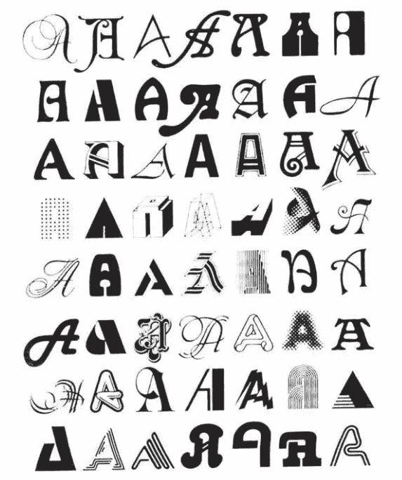
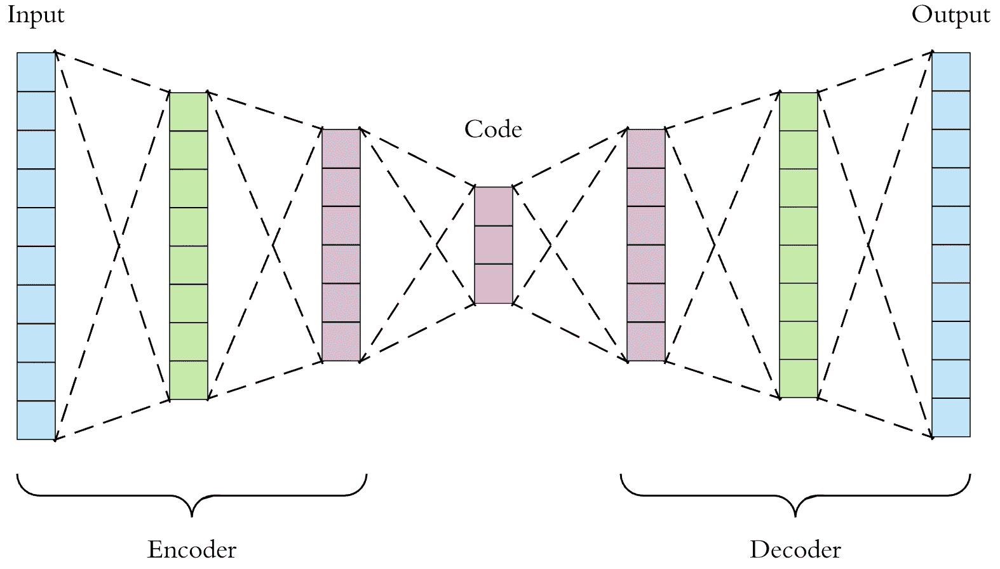
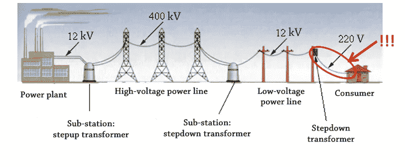
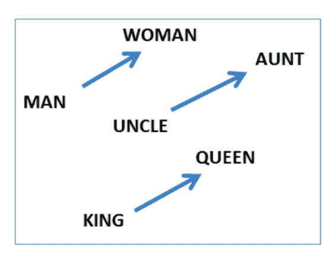

# 概念的概念算法

> 原文：<https://towardsdatascience.com/the-conceptual-arithmetics-of-concepts-9f3e16d18f90?source=collection_archive---------17----------------------->

我最近读的最喜欢的一本书是[道格拉斯·霍夫斯塔德](https://en.wikipedia.org/wiki/Douglas_Hofstadter)的《[表面和本质:类比是思维](https://www.goodreads.com/book/show/7711871-surfaces-and-essences)的燃料和火焰》。在这本书里，作者的中心论点是范畴化是思维的核心，而**类比**是认知的核心。霍夫施塔特的主要论点是，概念不是僵化的，而不是流动和模糊的，也不能严格地分等级。他认为，认知的发生得益于持续不断的**分类**，这与**分类**(旨在将所有事物放入固定和僵化的精神盒子中)形成对比。

What is the essence of the concept of letter “A”? What makes the letter “A”؟

> **概念不像嵌套的盒子**，任何给定的概念都被严格定义为一组精确的先前获得的概念，并且概念总是以固定的顺序获得。(…) **依赖关系是模糊和阴影的，而不是精确的**，在层级结构中没有严格意义上的“更高”或“更低”，因为依赖关系可以是相互的。新概念改变了在它们之前就存在的概念，并使它们得以产生；以这种方式，新的概念被结合到它们的“父母”中，反之亦然。(引自[表面和本质:类比是思维的燃料和火焰](https://www.goodreads.com/book/show/7711871-surfaces-and-essences))

霍夫施塔特还批评说，许多人使用“类比”这个词作为某个非常狭窄的句子类别的名称，看似精确到数学程度，属于以下类别:***“8 对 4 等于 10 对 5”***或 ***“西对东，如同左对右。”如果用一种准形式的符号来写，这看起来更像是一个数学陈述:***

> 西:东::左:右

> 智力测验经常使用用这种符号表示的谜题。例如，他们可能会提出这样的问题:“番茄:红色::花椰菜:X”，或者可能是“球体:圆形::立方体:X”，或者“脚:袜子::手:X”，或者“土星:光环::木星:X”，或者“法国:巴黎::美国:X”——等等。这种形式的陈述被认为构成了**比例类比**，这个术语本身是基于单词和数字之间的类比——也就是说，表达一对数字与另一对数字具有相同比率的等式 **(A/B = C/D)** 可以直接用于单词和概念的世界。**因此，人们可以用自己的话来总结这个类比:类比对于概念就像比例对于数量一样**

> 比例:数量::类比:概念

尽管我们距离智能的一般定义和以流体非刚性方式操纵概念的能力还非常远，但我们仍然可以用一种对解决比例类比有用的方式对概念进行编码吗？

自动编码器是由两部分组成的算法家族:编码器和解码器。编码器将高维数据转换为通常更容易处理的低维表示。解码器将较低的表示转换回原始的高维度。理想情况下，我们会让解码器完全重建原始数据，而不会丢失信息。

> 理想情况下，我们希望有:**解码器(编码器(x)) =x**

Auto-encoder schema. Ideally we would have: Output = Decoder(Encoder(Input)) = Input

我们很容易在自动编码器和调制解调器技术(调制解调器的缩写)之间进行类比。调制器接收数字数据，并在传输前产生具有特定物理属性的信号。另一方面，解调器对接收到的信号进行解码，以再现原始数字数据。

**我们可以清楚地看到，解调器的工作与调制器完全相反。那么，为什么要费心去创造它们呢？**

答案依赖于在中间发送特定信号而不是直接发送原始信号的优点(例如，如果中间的调制信号具有更好的抗噪声能力)。

**噪声(调制器)+噪声(远距离调制信号)+噪声(解调器)< < <噪声(远距离原始信号)**

这个类比也适用于电力领域，在电力领域，电压在被长距离输送之前首先被转换，然后在消耗之前被降低。

> 这种明显无意义且浪费的双重转换(先升压后降压)背后的理由是，由于高压下的电力转换和传输所产生的总损耗远低于直接发送低压所产生的损耗。

**损耗(升压)+损耗(高电压)+损耗(降压)< < <损耗(低电压)**

Electricity is transformed up before being sent over long distances then transformed down for consumption

回到我们的自动编码器，它们遵循相同的逻辑。处理高维数据通常成本很高。这就是为什么我们可以通过训练编码器将数据转换为更容易处理的低维表示来获得好处。当我们完成处理后，我们可以用一种总体处理成本更低的方式恢复到原始表示:

**编码(高维数据)+处理(表示)+解码(表示)< < <处理(高维数据)**

Word2Vec 是一种有趣的技术，可以将自然语言单词转换为密集的矢量表示，同时试图以某种抽象的方式保留单词的“含义”。Word2Vec 通过在多维空间中搜索与每个单词相关联的权重来实现这一点，其方式是保持出现在彼此相同上下文中的单词之间的距离。

Word2Vec 是一个自动编码器，因为我们可以将一种语言中数百万个单词中的每一个编码和解码成几百维的向量。[例如，谷歌设法将 300 万个单词训练成每个单词只有 300 个特征的编码](http://mccormickml.com/2016/04/12/googles-pretrained-word2vec-model-in-python/)！这意味着维数减少了 10 000 倍，处理 300 维的向量比处理 300 万维的向量要有利得多！！！

How every word is encoded by a vector that represents higher meaning

这种矢量表示非常适合回答比例类比问题，其形式为 *a* 之于 *b* 如同 *c* 之于*？*。比如*男*之于*女*就像*叔*之于*？* ( *姑姑*)。我们可以通过使用基于余弦距离的简单矢量偏移方法来实现这一点。Word2Vec 能够以一种令人惊讶的表达方式捕捉单词之间的关系。

> *例如，如果我们将单词* i *的向量表示为* vec(i) *，并关注单/复数关系，我们观察到:* vec(苹果)-vec(苹果)≈ vec(汽车)-vec(汽车)≈ vec(汽车)≈ vec(家庭)-vec(家庭)≈vec(汽车)-vec(汽车)*等等。*

它允许我们对概念执行一些算术运算！我们需要做的就是将单词编码成向量，在向量空间中执行运算(加法、减法)，然后将结果解码回最接近的原始单词等。例如，以下是说明性别关系的三个单词对的向量偏移量:

Vectorial relationship between concepts

[这篇博文](https://blog.acolyer.org/2016/04/21/the-amazing-power-of-word-vectors/)更详细地展示了 word2vec 的强大，并提供了 word2vec 如何解决许多比例类比问题的进一步解释和示例。

Example of arithmetics on concepts thanks to word2vec

也许在图像处理领域中，自然语言的 word2vec 的类似算法是生成对抗网络。这些网络根据(去)卷积矩阵捕获图像中编码的概念。这些神经网络能够捕捉和学习诸如“夏天”或“冬天”等概念的本质，然后可以用于将夏天的图像转换成冬天的图像，反之亦然。

GANs 也是图像处理领域中一种特殊类型的自动编码器。它们由发生器和鉴别器网络组成。生成器的目标是学习如何通过生成我们试图编码的概念的看似令人信服的图片来欺骗鉴别者。鉴别器的目标是学习如何检测真实图像和生成的图像。在训练过程结束时，生成器在其解卷积矩阵中保存成功表示某一视觉概念(根据概率分布)所需的知识。

Generative adversarial network- a different form of auto-encoder

以下是甘力量的一些神奇展示:

GAN 实现冬夏图像转换

另一个很酷的视频展示了甘把一匹马变成了斑马

> GANs 能够创建软件，可以从绘画中生成照片，将马变成斑马，进行风格转换，等等。(检查:【https://hardikbansal.github.io/CycleGANBlog/】T2)

A different level of image processing: conceptual processing. Image courtesy of [https://github.com/junyanz/CycleGAN](https://github.com/junyanz/CycleGAN)

机器学习领域是一个令人惊叹且发展非常迅速的领域。然而，由于其成本和复杂性，在目前的状态下仍然很难使用它。随着时间的推移，我们将拥有越来越多易于使用和预先训练的模型和库，这些模型和库将我们从每次处理大型数据集的负担、复杂性和成本中抽象出来，只是为了捕捉完全相同的概念。

我们可以很容易地想象未来数据和概念之间，以及概念和应用之间的抽象分离。就像石油一样(这将是本文最后一个概念类比)，没有必要让每个行业都建立自己的炼油厂，他们可以购买预精炼油，然后专注于将其直接转化为更高价值的材料。随着时间的推移，机器学习应该从原始数据处理转向更抽象和更高级的概念处理，这种处理依赖于预先训练的数据到概念模型。也许[模型动物园](https://modelzoo.co/)是朝着这个方向迈出的第一步。

*原载于 2018 年 11 月 21 日*[*【medium.com】*](https://medium.com/datathings/the-conceptual-arithmetics-of-concepts-369df29e4e0f)*。*