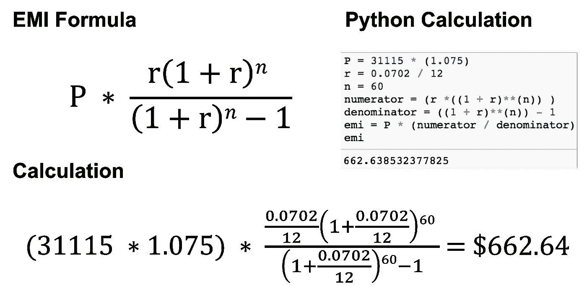
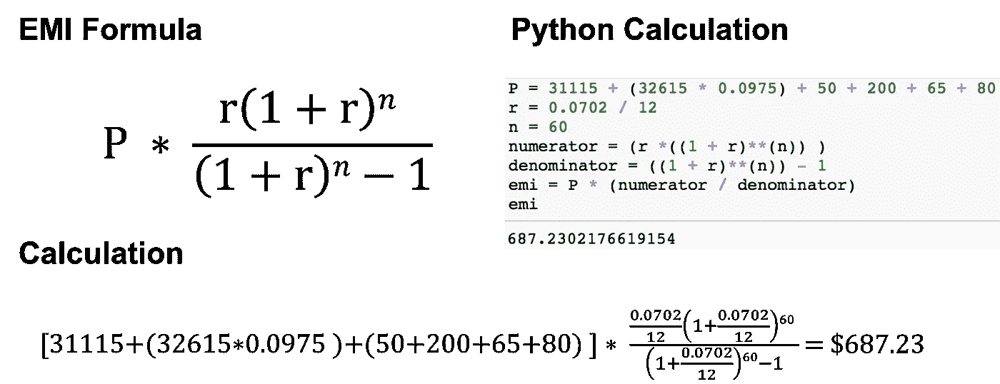
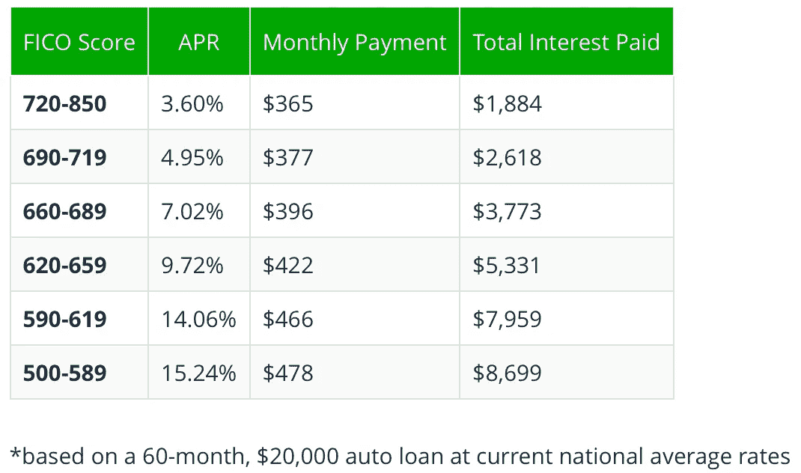
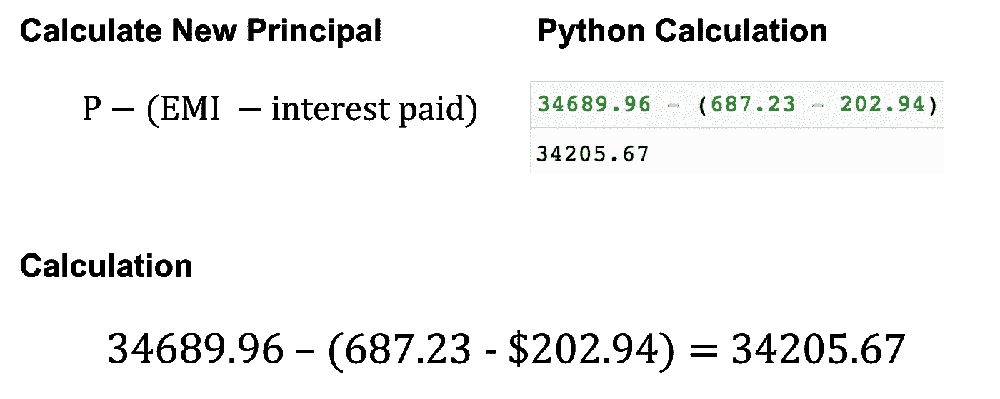
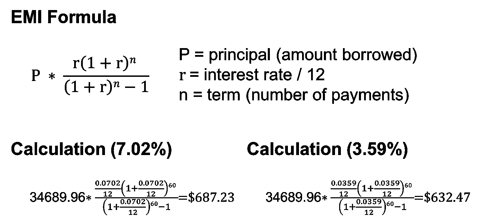

# 汽车融资成本(汽车贷款)

> 原文：<https://towardsdatascience.com/the-cost-of-financing-a-new-car-car-loans-c00997f1aee?source=collection_archive---------7----------------------->

## 了解如何计算每月汽车付款(相当于每月分期付款)。了解利率/年利率如何影响每月还款额，以及贷款期限如何影响支付的总利息。


This tutorial gets into more than how the length of a loan affects monthly payments.

本教程将包括:

*   如何计算每月付款(相当于每月分期付款)。
*   利率/年利率如何影响月供。
*   贷款期限如何影响支付的总利息

和往常一样，本教程中使用的代码位于我的 [GitHub](https://github.com/mGalarnyk/Python_Tutorials/blob/master/Finance/car_loans.ipynb) 上。就这样，让我们开始吧！

# 如何计算每月付款(相当于每月分期付款)

[Investopedia](https://en.wikipedia.org/wiki/Investopedia) 将您的月还款额(也称为您的等值月分期付款(EMI ))定义为借款人在每个日历月的特定日期向贷款人支付的固定金额。等额月供用于每月还清[利息](https://en.wikipedia.org/wiki/Interest)和[本金](https://en.wikipedia.org/wiki/Principal_sum)，这样在一定年限内，贷款全部还清。

每月付款可以使用类似于下面的 EMI 公式计算。


## 示例:计算每月付款(简化)


I want to upgrade my car from a 2002 Toyota Sienna to a 2019 Toyota Sienna.

说我买想买一辆 2019 款丰田 Sienna 31115 美元。我很好奇，如果我决定贷款购买这辆新车，每个月要花多少钱。一家汽车经销商向我提供 60 个月的固定利率 7.02%。假设销售税率为 7.5%，每月汽车付款将是多少？



Note that I rounded up to the nearest cent.

虽然这是一个简化且相对准确的计算(除了销售税是一个假设)，但在下一个示例中有一个更准确的计算。

## 示例:计算每月付款(包括一些费用)

比方说我买我想从洛杉矶一家总销售税率为 9.75%的汽车经销商那里花 31115 美元买一辆 2019 款丰田 Sienna([来源](https://www.bankrate.com/finance/taxes/highest-sales-tax-rates-in-the-country.aspx))。在经销商通过 1500 美元的折扣降低价格之前，价格最初是 32，615 美元。我很好奇，如果我决定贷款购买这辆新车，每个月要花多少钱。一家汽车经销商向我提供 60 个月的固定利率 7.02%。每月汽车付款是多少？

除了计算贷款的本金实际上更复杂之外，这可以通过与上一个示例相同的方式来解决。换句话说，税费需要加在购买价格上。大多数州对购车征税**，然后将折扣或奖励**应用于汽车价格[来源](https://www.edmunds.com/car-buying/what-fees-should-you-pay.html)。虽然费用可能因地而异，但此示例计算的费用如下

排放测试费:50 美元

注册费:200 美元

盘子转让费:65 美元

加州文件费:80 美元([记住有些州收取的文件费要高得多](https://www.edmunds.com/car-buying/what-fees-should-you-pay.html)



这个月付款比前一个例子中显示的要高 24.59 美元`(687.23 — 662.64)`。

# 利率/年利率如何影响月供

在进入这一部分之前，了解一下术语年化利率(APR)是很重要的。对于汽车贷款，年利率是你支付的利息费用加上所有其他费用，你必须支付你的贷款，而利率只占利息费用。虽然你可以在这里了解年利率，但年利率比你的利率高(希望只是稍微高一点)。请注意，尽管 APR 比利率高(假设费用少，通常不会高很多)，但从数学上来说，它们是相同的，因为它们都给你相同的付款。**出于本教程的目的，让我们在数学上更简单些，假设年利率和利率相同**。

通过查看下表，很明显你的 FICO 分数会影响你的 APR，从而影响你的月供。



[Source: The Simple Dollar](https://www.thesimpledollar.com/best-bad-credit-auto-loans/)

如果你想知道简单的美元是如何计算出支付的总利息的，请阅读下一部分。它详细说明了你每月支付多少利息。

## 如何计算支付的总利息

贷款的一个重要部分是知道在贷款过程中你将支付多少利息。这有点复杂，因为用于偿还贷款本金的月供(EMI)的百分比会随着时间的推移而增加。使用来自**计算月供(包括一些费用)**部分的相同本金(34689.96 美元)和利率(7.02%)，下图显示，对于每个后续月供，支付的本金持续上升，而支付的利息持续下降。


Dollars that go towards interest and principal each month from a monthly payment (EMI) of `687.23 with an interest rate of 7.02%`

现在，让我们通过生成一个类似于下面的表来计算支付的总利息，然后对支付的利息列求和。


Notice how much interest and principal are paid each month.

虽然我会用 Python 来做，但也可以用电子表格或任何你觉得舒服的东西来做。

1-)第一件事是计算每月付款中有多少钱将在一个月内支付给利息。


2-)每个月，月供的一部分用于支付本金，一部分用于支付利息。随着本金的降低，为了计算出你接下来几个月要支付的利息，你需要先计算出你的新本金。你可以在下面看到如何计算这个。



3.重复步骤 1 和 2，直到主体达到 0。您可以在下面的 Python 代码中看到这样的例子。

Python Code to Create Payment Table


Notice how much interest and principal are paid each month.

4.得到每个月支付的利息后，对支付的利息列求和。

```
np.round(payment_table['Interest Paid'].sum(),2)
```


## 向较低利率再融资

这个例子看的是一个人在低利率贷款过程中可以少付多少利息(支付的总利息)。特别是，在 60 个月的期限内，3.59%的利率与 7.02%的利率之间的差异。

Code to generate tables of total interest paid for different interest rates

通过使用与上一节相同的计算方法，较低的利率将节省 3285.63 美元的总利息。此外，由于利率较低，月供将减少 54.76 美元`(687.23 — 632.47)`。



如果你可以选择以较低的利率再融资，重要的是要注意，你目前的贷款可能会有提前还款罚款，或者你的新贷款可能会有发起费。换句话说，如果你决定重新贷款，尽你所能去了解你签约的是什么。我应该注意到，Credit Karma 有一个关于为你的汽车贷款再融资的[指南](https://www.creditkarma.com/auto/i/refinance-your-auto-loan/)，NerdWallet 有几个[方法来避免为你的汽车贷款多付](https://www.nerdwallet.com/blog/loans/auto-loans/5-ways-avoid-overpaying-car-loan/)。

# 贷款期限如何影响支付的总利息

**一般来说，在利率相同的情况下，你贷款的时间越长，总利息越多。**比较下面两笔贷款。两者的利率都是 7.02%，但一个期限是 60 个月，另一个期限是 72 个月。虽然 72 个月的贷款月供(EMI)低于 60 个月的贷款(591.76 比 687.23)，但贷款的总利息支付成本会更高。


上图显示，72 个月的贷款总利息成本为 7916.58 美元，而 60 个月的贷款成本为 6543.51 美元(72 个月的贷款成本为 1373.07 美元)。如果你想了解更多关于汽车贷款期限的决定，[埃德蒙兹有一篇很好的文章](https://www.edmunds.com/car-loan/how-long-should-my-car-loan-be.html)。

## 结论

我希望你喜欢这个教程，并获得了汽车贷款如何工作更好的理解。如果你对本教程有任何问题或想法，欢迎在下面的评论中或通过 [Twitter](https://twitter.com/GalarnykMichael) 联系我们。如果你想学习如何使用 Pandas、Matplotlib 或 Seaborn 库，请考虑参加我的[数据可视化 LinkedIn 学习课程](https://www.linkedin.com/learning/python-for-data-visualization/value-of-data-visualization)。