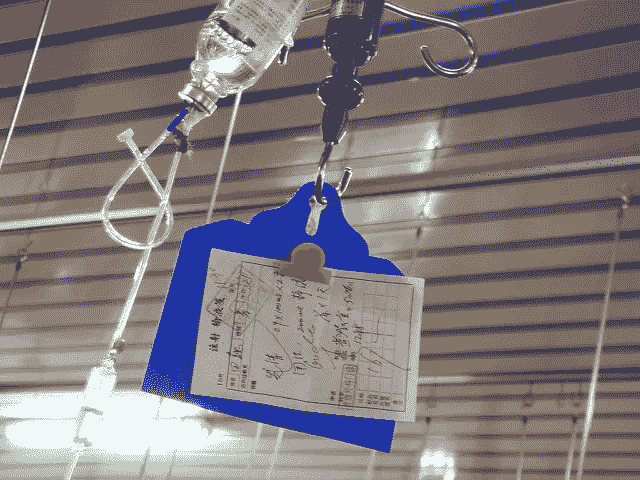

# 人工智能在医疗保健中的危险:风险内稳态和自动化偏差

> 原文：<https://towardsdatascience.com/the-dangers-of-ai-in-health-care-risk-homeostasis-and-automation-bias-148477a9080f?source=collection_archive---------2----------------------->

伦敦肯辛顿和切尔西区的展览路是一些世界上最伟大的博物馆的所在地。但这也是最近城市设计实验的一部分，叫做共享空间。沿着街道的长度，道路和人行道之间的界限已经消失:汽车和行人共享同一空间，道路标记，交通灯和人行横道已经消失。通过增加不确定性和感知风险，这种想法是司机将降低他们的速度，从而为行人和车辆创造一个更安全的环境。

Exhibition Road. Image Credit: [La Citta Vita](https://www.flickr.com/photos/la-citta-vita/7279517670/in/photolist-c6gqZm-5Fmb9m-c6gn9q-haX8Yu-47j9z8-dhzMnp-668LRs-6X4EtJ-dhzMUb-haWZQq-H9dWT-6JsK2-dfc81M-6WZBQv-TS7aRj-eC5dZ1-8vwtzo-8vwuqd-cy9p7f-TS7auC-8vBVVr-8vEXcj-bruwXT-9No2F4-9NqMQ3-pi8XJs-bwmArE-dbGX8C-bDXL9R-JwFfjh-ycNiH-9NnUjX-fgWmLF-dM3TQa-a4UHPX-dbH1m7-cRbF81-6WZG1n-8R5tBL-JQC8hk-8vsCQR-6Qhjmd-9NnXnt-8vw2Hj-kuyibx-973C1u-SoKMFz-8vwgeL-df6bSz-cm151w), via Creative Commons

这种方法基于由荷兰心理学家 Gerald Wilde 在 20 世纪 80 年代首次提出的[风险内稳态](https://www.ncbi.nlm.nih.gov/pmc/articles/PMC1730348/pdf/v004p00089.pdf)理论。该理论基于这样的观察:当一项活动变得更安全时，事故率通常保持不变。强制性安全带降低了事故中受伤的可能性，但是[并没有降低人均死亡率](http://injuryprevention.bmj.com/content/4/2/162.3.short)。带防抱死刹车[的司机更靠近前面的车](https://trid.trb.org/view.aspx?id=634291)。当 1967 年瑞典转向右侧驾驶时，死亡率明显下降，一年半后又回到了原来的水平。人类的冒险行为似乎与感知到的危险程度紧密相关。降低活动的风险感，人们会更大胆。

> "处方数量越多，人们的个人责任感就越弱。"([汉斯·蒙德曼](http://www.spiegel.de/international/spiegel/controlled-chaos-european-cities-do-away-with-traffic-signs-a-448747.html))

风险稳态从一开始就有争议，但是在过去的几十年里，行为适应感知风险的想法已经被科学界所接受。

在某些情况下，将其付诸实践似乎是可行的。在高街肯辛顿的展览路拐角处实施了共享空间方案。对改革前两年和改革后两年的公开数据的分析显示，交通相关伤害减少了 [43%。](https://www.theguardian.com/society/2006/apr/12/communities.guardiansocietysupplement)

## 人-人风险稳态

临床实践中的风险经常被科学的复杂性所混淆。但是临床医生之间风险平衡的证据已经被发现，例如，在最近[对英国重症监护室护士的研究中](http://onlinelibrary.wiley.com/doi/10.1111/j.1365-2044.2006.04858.x/epdf)。在药物分配期间实施的安全措施包括在将药物给予患者之前由不同的同事进行多次交叉检查。虽然护士们接受过双重检查的训练，但是安全措施降低了感知的风险水平，并且在这项研究中，护士们认为不太可能犯错误。

> “我认为在检查药物时，工作人员非常信任彼此，而不是像他们应该做的那样仔细查看处方。嗯，因为他们认为你不会犯错误是理所当然的。[(桑赫拉等人。阿尔，2007)](http://onlinelibrary.wiley.com/doi/10.1111/j.1365-2044.2006.04858.x/epdf)

在他的书《数字医生》中，鲍勃·沃希特讲述了帕布罗·加西亚(Pablo Garcia)的故事，一个年轻的病人服用了过量的 38 倍的抗癫痫药。他描述了尽管在配药前经过了 50 个不同的步骤和多次检查，工作人员还是没能发现处方错误。

Image credit: [Liu Tao](https://www.flickr.com/photos/liutao/514488824/in/photolist-MsTAY-k6a6U-7wnxWM-4tMDXt-76aU9k-7WJwh-92T4Ew-fkSDK-dQE3DT-k8Pqp-9zUj73-8tgf1G-sKS3x-FXkKC-4fzVgW-2EuUiv-7KXXfs-4mbqer-5ePTRp-6C4eEC-9KY9Wj-5xGL92-4pHNDS-TRizic-4HBE9-6ZDBoX-7h9VnM-5UREjz-affsRD-VA2baG-r56Tr2-rpBPDE-7tuNR2-dbJNho-5YKMzZ-6RSUEq-bRitjR-g51Ltb-8ryGD9-7gw2mz-6s1WYR-6yqaht-6tqZAT-6rSdnG-3atJUE-UuK46z-8XoYPg-didX8F-4kxt9i-9WQ3CY), via Creative Commons

处方错误会带来一种动力。错误通过的检查越多，在后续检查中被怀疑的可能性就越小。同样，诊断错误可以表现为 [*诊断动量*](http://www.jabfm.org/content/25/1/87.long) *。*一旦诊断结果在护理团队中传播开来，它就不太可能被质疑，一旦被发现是错误的，就更难被推翻。

## 人机交互:自动化偏差

人类在与执行自动化任务的机器互动时表现出类似的行为，称为自动化偏见:

> 自动化偏差:“*倾向于忽视或不去寻找矛盾的信息，因为计算机生成的解决方案被认为是正确的”(Parasuraman & Riley，1997)*

医学中自动化偏差的研究有着丰富的历史，但随着新的机器学习方法进入临床决策支持，这一研究变得尤为重要。在*这些模型如何*做出决定方面缺乏透明度，这将对赢得临床医生的信任和避免自动化偏差提出挑战。

自动化系统存在于一个范围内，从那些需要人类参与的系统，到人类被排除在任何决策之外的全自动化系统。

完全自动化适用于不需要决策灵活性、失败概率低且风险低的任务。但是对于决策涉及许多变化的变量的动态环境，例如医疗保健，完全自动化很难实现。

当应用于混乱的真实世界临床实践时，系统的性能无疑将具有小于 100%的准确性，因此人类操作员必须知道何时信任，何时不信任系统。我们如何设计人和机器之间的交互变得至关重要，以防止*引入新的*偏差和错误。

风险内稳态表明，临床实践的过度自动化可能会导致自满以及错误和事故的增加。来自其他领域的研究表明，当人类的任务被机器接管时，人类确实会遭受自动化偏见和个人责任的减少。

## 错误行动与不行动

对不完善的自动化系统的过度信任会导致两种特定类型的错误:委托错误*和遗漏错误*。当一个人错误地行动时，就发生了犯错误，当这个人在应该行动的时候没有行动时，就发生了不作为的错误。**

*最近的一项研究使用决策支持系统调查了任务中的这两个错误。当系统提供正确的决策支持建议时，参与者的决策更快、更准确，并且需要更低的认知负荷。但是当系统给出一个错误的建议(“自动化错误”)时，参与者的决策表现下降到接近零。参与者假设系统是正确的，并且犯了*委员会*的错误——他们*错误地执行了* *。*当系统根本没有给出任何建议(“自动化消失”)时，参与者更有可能犯*遗漏的错误——他们*没有在应该采取*行动的时候采取行动。**

*有趣的是，与“自动化消失”条件相比，参与者在“自动化错误”条件下的准确性下降幅度更大。与决策支持系统出现故障并任由我们自生自灭(这里的错误是由于“自动化自满”)相比，我们在使用错误的决策支持系统时会犯更多的错误(自动化偏差)。作者建议，为了避免自动化偏差，决策支持系统应该向用户揭示他们不确定时的低置信度。*

*这种透明度对于设计智能临床决策支持工具至关重要。尽管对机器学习方法傲慢自大，但这些技术仍然会受到误差和偏差(例如[数据集移位](https://mitpress.mit.edu/books/dataset-shift-machine-learning))的影响，这种*必须*传达给临床医生，以避免自动化偏差。*

*自动化医疗保健的一个特殊挑战是[错误经常不被报告](http://www.nytimes.com/2012/01/06/health/study-of-medicare-patients-finds-most-hospital-errors-unreported.html)，并且它们的影响很难测量。随着[基于价值的医疗保健](http://www.huffingtonpost.com/entry/what-is-value-based-care_us_58939f9de4b02bbb1816b892)的出现，护理事件的健康结果也才刚刚开始被跟踪。这意味着，一旦纳入临床实践，智能决策支持系统的正面和潜在负面影响都可能难以识别。这使得我们提前得到正确的设计变得更加重要。*