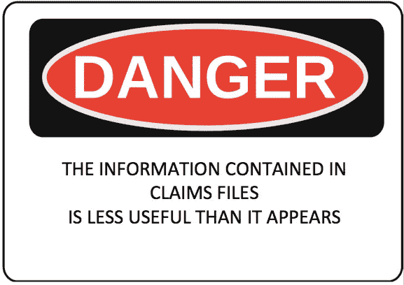

# 基于索赔的索赔的危险性

> 原文：<https://towardsdatascience.com/the-dangers-of-claims-based-on-claims-142fd2c9f7cd?source=collection_archive---------10----------------------->

医疗保健因缺乏采用的数据格式而臭名昭著。一个例外是付款人和供应商之间交换的账单信息。这些文件通常被称为“索赔”由于无处不在，今天的许多分析方法——从流行病学到公共卫生、精算科学、商业智能和风险评分——都严重依赖(有时完全依赖)索赔文件。

索赔文件对于理解所提供服务的数量和金额来说是足够可靠的。然而，人们应该警惕依赖声称来理解某事为什么发生，它是否起作用，或者应该发生什么——事实上，声称不适合回答改进的基本问题。

**首先，关于索赔文件的高级入门知识:**

*   **程序代码**代表医疗专业人员采取的特定健康干预措施。对所提供服务的单位或类型的补偿主要来自这些编码。
*   **诊断代码**(通常称为疾病代码)记录了困扰每个人的疾病、失调或症状。这些代码会影响所执行程序的报销率。
*   **药品代码显示开给患者的药品。这些必须是准确的帐单，但它们不能跟踪病人是否实际服用了处方药物。**

索赔文件旨在支持帐单和随后的报销。他们捕捉什么、如何捕捉，以及这些信息的价值完全是基于这些预期用途而精心设计的。为了获得补偿，索赔文件必须包含证据，证明做了什么以及对谁做的。服务的单元和复杂性也被捕获。不完整地获取这些信息会导致支付困难。虚假陈述会导致审计和法律风险。因此，从事务的角度来看，我们应该对依靠索赔数据来告诉我们发生了什么感到非常放心。

理解事情发生的原因或它是否起作用是另一回事。

没有一个临床医生会求助于索赔文件来理解这些问题。他们知道声明中包含的信息既不可靠也不完整，不足以开始解决这些问题。除了大量关于声明缺陷的研究，每个流行病学家或健康服务研究者都有“声明有问题”的轶事。我第一次感受到主张和现实之间的差距是在我刚获得博士学位时，当时我正与 6 个学术医疗中心合作进行一个结肠直肠癌质量改善项目。像许多改进努力一样，我们的第一步是找到患有目标疾病的人——在这个例子中，是结肠直肠癌。该项目从查询索赔数据中的疾病代码开始。然后，为了验证他们的结果，我们进行了一项图表审查，将病历中的内容与每个患者的 ICD 代码进行比较。

**我们发现 80%的代码指示结肠直肠癌的患者并没有癌症。他们都做过结肠镜检查。**

接下来的几年证实，这种令人恐惧的不准确疾病编码模式更像是常规而非例外。就在最近，我们发现约 50%的心脏病代码是错误的。这并不是改善我们对医疗保健理解的坚实基础。

也有理由相信事情在好转之前会变得更糟。随着人们(和软件)采用国际疾病分类编码第 9 版标准(ICD-9)，疾病编码不正确的问题已经流行了多年，该标准有大约 12，000 个不同的编码。2015 年，CMS 将 ICD-10 作为强制性标准，将可能的代码扩展到 65，000 多个。不用说，我们并不期望因此而提高准确性或一致性。

**那么如何利用索赔来进行改进呢？**

大多数分析方法只是为其他客户重用现有模型。为了使模型可以转移，他们依赖于只索赔的方法，因为这是医疗保健中唯一一致的数据。幸运的是，从技术角度来看，我们已经超越了这一点。或者至少，我们应该是。在大约 20 年的研究中，有几千项研究表明，机器学习+自然语言处理等高级分析方法能够提供更好的能力，最终从所有可用的数据源中获得洞察力。

现在的挑战是，没有人知道如何将这些技术应用到医疗保健的复杂现实中，并从中获得真正的价值。这就是我们开始 [Cyft](http://www.cyft.com/) 的原因——帮助医疗保健组织最终开始从大量尚未开发的数据中学习，并在正确的时间将这些见解应用于正确的人。这是一项棘手的工作，我觉得经过 10 多年的研究和现在的工业应用，我们才刚刚开始触及可能的表面。但我们确实学到了很多，并将通过更多这样的帖子分享真实世界的经验。

我们接下来的几个主题是风险分层，如何评估不同的预测方法，以及如何在复杂的护理管理世界中进行预测。如果你有你认为我们应该涉及的话题或问题，请给我发邮件至 ldavolio@cyft.io 或 [@ldavolio](https://twitter.com/ldavolio) 。

谢谢，莱恩