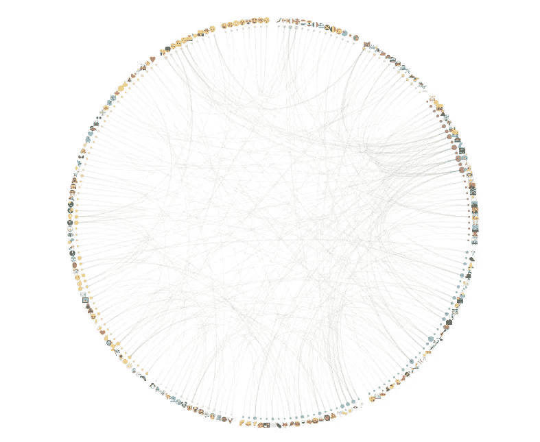

# Twitter 表情符号分析:Airbnb 的故事

> 原文：<https://towardsdatascience.com/the-data-files-twitter-emoji-analysis-987093f9c1ee?source=collection_archive---------4----------------------->

表情符号和数据是我最喜欢的东西，我一直渴望将它们结合在一个有趣的项目中。几周前，当我滚动浏览我的 twitter 信息时，突然有了灵感:

Describe your dream trip in three emojis.

此处见项目[。](https://christinequan.github.io/airtweets/)

# 该过程

## 1.收集数据:

起初我认为抓取会很简单，因为我需要做的只是查询 twitter API。*当然*，有一个端点会给我一条特定推文的回复。但是，唉，事实并非如此。经过几个小时的谷歌搜索和堆栈溢出，我找到了一些可能的解决方案。但是我最后使用了下面的 rscript(在@PRISMOJI 的@HamdanAzhar 的帮助下)

解决方法基本上是获得原始帐户的所有提及。然后用原始的 tweet id 过滤这些提及。最好尽快这样做，因为对于流行的账户，你可能需要收集成千上万的回复才能得到完整的回复。另一个警告是免费的 API 账户目前只允许 7 天前的查询。因此，请务必在一周内收集回复。

## 2.将表情符号翻译成英语:

一旦有了数据，我必须将 unicode 转换成英语，这样我才能更好地过滤和分析数据。虽然有一些 unicode <>英语词典，但我碰巧是在 R 语言和 windows 机器上工作的(所以我要使用一些相当晦涩的编码)。经过几个小时的挫折，我终于找到了一个可行的解决方案。我首先从评论中提取表情符号，因为其中一些也有无关的文字。从那里，我做了一些字符串操作来获得我需要的格式，并使用这本字典来翻译我的表情符号。

## 2.分析和清理数据:

在我翻译完表情符号后，我终于准备好进行分析了。我主要使用 tidytext 库来处理数据集。

我还想对不同的表情符号进行分类。在考虑过写一个分类器(hi scipy)或者使用普林斯顿的 Wordnet(T6)之后，我最终坚决反对这两种方式。这两个解决方案都没有提供我想要的东西，因为我的数据集只有大约 150 个独特的表情符号(按数据集标准来看很小)，我决定咬紧牙关，打开我最喜欢的 Spotify 播放列表，并手工编码我想要的类别。

## 3.将数据可视化

从一开始，我们的主要目标之一就是构建一个自定义的 d3 和弦来可视化表情符号的不同组合。因为这是我第一次建立这种 d3 图表，我有一点需要学习。特别是定位的径向比例，如何将自定义图像(表情符号)附加到 svg，以及如何创建完美的弧线。

在弄清楚所有这些之后，我得出了这个结论(tada！):点击[此处](https://christinequan.github.io/airtweets/)为互动版。

Airbnb Twitter Emoji Chord. See interactive version here: [https://christinequan.github.io/airtweets/](https://christinequan.github.io/airtweets/)

***感谢阅读！如果你对我是如何制作的有任何反馈或问题，请告诉我。请关注我，阅读更多关于数据可视化、迷你教程和我正在从事的各种数据项目的信息。:)***

***婷***