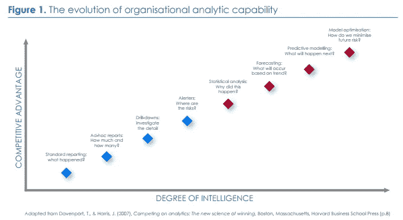
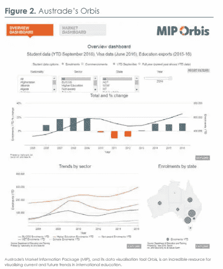

# 数据游戏:在国际教育中建立分析能力

> 原文：<https://towardsdatascience.com/the-data-game-building-analytics-capability-in-international-education-b940f24b13a4?source=collection_archive---------7----------------------->

[ *原载于*[*IEAA Vista 杂志(2016/17 年夏季)*](http://www.ieaa.org.au/news-info/vista-magazine)*——如果你对澳大利亚国际教育感兴趣，我强烈推荐你在线关注他们，阅读他们的出版物！]*

Darragh Murray 写道:*接受分析思维模式并利用大数据时代的技术是实现澳大利亚战略性国际教育目标的关键。*

**预言和少女怀孕的故事**

2012 年，记者查尔斯·杜希格偶然发现了一个关于预测的力量和少女怀孕的有趣故事。杜希格在为《纽约时报》撰写的文章中讲述了一名愤怒的男子如何与美国一家百货商店的经理对峙，要求知道为什么这家零售商一直给他十几岁的女儿送婴儿服装和乳液的优惠券。

“你是想鼓励我女儿怀孕吗？!"愤怒的父亲抱怨道，并向这位不幸的经理赠送了一捆捆与婴儿相关的用品。经理不知道这是怎么发生的，并承诺会跟进此事。然而，当父亲几天后打电话道歉时，调查中断了。他十几岁的女儿确实怀孕了，不知何故塔吉特比她的家人更早知道。

塔吉特怎么可能知道这些？答案是通过精确使用数据和分析。Target 一直在大力投资分析能力，这是一项将数据置于知识发现和交流中心的专业。通过使用预测模型，商店可以根据历史购物模式准确识别潜在的怀孕顾客。

虽然这个轶事既有趣又令人毛骨悚然，但它提醒我们现代行业如何利用大量数据来追求战略商业目标。无论是瞄准期待中的客户，还是使用数据评估国际学生市场的潜力，熟练使用数据正迅速成为企业和组织竞争的资源。

**数据革命**

利用数据解决问题并不是最近才出现的。自 20 世纪 70 年代以来，我们现在所说的数据科学已被广泛用于科学和工程领域，通常用于风险管理和工作场所健康与安全。在 20 世纪 90 年代，当银行和金融越来越多地使用数据监控来打击欺诈和信用卡盗窃时，该领域变得更加活跃。

巨大的计算能力、廉价的数据存储以及现代数据挖掘和机器学习技术的发展最近的融合导致了数据作为一种有价值的日常商业资源的主流化。这一切都以“大数据”的出现为高潮，成为这个国家最新的时髦词汇。

这场数据和分析革命现在被视为现代全球经济持续发展的关键。在他们的优秀作品[*Competing on Analytics*](http://www.amazon.com/Competing-Analytics-New-Science-Winning/dp/1422103323)*，*中，研究人员达文波特和哈里斯认为，数据现在是组织必须用来发现保持竞争力的独特能力的关键资源([参见达文波特 2006 年撰写的这篇 HBR 文章，了解这本巨著的摘要](http://hbr.org/2006/01/competing-on-analytics))。

如图 1(第 18 页)所示，Davenport 和 Harris 提出了组织分析能力的概念，范围从基本的标准报告到高级预测模型，允许数据驱动的预测和风险管理优化。如果您的组织仍然使用简单的标准报告来监控关键指标，您可能已经落后了。

那么，分析革命是如何与澳大利亚国际教育部门交叉的呢？考虑到越来越多的国际流动学生，以及拥有先进教育系统的现代经济体对教授这些学生越来越感兴趣，在分析和数据上竞争的想法非常重要。如果澳大利亚想继续吸引最优质的国际学生，那么在竞争对手之前了解更多潜在的国际学生是有意义的。

在数据和分析方面最具竞争力的教育提供商将在未来获益。澳大利亚的国际教育部门幸运地拥有一个比较优势:我们有大量高质量的学生数据，而其他市场似乎没有。

**澳大利亚的比较数据优势**

澳大利亚拥有世界级的国际学生数据。移民和边境保护部(T1)(DIBP)等政府机构定期发布关于 T2 学生签证申请和批准率(T3)的详细而及时的统计数据，以便对未来的需求进行分析。同样，[教育和培训部](http://www.education.gov.au/) (DET)提供了关于[国际学生注册和毕业典礼](http://internationaleducation.gov.au/research/International-Student-Data/Pages/default.aspx)的有价值的信息，这些信息可以通过国际教育所有部门的众多指标进行细分。

[在线数据门户，如 uCube](http://highereducationstatistics.education.gov.au/) 允许进行详细的本地竞争对手分析和基准测试。[澳大利亚市场信息包](http://www.austrade.gov.au/Australian/Education/Services/Market-Information-Package) (MIP)是国际学生数据可视化领域的全球领导者，它提供了一个集成的商业智能平台(见图 2)，使机构和企业能够在不进行大规模 IT 基础设施投资的情况下分析澳大利亚国际学生市场。

这些例子甚至没有考虑到澳大利亚国际学生群体的无数其他私人组织信息来源，这些信息可以整合到这些强大的公共来源中。

这种最新的综合数据来源在其他国际学生竞争市场中并不明显。例如，美国依赖于国际教育研究所发布的“开放门户”,而英国的高等教育统计机构(HESA)提供了一些关于全体学生的广泛细节。

虽然这些服务无疑是方便的，但它们似乎没有澳大利亚行业所享有的专业、集成或灵活的数据分析平台。他们还可能缺乏及时的更新或难以提取和分析的数据。

声称澳大利亚是国际学生数据的市场领导者不是没有道理的。问题是，我们如何利用这些数据集来推进澳大利亚的国际教育部门？

**构建分析能力:数据驱动的思维模式**

可靠的数据和全面的分析支持良好的商业决策。正如达文波特和哈里斯所断言的，在竞争对手连枷的特定市场中取得成功的组织，几乎肯定是通过使用分析和数据来推动其战略商业决策而取得胜利的。

鉴于澳大利亚令人羡慕的国际学生数据资源，改变心态和一些创造力可能是开始取得巨大竞争优势所需的一切。让我们看几个例子。假设你正试图决定是否进入国际学生市场。“直觉”反应可能是根据你在媒体上读到的内容、你信任的同事的推荐或你的组织以前的经验来证明你的决定是正确的。

分析、数据驱动的思维模式要求更多。一个好的起点是测试相关数据集中的关键影响变量。你能仅凭数据找出其他成熟市场中历史上影响增长的因素吗？在这种情况下，国内生产总值或奖学金等变量有影响吗？在可用的数据中找到这些问题的答案有助于增强对某项建议的信心，也有助于制定更好的战略计划。

此外，数据熟悉对于构建分析能力至关重要。IBM SPSS、Tableau 或 TIBCO Spotfire 等数据挖掘和可视化工具有助于理解支撑数据集的自然关系。聚类是一种根据自然属性将数据组织成不同组的技术，在揭示洞察力方面非常有用。

这种高级别的分析能力意味着进入预测模型领域。这包括检查数据集中的历史模式，以帮助对未来做出明智的预测。预测建模利用机器学习技术，如分类、神经网络和逻辑回归。

使用这些技术可以让国际教育机构有能力计算国际申请结果概率，甚至是当前学生第一年是否会通过或失败。在澳大利亚的国际教育领域，预测模型具有难以置信的价值和无数的用途。

这里要传达的信息是，紧迫的业务问题应该通过从直觉转向分析来解决。拥抱分析思维，利用大数据时代的技术，可能是推进澳大利亚战略性国际教育目标的关键。

**信号和噪音**

澳大利亚在其“[2025](http://internationaleducation.gov.au/International-network/Australia/InternationalStrategy/Pages/National-Strategy.aspx)国家国际教育战略”中制定了一个大胆的三大支柱议程。该战略中设定的许多目标，尤其是支柱三“全球竞争”中设定的目标，可以通过提高我们的集体分析能力和接受数据驱动的决策思维模式来进一步实现。具有竞争力的现代组织投资于先进的分析能力，使用数据挖掘、聚类和预测模型等技术和方法来更好地理解和解决关键的战略问题。

澳大利亚国际教育部门也不能幸免于这些发展，总有一天，我们将需要依靠我们的比较数据优势来保持领先于竞争的国际教育中心。我们有原材料，这只是一个建立在这些基础上的案例，以提高行业的集体分析能力，并在竞争中保持领先地位。

**给它你最好的数据集**

增强组织分析和构建数据知识并不仅仅是获取数据集并希望得到最好的结果。以下是关于分析职位上的人如何帮助他们的组织利用数据做更多事情的三点建议。

**关注过程和最终目标**

正确地做数据需要时间、精度和目的。同事可能没有意识到组织和操作数据可能有多复杂，并且在请求他们做出决策所需的数据时，不会主动满足他们的所有业务需求。在任何基于分析的项目之前，你越严格地收集需求，对你和你的组织就越有利。如果你被要求做数据分析而没有一个可靠的战略理由，你只是在浪费时间。

**一些核心技能可以走很长的路**

基本的统计技巧对理解数据的形态很有帮助。学习如何编制五个数字的统计摘要，了解不同的平均值测量方法，如中位数和平均数，并掌握离群值的概念。这些都是理解数据的关键技能。将数据转化为有意义的见解需要时间，并且需要良好的数据处理技能。能够使用关系数据库甚至良好的电子表格技能来组织信息，可以让你在数据游戏中走得更远。

**沟通是关键**

即使你是人类已知的最伟大的统计学家或数据科学家，如果你不能正确地传达洞察力，它也毫无价值。能够简洁而有目的地书写数据——以及熟练地使用有意义的数据可视化——将为增加高管支持和提高组织分析能力做出更多贡献。通常，在交流数据时，越少越好。

**数据来源**

【www.education.gov.au/higher-education-statistics 号

【www.education.gov.au/ucube-higher-education-data-cube 

www . austrade . gov . au/Australia n/Education/Services/Market-Information-Package

[www . border . gov . au/about/reports-publications/research-statistics/statistics/留学澳大利亚](http://www.border.gov.au/about/reports-publications/research-statistics/statistics/study-in-australia)

其他链接

*   [在 Twitter 上关注我](http://twitter.com/dbfmurray)
*   [或者在 LinkedIn 上关注我。](http://www.linkedin.com/in/darraghmurray/)