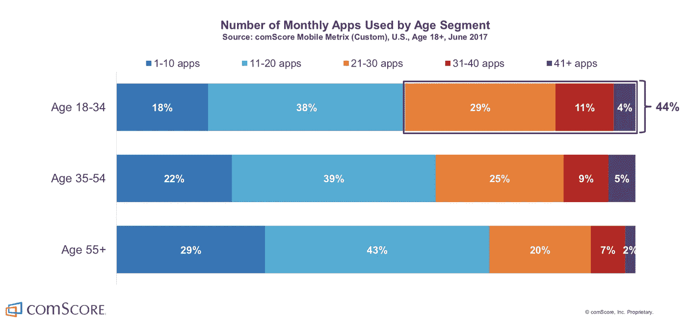
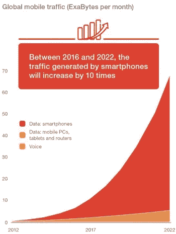
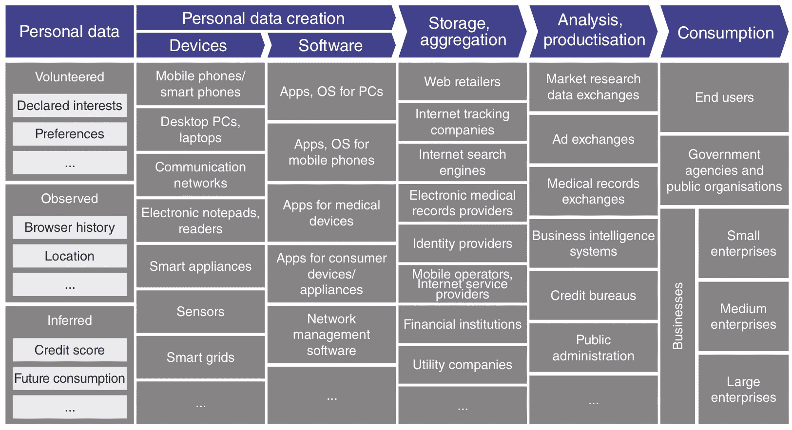

# 数据革命公式

> 原文：<https://towardsdatascience.com/the-data-revolution-formula-c59453b946f6?source=collection_archive---------8----------------------->

数据不代表钱。数据意味着赚钱的机会。钱不代表数据。金钱意味着购买数据的机会。

今天，有许多用户和应用程序产生大量数据。让我们称他们为“数据生产者”。另一方面，一些公司使用数据来改善业务，而其他许多公司则渴望获得这些资产。让我们称他们为“数据消费者”。在中间，一大群人正在从原始和无意义的数据中提取价值。我们称他们为“数据科学家”。

关于当今数据生态系统的一些统计数据:

*   25 亿活跃智能手机用户
*   500 万可用的移动应用
*   690 万机器学习开发人员和数据科学家
*   每年在数据上花费 2500 亿美元

它看起来很有前途，感觉这是一个坚实的行业，但…

*   用户无法控制他们的数据，包括他们的私人信息
*   应用程序不使用数据来赚钱(除了“幸运的”1%以外的其他人)
*   数据科学家无法访问开放和多样化的数据集
*   只有一群巨大的公司(有着巨大的钱包)才能获得这种宝贵的资源

数据科学家和数据消费者需要能够在他们收集的数据和这些数据的用途方面具有创造性。今天，由大公司决定收集什么和不收集什么。

我们正处于数据革命的早期，我们有很好的机会做正确的事情——连接参与者并释放资产以[创造一个更美好的世界](https://medium.com/@bryantafel/changing-the-world-one-app-at-a-time-169605a51091)……而不是将这个庞大的业务留在少数几家公司手中，这些公司控制着从用户隐私到开发者信仰的一切。

# **应用程序使用情况**

大多数应用程序用户在一个月内访问 20 个不同的应用程序，每天使用它们的时间超过 2 小时。

[comScore Mobile Matrix Report](https://www.comscore.com/layout/set/popup/Request/Presentations/2017/The-2017-US-Mobile-App-Report?logo=0&c=1?utm_campaign=CONFIRMED_OPT_IN_AUTO_RESPONDER_ALL&utm_medium=email&utm_source=comscore_elq_OPTIN_CONFIRMATION_CONTENT_ALL_AR)

这意味着在数字媒体上投入了数十亿小时，因此这些应用程序产生了数万亿字节。但这仅仅是开始。智能物体(又名“物联网”)大规模集成到我们的日常生活中，将大大增加应用程序的使用，从而产生字节数。

[Ericsson Report](https://www.ericsson.com/en/mobility-report/future-mobile-data-usage-and-traffic-growth)

正如您所看到的，数据量正在以惊人的速度增长，但我们还需要讨论正在收集哪些数据点，以及倾斜数据集可能会产生什么后果。

# **数据偏差问题**

最近有几个公开案例，其中人工智能系统犯了愚蠢的错误，对公众舆论产生了巨大影响，促使媒体关注诸如人工智能的偏见问题等问题。

但问题不在于这些复杂软件的智能，而在于用来供给它们的数据。这些原始数据是实现学习和得出兴趣、行为和趋势结论的机制。

众所周知，可用于训练机器学习模型的数据越多越好。有了更多的数据，就可以实现更高的准确性，并且可以将异常与所描述的“现实”分开。但是准确不代表客观。微软的 Tay bot 非常迅速、精确、准确地了解到“[里奇·格威斯从无神论的发明者阿道夫·希特勒那里学到了极权主义”。](https://www.nytimes.com/2016/03/25/technology/microsoft-created-a-twitter-bot-to-learn-from-users-it-quickly-became-a-racist-jerk.html)

问题不在于 Tay 和她的人工智能实现，而在于提供给她的数据。在处理数据时，尤其是在深度学习模型中，您可能会有一个存在本质缺陷的大型数据集，因为数据不完整，不包含关于特定群体的数据，无意或有意地强化了刻板印象，或者包含导致模型获得“错误”知识的其他问题。

# **数据经纪业务**

数据经纪人是收集、分析和出售用户信息的公司。这可能包括个人信息以及人口统计数据、预期行为、兴趣和购买意向。这些公司是中介机构，他们从跟踪公司、调查营销人员和零售商那里购买你的数据，应用一些剖析智能；然后将结果卖给广告商、保险公司、银行或其他有兴趣更多了解你的实体——甚至试图操纵你。

如果你，作为一个普通公民，想获得他们关于你的数据，你可以试试这些被描述得很漂亮的方法[(祝你好运！).但是如果你想知道到底是谁在购买你的数据，那么即使是好运也帮不了你。](https://www.propublica.org/article/how-to-wrestle-your-data-from-data-brokers-silicon-valley-and-cambridge-analytica)

如果你，作为一名自由职业者、应用程序开发人员、出版商或小公司，想要获取用户数据，比如说，了解你的应用程序的访问者并改善用户体验，你只能选择从诸如 [Pipl](http://pipl.com) 、 [DataFinder](http://datafinder.com) 、 [TowerData](http://TowerData.com) 或 [ClearBit](http://ClearBit.com) 等网站购买人口统计数据和静态数据。因为如果你想接触 Acxiom、Lotame、Nielsen、Oracle Cloud Data 或 Equifax…祝你好运！他们忙着一年赚 2500 亿美元，没时间接你的电话。

# **个人数据资产**

您的个人数据具有价值。句号。公司付钱给你——或者你的“同类”——来做特定的广告。其他人付费是为了更多地了解你的购买记录，以评估向你提供信用卡等产品的风险。

如果你想对你的数据价值有一个粗略的概念，试试《金融时报》发明的这个计算器。

早在 2011 年，世界经济论坛就宣布个人数据是一种[新资产类别](https://www.weforum.org/reports/personal-data-emergence-new-asset-class)，称其为“21 世纪的宝贵资源，将触及社会的方方面面。”他们制作了这张伟大的表格来展示经济价值链:

每个盒子里都有许多公司，它们通过生产你的个人数据并从中获利，创造了一个富裕的生态系统。让我们同意经济学家[的观点，把你的数据称为‘新石油’。所以我们应该说，有一个完整的行业提炼、分离、转化和处理你的原油，然后作为燃料出售。但是，当然，在这种情况下，作为原油供应，你什么也得不到。](https://www.economist.com/leaders/2017/05/06/the-worlds-most-valuable-resource-is-no-longer-oil-but-data)

# **公式**

所以我们希望人们能够控制他们产生的数据。我们希望应用程序所有者在不损害用户体验或隐私的情况下从他们的应用程序中赚钱。我们需要数据科学家来处理从应用程序中提取的数据资产；我们需要数据消费者透明、公平地访问这些原始或处理过的资产。

但我们也要看到这个流程:(用户->应用->DS->DC)反过来(DC->DS->应用->用户)。如果数据消费者或数据科学家可以提交请求，从应用程序/用户那里收集或生成特定类型的数据，会怎么样？

如果我们停止这种集中的数据经纪业务，允许任何人公开购买和请求数据，会发生什么？如果这种请求出现在数百万应用程序所有者和发布者的视野中，并且他们与他们的用户一起共同制作所请求的数据，会发生什么？

通过在应用程序开发人员和数据消费者(以及他们的科学家)之间建立直接联系，可以释放数据收集方面的创造力——既来自应用程序开发人员(“等一下，我也可以跟踪这个东西！”)和数据消费者(“如果我能找到这个用户子集就好了……”)。

**我们谈论的是全球数百万数据消费者，他们与数百万数据科学家合作，连接到数百万应用程序，访问数十亿用户。这是我们改变这个行业的公式。**

# **大团圆结局**

我是一个应用程序，我从与我的用户(伟大的普通公民)共同制作的数据中获得报酬。

我是一名数据科学家，可以访问全球数百万数据集，这些数据来自多个用户，他们知道我在使用他们的数据作为无偏见的来源，来支持我的机器学习模型。如果我还需要什么，我可以要求它(甜！).

我是数据消费者，无论是小型、中型还是大型(谁在乎？)并且我可以访问多个数据集、见解、原始数据或任何其他形式的可用数据。

## 我是一名普通公民，我拥有并控制我生成的数据。