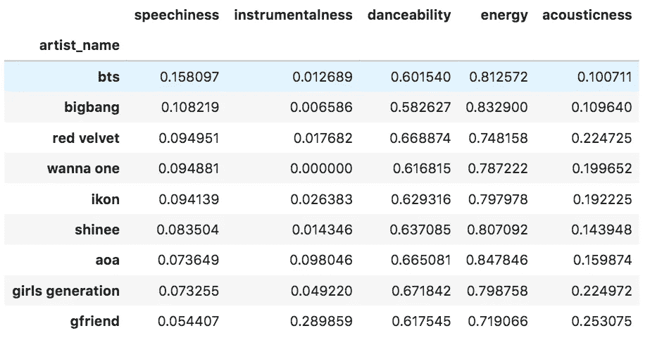
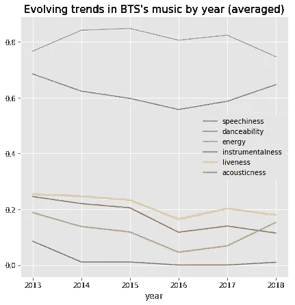
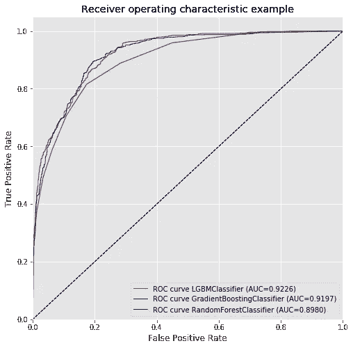
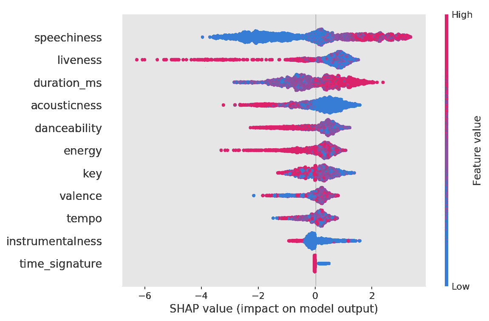
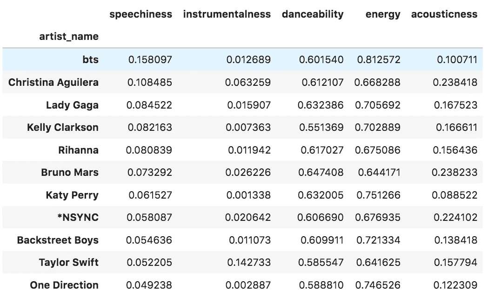

# K-Pop 的数据科学:通过数据和人工智能理解 BTS。

> 原文：<https://towardsdatascience.com/the-data-science-of-k-pop-understanding-bts-through-data-and-a-i-part-1-50783b198ac2?source=collection_archive---------0----------------------->

> 通过数据科学理解 BTS 热潮。

# 介绍

BTS (Bangtan Boys)是一个毫无疑问是国际轰动的 K-Pop 组合。一周前，成员们的脸被登上了《时代》杂志的封面，其他著名的媒体机构如艾伦和英国广播公司也一起受到了关注。

随着这一群体的突然崛起，自然产生了理解这一切的愿望，尤其是在西方。是什么让这个团体如此值得关注？鉴于韩国有数百名歌手(更不用说西方歌手)，是什么让他们与竞争对手相比如此独特呢？

同样的媒体也试图回答这些令人困惑的问题。提供的答案包括:

1.  成员“完全理解团队的价值观”——[时间](https://www.youtube.com/watch?v=6QK-HR7xfEA)
2.  “高品质的音乐”——[Kpopmap](https://www.kpopmap.com/5-reasons-why-bts-is-different-idol/)
3.  努力工作的儒家价值观— [心理学家手表](https://www.youtube.com/watch?v=26IaIL_RLOE&t=452s)
4.  “情感共鸣，真心诚意，粉丝大军。”— [Vox](https://www.vox.com/culture/2018/6/13/17426350/bts-history-members-explained)

# 问题是

这些解释的问题在于，它们中的大多数并不真正令人信服。他们可以很容易地应用于另一个著名的韩国男孩乐队 say BigBang，该乐队也被认为是“音乐多样性[和]不符合规定”，同时“仍然保持独特的身份”(Mithunonthe，2012 年)。此外，这些说法没有任何科学调查的支持，仍然只是没有任何真正的批判性验证的话。

这是本文旨在解决的问题，通过使用机器学习和人工智能中最新的数据科学技术，科学地回答群体的真实身份问题。

这是关于 K-Pop 和数据科学的两部分系列的第一部分。在第二篇文章中，我将研究 K-pop 的歌词，探索数据科学技术如何对 BTS 歌词进行定量分析。

> 重要说明:本文面向更广泛的读者。因此，我不会花时间解释我使用的工具的技术细节，而是直接进入可解释的结果。整个作品可以在我的 [Github](https://github.com/haebichan/kpopclassifier) 上找到。

# 方法论

## 数据分析:获取和分析数据

在第一部分，我探索了 BTS 的一个明显的方面:他们的音乐。我进入 Spotify 的 API，它给了我每首 BTS 原声带的 11 种音质。这些品质从数学上衡量了每首歌的音质、舞蹈性、乐器性等的数值水平。这些计算不是我自己的，而是 Spotify 的内部算法。

numeric breakdown of every single BTS song.

基于这张[20 大艺人排行榜](https://www.koreaboo.com/lists/20-popular-kpop-groups-korea-right-now/)，我收集了 BigBang 和 Twice 等其他 K-Pop 组合的数据。总的来说，我总共有 2673 首 K-Pop 原声。用几行代码，我提取了一些关于 BTS 音乐的有趣的数学特性。

这些数字代表了我们数据集中每首 K-pop 歌曲的每个音乐特征的平均值。我们在这里看到，平均来说，BTS 的歌曲的`speechiness`水平最高，几乎是其他艺人的三倍。`Speechiness`是检测音轨中的口语单词，与`instrumentalness`相反:衡量音轨是否包含人声。难怪 BTS 的歌在后一项指标上相对较低。事实上，看看下面的图表:

-

我们在这里看到，自 2013 年(该集团首次亮相)以来，`liveness` `danceability`、`speechiness`和`acousticness`的测量值都逐渐下降，直到 2016 年，这些数字开始回升。匡威，`energy`在他们的跟踪中增加，直到 2016 年的同一年，数量开始下降。

-

单看`speechiness`，BTS 的*更不用说*了，有 0.90 的最高等级之一！如果你看看下面的音乐视频，你会发现这首歌是流行、嘻哈和说唱的混合，导致歌曲中的人声比例很高。

艺术家之间的视觉比较对于我们解决群体身份和独特性的问题也是有用的。

上面的分布图展示了一条有趣的信息。BigBang 和 iKon 的音乐通常围绕特定的节奏(分别为 125 和~90)，而 BTS 的音乐则更多地分布在节拍中。这表明 BTS 的音乐在节奏和速度上是多样化的，包括节奏极快和极慢的歌曲。

我想听听自己的感受，速度有多大的不同。节奏最慢的 BTS 曲目是 *Butterfly* ，这是一首民谣-EDM 混合曲目。包含最快节奏的曲目之一是 MAMA，它倾向于直上嘻哈。

Not the original for ‘MAMA’. Couldn’t find it on Soundcloud.

-

iKon 与 BTS 的比较尤其相关，因为他们也是一个流行/嘻哈混合组合(BigBang 也是)。但是他们的歌曲平均来说要慢得多，像*欢迎回来*就徘徊在 90 度的节奏线上。我的数据显示，他们最快的音乐要么是混音，要么是原版的现场演唱会版本。

## 数据建模:计算数据(通过人工智能)

有了这些数据中不可预测性较低的确定性数字(不像用户行为数据)，机器学习算法就可以相对容易地了解哪些音乐属性对于区分一个 K-Pop 团体和另一个团体是重要的。因此，我建立了一个简单的分类器，机器学习模型将学习这 11 个音乐特征，并尝试预测这些歌曲是否来自 BTS。

-

对于更具技术性的观众，我使用了 LightGBM、梯度增强和随机森林的集合模型，采用一个 v-all 方法，其中当特征对应于 BTS 歌曲时，目标标签为 1，否则为 0。在没有任何模型优化或特征工程的情况下，三款都在 AUC 的 **0.9** 附近。过采样被用来对抗阶级不平衡。

-

这些机器的输出与我们了解 BTS 区别于其他 K-pop 艺人的重要特征非常相关。因此，下面的图表是我们最初问题的答案！

**如何阅读 SHAP 值图表**:SHAP 值是一个数学计算，根据 11 个特征，计算每个特征对我们的机器预测一个音轨是否是 BTS 的贡献。

这些特征在左侧 y 轴上的等级越高，它们对模型预测的影响就越大。对模型输出的正面和负面影响的大小通过点从中心的分散程度来显示。正面影响是指对 BTS 预测的影响，负面影响是指对其他方面的影响。

图表中的蓝色和红色表示特性的值。例如，红点代表`speechiness` 的较高等级，蓝色代表该特性的较低值。

综合这些信息，上图显示`speechiness`是模型预测最重要的特征。`speechiness`水平越高，宋对我们机器预测 BTS 的影响就越大。

## 美国艺术家呢？BTS 对布鲁诺·马斯

我决定通过比较 BTS 和欧美流行音乐人来进一步分析。在收集了凯莉·克莱森、单向乐队和布鲁诺·马斯等艺术家的音乐数据后，我让我的模特们试着从 BTS 的音乐中辨别出他们的音乐。我收到了以下结果:

再次在特性重要性上排名第一，尽管影响的大小似乎比以前的结果更加平衡。有趣的是，`energy`并不像活性一样是一个重要的预测因素。然而下面的图表显示 BTS 的歌曲在他们的能量水平上排名更高。同样值得注意的是，与其他西方艺术家相比，BTS 歌曲在`acousticness`排名倒数第二。

# 结论

通过数据科学中的技术，我们发现了 BTS 特有的音乐品质，以及它们如何影响我们的机器学习算法提供的结果。

我们发现了一些东西:

1.  与其他男性流行歌手相比，BTS 的歌曲非常多样化，节奏分布也很均匀，尤其是那些融合了流行和嘻哈的歌手。
2.  平均而言，BTS 歌曲的音轨中人声比例较高，乐器比例较低。
3.  平均而言，BTS 的歌曲比西方流行歌手更有活力。他们的音乐在声学测量方面也相当低。

如果你喜欢《韩国流行音乐与数据科学》的第一部分，请继续关注第二部分，在第二部分，我将研究韩国流行音乐的歌词，看看我们是否能得出与 BTS 相关的同样有趣的见解。

与此同时，请随意查看我关于流行音乐和人工智能的另一篇文章。在那里，我展示了我如何制作一台可以自己创作流行音乐的机器！

 [## 制作音乐:当简单概率胜过深度学习

### 概述:我如何发现一个使用深度学习制作音乐的问题，并通过创作自己的原创来解决它…

towardsdatascience.com](/making-music-when-simple-probabilities-outperform-deep-learning-75f4ee1b8e69)