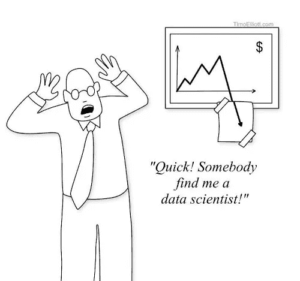

# 没有数据的数据科学家！

> 原文：<https://towardsdatascience.com/the-data-scientist-with-no-data-2750896fb559?source=collection_archive---------9----------------------->

source: [unsplash.com](https://unsplash.com/photos/Cuujm8Yad7A)

# 摘要

*   统计学家/护士的历史。
*   一个当今数据科学家工作生活的故事。
*   对未来数据科学家的猜测。

## 首先，一个历史故事:

1854 年 11 月，佛罗伦萨·南丁格尔在克里米亚战争期间来到斯库塔里当护士。她从小就有数学天赋。在战地医院，她面临着苦难、痛苦和混乱。

> “受伤的士兵往往带着伤寒、霍乱和痢疾等疾病抵达。死于这些疾病的人比死于受伤的人多。”( [1](http://nationalarchives.gov.uk/education/resources/florence-nightingale)

白天她是一名护士，晚上她有另一项任务——她被称为“拿灯的女士”。她正在收集数据，分析士兵死亡的原因。当她回到伦敦时，她将数据可视化，并开始了提高意识的活动。她根据数据表明，士兵受伤并不是死亡的主要原因。她于 1859 年在查塔姆建立了陆军医学院，并继续为她的事业做出贡献。她个人的痛苦和苦难是可以想象的，但她通过利用数据为人类服务。

source: [researchgate.net](https://www.researchgate.net/figure/Multicomparative-polar-area-diagrams-Florence-Nightingale-Diagram-of-the-causes-of_fig16_45858111)

# 第二，今天的一个故事:

今天的数据科学家的故事有点像夜莺的工作——特别是在迫切需要了解士兵情况的同时缺乏数据。今天，并不是所有的数据科学家都拯救生命，但实际上很多人都这样做了！

今天的许多数据科学家很可能会欢迎更多的数据、数据流、数据源、数据基础设施和数据工程支持。然而，他们被要求提供更好的见解、模型、推论、可视化，并提供决策咨询。

数据科学家常常感到沮丧，不是因为模型在生产中不起作用，而是因为数据源不可用——尤其是在现在的 GDPR 时代，这种情况会变得更糟。

这种情况有一个共同点，即缺乏对数据科学的理解。决策者不理解数据科学不仅仅是软件编程(还没有！)和模型不仅仅是生产中的源代码管道。

许多公司希望变得数据驱动、现代化和敏捷。因此，他们雇佣了一名数据科学家，或许还有一名数据工程师。这是在收集数据、准备数据基础设施、启用数据工程以及了解未来的数据驱动型业务问题和策略之前完成的。压力的螺旋上升最终落在了数据科学家身上，他的手被束缚住了，而期望值却在继续增长。一个简单的谷歌搜索“为什么数据科学家”会建议你用“离开”这个词来完成句子。有希望看到有一天这个建议变成积极的东西。

source: [timoelliott.com](https://timoelliott.com/blog/quick-somebody-find-me-a-data-scientist-jpg)

对于有抱负的数据驱动型公司，成功实现数据驱动型转型的建议步骤如下:

1.  成熟，还是拥抱，DevOps 转型( [DevOps:做还是不做？先关注文化！](https://www.linkedin.com/pulse/devops-do-focus-culture-first-agron-fazliu) ) —这是文化、管道、数据管理使然！
2.  推出符合 GDPR 标准的数据湖—用于存储和实验！
3.  集成数据工程能力—雇佣数据工程师或数据运营！
4.  收集数据时要考虑合规性和 GDPR —这是显而易见的，但也是全新的！
5.  雇一个数据科学家！

# 第三，对未来的猜测:

随着计算能力和服务通过云提供商成为商品，有理由认为数据科学也将商品化。这个百万美元的问题是:在什么样的法律平衡数据约束下，数据科学将成为 DSaaS(数据科学即服务)？

这种平衡需要考虑以下因素:

*   数据收集 GDPR 影响(目前在美国更容易处理，在欧盟更难)。
*   数据匿名化最佳点(最终，数据科学并不致力于完全匿名化的数据，尽管它适用于一些用例，例如基于家庭人口统计的洞察，同时匿名化人们的 UID、姓名和姓氏)。
*   机器学习模型(甚至统计模型)的合法更新，以跟进用户 GDPR 的同意。这是指 GDPR 后来同意退出(在最初同意之后)。并非每个退出案例都会影响您的模型，但是，有一个点，过多的退出会影响模型，需要以反映法律要求的频率进行更新。
*   数据所有权和信任(您在云和应用数据科学上的原始数据会发生什么？服务提供商会为了自己的利益从你的数据中推断和学习吗？您的数据会成为提供商方面更广泛的数据科学活动的一部分吗？等等。)

虽然目前许多组织内部都有数据科学家，但将来可能就不是这样了。有可能，名字会改成机器学习工程师(或者类似！)知道如何使用 DSaaS，并对算法有足够的理解，能够知道输入什么和如何解释输出。核心数据科学家将在 DSaaS 公司工作，那里有大量数据科学进展。

好消息是，数据科学家将处于大量数据可用的情况，云基础设施将会成熟。他们的主要工作将是扩展算法，挑战技术上可能的边界。

source: [constantcontact.com](http://archive.constantcontact.com/fs021/1101653964313/archive/1102495372319.html)

总会有疯狂的数据科学家在地下服务器机房工作，也许使用怪异的数据集。