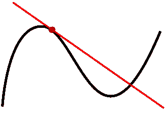
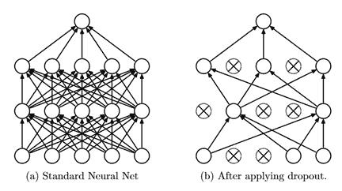
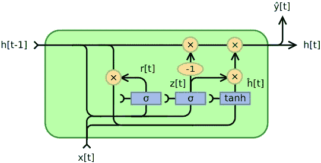
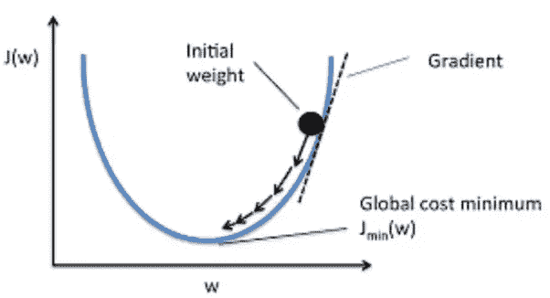
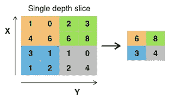
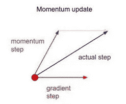

# 深度学习(。人工智能)词典

> 原文：<https://towardsdatascience.com/the-deep-learning-ai-dictionary-ade421df39e4?source=collection_archive---------1----------------------->

## 有没有努力回忆起亚当、雷鲁或 YOLO 的意思？别再看了，看看你掌握深度学习所需的每一个术语。

在 Coursera 深度学习的世界中生存意味着理解并在技术术语的丛林中导航。你不是💯%确定 AdaGrad、Dropout 或 Xavier 初始化意味着什么？当你偶然发现一个你安全地停在脑海深处一个积满灰尘的角落里的术语时，用这个指南作为参考来刷新你的记忆。

这本字典旨在简要解释来自吴恩达 deeplearning.ai 的 Coursera 深度学习专业化最重要的术语。它包含对术语的简短解释，并附有后续帖子、图片和原始论文的链接。该帖子旨在对深度学习初学者和从业者同样有用。

让我们打开深度学习的百科全书。📚

[**激活功能**](/activation-functions-neural-networks-1cbd9f8d91d6) —用于创建输入的非线性变换。输入乘以权重并添加到偏差项。常见的激活函数包括 ReLU、tanh 或 sigmoid。

Source: [https://bit.ly/2GBeocg](https://bit.ly/2GBeocg)

[**Adam Optimization**](https://machinelearningmastery.com/adam-optimization-algorithm-for-deep-learning/)—可以用来代替随机梯度下降优化方法，迭代调整网络权重。根据[发明者](https://arxiv.org/abs/1412.6980)的说法，Adam 的计算效率很高，可以很好地处理大型数据集，并且几乎不需要超参数调整。Adam 使用自适应学习速率 *α* ，而不是预定义的固定学习速率。Adam 是目前深度学习模型中默认的优化算法。

[**自适应梯度算法**](https://www.youtube.com/watch?v=8NgKbjFbwJg) **—** AdaGrad 是一种梯度下降优化算法，其特点是每个参数的学习率都是可调的。与更新频率较低的参数相比，AdaGrad 以较小的步长调整频繁更新的参数。因此，它在非常稀疏的数据集上表现良好，例如在自然语言处理任务中适应单词嵌入。在这里看论文[。](http://www.jmlr.org/papers/volume12/duchi11a/duchi11a.pdf)

[**平均池**](http://ufldl.stanford.edu/tutorial/supervised/Pooling/) —对卷积运算的结果进行平均。它通常用于缩小输入的大小。平均池主要用于旧的卷积神经网络架构，而最近的架构支持最大池。

[**Alex net**](http://vision.stanford.edu/teaching/cs231b_spring1415/slides/alexnet_tugce_kyunghee.pdf)——八层的流行 CNN 架构。这是一个比 LeNet 更广泛的网络架构，需要更长的时间来训练。AlexNet 赢得了 2012 年 ImageNet 图像分类挑战赛。在这里看论文[。](https://papers.nips.cc/paper/4824-imagenet-classification-with-deep-convolutional-neural-networks.pdf)

Source: [https://goo.gl/BVXbhL](https://goo.gl/BVXbhL)

[**反向传播**](http://neuralnetworksanddeeplearning.com/chap2.html)—用于调整网络权重以最小化神经网络损失函数的通用框架。该算法通过网络反向传播，并通过每个激活函数的梯度下降的形式来调整权重。

Backpropagation travels back through the network and adjusts the weights.

[**批量梯度下降**](/difference-between-batch-gradient-descent-and-stochastic-gradient-descent-1187f1291aa1) —规则梯度下降优化算法。对整个训练集执行参数更新。该算法需要在完成一个参数更新步骤之前计算整个训练集的梯度。因此，对于大型训练集，批量梯度可能非常慢。

[**批量标准化**](/batch-normalization-in-neural-networks-1ac91516821c) —将神经网络层中的值标准化为 0 到 1 之间的值。这有助于更快地训练神经网络。

[**偏差**](https://datascience.stackexchange.com/questions/361/when-is-a-model-underfitted)—当模型在训练集上没有达到高精度时发生。这也被称为欠拟合。当模型具有高偏差时，它通常不会在测试集上产生高精度。

Source: [https://goo.gl/htKsQS](https://goo.gl/htKsQS)

[**分类**](https://medium.com/fuzz/machine-learning-classification-models-3040f71e2529) —当目标变量属于一个截然不同的类，而不是一个连续变量时。图像分类、欺诈检测或自然语言处理是深度学习分类任务的例子。

[**卷积**](http://colah.github.io/posts/2014-07-Understanding-Convolutions/) —将输入与滤波器相乘的数学运算。卷积是卷积神经网络的基础，卷积神经网络擅长识别图像中的边缘和对象。

[**成本函数**](/machine-learning-fundamentals-via-linear-regression-41a5d11f5220)**——定义计算出的输出和应该输出之间的差异。成本函数是深度神经网络中学习的关键成分之一，因为它们形成了参数更新的基础。网络将其前向传播的结果与地面实况进行比较，并相应地调整网络权重以最小化成本函数。均方根误差是成本函数的一个简单例子。**

**[**深度神经网络**](https://deeplearning4j.org/neuralnet-overview) —有很多隐含层的神经网络，通常超过五层。没有定义深度神经网络必须至少有多少层。深度神经网络是一种强大的机器学习算法，用于确定信贷风险、驾驶自动驾驶汽车和探测宇宙中的新行星。**

****

**Derivative of a function. Source: [https://goo.gl/HqKdeg](https://goo.gl/HqKdeg)**

**[**导数**](https://stackoverflow.com/questions/14829785/why-derivative-of-a-function-is-used-to-calculate-local-minimum-instead-of-the-a) —导数是函数在特定点的斜率。计算导数以让梯度下降算法向局部最小值调整权重参数。**

**[**Dropout**](https://machinelearningmastery.com/dropout-regularization-deep-learning-models-keras/) —一种正则化技术，随机消除深度神经网络中的节点及其连接。Dropout 减少了过度拟合，并能够更快地训练深度神经网络。每个参数更新周期，不同的节点在训练期间被丢弃。这迫使相邻节点避免过度依赖彼此，并自己找出正确的表示。它还提高了某些分类任务的性能。在这里看论文[。](http://jmlr.org/papers/v15/srivastava14a.html)**

****

**Source: [https://goo.gl/obY4L5](https://goo.gl/obY4L5)**

**[**端到端学习**](https://www.quora.com/What-is-end-to-end-learning-in-machine-learning?utm_medium=organic&utm_source=google_rich_qa&utm_campaign=google_rich_qa) —一个算法能够自己解决整个任务。不需要额外的人工干预，如模型切换或新数据标记。例如，[端到端驾驶](https://arxiv.org/abs/1604.07316)意味着神经网络仅通过评估图像就能计算出如何调整转向命令。**

**[**历元**](http://neuralnetworksanddeeplearning.com/chap1.html)—包含对每个示例的*训练集的一次向前和向后传递。单个历元触及迭代中的每个训练示例。***

**[**前向传播**](/under-the-hood-of-neural-network-forward-propagation-the-dreaded-matrix-multiplication-a5360b33426) —深度神经网络中的前向传递。输入通过隐藏层的激活功能，直到最后产生一个结果。前向传播也用于在正确训练权重后预测输入示例的结果。**

**[**全连接层**](http://cs231n.github.io/convolutional-networks/#fc) —全连接层用其权重变换输入，并将结果传递给下一层。这一层可以访问前一层的所有输入或激活。**

**[**门控递归单元**](https://www.quora.com/Are-GRU-Gated-Recurrent-Unit-a-special-case-of-LSTM)—门控递归单元(GRU)对给定的输入进行多重变换。它主要用于自然语言处理任务。gru 防止了 rnn 中的消失梯度问题，类似于 LSTMs。与 LSTMs 相比，gru 不使用存储单元，因此在实现类似性能的同时计算效率更高。在这里看论文[。](https://arxiv.org/abs/1406.1078)**

****

**No forget gate, in contrast to LSTM. Source: [https://goo.gl/dUPtdV](https://goo.gl/dUPtdV)**

**[**人类水平的表现**](http://datalya.com/blog/2017/machine-learning-versus-human-level-performance)——一群人类专家可能的最佳表现。算法可以超越人类水平的表现。用于比较和改进神经网络的有价值的度量。**

**[**超参数**](https://www.quora.com/What-are-hyperparameters-in-machine-learning) —决定你的神经网络的性能。超参数的例子是，例如，学习速率、梯度下降的迭代、隐藏层数或激活函数。不要与 DNN 自动学习的参数或重量混淆。**

**[**ImageNet**](http://www.image-net.org/) —数以千计的图像及其注释类的集合。非常有用的资源图像分类任务。**

****

**[**迭代**](https://stackoverflow.com/questions/4752626/epoch-vs-iteration-when-training-neural-networks) —一个神经网络向前和向后的总次数。每批计为一次通过。如果您的训练集有 5 个批次，训练 2 个时期，那么它将运行 10 次迭代。**

**[**梯度下降**](https://www.kdnuggets.com/2017/04/simple-understand-gradient-descent-algorithm.html) —帮助神经网络决定如何调整参数以最小化成本函数。反复调整参数，直到找到全局最小值。[这篇文章](http://ruder.io/optimizing-gradient-descent/)包含了对不同梯度下降优化方法的全面概述。**

****

**Source: [https://bit.ly/2JnOeLR](https://bit.ly/2JnOeLR)**

****

**[**层**](http://ufldl.stanford.edu/tutorial/supervised/MultiLayerNeuralNetworks/) —一组转换输入的激活函数。神经网络使用多个隐藏层来创建输出。通常可以区分输入层、隐藏层和输出层。**

**[**学习率衰减**](/learning-rate-schedules-and-adaptive-learning-rate-methods-for-deep-learning-2c8f433990d1) —训练时调整学习率的一个概念。允许灵活的学习率调整。在深度学习中，网络训练的时间越长，学习速度通常会下降。**

****

**Max pooling.**

**[**最大汇集**](http://ufldl.stanford.edu/tutorial/supervised/Pooling/) —仅选择特定输入区域的最大值。它通常用于卷积神经网络，以减少输入的大小。**

******——RNN 的一种特殊形式，能够学习输入的上下文。当相应的输入彼此远离时，常规的 rnn 遭受消失梯度，而 LSTMs 可以学习这些长期的依赖性。在这里看论文[。](http://www.bioinf.jku.at/publications/older/2604.pdf)******

************

******Input and Output of an LSTM unit. Source: [https://bit.ly/2GlKyMF](https://bit.ly/2GlKyMF)******

******[**小批量梯度下降**](https://machinelearningmastery.com/gentle-introduction-mini-batch-gradient-descent-configure-batch-size/) —一种优化算法，在训练数据的较小子集上运行梯度下降。该方法允许并行化，因为不同的工人分别迭代不同的小批量。对于每个小批量，计算成本并更新小批量的重量。这是批量和随机梯度下降的有效结合。******

********

****Source: [https://bit.ly/2Iz7uob](https://bit.ly/2Iz7uob)****

****[**动量**](http://www.cs.bham.ac.uk/~jxb/NN/l8.pdf) —平滑随机梯度下降法振荡的梯度下降优化算法。动量计算先前采取的步骤的方向的平均方向，并在该方向上调整参数更新。想象一个球滚下山坡，并利用这个动量调整向左或向右滚动。球滚下山类似于梯度下降寻找局部最小值。****

****[**神经网络**](https://www.youtube.com/watch?v=aircAruvnKk) —转换输入的机器学习模型。一个普通的神经网络有一个输入、隐藏和输出层。神经网络已经成为在数据中寻找复杂模式的首选工具。****

****[**非最大值抑制**](https://www.youtube.com/watch?v=SnYMimFnKuY) —算法用作 YOLO 的一部分。它通过消除具有较低识别对象置信度的重叠边界框来帮助检测对象的正确边界框。在这里看论文[。](https://arxiv.org/abs/1705.02950)****

********

****Source:[https://bit.ly/2H303sF](https://bit.ly/2H303sF)****

****[**递归神经网络**](http://karpathy.github.io/2015/05/21/rnn-effectiveness/) — RNNs 允许神经网络理解语音、文本或音乐中的上下文。RNN 允许信息在网络中循环，从而在前后层之间保持输入的重要特征。****

********

****Source: [https://goo.gl/nr7Hf8](https://goo.gl/nr7Hf8)****

****[**ReLU**](https://github.com/Kulbear/deep-learning-nano-foundation/wiki/ReLU-and-Softmax-Activation-Functions) —整流线性单元，是一种简单的线性变换单元，如果输入小于零，则输出为零，否则输出等于输入。ReLU 是选择的激活函数，因为它允许神经网络更快地训练，并防止信息丢失。****

****[**回归**](https://machinelearningmastery.com/linear-regression-for-machine-learning/)—统计学习的一种形式，其中输出变量是一个*连续*而不是一个分类值。分类为输入变量指定一个类别，而回归则指定一个具有无限个可能值的值，通常是一个数字。例如房价或客户年龄的预测。****

****[**均方根传播**](https://www.quora.com/What-is-an-intuitive-explanation-of-RMSProp) — RMSProp 是随机梯度下降优化方法的扩展。该算法以每个参数的学习率为特征，但不是整个训练集的学习率。RMSProp 根据先前迭代中参数变化的速度来调整学习速率。看这里的报纸。****

****[**参数**](https://machinelearningmastery.com/difference-between-a-parameter-and-a-hyperparameter/)——在应用激活功能之前转换输入的 DNN 的权重。每一层都有自己的一组参数。通过反向传播调整参数以最小化损失函数。****

********

****Weights of a neural network****

****[**soft max**](http://ufldl.stanford.edu/tutorial/supervised/SoftmaxRegression/)-逻辑回归函数的扩展，用于计算输入属于每个现有类的概率。Softmax 通常用于 DNN 的最后一层。概率最高的类别被选为预测类别。它非常适合具有两个以上输出类的分类任务。****

********

****Source: [https://bit.ly/2HdWZHL](https://bit.ly/2HdWZHL)****

****[**随机梯度下降**](http://ufldl.stanford.edu/tutorial/supervised/OptimizationStochasticGradientDescent/) —一种优化算法，对每个*单个*训练样本进行参数更新。该算法的收敛速度通常比批量梯度下降快得多，批量梯度下降在为整个*训练集计算梯度后执行参数更新。*****

****[**监督学习**](https://medium.com/machine-learning-for-humans/supervised-learning-740383a2feab)——深度学习的一种形式，对每个输入的例子都有一个输出标签。标注用于将 DNN 的输出与地面真实值进行比较，并最小化成本函数。深度学习任务的其他形式是半监督训练和非监督训练。****

****[**迁移学习**](https://machinelearningmastery.com/transfer-learning-for-deep-learning/) —一种将一个神经网络的参数用于不同任务而无需重新训练整个网络的技术。使用先前训练的网络的权重，并移除输出层。用你自己的 softmax 或 logistic 层替换最后一层，再次训练网络。之所以有效，是因为较低层经常检测类似的东西，如边缘，这对其他图像分类任务很有用。****

****[**无监督学习**](https://medium.com/machine-learning-for-humans/unsupervised-learning-f45587588294) —一种输出类未知的机器学习形式。GANs 或变分自动编码器用于无监督的深度学习任务。****

****[**验证集**](http://www.fast.ai/2017/11/13/validation-sets/) —验证集用于寻找深度神经网络的最优超参数。通常，DNN 是用超参数的不同组合来训练的，并在验证集上进行测试。然后，应用性能最佳的超参数集对测试集进行最终预测。注意平衡验证集。如果有大量数据可用，那么将 99%用于训练，0.5%用于验证，0.5%用于测试集。****

****[**消失梯度**](http://neuralnetworksanddeeplearning.com/chap5.html) —训练非常深度的神经网络时出现问题。在反向传播中，权重基于其梯度或导数进行调整。在深度神经网络中，早期层的梯度可能变得非常小，以至于根本不更新权重。ReLU 激活函数适合解决这个问题，因为它不像其他函数那样压缩输入。在这里看报纸。****

****[**方差**](https://elitedatascience.com/overfitting-in-machine-learning)—当 DNN 过度拟合训练数据时发生。DNN 无法区分噪声和模式，并对训练数据中的每个变化进行建模。具有高方差的模型通常无法准确地推广到新数据。****

****[**向量**](https://stackoverflow.com/questions/38379905/what-is-vector-in-terms-of-machine-learning) —作为输入传递到 DNN 激活层的值的组合。****

********

****[**VGG-16**](https://www.quora.com/What-is-the-VGG-neural-network)—CNN 的流行网络架构。它简化了 AlexNet 的架构，共有 16 层。有许多预训练的 VGG 模型可以通过迁移学习应用于新的用例。在这里看论文[。](https://arxiv.org/pdf/1409.1556.pdf)****

****[**Xavier 初始化**](http://andyljones.tumblr.com/post/110998971763/an-explanation-of-xavier-initialization) — Xavier 初始化在第一个隐藏层分配起始权重，使输入信号深入神经网络。它根据神经元和输出的数量来调整权重。这样可以防止信号在网络中变得太小或太大。****

****[**YOLO**](/yolo-you-only-look-once-real-time-object-detection-explained-492dc9230006)——你只看一次，是一种识别图像中物体的算法。卷积用于确定对象在图像的一部分中的概率。然后使用非最大抑制和锚定框来正确定位对象。在这里看论文[。](https://arxiv.org/pdf/1612.08242v1.pdf)****

****我希望这本字典帮助你更清楚地了解深度学习世界中使用的术语。在参加 Coursera 深度学习专业化认证时，请将本指南放在手边，以便快速查找术语和概念。****

****如果你认为这篇文章是有帮助的，不要忘记展示你的💛穿过👏 👏 👏在 [Medium](https://medium.com/@janzawadzki) 和 [LinkedIn](https://www.linkedin.com/in/jan-zawadzki/) 上关注我，了解更多关于深度学习、在线课程、自动驾驶汽车和生活的信息。还有，[查一下](https://medium.com/machine-learning-world/netflix-or-coursera-how-to-finish-andrew-ngs-1st-deep-learning-course-in-7-days-6fa293ee83d8) [这些](/https-medium-com-janzawadzki-applying-andrew-ngs-1st-deep-neural-network-on-the-titanic-survival-data-set-b77edbc83816) [关于深度学习专业化的帖子](/structuring-your-machine-learning-project-course-summary-in-1-picture-and-22-nuggets-of-wisdom-95b051a6c9dd)出来。请评论分享你的看法。干杯！🙇****