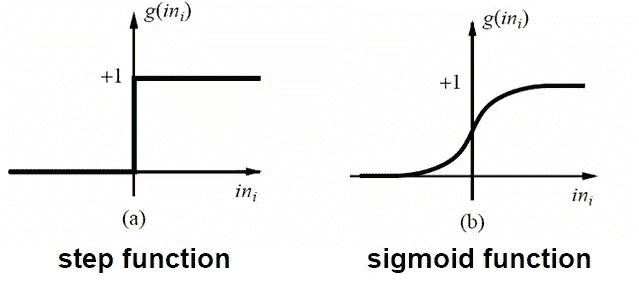
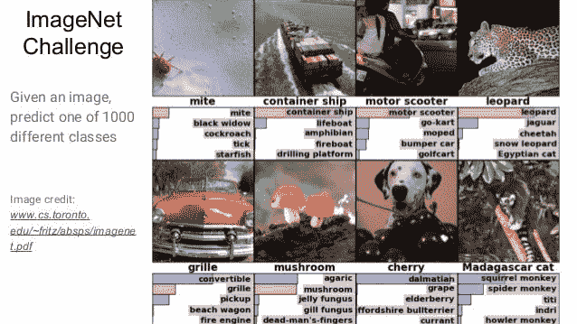
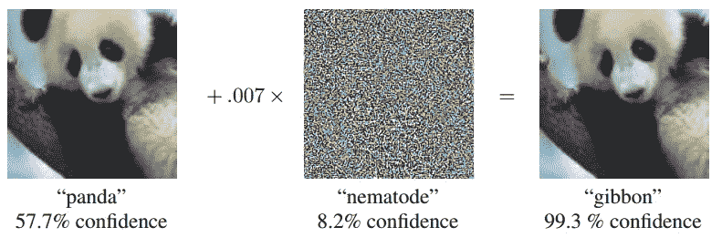

# 人工神经网络和生物神经网络的区别

> 原文：<https://towardsdatascience.com/the-differences-between-artificial-and-biological-neural-networks-a8b46db828b7?source=collection_archive---------0----------------------->

虽然人工神经元和感知机是受科学家们在 50 年代能够观察到的大脑生物过程的启发，但它们在几个方面确实不同于生物学上的同类。鸟类启发了飞行，马启发了机车和汽车，然而今天的交通工具没有一个像活的、呼吸的、自我复制的动物的金属骨架。尽管如此，我们有限的机器在它们自己的领域里甚至比它们的动物“祖先”更强大(因此，对我们人类更有用)。通过拟人化深度神经网络，很容易从人工智能研究的可能性中得出错误的结论，但人工和生物神经元确实在更多方面有所不同，而不仅仅是它们容器的材料。

Airplanes are more useful to us than actual mechanical bird models.

# 历史背景

感知器(人工神经元的前身)背后的想法是，有可能使用简化的数学模型来模拟神经元的某些部分，如树突、细胞体和轴突，这些简化的数学模型限制了我们对其内部工作的了解:信号可以从树突接收，一旦接收到足够的信号，就发送到轴突。这个传出的信号可以作为其他神经元的另一个输入，重复这个过程。一些信号比其他信号更重要，可以更容易地触发一些神经元。连接可能变得更强或更弱，新的连接可能出现，而其他连接可能不复存在。我们可以通过提出一个函数来模拟这一过程，该函数接收一系列加权输入信号，如果这些加权输入的总和达到某个偏差，则输出某种信号。**请注意，这个简化的模型既不模仿神经元之间连接(树突或轴突)的创建，也不模仿连接的破坏，而且忽略了信号时序。**然而，这个受限模型本身就足以处理简单的分类任务。

A biological and an artificial neuron (via [https://www.quora.com/What-is-the-differences-between-artificial-neural-network-computer-science-and-biological-neural-network](https://www.quora.com/What-is-the-differences-between-artificial-neural-network-computer-science-and-biological-neural-network))

感知机由弗兰克·罗森布拉特发明，最初是为了成为一个定制的机械硬件而不是软件功能。Mark 1 感知器是美国海军为图像识别任务制造的机器。

Researching “Artificial Brains”

想象一下可能性吧！一台可以用蒸汽朋克神经元一样的大脑模仿经验学习的机器？一台从它“看到”的例子中学习的机器，而不是戴眼镜的科学家必须给它一套硬编码的指令才能工作？炒作是真实的，人们是乐观的。由于它与生物神经元的相似性，以及感知器网络最初是多么有前途，纽约时报在 1958 年报道说[“海军今天展示了电子计算机的胚胎，它预计将能够行走，说话，看，写，自我复制并意识到它的存在。”](https://www.nytimes.com/1958/07/08/archives/new-navy-device-learns-by-doing-psychologist-shows-embryo-of.html)

然而，它的缺点很快被认识到，因为单独的一层感知器无法解决非线性分类问题(例如[学习简单的 XOR](https://www.quora.com/Why-cant-the-XOR-problem-be-solved-by-a-one-layer-perceptron) 函数)。这个问题只能通过使用多层(隐藏层)来克服(数据中更复杂的关系只能建模)。然而，除了随机调整所有权重之外，没有一种简单、廉价的方法来训练多层感知机，因为没有办法判断哪一小组变化最终会在很大程度上影响其他神经元的输出。这一缺陷导致人工神经网络研究停滞多年。然后，一种新的人工神经元通过稍微改变其模型的某些方面来解决这个问题，这允许多个层的连接，而不会失去训练它们的能力。人工神经元不是作为只能接收和输出二进制信号的开关工作(这意味着感知机将根据信号的存在或不存在而获得 0 或 1，并且当达到组合的加权信号输入的某个阈值时，还将输出 0 或 1)，而是利用具有连续激活函数的连续(浮点)值(稍后将详细介绍这些函数)。

Activation functions for perceptrons (step function, that would either output 0 or 1 if the sum of weights was larger than the threshold) and for the first artificial neurons (sigmoid function, that always outputs values between 0 and 1).

这可能看起来没有太大的区别，但由于他们模型中的这一微小变化，人工神经元层可以在数学公式中作为独立的连续函数使用，其中可以计算一组可选的权重(通过逐个计算它们的偏导数来估计如何最小化它们的误差)。这个微小的变化使得使用[反向传播](https://www.youtube.com/watch?v=Ilg3gGewQ5U&vl=en)算法来教授多层人工神经元成为可能。因此，与生物神经元不同，人工神经元不只是“发射”:它们发送连续值，而不是二进制信号。[根据它们的激活功能](https://medium.com/the-theory-of-everything/understanding-activation-functions-in-neural-networks-9491262884e0)、**，它们可能会一直发出信号，但这些信号的强度会有所不同**。请注意，术语“多层感知器”实际上是不准确的，因为这些网络使用人工神经元层，而不是感知器层。然而，**教授这些网络在计算上是如此昂贵，以至于人们很少使用它们来完成机器学习任务**，直到最近(那时大量的示例数据更容易获得，计算机的速度快了许多倍)。由于人工神经网络很难教，而且[不是我们头脑中真实想法的忠实模型](https://www.youtube.com/watch?v=uXt8qF2Zzfo)，**大多数科学家仍然认为它们是机器学习的死胡同**。当 2012 年一个深度神经网络架构 [AlexNet](https://papers.nips.cc/paper/4824-imagenet-classification-with-deep-convolutional-neural-networks.pdf) 成功解决了 [ImageNet](https://en.wikipedia.org/wiki/ImageNet) 挑战(一个拥有超过 1400 万张手绘图像的大型视觉数据集)时，炒作又回来了，而不依赖于手工制作的、精细提取的特征，这是迄今为止计算机视觉的标准。AlexNet 击败了竞争对手，为神经网络再次发挥作用铺平了道路。

AlexNet correctly classifies images at the top, based on likelihood.

*你可以阅读更多关于深度学习的历史，这里的***。该领域发展如此之快，以至于研究人员不断提出新的解决方案来解决人工神经网络的某些限制和缺点。**

# *主要区别*

1.  *尺寸:我们的大脑包含大约 860 亿个神经元(T2)和超过 100 万亿个(或者根据一些估计是 1000 万亿个)突触(连接)。**人工网络中的“神经元”数量比**少得多(通常在 10-1000 左右)，但以这种方式比较它们的数量会产生误导。感知器只是在其“树突”上接受输入，并在其“轴突分支”上产生输出。单层感知器网络由几个互不相连的感知器组成:它们只是同时执行完全相同的任务。深度神经网络通常由输入神经元(与数据中的特征数量一样多)、输出神经元(如果构建它们是为了解决分类问题，则与类的数量一样多)和隐藏层中的神经元组成。所有层通常([但不一定是](https://www.cv-foundation.org/openaccess/content_cvpr_2015/papers/Szegedy_Going_Deeper_With_2015_CVPR_paper.pdf))完全连接到下一层，这意味着人工神经元通常具有与前一层和后一层中的人工神经元总和一样多的连接。卷积神经网络还使用不同的技术从数据中提取特征，这些技术比几个相互连接的神经元单独能够做到的更复杂。手动特征提取(以可以馈入机器学习算法的方式改变数据)需要人脑的力量，这在对深度学习任务所需的“神经元”数量求和时也没有考虑在内。大小的限制不仅仅是计算上的:简单地增加层数和人工神经元的数量并不总是能在机器学习任务中产生更好的结果。*
2.  ***拓扑:**所有人工层都是一个一个计算的，而不是一个节点异步计算的网络的一部分。前馈网络计算一层人工神经元的状态及其权重，然后使用结果以同样的方式计算下一层。在反向传播期间，该算法以相反的方式计算权重的一些变化，以减小输出层中前馈计算结果与输出层期望值的差异。**层不与非相邻层相连，**但是用循环和 LSTM 网络来模拟环路是可能的。在生物网络中，神经元可以并行异步放电，具有小世界性质，具有一小部分高度连接的神经元(中枢)和大量较低连接的神经元(程度分布至少部分遵循[幂律](https://en.wikipedia.org/wiki/Scale-free_network))。由于人工神经元层通常是完全连接的，因此生物神经元的这种小世界性质只能通过引入 0 的权重来模拟两个神经元之间缺乏连接的情况。*
3.  ***速度:**某些生物神经元平均每秒可以放电 200 次左右。根据神经冲动的类型，信号以不同的速度传播，[从 0.61 米/秒到 119 米/秒](https://hypertextbook.com/facts/2002/DavidParizh.shtml)。**信号传播速度也因人而异，取决于他们的性别、年龄、身高、温度、医疗状况、睡眠不足等。**动作电位频率携带[生物神经元网络信息](https://www.khanacademy.org/test-prep/mcat/organ-systems/neuron-membrane-potentials/a/neuron-action-potentials-the-creation-of-a-brain-signal):生物系统中输出神经元的放电频率或放电模式(紧张或突发放电)以及输入神经元传入信号的幅度携带信息。**人工神经元中的信息转而由突触权重的连续浮点数值携带。**前馈或反向传播算法的计算速度除了加快模型的执行和训练速度之外，没有其他信息。人工神经网络没有不应期(由于钠通道被锁定，不可能发送另一个动作电位的时期)，人工神经元不会经历“疲劳”:它们是可以在计算机架构允许的情况下尽可能快地计算多次的函数。由于人工神经网络模型可以被理解为只是一堆矩阵运算和寻找导数，因此运行这样的计算可以针对矢量处理器进行高度优化(反复对大量数据点进行完全相同的计算)，并使用 GPU 或专用硬件(如最近智能手机中的 [AI 芯片](https://www.engadget.com/2017/12/15/ai-processor-cpu-explainer-bionic-neural-npu/))进行大幅加速。*
4.  ***容错:**生物神经元网络由于其拓扑结构也是容错的。信息以冗余方式存储，因此小故障不会导致内存丢失。他们没有一个“中心”部分。大脑也能在一定程度上恢复和愈合。**人工神经网络不是为容错或自我再生而建模的**(与疲劳类似，这些想法不适用于矩阵运算)，尽管通过保存模型的当前状态(权重值)并从该保存状态继续训练可以恢复。辍学可以在训练期间打开和关闭一层中的随机神经元，模仿信号的不可用路径，并强制一些冗余(辍学实际上是用来减少过度拟合的机会)。经过训练的模型可以导出并在支持该框架的不同设备上使用，这意味着相同的人工神经网络模型将在其运行的每个设备上为相同的输入数据产生相同的输出。长时间训练人工神经网络不会影响人工神经元的效率。然而，**如果经常使用，用于训练的硬件会很快磨损**，需要更换。另一个区别是，所有的过程(状态和值)都可以在人工神经网络中被密切监控。*
5.  ***功耗**:大脑消耗大约 20%的人体能量——尽管它很大，但一个成年人的大脑在大约 20 瓦(仅够微弱地点亮一个灯泡)的功率下工作，效率极高。考虑到人类如何还能运转一段时间，当[只给了一些富含 c-维生素的柠檬汁和牛油](https://www.nature.com/articles/pr197666)时，这就相当了不起了。基准测试:一个单独的 Nvidia GeForce Titan X GPU 运行在 [250 瓦](https://www.geforce.com/hardware/desktop-gpus/geforce-gtx-titan-x/specifications)上，需要一个电源而不是牛油。我们的机器远不如生物系统有效。计算机在使用时也会产生大量热量，消费类 GPU 在 50–80 摄氏度之间安全运行，而不是 36.5–37.5 摄氏度。*
6.  ***信号**:动作电位要么被触发，要么不被触发——生物突触要么携带信号，要么不携带。感知器的工作方式有些类似，它接受二进制输入，对其应用权重，并根据这些加权输入的总和是否达到某个阈值(也称为阶跃函数)来生成二进制输出。人工神经元接受连续值作为输入，并对其加权输入之和应用简单的非线性、易微分函数(激活函数),以限制输出值的范围。激活函数是非线性的，所以理论上多层可以[近似任何函数](https://en.wikipedia.org/wiki/Universal_approximation_theorem)。**以前，sigmoid 和双曲线正切函数被用作激活函数，但是这些网络受到消失梯度问题**的困扰，这意味着网络中的层数越多，第一层的变化对输出的影响就越小，因为这些函数[将其输入压缩到非常小的输出范围内](https://www.quora.com/What-is-the-vanishing-gradient-problem)。这些问题通过引入不同的激活功能得以解决，例如 [ReLU](https://en.wikipedia.org/wiki/Rectifier_(neural_networks)) 。这些网络的最终输出通常也压缩在 0-1(代表分类任务的概率)之间，而不是输出二进制信号。如前所述，信号的频率/速度和发射率都不携带人工神经网络的任何信息(该信息由输入权重携带)。信号的时序是同步的，同一层的人工神经元接收它们的输入信号，然后一次性发送它们的输出信号。循环和时间增量只能用循环(RNN)层(其深受上述消失梯度问题的困扰)或长短期记忆(LSTM)层来部分模拟，其作用更像状态机或锁存电路而不是神经元。这些都是生物神经元和人工神经元之间相当大的差异。*
7.  *学习:我们仍然不明白大脑是如何学习的，或者冗余连接是如何存储和回忆信息的。大脑纤维生长并伸出与其他神经元连接，神经可塑性允许创建新的连接或区域移动并改变功能，突触可能根据其重要性加强或削弱。[一起放电的神经元，连接在一起](https://en.wikipedia.org/wiki/Hebbian_theory)(尽管这是一个非常简化的理论，不应该过于拘泥于字面意思)。通过学习，我们建立在已经储存在大脑中的信息之上。我们的知识通过重复和睡眠加深，一旦掌握，曾经需要集中注意力的任务可以自动执行。**另一方面，人工神经网络有一个预定义的模型，不能添加或删除更多的神经元或连接。**在训练期间，只有连接的权重(以及代表阈值的偏差)可以改变。网络以随机的权重值开始，并且将慢慢地尝试达到一个点，在该点，权重的进一步改变将不再提高性能。就像现实生活中同样的问题有许多解决方案一样，不能保证网络的权重将是某个问题的最佳权重安排，它们将只代表无限个解决方案的无限个近似中的一个。学习可以被理解为寻找最优权重以最小化网络预期输出和生成输出之间的差异的过程:以一种方式改变权重会增加这种误差，以另一种方式改变它们会使其恶化。想象一个雾蒙蒙的山顶，在那里我们所能告诉的就是[朝着某个方向迈步会把我们带到下坡](https://www.youtube.com/watch?v=oSdPmxRCWws)。通过重复这一过程，我们最终会到达一个山谷，在那里再往前走一步只会让我们更高。一旦找到这个山谷，我们就可以说我们已经到达了一个局部极小值。请注意，可能有其他更好的山谷，甚至比山顶更低(全局最小值)，我们已经错过了，因为我们看不到它们。在通常超过 3 维的空间中这样做被称为梯度下降。为了加速这个“学习过程”,从数据集中抽取随机样本(批次)并用于训练迭代，而不是每次都遍历每个示例。这只给出了如何调整权重以达到局部最小值的近似值(找到下坡的方向，而不用一直仔细查看所有方向)，但这仍然是一个相当好的近似值。我们也可以在登顶时迈大一点的步子，在到达山谷时迈小一点的步子，在那里，即使很小的推搡也会带我们走错路。像这样走下坡路，走得比精心规划的每一步都要快，这叫随机梯度下降。因此，人工神经网络的学习速度会随着时间而变化(它会降低以确保更好的性能)，但没有任何类似于人类睡眠阶段的时期，网络会学习得更好。也没有神经疲劳，尽管训练期间 GPU 过热会降低性能。一旦经过训练，人工神经网络的权重可以导出，并用于解决与训练集中发现的问题类似的问题。训练(使用类似随机梯度下降的[优化方法](https://stackoverflow.com/questions/37953585/what-is-the-diffirence-between-sgd-and-back-propogation)的反向传播，在许多层和例子上)极其昂贵，但是使用经过训练的网络(简单地进行前馈计算)便宜得离谱。**与大脑不同，人工神经网络不会通过回忆信息来学习** —它们只会在训练期间学习，但事后会一直“回忆”相同的、学习过的答案，不会出错。最棒的一点是,“回忆”可以在更弱的硬件上进行，次数不限。还可以使用之前预训练的模型(因为不必从完全随机的一组权重开始，所以可以节省时间和资源)，并通过使用具有相同输入特征的其他示例进行训练来改进它们。这有点类似于大脑如何更容易地学习某些东西(如面孔)，因为大脑有专门的区域来处理某些类型的信息。*

*因此，人工神经元和生物神经元确实在更多方面不同于它们环境的材料——生物神经元只为它们的人工对应物提供了灵感，但它们绝不是具有相似潜力的直接副本。如果有人说另一个人聪明或聪明，我们会自然而然地认为他们也有能力处理各种各样的问题，而且很可能礼貌、善良、勤奋。称一个软件智能仅仅意味着它能够找到一组问题的最佳解决方案。*

# *AI 做不到的*

*人工智能现在几乎可以在每个领域击败人类:*

1.  *足够多的训练数据和示例都可以通过数字方式获得，工程师可以清楚地将数据中的信息转化为数值(特征),而不会产生太多歧义。*
2.  *这些例子的解决方案要么是清楚的(有大量的标签数据可用)，要么是有可能清楚地定义优选的状态，应该实现的长期目标(例如，有可能将进化算法的目标定义为[能够走尽可能远的距离](https://www.youtube.com/watch?v=pgaEE27nsQw)，因为其进化的目标可以很容易地在距离上测量)。*

*这听起来很可怕，但我们仍然完全不知道[一般智力](https://www.youtube.com/watch?v=tlS5Y2vm02c)是如何工作的，这意味着我们不知道人脑如何能够通过将知识从一个区域转移到另一个区域而在各种不同的区域如此高效。AlphaGo 现在可以在围棋比赛中击败任何人，但你最有可能在井字游戏中击败它，因为它对自己领域之外的游戏没有概念。一只狩猎采集的猴子如何想出利用它的大脑不仅仅是寻找和培育食物，而是建立一个社会来支持那些不是把生命献给农业，而是一生都在玩桌面围棋的人，尽管他们的大脑中没有专门的围棋神经网络区域，这本身就是一个奇迹。类似于重型机械如何在许多领域取代了人类的力量，仅仅因为起重机能比任何人手更好地举起重物，他们中没有人能精确地放置较小的物体或同时弹钢琴。人类很像自我复制、节能的瑞士军刀，即使在恶劣的条件下也能生存和工作。*

*机器学习可以比人类更有效地将输入特征映射到输出(特别是在数据仅以我们无法理解的形式可用的领域:我们不会将图像视为一串代表颜色值和边缘的数字，然而机器学习模型从这样的表示中学习没有问题)。然而，他们无法自动发现和理解额外的特征(可能很重要的属性)，并基于它们快速更新他们的世界模型(公平地说，我们也无法理解我们无法感知的特征:例如，无论我们阅读多少关于它们的知识，我们都无法看到紫外线)。如果直到今天，你在生活中只见过狗，但有人向你指出，你现在看到的狼不是狗，而是它们未经驯化的野生祖先，你会很快意识到有类似狗的生物，你可能已经看到狗可能是狼而没有意识到，其他宠物也可能有类似的未经驯化的祖先。从现在开始，你很有可能能够区分这两个物种，而不必再看一眼你迄今为止在生活中见过的所有狗，也不需要几百张狼的照片，最好是它们在不同光照条件下从每个角度每个位置拍摄的照片。你也可以毫不犹豫地相信，一幅模糊的狼的卡通图画在某种程度上仍然是一只狼的代表，它具有现实生活中动物的一些特性，同时也具有真正的狼所没有的拟人化的特征。如果有人把你介绍给一个叫沃尔夫的人，你也不会感到困惑。人工智能无法做到这一点(尽管人工神经网络不必那么依赖手工制作的特征，不像大多数其他类型的机器学习算法)。机器学习模型，包括深度学习模型，学习数据表示中的[关系](/word2vec-a-baby-step-in-deep-learning-but-a-giant-leap-towards-natural-language-processing-40fe4e8602ba)。这也意味着**如果表示模糊不清并且依赖于上下文，即使最准确的模型也会失败**，因为它们会输出只在不同情况下有效的结果(例如，如果某些推文同时被标记为悲伤和有趣，情感分析将很难区分它们，更不用说理解讽刺了)。人类是进化来面对未知挑战的生物，以改善他们对世界的看法，并建立在以前的经验基础上——而不仅仅是解决分类或回归问题的大脑。但是我们如何做到这一切仍然是我们无法理解的。然而，如果我们要造一台像人类一样智能的机器，[它会自动比我们更好](https://www.youtube.com/watch?v=gP4ZNUHdwp8)，这是因为硅树脂在速度上的绝对优势。*

**

*The reason adversarial attacks can trick neural networks is because they do not “see” the same way we do. They do learn relationships in image data and can come to similar conclusions as we do when classifying, but their internal models are different from ours.*

*尽管人工智能受到我们自身的启发，但该领域的进步反过来帮助生物学家和心理学家更好地理解智能和进化。例如，在对智能体建模时，某些学习策略的局限性变得很明显(比如进化一定比随机突变更复杂)。科学家们过去认为，大脑具有超专业的视觉神经元，这些神经元变得越来越复杂，能够检测更复杂的形状和物体。然而，现在很清楚，通过让其他类似的神经元学习不太复杂的形式和属性，以及通过检测这些较低水平的表示是否在发出信号，相同类型的人工神经元能够学习复杂的形状。*

> *即使机器学习可以在某些领域解决问题并击败人类，也不意味着这些算法表现得像人类一样，在其他领域也一样能干。鉴于足够多的神经元和层可以堆叠在一起，说人工神经元将成为始终有效的积木是一个神话:更大的网络不一定工作得更好，模型能够学习的任何东西都取决于其输入和输出数据。不同的激活函数、神经元类型、模型、退出率和优化技术更适合不同的任务——找出[哪些解决方案最有效](https://adeshpande3.github.io/The-9-Deep-Learning-Papers-You-Need-To-Know-About.html)仍然是数据科学家的工作，类似于收集、清理和重新编码数据为有用的特征。**让任何机器智能化都需要大量的人类智能，尽管媒体头条很少报道这一事实。**无论如何，如果有人向你提供他们新成立的公司的股份，这家公司专门将人类的意识上传到云端，希望获得永生，最好还是友好地拒绝他们的提议，至少现在是这样。*