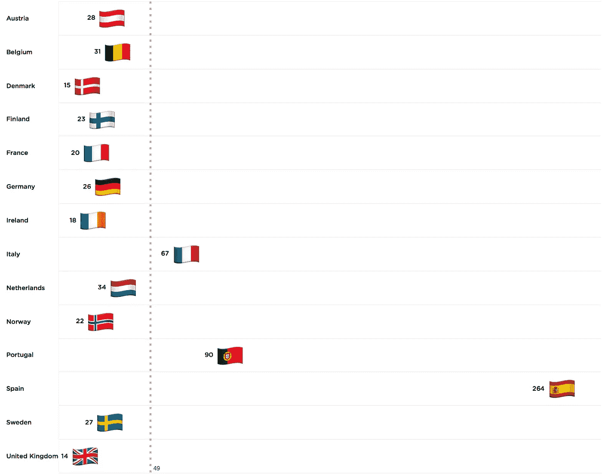
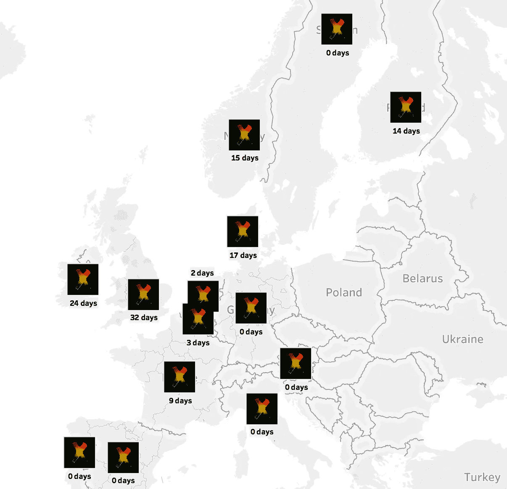
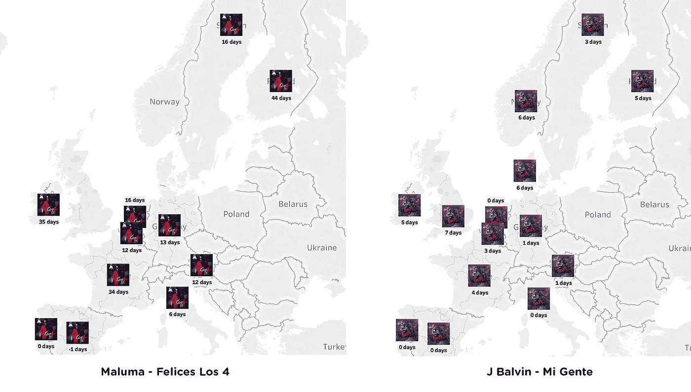

# 拉丁语和雷鬼音乐的传播

> 原文：<https://towardsdatascience.com/the-diffusion-of-latin-and-reggaeton-69113f9929dd?source=collection_archive---------11----------------------->

Ozuna — 18 million monthly listeners on Spotify

公平地说，我们很多人都在跟着当今最流行的拉丁和雷鬼音乐一起唱歌，却不一定理解我们在说什么或听到什么。直到今天早上我咨询了天才，我才熟悉了《美国佬老爹》的一些歌词的含义，同时我已经喃喃自语了几个星期了。像尼基·杰姆的《X》和《T4》**美国佬老爹的《杜拉》** 这样的热门歌曲在国外积累了数百万的流量。更不用说他们在整个欧洲都达到了很高的排行榜位置。

在这个流媒体时代，拉丁流行音乐和雷鬼音乐似乎比以前更容易到达我们这里。有了像 [Viva Latino](https://open.spotify.com/user/spotify/playlist/37i9dQZF1DX10zKzsJ2jva?si=uYh_717HQf-eWdWrhTAuLA) 和[白腊瑞格顿](https://open.spotify.com/user/spotify/playlist/37i9dQZF1DWY7IeIP1cdjF?si=jI_IoRk5RlaU-cg1_BwAYw)这样的大规模国际播放列表(分别有 800 多万和 700 多万追随者)和以拉丁曲目为特色的主流流行播放列表，潜在的全球听众变得巨大——导致消费者经常接触到拉丁音乐。

知道拉丁音乐能够接触到数量惊人的 Spotify 听众，我想知道我们是否能弄清楚拉丁音乐是如何在欧洲接触到我们的，以及这是否因国家或艺术家而异。

## 数据集

*   该数据集包含从 2017 年 1 月到 2018 年 5 月 20 日的所有 Spotify 每日图表，通过 spotifycharts.com 收集。相当于 502 天。
*   通过查看 Spotify 上最大的两个拉丁播放列表(Viva Latino 和白腊瑞格顿)及其特色音乐，我能够检索到拉丁音乐的最大供应商拉丁音乐国家，这些音乐符合 Spotify 的播放列表(通过 [Chartmetric](https://chartmetric.io/playlist/spotify?id=1645077) 完成)。最大的供应商是波多黎各、哥伦比亚、多米尼加共和国、墨西哥、巴西和委内瑞拉。我决定将这些国家作为拉美地区与欧洲进行比较的基准。不幸的是，波多黎各和委内瑞拉没有自己的 Spotify 每日排行榜。

## 每个拉美国家排名前三的艺术家

在我们开始与欧洲进行比较之前，我想先从更好地了解拉丁音乐的“家”开始。根据进入 Spotify 前 50 名排行榜的不同曲目的数量，下面的可视化显示了每个国家的前三名艺术家。 [**奥祖纳**](https://open.spotify.com/artist/1i8SpTcr7yvPOmcqrbnVXY?si=ga-2T35cS8GmUmXtmsejuQ) 设法让最多的曲目进入前 50。他唯一没有排名第一的国家是巴西，在那里我们看到了与其他拉美国家截然不同的前三名。在大多数国家，J·巴尔文和**马鲁玛**的排名也很高

Top 3 artists based on amount of distinct tracks

## 与欧洲的相似之处

考虑到 LatAm 基准，我想知道与欧洲国家有什么相似之处。我们可以通过查看 Spotify 在拉美地区和欧洲的前 200 名中出现的歌曲来做到这一点。从那里我们可以计算出 LatAm 基准中所有独特曲目的相似度。我还想知道每月是否会有差异，因为拉丁音乐经常与夏天联系在一起。

下面的可视化显示了从 2017 年 1 月到 2018 年 4 月每月与 LatAm(欧盟国家的平均值)的相似性。所有被考虑的月份的平均相似度百分比为 **23%** ，这意味着 Spotify 在墨西哥、哥伦比亚、巴西和多米尼加共和国的前 200 首歌曲中有 23%也进入了欧洲排行榜。值得一提的是，2017 年 3 月的峰值主要是由艾德·希兰的专辑发行引起的。

Average resemblance with LatAm benchmark per month

就像我之前[的一篇文章](https://medium.com/@boplantinga/music-travels-but-what-s-the-travel-time-8fd7279e1aa6)中的图表与美国的比较一样，很可能有些国家比其他国家更像 LatAm。大概不会太显著；西班牙(平均 30%) 和**葡萄牙(平均。29%)** 在相似度方面得分最高。法国(平均。17%) 和**丹麦(平均。19%)** 相似度得分最低。

% of LatAm resemblance per month and country

## 拉丁图表条目

知道了这一点，我想知道有多少拉丁歌曲进入了欧洲排行榜。为了将拉丁流派从其余的图表条目中分离出来，我根据 Spotify 播放列表中包含的最大拉丁艺术家的数据集放置了一个过滤器。

毫不奇怪，西班牙得分最高，有 264 首不同的拉丁歌曲进入 Spotify 前 200 名，其次是葡萄牙，有 90 首拉丁歌曲进入排行榜。荷兰在(更明智的)前三名之后率先赶上。

Amount of Latin tracks in European charts

当看拉丁曲目时，西班牙自然是一个倾向于提前参加派对的国家。我想知道哪些国家也很快接受了拉丁曲目，所以我选择了一些最热门的拉丁曲目，并计算了该曲目达到欧洲国家与拉丁基准所需的时间。

爸爸美国佬的《T1》[**杜拉**](https://open.spotify.com/track/2j2fIJGh4PMdXt9ULI5Tlc?si=fbt13A0-RpyTZltCjRtHEQ)**是目前最热门的歌曲之一，仅在 Spotify 上就有超过 2 . 5 亿的播放量。下图显示了杜拉袭击一个特定的欧洲国家所需要的时间。正如你所看到的，西班牙和葡萄牙立即采用了这条赛道，随后是意大利(7 天后)和荷兰(18 天后)。**

****

**Daddy Yankee — Dura**

**那么另一部夏季热门电影呢，尼基·杰姆的《X》(T11)？我做了同样的计算，结果是欧洲采用 X 比采用“Dura”更快。**

****

**Nicky Jam — X**

**J . Balvin 的巨大成功**《米根特》**也显示在下面，平均花了**三天时间**才到达排行榜。当我们看到 Maluma 的(我个人最喜欢的)**“felicies Los 4”**时，我们看到的采用率略有下降，在欧洲，平均需要 **14 天**才能到达我们这里。**

****

**Maluma — Felices Los 4 & J Balvin — Mi Gente**

**平均一下所有穿越海洋的音乐，我们可以得出这样的结论:拉丁音乐到达欧洲需要 3 天。然而，当我们排除两个欧洲领先者(西班牙和葡萄牙)时，平均时间立即减少到 9 天。**

**最后，对于所有那些跟着洋基老爹的“杜拉”唱歌的人，你们实际上是在唱歌；**

> **你很性感，告诉我，告诉我，你是怎么做到的？**
> 
> **你很性感，我给你满分 20 分**
> 
> **你很热，很热，很热**

## **放弃**

*   **由于过滤器被放置在具有已经被包括在大型拉丁主题播放列表中的拉丁艺术家的数据集上，所以一些较小的拉丁艺术家可能被排除。然而，鉴于这些播放列表包含了最大和最有潜力的艺术家，我很有信心他们中的大多数应该被包括在内。**
*   **这一比较是基于 Spotify 200 强排行榜进行的。查看前 100 名或前 50 名时，结果可能会有所不同。**
*   **这只是涵盖了 Spotify 平台的图表部分，不应被视为 Spotify 图表范围之外的收听行为的整体表现**

****感谢阅读！如果你喜欢读这篇文章👏🏻很感激。****

**在这里找到更多我写的关于音乐的故事。**