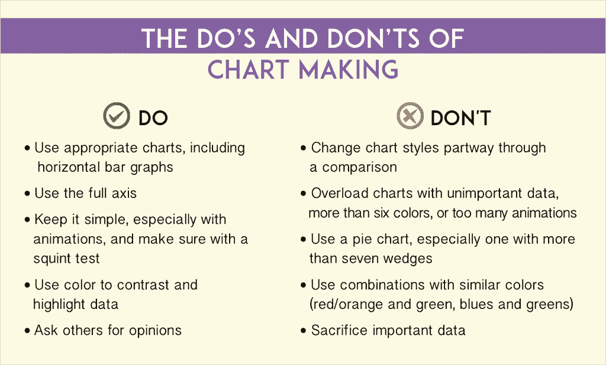
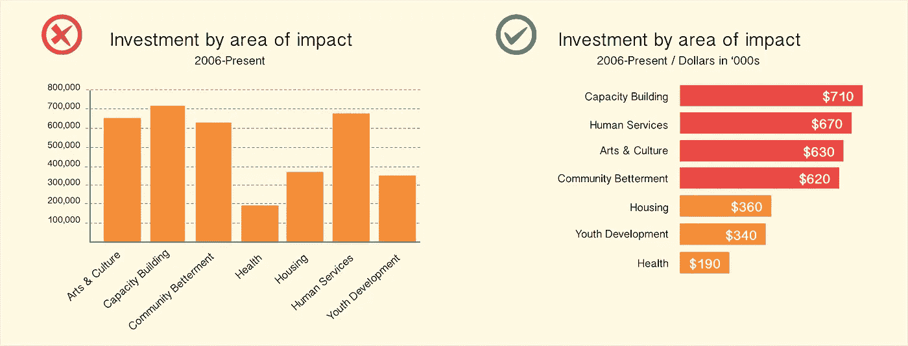
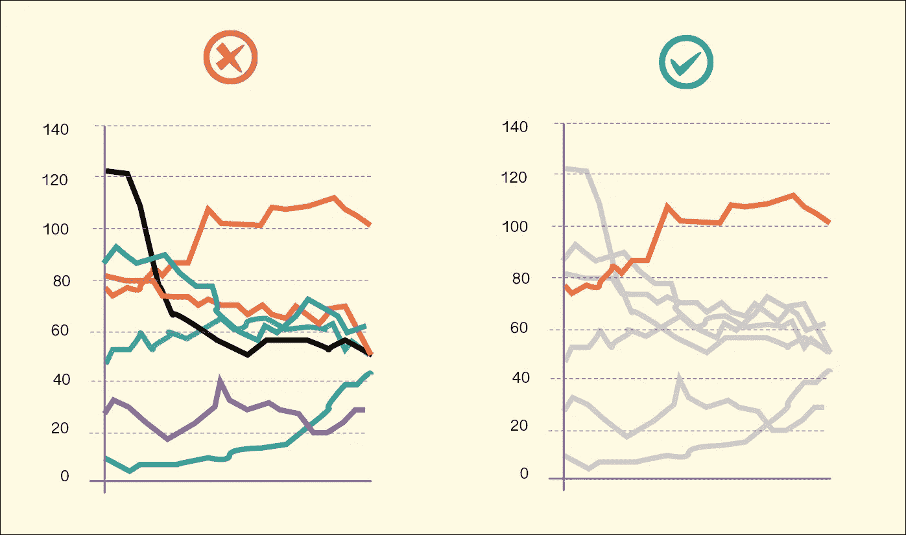
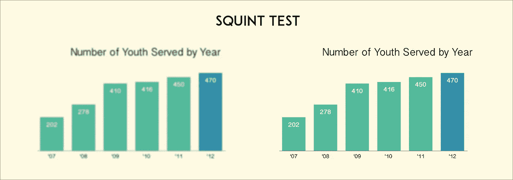

# 图表制作的注意事项

> 原文：<https://towardsdatascience.com/the-dos-and-don-ts-of-chart-making-13c629456027?source=collection_archive---------4----------------------->

当涉及到向你的观众传达信息时，图表是一种简单而有效的方式。也就是说，如果图表制作正确的话。

制作完美的视觉内容需要投入大量的精力，很容易遗漏一些元素。匆忙拼凑的图表往往弊大于利。

为了帮助您避免这种情况，我们整理了一个有用的注意事项列表，以便您在创建自己的数据表示时牢记在心，无论是简单的条形图和图形形式，还是更复杂的交互式可视化形式。

[相关:你永远不想犯的 11 个常见信息图表错误](http://blog.visme.co/bad-infographics/)

# 图表类型

准备图形时，选择最适合数据的图表很重要。

**对你的数据使用合适的图表。了解你的[基本图表](http://www.skillsyouneed.com/num/graphs-charts.html)以及它们最擅长什么，这样你就可以为你的观众创造最有效的图形。三种最流行的图表是条形图、饼图和折线图。同时有定性和定量两类数据，每一类数据又可以分为[两个子类型](https://surfstat.anu.edu.au/surfstat-home/1-1-1.html)。**

Combine text and icons just like this using [Visme](http://www.visme.co/?vc=Graphic-CTA)

第一种信息是定性数据，由序数数据和名义数据组成。第一个是指专门为其数据组制作的标尺。这种数据经常出现在问卷中，当人们被要求按照从差到好的等级(通常表示为一到五)对不同方面进行评级时。同时，[名义数据](http://www.dictionary.com/browse/nominal-scale)没有被排序或测量，而是被分类。名义数据的一个例子是一个人的性别或眼睛颜色的记录。

第二种信息，定量数据，包括[离散或连续的](https://surfstat.anu.edu.au/surfstat-home/1-1-1.html)数据。离散数据是用整数来度量的，整数代表一个整体，例如一个家庭中的人数。连续数据不是表示单个数据点，而是表示值可能不同但仍属于同一标签的测量值，如人的体重或身高记录。

每种类型的数据都可以用各种流行的图表来表示，尽管某些类型的图表更适合不同类型的数据。

**条形图**在用于名义数据和离散数据时效果最佳，并有助于比较。同样，**饼图**可用于离散和有序数据，以显示整体的一部分。**折线图**最适合连续数据，因为它连接了许多属于同一类别的变量。

当使用 x(水平)和 y(垂直)轴图表时，尤其是条形图，**使用[全轴](https://vis4.net/blog/posts/doing-the-line-charts-right/)。从零开始绘制图表可以避免图表中的数据产生误导，从而被受众误解。例如，从零开始的条形图有夸大比较数据之间差异的风险。**

[图片:http://blog . visme . co/WP-content/uploads/2016/08/intervals . png](http://blog.visme.co/wp-content/uploads/2016/08/intervals.png)

从零开始你的 Y 轴，以避免误导和扭曲的数据可视化。

在某些线图的情况下，发现一个**例外**总是从零开始轴。当数据在一个远远大于零的量上变化很小时，就很难读取。在这种情况下，从更接近数据的数量开始基线可以揭示变化。只是要小心，不要让**的数据碰到底部轴。在最低数据点和轴之间留出一个清晰的空白。**

此外，**在进行比较时，不要** [改变图形的样式](http://guides.library.duke.edu/datavis/topten)。例如，条形图和饼图都是可以显示离散数据的样式。然而，当这些风格放在一起时，很难对两者进行比较。这可能会让你的听众感到不舒服，让他们很难理解你的信息。相反，保持你的风格一致。当比较多个图表中的相同数据时，选择一种样式或类型并保持不变。

# 可读性

一旦你选择了最适合你的信息的图表类型，注意让你的图表易于理解。图表，以及任何视觉辅助，应该让你快速、简单、轻松地理解你的数据。

保持你的图表简单。[统计学家爱德华·塔夫特](https://www.amazon.com/Visual-Display-Quantitative-Information/dp/0961392142)说，“图形的优雅通常存在于设计的简单和数据的复杂中。”一种在不减少数据的情况下简化图表的方法是通过 Tufte 的[数据墨水比率](https://vis4.net/blog/posts/doing-the-line-charts-right/)。删除边框、网格线甚至图例中的多余墨迹，以简化图表的整体外观。例如，不用图例和 y 轴，直接用类别和数量来标记数据。

通过消除不必要的网格线、轴值和图例来提高图形的可读性。

为了增加具有长名称的多个类别的条形图的可读性， **do** 使用[水平条形图](http://www.storytellingwithdata.com/blog/2012/10/my-penchant-for-horizontal-bar-graphs)并按降序从最大到最小排列数据。这可以防止你的读者伸长脖子去阅读长标签，也可以清楚地定义你所有数据之间的关系。

当处理具有长名称的多个类别时，使用水平图形来提高可读性。

注意不要让图表上的信息过多。二十行，虽然显示了广泛的数据，但很难阅读，需要时间让你的观众理解，当他们真正应该看一眼就明白的时候。

此外，为了最大程度的方便和可读性，**不要使用饼状图。在统计学家中，饼状图通常包含有问题的数据，很难解释。如果饼状图是你的最佳选择，不要使用超过七个楔形 T21，否则你将很难辨别数据中的差异。**

# 颜色

将您的信息添加到您选择的图表中后，是时候确保强调您希望受众注意到的数据了。有了一些特定的颜色选择，很容易让你的信息脱颖而出，或者让它迷失在人群中。

确保你**使用[强烈的颜色对比](http://www.scribblelive.com/blog/2012/12/27/the-chart-that-wasnt-there-avoiding-disappearing-plots-in-presentations/)。最简单的色彩对比就是黑白。在白色背景上添加高度饱和的颜色，如蓝色，将真正使您的数据流行。然而，并不是所有的颜色都能很好地搭配，所以要小心。例如，白色上的黄色和黑色上的海军蓝分别很难看到。**

**做** [通过颜色强调](http://www.storytellingwithdata.com/blog/2012/10/my-penchant-for-horizontal-bar-graphs)你最重要的数据。例如，在线图中，将有价值的线涂成彩色，而不太重要的信息涂成灰色。在条形图中，使最大数量成为最亮的颜色，随后每个类别的饱和度越来越低。像这样的选择真的可以把注意力吸引到你想要的地方。

坚持使用几种颜色，用对比突出重要信息。

**不要**一起使用[超过六种颜色](http://guides.library.duke.edu/datavis/topten)。太多的颜色意味着相似的色调会出现，像蓝色和绿色，这可能很难区分。此外，颜色越浅，越难看到。太多的颜色就像有太多的数据。令人困惑和分心。

另外，**不要**用红色和绿色或者橙色和绿色在同一个图表上做比较。大约 10%的男性是色盲，红色/绿色是最常见的色盲。橙色接近红色，使这些颜色完全无法分辨。为了使您的图表更容易被读者理解，请不惜一切代价避免使用这些颜色组合。

# 特殊效果

选择好图表、数据可读并选择好颜色后，是时候润色图表了。添加一些收尾工作的简单方法是在图表中添加特殊效果。无论是动画还是文字效果，都可以真正增加你的视觉内容。然而，如果做得不好，结果可能达不到预期。

在处理特效时，**使用[简单动画](http://www.indezine.com/products/powerpoint/learn/chartsdiagrams/ten-tips-for-cool-ppt-charts/should-charts-be-animated.html)。一点点的移动会抓住你的观众的注意力，把他们吸引到你的图表上。在图表介绍给观众后，快速简单的动画(如擦拭动作)也是揭示相关数据的好方法。**

**保持动画图表简单。使用 motion 将注意力吸引到数据中的特定值和趋势。**

**尽管特效会对你的图表产生负面影响，所以**不要**过度。图表上的每一条新信息都有大的动画会分散你对信息的注意力，反而会把注意力吸引到跳动的文本和旋转的条形图上。经常在饼图上使用的分离效果也进一步降低了它们的可读性。**

****也不要**使用 [3D 效果](http://www.forbes.com/sites/naomirobbins/2012/06/07/trellis-plot-alternative-to-three-dimensional-bar-charts/)，尤其是在条形图中。通过使条形看起来像立方体，顶部变得模糊不清，很难辨别数据顶部真正的终点。是立方体的正面还是背面？通过完全远离 3D 效果来避免观众的困惑。**

# **收尾**

**当你完成你的图表时，再看一遍以检查你可能遗漏的错误是很重要的。这个反思点是一个很好的机会来确保你只做了**该做的**而避免了所有**不该做的**。纵观全局，你就能发现哪些小部分不太合适。你的所有元素一起工作吗？你的数据可读吗？有没有什么东西把你的注意力从你想要的地方引开了？**

****做**斜视测试[确保你的图表整体有效](http://extremepresentation.typepad.com/blog/2006/09/simplicity_of_d.html)。看着你的图表，眯眼直到所有的文字和数字都模糊了。你还明白你的图表的目的吗？例如，你能根据颜色和数量判断出一个条形图正在比较不同的单位吗？或者你能看到你的折线图的起伏变化吗？如果没有，确定什么正在丢失，并回头强调它。**

****

**进行斜视测试，看看你的图表是否能被毫不费力地解读。**

**一旦你觉得一切都是理所应当的，就去问别人的意见。同事和朋友可以从你可能错过的新角度提供见解。确保你的图表在第一次看到它的观众面前有效的最好方法是把它展示给一个从未看过它的人。**

**无论你做什么样的修改，确保你**在做最后的编辑时不要牺牲重要的数据。只要它有助于你的图表的总体目标，保持它。如果它不是你最有价值的信息，而且你觉得它把你的注意力从你想要的地方引开了，考虑把它的颜色弄暗一点，甚至是灰色。这将把它推到后台，让你的真实数据闪闪发光。****

**简而言之，制作图表时要记住的注意事项有:**

# **待办事项:**

*   **使用适当的图表，包括水平条形图**
*   **使用全轴**
*   **保持简单，尤其是动画，并确保有斜视测试**
*   **使用颜色来对比和突出显示数据**
*   **征求别人的意见**

# **不要:**

*   **在比较过程中更改图表样式**
*   **用不重要的数据、超过六种颜色或太多动画使图表超载**
*   **使用饼图，尤其是有七个以上扇区的饼图**
*   **使用相似颜色的组合(红色/橙色和绿色，蓝色和绿色)**
*   **牺牲重要数据**

***本帖* [*原版*](http://blog.visme.co/dos-and-donts-chart-making/) *最早出现在* [*Visme 的视觉学习中心*](http://blog.visme.co/) *。***