# 数据角色和团队的动态

> 原文：<https://towardsdatascience.com/the-dynamics-of-data-roles-teams-6c450b27e59e?source=collection_archive---------2----------------------->

“*数据职业*”中出现的新角色的职责和头衔不断让我感到惊讶。不可否认，这是一个相当模糊的概念，我怀疑从业者对这个空间的组成有不同的看法。然而，在这个领域有一些趋势是从业者也同意的。**数据**比以往任何时候都更加受到组织的重视，在专门的“数据人”、投资和技术方面也出现了相应的增长。

出于方便和可读性的考虑，我将按照技术革命——那些影响了重大变化的技术革命——来简单介绍一下数据角色，尤其是那些在未来会不断发展的数据角色。此外，我最近写了一篇关于 [**数据分析的演变**](https://deepesh-nair.blog/2018/08/03/the-evolution-of-analytics-with-data/) 的文章，这有助于为本文收集更好的上下文。

作为一个业余博客写手，这显然是一个视角，对他们昏昏欲睡的眼睛来说可能是一个长期阅读。只有一个建议:喝杯咖啡。

# 商业智能角色

的确如此，“BI”没有资格在 2018 年与科技生态系统中的时髦流行语竞争，也不会让我们这一代懂数据的人感到愉悦。ETL 工具&策略不再使用了吗？BI 的范围是否被大数据&数据科学方法的大量应用所掩盖？？不要！！

How traditional BI roles were structured in-accordance with the
business model of the organisation. Source: [Microsoft Wiki](https://social.technet.microsoft.com/wiki/contents/articles/25319.business-intelligence-roles-and-team-composition.aspx)

在过去的一两年里，商业智能有了相当大的下降。然而，我不会说 BI *死了*，因为它的应用对大企业来说非常关键。像 *BI 分析师、数据架构师、ETL 开发人员、DW 工程师、BIDW 管理员*这样的角色只会变得更加重要，强调对[市场领先工具&技术](https://www.analyticsinsight.net/top-10-business-intelligence-platforms-in-2018/)的额外关注，而不是当前领域中的*多面手*角色。

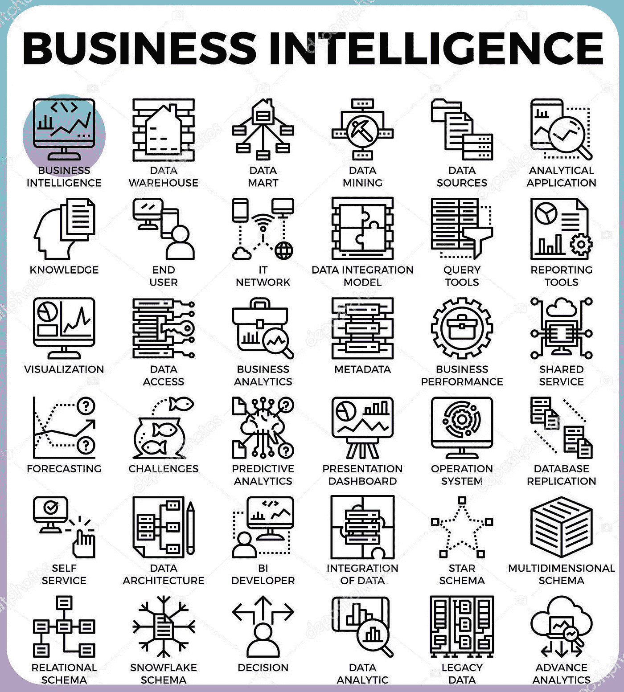

Scope of Business Intelligence techniques employed in 2018.
Source: Check out infographics & vector designs on [DepositPhotos](https://depositphotos.com/)

根据最近的一项大众智慧商业智能市场研究，商务智能将继续提供有竞争力的工作薪酬，并在市场的某些领域占据主导地位。以下是 2018 年 it 的一些关键数字:

*   执行管理、运营和销售:推动 BI 采用的 3 个领域。
*   仪表板、报告、终端用户自助服务、高级可视化和数据仓库:对 BI 具有战略意义的 5 项技术和计划。
*   员工不超过 100 人的小企业拥有最高的 BI 普及率。
*   50%的供应商提供永久内部许可和云订阅。
*   不到 15%的受访组织有首席数据官。

如果你仍然有不同意见，我推荐你阅读全文:[商业智能状况，2018](https://www.forbes.com/sites/louiscolumbus/2018/06/08/the-state-of-business-intelligence-2018/)

# 大数据和数据科学角色

在我们深入探讨当前角色之前，让我们先回顾一下这一切是如何开始的，从哪里开始的。我的想法是在传统的明文定义上用一个讲故事的叙述来展示这些角色——后者在互联网上很容易获得。此外，行业中的每一个*新浪潮*都会产生令人困惑的流行语，虚假的演绎&超现实主义的规定(至少可以说是满嘴的)。

## 变化

创造“大数据”是为了区别于小数据，因为它不是纯粹由公司的交易系统产生的。它还表示，*预测分析*提供了更好的数据趋势，而不是基于事实的理解，以超越决策时的直觉。如果 dimensions & analytics 还不够合理的话，这个阶段欢迎使用社区驱动的“开源”工具，而不是高价的许可证。

我通常避免在我的帖子中引用工具的名称，但是如果不提到 **Apache Hadoop** 就很难描述这场革命。技术栈&可扩展项目、函数式编程范例(可扩展、并发&分布式系统)、noSQL 的兴起、作业调度&集群资源管理、拖放 ETL 的不断变化的方面以及更好的数据建模技术——所有这些都是由 Hadoop 带来的，但它最终强调了最后一点——***代码*** *是软件的最佳抽象*。此外，它还引入了一个概念——通常是广义的——让定制架构为未来与*数据科学&机器学习*的集成做好准备。

从开发者的角度来看，这意味着你不一定要为技术巨头工作来开发新的颠覆性项目。你有社区的支持，有像 Github 这样的新兴合作平台来展示你的作品。

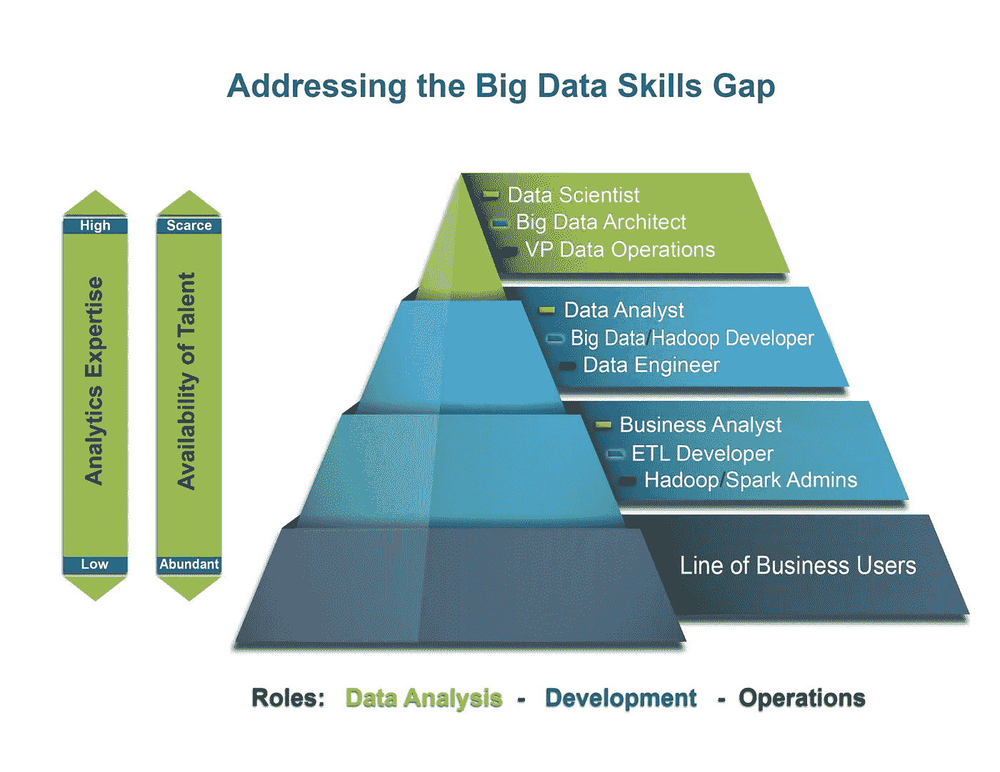

Hierarchy of roles in Big Data & Analytics-driven companies.

从组织的角度来看，软件工程师(java 开发人员)、数据仓库工程师(BI/ETL 开发人员、数据架构师)、基础设施管理员(DBA、Linux SAs)探索了更好的头衔，因为*大数据工程师、Hadoop 开发人员、Hadoop 架构师、大数据支持工程师*开始在就业市场上蓬勃发展。双重角色的地位下降了，业务线用户和数据人员使用相同工具的时代已经结束了。

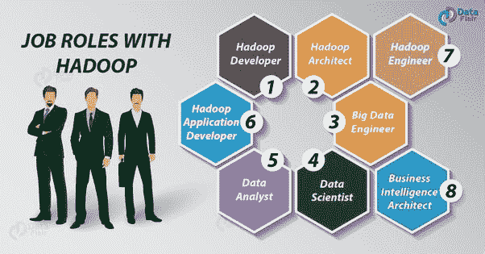

BI roles gradually moving out of the circle of Big Data teams.
Source: [DataFlair](https://data-flair.training/)

在行业层面，它的影响最大——因为不仅仅是科技公司和网络公司可以从大数据分析中创造产品和服务——它几乎是行业中的*每家公司*。

## 融合

由于使用大数据和数据科学策略的需求不断上升，科技行业突然出现了分化。因此，现场角色被分为三类:**软件工程**(前端*后端*工程师、 *Web 开发人员、基础设施管理员、中间件专家、iOS/Android 开发人员*)、**数据工程**(强大的数据背景，如 *ETL 开发人员、DWH 架构师、BI 分析师、Hadoop 工程师、DBA*)并欢迎第三组被视为下一代的个人

Venn Diagram showing tools & techniques under SE vs DE vs DS domains.
Source: Ryan Swanstrom, [Data Science 101](http://101.datascience.community/2016/11/28/data-scientists-data-engineers-software-engineers-the-difference-according-to-linkedin/)

据我所知，这种分类产生于一个重大的转变，其积极因素被小规模公司(< 50 employees) like emerging startups, research-facilities as well as large-scale enterprises (> 1000 名员工)如电信、电子商务、社交媒体等充分利用。初创公司可以自由地将多种角色合并为一个角色，并鼓励多学科的增长机会，而主流巨头在不同部门雇用不同的角色方面没有问题，从而增加了产生更多业务的领域。

现在拥有一家中型(或 SMB)公司的企业家，他们努力获得商业利润——在各自的市场上与大公司竞争——可以说受影响最大。最初的成功——通过一系列融资或风险投资的支持——使他们的数量得以扩大(50-300 多名员工)。他们匆忙进入无限期雇佣，多余的角色，糟糕的决策策略。最终，在季度时间表下留在市场的持续压力迫使前所未有的裁员，股票分配损失，甚至导致早期清算。一些精通技术的投资者(我想称他们为*守护天使*)提供并购援助，但是这个行业第一次看到了吸收角色的负面影响。

## 重叠部分

与此同时，不仅仅是公司在演变数据角色方面遇到了困难。这个时代见证了越来越多的*数据科学爱好者(*学术&经验丰富)走出舒适的洞穴&扩展他们的技能组合。为什么不呢，这些申请者(数学家、工程师、博士、分析师、毕业生)都有权利申请 21 世纪收入最高的工作之一。出现了受人尊敬的大学教授和慈善家，带着他们版本的*理想候选人*，这只会引起偏见，却无法阻止暴民。

带有*数据前缀*的头衔有助于早期区分任务相似的角色。其目的是确定技能范围和利用合适的潜力。**数据分析师**避开业务，将他们的目光投向统计&工程，而**数据架构师**保持他们的深度——专注于发布模型(不要与 ML 混淆)、数据库设计、治理以及他们标志性的*政治中立*态度。

Radar chart explaining overlap of skills between Data-driven roles.
Ignore Mad Skillz as it implies **Natural Abilities**. Source:[edX](https://courses.edx.org/courses/course-v1:Microsoft+DAT210x+1T2018a/course/)

企业开始通过围绕其前提利用机器学习培养*规定性分析的能力*来收集更多的理解。他们开始不仅在传统意义上竞争分析——通过改善内部业务决策——而且通过创造更有价值的*产品和服务。*实现具体目标的纯粹需求(或贪婪)——比上一季度的结果有所改善——成比例地带来了角色和职责的开销。因此，像**数据科学家、**这样一个充满希望但又充满挑战的职位也需要一个跨团队的核心人物——任何与数据相关的事情的日常联系人。对于许多背负如此沉重负担的人的压力和疲劳，人们谈得不多。如果一个有这种能力的人把大部分时间花在*分析*上，他们也会设法找到时间为自己追求更好的机会。这里有一个在 [KDnuggets](https://www.kdnuggets.com/2018/04/why-data-scientists-leaving-jobs.html) 上的讽刺来支持我的观点。

## 权衡取舍

两大问题浮出水面:数据科学是下一个泡沫吗？我的回答是:没有，但“*数据科学家”*的头衔可能会成为一个头衔。一个教科书式的需求和供给问题——每个有抱负的人都想得到公平份额的商品，但只有少数人被证明值得拥有。嗯，有点困惑！—你如何应对一名应届毕业生申请这个职位，或者当你的数据科学家可能会离开，留给你的是一群“自称”的人来敲你的门时，你该怎么办？

第二，直接从网站、API、社交媒体或互联网等来源获取数据；对软件编程语言的需求&快速高效地实现这一需求的能力——不能妥协。“不是所有的数据科学家都有很好的软件基础”或者“为什么在数据科学的热潮中，软件工程的概念被忽视了？”。公司很快意识到，只有角色的重新分配才能使这种倾向正常化，因为他们指望更广泛的 *工程师***——**来大力支持他们的数据科学家，并在不同的实体角色之间找到平衡。

软件工程师，似乎有数据科学&机器学习的诀窍，站出来帮助解决这一困境，并加强了数据工程师俱乐部。当那些实践核心 web 编程&栈驱动野心的人转向更大的挑战:**全栈工程师**。

Full-Stack by past roles (L) & by tech-stack areas (R).

双赢的局面:数据科学家得到了一个可靠的助手，他松了一口气(对他们“王冠”的夸大宣传降低了)，并且一个同样胜任的角色即将挑战他们。这种勾结不仅让那些渴望的狂热分子转了起来，还打开了另一扇门，使数据工程成为当今最复杂的学科之一。这位现代的**数据工程师**补充了其他所有的角色，是每个公司必备的勤杂工，实际上是如今初创公司的[第一批雇员](https://hackernoon.com/top-10-roles-for-your-data-science-team-e7f05d90d961)。

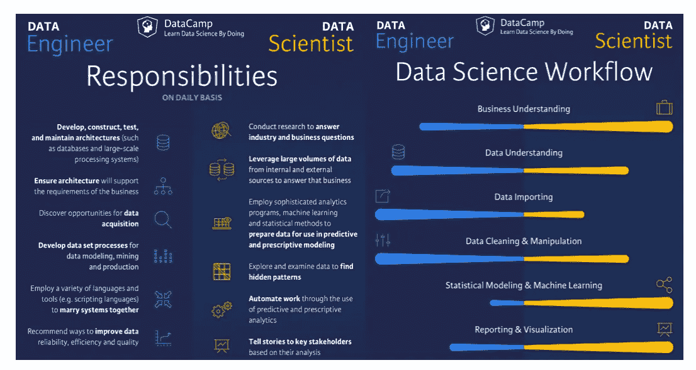

An Infographic-take on Data Engineers and Data Scientists.
Source: Read Full Post on [DE vs DS](https://www.datacamp.com/community/blog/data-scientist-vs-data-engineer), by Karlijn Willems

通过平衡相互不同的角色进行的*赌博*(点击的变通办法)获得了完美的回报，但技术行业知道他们不能承受另一次挫折，必须准备好迎接日益被接受的人工智能。

## 该决议

不可避免地，公司发现了他们组织结构中的缺陷:职位、优先权和能力——并接受了*数据驱动团队* ***。主要的焦点是角色区分、分工、避免任务冲突、适当的合作规则。基于角色的领导者在这样的团队中领导各自的单位的扩展示例是:*首席数据科学家&* *工程领导。****

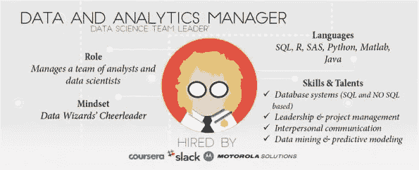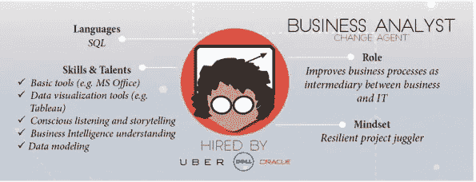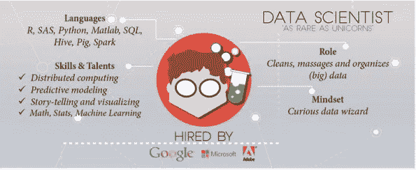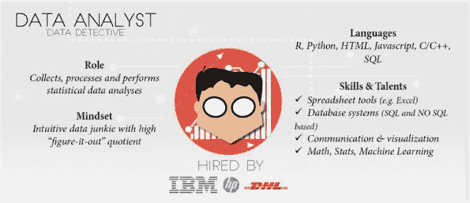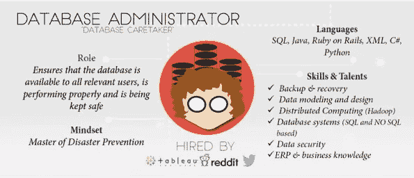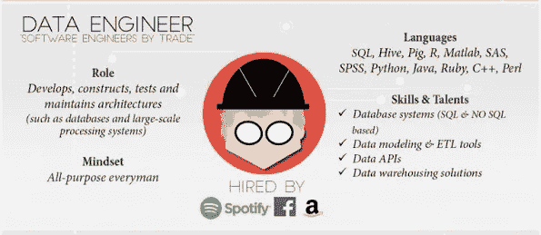

An early look of a well-structured Data Science team under the same roof. Source: [DataCamp Blog Community](https://www.datacamp.com/community/tutorials/data-science-industry-infographic)

今天，一个完美的数据科学团队是一个神话，或者是一个引起激烈争论的话题。公司对他们团队的期望是像一群超级英雄(*《复仇者联盟》*)*——*他们在许多场合悲惨失败的是任命一个为这些团队提供背景的人(*尼克·弗瑞*)。这就是首席数据官强大存在的地方。随着数据成为不可或缺的商业战略，CDO 在组织中扮演着越来越重要的角色。《福布斯》的一项调查显示，2018 年，超过 50%的 CDO 可能会直接向 CEO 汇报。他们一定会在塑造企业计划方面扮演更积极的角色。

通常，当我看到包含“高级英语技能”或“仅限本土候选人”的职位描述时，我会感到失望。因此，我每次都会主动质疑(或搜索)这样的招聘海报(我很享受它们明显的停顿)。语言不应被视为障碍，而应被用作团结团队的强大源泉。2018 年最能说明我立场的例子，确实是语言本身: **Python** 。创始人(CEO&CDO)必须在他们的团队内部进行这些小交流，最重要的是——他们的第一个焦点——人才需求**团队**团队**。**

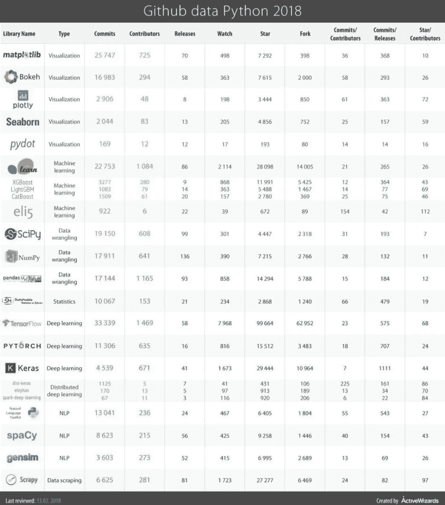

How Python brings a team of diversified role-types together.
Source: [ActiveWizards](https://activewizards.com/blog/top-20-python-libraries-for-data-science-in-2018/)

如今，人力资源协调员、招聘人员、外包猎头都可以访问大量的数据资源(Medium、Datacamp)和数据友好型平台(LinkedIn Recruiter、Glassdoor ),以完善他们对改善招聘的搜索；因此使得他们的角色甚至是数据驱动的。

# 机器学习和人工智能驱动的角色

也许机器学习最引人注目的方面是它看似无限的适用性。已经有那么多领域被 ML 和现在的 AI 冲击了，包括[教育](https://www.thetechedvocate.org/7-roles-for-artificial-intelligence-in-education/)、[金融](https://sigmoidal.io/real-applications-of-ai-in-finance/)等等。机器学习技术已经被应用到医疗保健领域的关键领域，影响了从[减少医疗变化的努力](http://smartblogs.com/leadership/2015/06/16/how-machine-learning-driven-interventions-can-build-value-in-health-care/)到[医疗扫描分析](https://www.itnonline.com/content/aidoc-introduces-ai-solution-whole-body-ct-scan-analysis)的方方面面

对于许多公司来说，他们的数据(或数据分析平台)*就是*他们的产品。在这种情况下，正在进行的数据分析或机器学习可能会非常激烈。对于有正式的数学、统计学或物理学背景并希望继续走学术道路的人来说，这可能是理想的情况。

*“机器学习工程师通常更专注于生产伟大的数据驱动产品，而不是回答公司的运营问题。”*

New addition to the DataScience team working on ML. Source:[Udacity](https://blog.udacity.com/2018/01/4-types-data-science-jobs.html)

公司变得更加令人鼓舞，并一直在寻找**机器学习工程师**:各年龄段(学术实习生到研究科学家)的开明候选人。从 LinkedIn、Medium 和 Github 可以看出，社交媒体一代也比以前更受欢迎。

Bird’s-Eye view of multiple ML-roles in AI firms. Source:[Udacity](https://blog.udacity.com/2016/04/5-skills-you-need-to-become-a-machine-learning-engineer.html)

人工智能驱动的公司成功实现了智能机器(如聊天机器人)，已经比其他公司领先一步。由*软件、应用&核心*赋予的角色是一个明确的标志——他们对他们的产品开发&服务提供是认真的。因为在这个问题上没有任何关于名字或资历的概括，他们有充分的自由在未来即兴创作 *AI 头衔*。

# 包含角色

有许多角色可以在日常工作中补充数据驱动团队。无论他们属于哪个团队，他们都是组织中不可或缺的一员。你可能会奇怪为什么我没有早点提到它们。老实说，我对此表示怀疑，原因如下:

*   我对这些概况及其范围的专业知识有限。
*   他们主要不属于数据驱动角色的范畴。
*   他们的领域多样性允许他们跨不同的团队运作。

在*持刀暴徒*到来之前，让我试着解释一下。

*   **平面设计师:**各种意义上的创意总监。艺术、科学、编程、想法和想象力的完整组合，具有无限的能力。他们以敢于直言的无畏态度增加价值。我个人的最爱。
*   **决策者:**一个经常被误解和忽视的角色。尤其是在特定领域的初创公司，在雇佣经过博士培训的数据科学家之前，要确保你有一个了解决策艺术科学的决策者。
*   站点可靠性工程师:大致分为两类:“业务能力团队”和“敏捷运营团队”。数据架构师&工程师可以协调、学习和实施基于云(IaaS、PaaS、SaaS)的配置、容器、微服务部署&虚拟化等任务。然而， *DataOps* 是一个新的平台，允许企业内部持续的数据流。
*   **云架构师**:通常担任咨询角色的技术专家(像他们的云服务一样按小时收费)。同样，如果您的数据工程师熟悉云概念或认证助理/专家，您可以选择不聘用他们。
*   **项目&交付经理—** 一些数据科学&分析公司仍然不得不屈服于敏捷& Scrum 方法论的旧规范。在开始咨询客户以协调产品销售和服务之前，他们需要经验丰富的经理来确保 PoC(概念验证)时间表&资源得到合理分配。
*   **网络&网络安全工程师**:通常被视为内部团队，但在所有上述提到的团队中，他们很快将成为数据驱动团队不可或缺的一部分。随着数据安全在 2018 年已经显示出威胁性的担忧，这些角色已经被认识到“至关重要”，因为大多数公司每天都在网上运营。

# 离别的思绪

当然，在工具方面，技术变得比以往任何时候都更容易使用和直观。例如，在大多数清理、建模、报告和可视化工具中有一系列适配器，这意味着加载数据本身不再是一个非常重要的需求。然而，这也鼓励了某种程度上无处不在的数据视图——它应该只需最少的努力就能工作。一个不祥的风险是，越来越少的时间将被用于纠正基本面。

2018-2019 年值得关注的技术和行业:

*   渐进式网络应用(PWAs)——移动和网络应用的混合体。
*   区块链和金融科技-元模型构建，可靠的交易和信用评分。
*   医疗保健—通过医学成像(计算机视觉和 ML)进行诊断。
*   AR/VR-体育分析、名片(图像跟踪)、现实游戏(Hado)。
*   人工智能语音助手，更智能的聊天机器人集成。
*   智能供应链——数字双胞胎(物联网传感器)。
*   5G——大数据、移动云计算、可扩展物联网和网络功能虚拟化(NFV)。
*   3D 打印——预制效率、缺陷检测、预测性 ML 维护。
*   黑暗数据——尚未以数字格式提供的信息。
*   量子计算——将数据处理时间缩短至几分之一。

最后，在工作方面，很明显，这些角色将无法跟上技术的发展。抓住下一个机会会很困难。根据许多就业顾问的说法，有两种方法可以保持工作的稳定性:成为一个领域的专家，在一个稳定的公司中坚持自己的立场，或者通过识别与技术趋势一致的新领域来寻求具有挑战性的角色。作为一名数据工程师，我遵循一种混合方法——在职业生涯和个人抱负之间保持学习纪律——这实际上允许我在任何技术驱动的行业工作。如果有任何安慰的话，我肯定知道我要对我未来的成功和失败负责。

> “永远不要让别人告诉你，你不能做一些事情。如果你有梦想，就要捍卫它。人们自己做不到一些事情，他们想告诉你你也做不到。你想要什么，就去得到它。句号。”
> 
> **对海蓓娜斯的追求**

见原帖发表在:[苹果！=橘子](https://deepesh-nair.blog/2018/09/06/the-dynamics-of-data-roles-teams/)