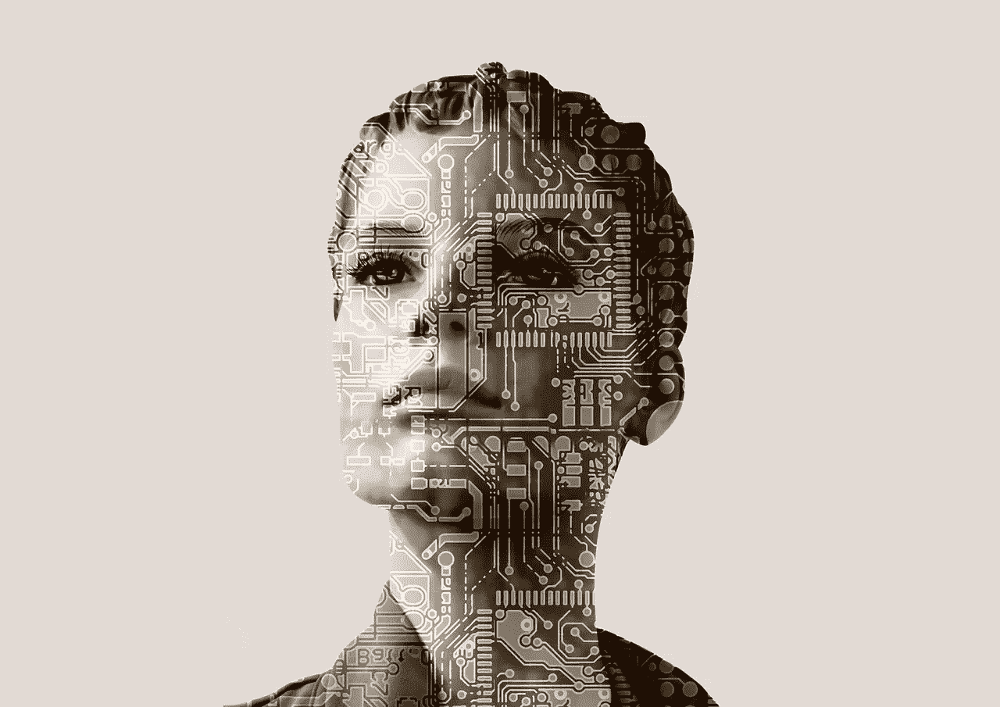

# 人工智能的出现

> 原文：<https://towardsdatascience.com/the-emergence-of-artificial-intelligence-3cde7378768e?source=collection_archive---------13----------------------->

几周前，谷歌首席执行官桑德尔·皮帅在 Recode 赞助的活动中告诉观众，对人类来说，人工智能的影响可能“比电或火更深远”。在这篇文章中，我将探索人工智能如何从数据和算法中产生，以及计算的未来进步将如何帮助它的发展。

**数据和分析**

术语“大数据”描述了组织收集的数据的数量、速度和种类不断增加。它是一个包罗万象的术语，用来描述组织收集的大型数据集。这些数据集中的信息(包括关于组织的产品和服务、内部流程、市场条件和竞争对手、供应链、消费者偏好趋势、个人消费者偏好以及消费者与产品、服务和在线门户之间的特定交互的信息)可用于回顾性或前瞻性分析。为分析此类数据而开发的分析技术统称为数据分析，通常涉及基于计算机的定量模型的使用。回顾性方法有时被描述为描述性的(分析数据并对重要趋势进行总结和可视化描述)或诊断性的(查看过去的数据以确定哪里出了问题)。前瞻性方法可以是预测性的(使用过去的趋势来预测未来的趋势)，或者充其量是规定性的(预测未来的趋势，并根据某些度量建议组织策略来最大化绩效)。

**算法**

数据分析使用算法来处理数据集，以便提取有意义的信息。算法是对完成任务所执行的步骤的描述。例如，您可以使用一系列步骤在停车场找到您的汽车。首先，你可以查看它是否在你的视野范围内。第二，你可能会检查你是否有一个纸条或收据，表明你的车在哪里。第三，你可以有条不紊地走过停车场，直到找到你的车。如果你把这三个步骤编程到你的手机里，它们就会变成一个算法。

选择解决特定问题的最佳算法可以给组织带来显著的竞争优势。如果一个算法能够快速准确地完成某项任务，那么它就是适合该任务的。谷歌凭借一种名为 PageRank 的算法(由拉里·佩奇和谢尔盖·布林于 1996 年开发)在网络搜索行业占据主导地位，该算法根据其他网站到这些网站的超链接的数量(和质量)对网站进行排名。商业模式需要大量使用一些算法的组织的最近例子包括优步和 Stitch Fix。

**机器学习算法**

虽然组织可以通过使用适当的算法来分析特定类型的数据而受益匪浅，但在遇到数据时自我改进的算法可能会更加有用。

受监督的机器学习算法在其字段已经被“标记”的数据上被“训练”。然后，他们根据自己的训练对新的输入数据进行分类。例如，可以训练算法将越南语翻译成英语，以确定哪些收件箱电子邮件是垃圾邮件，或者在给定汽车属性的标记集时确定汽车制造商。今天使用的绝大多数机器学习算法都使用监督学习方法。

其他种类的算法包括无监督学习、半监督学习和强化学习。无监督的机器学习算法直接处理“未标记”的数据，在其中找到模式，并提取他们认为有意义的信息。例如，无监督的机器学习算法可能会查看世界上所有不同种类的植物和动物，然后根据算法认为必不可少的任何属性来组织它们。算法可能会选择根据对人类有意义的属性(如大小、颜色或移动性)或根据其他一些对我们来说不直观的属性来组织它们。数据科学家还开发了半监督机器学习算法，该算法结合了监督和非监督机器学习算法的元素。强化学习通过反复试验来达到目的。尽管无监督、半监督和强化学习方法在很大程度上仍处于研究阶段，但它们将很快应用于现实世界的案例。

机器学习方法也可以以其他方式分类。例如，人工智能学者 Pedro Domingos 将机器学习算法分为[五大学派](https://www.amazon.com/Master-Algorithm-Ultimate-Learning-Machine-ebook/dp/B012271YB2)(象征主义者、连接主义者、进化论者、贝叶斯主义者和类比主义者)。

深度学习是最有前途的机器学习方法之一(如果目前可能被过度宣传的话)(这属于多明戈斯所说的‘连接主义’学派)。深度学习使用神经网络(由几层组成，通过这些层可以前馈信息)。神经网络是通过一个叫做反向传播的过程来训练的。虽然神经网络中节点的动作是模拟人脑中神经元的动作，但是在神经网络的工作和人脑的工作之间几乎没有相似之处。

**人工智能**

人工智能描述了我们认为需要人类智能的机器能力。由于这个定义是主观的，某种机器能力是否被认为是人工智能可能会随着我们对计算机的期望的演变而变化。由于几个世纪以来，机器已经能够比人类更好地执行某些特定的任务(例如，加减数字)，我们不认为这样的任务需要人类的智慧。我们以前认为需要人类智能的一些任务(例如将文本翻译成不同的语言)现在可以很容易地由计算机完成，所以今天我们可能会也可能不会将语言翻译算法视为人工智能。我们仍然预计精确的视觉感知和语音识别需要人类智能，因此有效完成这些任务的机器学习算法将很可能被认为是人工智能(暂时)。

然而，人类智能与机器学习算法的真正区别在于，前者能够处理各种各样的复杂任务。即使是今天最令人印象深刻的机器学习应用程序，如 DeepMind 的 AlphaGo 计算机程序(在复杂的棋盘游戏围棋中，它比任何人类棋手都强)，也被认为是“弱”人工智能:它们中的每一个都只专注于一项或一组狭窄的任务。即使是正在进行的大型人工智能项目，如丰田通过在美国投资 10 亿美元进行研究来改善制造流程的努力，或苹果秘密的自动驾驶汽车项目，也可能导致“弱”但令人印象深刻的人工智能。

我们还没有实现一个‘强’的人工智能(也称人工通用智能)，它能完成一个人类能完成的所有智力任务。然而，过去几年人工智能的重大进展表明，在可预见的未来，强大的人工智能可能是可以实现的。

**芯片和超级计算机**

人工智能需要合适的机器学习算法、数据和计算能力。当今许多最有前途的人工智能技术都使用神经网络。神经网络可以小而简单，也可以大而强大。神经网络越大，功能越强大。达到神经网络的极限，从而达到今天人工智能性能的极限，需要使用强大的计算机芯片。尽管英特尔长期以来一直是超级计算机芯片的市场领导者，但英伟达、谷歌和其他公司正在竞相开发专门用于深度学习和其他人工智能用途的芯片。

当它今年晚些时候上线时，世界上最快的计算机将很快成为位于美国能源部橡树岭国家实验室的名为 Summit 的 200 petaflop 计算机。然而，世界上一些最快的计算机根本不依赖美国制造的芯片。其中一台这样的计算机是中国的 125.4 petaflop 超级计算机神威太湖之光，这是目前世界上最快的超级计算机。另一台将于 2018 年上线的尖端超级计算机是日本政府的 130 petaflop AI 桥接云基础设施(ABCI)。日本政府将向日本公司和研究人员出租 ABCI 的使用权，期望他们将其用于深度学习和人工智能应用。

这些和其他趋势表明，人工智能的进步既由符合摩尔定律(英特尔联合创始人戈登·摩尔在 1975 年观察到计算机芯片上的晶体管数量可以预期每两年翻一番)的硬件发展推动，也有助于硬件发展。

**量子计算的前景**

虽然摩尔定律准确地描述了 21 世纪计算能力的指数增长，但行业领导者英特尔最近开发新芯片的时间比过去更长。这导致一些分析师质疑芯片发展是否会继续按照摩尔定律进行。英特尔[反驳](https://www.fastcompany.com/40401818/moores-law-survives-but-its-not-what-it-used-to-be)说，虽然它的芯片需要更长的时间来开发，但新芯片一旦发布，其性能就符合摩尔定律的预测。然而，专家们担心，在传统计算中，摩尔定律正在触及其上限，进一步的芯片小型化可能很困难，也许在经济上不可行。

一些专家正期待量子计算机在计算能力方面取得新的进展。量子计算机已经处于研究阶段几十年了。加拿大公司 D-Wave 已经在销售它所谓的量子计算机，但专家们不认为这是真正的量子计算机，而且在大多数应用中，这种计算机可能不比传统计算机快。尽管如此，D-Wave 计算机在一些应用中还是有用的:大众汽车使用 D-Wave 的量子计算开发了一种算法来优化北京的交通流量。使用 D-Wave 的计算机，该算法可以在几秒钟内运行[，而传统计算机需要大约 30 分钟才能完成同样的任务。](https://asia.nikkei.com/print/article/286051)

谷歌、微软、IBM 和其他公司已经表示，他们将在几年内拥有可工作的量子计算机。量子计算崛起的一个重要里程碑将是“量子优势”的实现:量子计算机可以比任何经典计算机更好地执行某些明确定义的高性能任务。尽管大型科技公司纷纷宣布，但尚不清楚量子计算何时会变得普遍:可能在未来几年或几十年内。

**一项变革性的技术**

数据的创建出现了爆炸式增长，数据是算法的食粮。计算能力的进步使得越来越复杂和强大的机器学习算法能够运行。随着这些算法的改进，它们将在许多方面赶上或超过人类的智能。它们将在各个行业得到应用，从生物技术(它们将与基因组学交叉)到制造业。虽然还不清楚强人工智能需要多长时间才能出现，但可以预计大量弱人工智能将改变人类社会。人工智能对人类的影响确实将是变革性的，就像之前的火或电一样。

接下来:[深度人工智能](http://www.rayadvisors.com/blog/artificial-intelligence-in-depth)。

[沙恩雷](http://www.shaanray.com/)

请关注媒体上的 Lansaar Research ，了解最新的新兴技术和新的商业模式。

 [## 沙恩·雷

### 来自 Shaan Ray 的最新推文(@ShaanRay)。创造新价值和探索新兴技术| ENTJ | #科学…

twitter.com](https://twitter.com/shaanray)