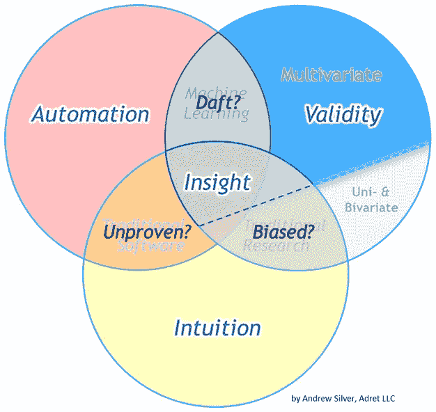
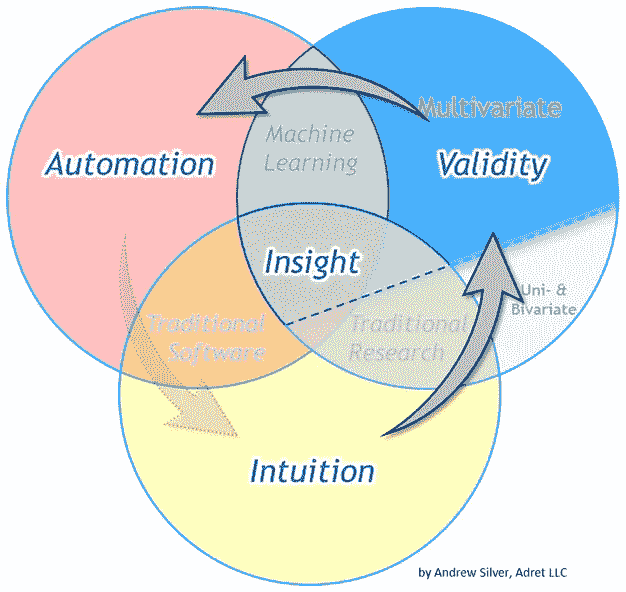
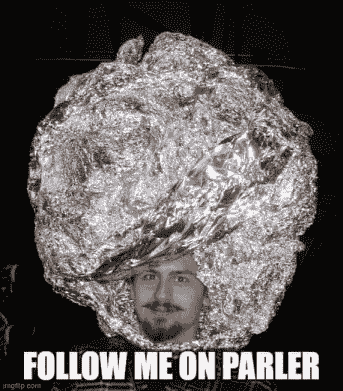

# 基本数据科学文氏图

> 原文：<https://towardsdatascience.com/the-essential-data-science-venn-diagram-35800c3bef40?source=collection_archive---------17----------------------->

Cross-posted on KDnuggets

几年前，德鲁·康威提出并分享了他现在无处不在的数据科学维恩图。这很有帮助，我们都受到了启发。谢谢你康威医生。

[许多变种](https://www.kdnuggets.com/2016/10/battle-data-science-venn-diagrams.html)随之而来，我在这里提出我自己的改进。希望它们也能有所启发。我提议增加两项内容:统计应用的区分(多元*与*)。非多元)以及学科*精华* ( *即*，各技能集的主要贡献或作用)。

首先，让我说，我的维恩图，像所有的维恩图一样，有内在的缺陷。为什么？因为它是一个二维图，说明了什么是固有的多维动态。这部分体现在下角的免责声明中，没有显示*沟通*(听觉+视觉)和*软技能*的维度。*创意*、*坚韧*、*自省诚实*等属性也从图形中缺失。

# **需要**

统计学广泛处理方差结构的量化，其令人高兴的结果是能够建立描述性、解释性、预测性和规范性模型(数据科学的输出)。因此，在数据科学维恩图上记录统计方法中最大的方差来源并不可耻:多变量统计方法*(评估≥ 3 个变量)*与*之间的差异。【单变量&双变量】统计方法。*

*是的，我在这里暗示这比被监督的*和*之间的差别更大。无监督统计建模、参数*对*非参数建模、*等*。我这一主张所基于的方差度量是人类对高级统计方法的*认知*的显著差异。*需求*是人们应该更加*意识到*多元分析在第四次工业革命中发挥的核心作用。*

*这种划分的一个含义是，“传统研究”在很大程度上没有充分利用多元统计。根据你的学科，这个暗示可能不成立。不幸的是，对于许多学科来说，它*确实*成立。可以说，这一事实是如此多的行业容易受到干扰的部分原因。*

*这方面的一个例子是持续过度依赖决定系数(R 平方),这种情况在许多循环中持续存在。R-squared 对异常值没有抵抗力，仅与目标变量相关，可能会随着串行相关数据膨胀，并且在许多其他方面可能不可靠。尽管如此，它还是被大量使用——部分是因为 Excel 和几乎所有其他绘图工具使它变得容易获得。虽然 R 平方可以是一个有用的工具，但它仍然是一个必须正确使用的工具(*例如*，用于评估 *bi* 变量线性关联)。*

*多变量问题需要多变量工具，而大多数业务挑战本质上都是多变量的。在学习如何正确应用计算多元统计(⊆ " [机器学习](https://www.deeplearningbook.org/contents/ml.html)")方面，许多分析师和技术专业人士还有很长的路要走。因此，他们仍然容易受到竞争对手的干扰，这些竞争对手利用多变量算法从数据中获得更好的洞察力……或者他们自己采用无效策略造成的干扰(*例如*、[创新者的困境](https://en.wikipedia.org/wiki/The_Innovator%27s_Dilemma)，其典型特征是忽视低端市场、低利润的机会，而这些机会可能会催生未来的竞争)。*

**

*The Essences of Contributed Expertise*

# ***本质含义***

*这三个专业领域也可以用他们所提供的更简单的术语来表述(*即*，他们的 ***本质*** ): ***直觉*** ， ***有效性*** ，以及 ***自动化*** )。自动化也可以称为*升级*。他们的融合为我们提供了改进的 ***洞察力*** 。正如所描绘的，洞察力也可以简单地来自拥有有效直觉的重叠(自动化不是先决条件)。历史上的大部分时间都是如此。当前对高级分析的大肆宣传主要是通过自动化数据收集、处理和分析来加速洞察。*

*“偏见”的危险存在于“传统研究”区域，是数据科学维恩图此次更新的主要灵感。统计上的“偏差”是排除或忽略重要的变量，就像口语中的意思一样。由于大多数人不熟悉处理多变量分析，当多变量问题作为双变量或单变量问题处理时，偏差的危险最容易出现。如上所述，偏见的存在使组织容易受到新来者的破坏，新来者的多元方法使他们成为更有洞察力的竞争对手。*

*还要注意，对应于“机器学习”的重叠区域缺乏直觉(*即*，是“daft”——一种明显的偏差形式)。一些人无疑会对此提出抗议。但是想想看，在我们与物理世界和社会的几十年互动中，人们获得了一种没有任何人工智能模型能够接近获得的直觉水平(*举例*，知道任何人工智能应用程序知道*并欣赏*盐的味道吗？).ML 模型只知道我们告诉他们的(我们提供的数据),模型输出最终会反映出来。ML 模型可以变得非常擅长我们训练它们做的事情，但它们仍然需要由人类来训练。(注意:即使是年轻的人类也需要年长的、更智慧的人类来训练。)从广泛经验中获得的*背景*建立*直觉*。背景很重要。*

*标记为“传统软件”的领域很难描述。这又回到了试图用二维图形概括多变量系统的局限性。这种重叠也可以被用来描述机械自动化(这无疑构成了全球经济的重要组成部分)。为了讨论的目的，在大多数白领智力活动的背景下，可以说在执行风险评估时，这个领域可能缺乏严密性。*

# ***操作顺序***

*在大多数情况下，在如何整合每个专业领域的顺序中，有一个固有的操作顺序或“最佳实践”。参与的顺序通常是*直觉*首先*，*然后*验证*，然后*自动化*。我们通常会在直觉首先引导我们产生一个想法后，测试这个想法是否有效。同样，我们不应该升级(自动化)实现，除非它们首先被认为是有效的。*

**

*上述提议的顺序有例外吗？当然可以！机器学习输出引起领域专家注意的关联并不罕见，而他们以前忽略了或没有意识到这一点。也有很多案例，领域专家的启发式方法已经在自动化系统中实现，并且在数据收集变得可能时得到验证。让我们也不要忘记自动化在帮助我们首先收集数据方面的作用，这些数据可以在以后用领域专业知识和统计严谨性进行评估。*

# ***σ***

*总而言之，这个新的文氏图告诉我们一些我们已经知道，但可能还没有正式表达出来的事情。这是一个简单的模式，因此可以帮助人们更好地确定工作流的优先级。例如，它鼓励数据科学家通过首先与领域专家交谈来开始他们的工作——这已经被吹捧为最佳实践。如果你是那种不满足于列出*做什么*到*做什么*还想了解*为什么做*的人，了解事情如何发生的本质*会有所帮助。**

*大约 70 年前，塞缪尔·威尔克斯写道:“有一天，统计思维将像读写能力一样成为高效公民的必要条件。”在不久的将来，*多元*统计思维可能会成为远远更多职业的必备条件。如果我对数据科学维恩图的重复使用对任何人有所帮助，我会认为这是值得的。*

****世界是我们造就的，它需要变得更聪明*** 。如果你喜欢这篇文章，考虑与朋友分享。*

**(注:这些文氏图图形可能与属性一起使用。上图的初始迭代于 2017 年初首次发布在 www.adret-llc.com***和 LinkedIn* *上。)***

# **附录**

***(2020 年 11 月)***

***自动化*的效果在本文最初的草稿中没有给予足够的重视。某些形式的自动化对于维持我们这个星球上 70 多亿人的生活是必要的。与此同时，某些其他形式的自动化对社会构成了巨大威胁——也就是说，那些被不人道和不可持续地部署的自动化。为了理解自动化的风险，我推荐两个资源:书籍 [*【数学毁灭的武器】*](https://weaponsofmathdestructionbook.com/) 和电影 [*《社会困境》*](https://www.thesocialdilemma.com/) 。**

**错误信息正以算法的速度向我们袭来。某些坏演员已经发现，他们可以通过用虚假的*淹没民众来掩盖他们自私的行为。在更阴险的情况下，他们通过算法利用我们与家人和朋友的关系向我们提供错误信息。虽然每*分钟*就有一个白痴诞生，但如果他们在脸书或 YouTube 上花太多时间，每*秒*就会产生一个白痴。人类现在正与训练有素的机器学习黑匣子进行竞争，这些黑匣子旨在优化利润或灌输宣传。人类经常会输。***

****

**(image source unknown)**

**就连朗朗上口的短语“假新闻”(不幸的是，部分来源于事实)也被用来引导人们从半审查的新闻来源转向充斥着疯狂阴谋论的社交网络平台。考虑到社交网络因此获得的额外流量，如果这些社交网络最终推广了主流媒体(MSM)新闻都是假的这一错误观念，那就不足为奇了。**

**来自物理自动化的威胁对社会来说也是可怕的。美国中产阶级已经受到无数制造业工作外包的冲击，现在又面临着由能干而灵活的机器人承担大量额外工作的威胁。从开卡车到煎汉堡，从查阅法律文件到诊断癌症，从绘画到作曲，越来越多的职业被证明容易受到自动化的影响。(事实上，就在几年后，这份声明可能需要另一份增编。)**

**由于自动化趋势进一步加剧了社会不平等和/或文明，它们会破坏社会本身的稳定。考虑到社会不稳定的危险(想想法国大革命期间断头台的猖獗使用)，所有监督自动化工作的决策者都应该整体考虑。优化不应该仅仅是金钱上的努力，还应该存在于社会可持续发展的框架中。它可能会帮助每个人保持冷静的头脑…并正确地安装在他们应该在的地方。**

**熟悉*受害者三角*(又名 [*戏剧三角*](https://en.wikipedia.org/wiki/Karpman_drama_triangle) ，一种 [*交易分析*](https://en.wikipedia.org/wiki/Transactional_analysis) 的工具)的心理动力学的人都知道，逃离其中苦难漩涡的唯一方法是 ***负责*** 解决问题。在数据分析的情况下，这意味着 ***责任*** 来平衡*直觉、有效性*评估、和实现*自动化* …对我们的组织和我们的社区都是如此。**