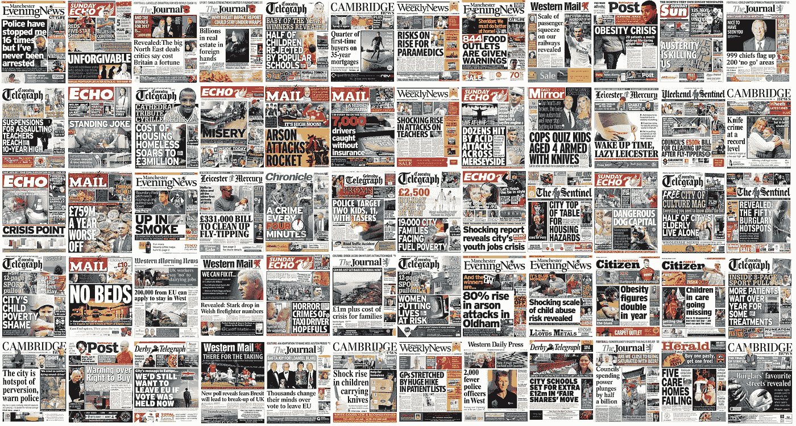

# 数据新闻的演变

> 原文：<https://towardsdatascience.com/the-evolution-of-data-journalism-1e4c2802bc3d?source=collection_archive---------12----------------------->

我正在写一篇关于 Trinity Mirror 数据单元在过去五年中的发展的文章，因此从去年一月开始，我已经收集了一些头版新闻。

这些故事来源广泛。有些来自数据部门，深入到定期发布的地方级别数据集，这是我们工作的基础。有些是来自 FOI 的请求；有些是擦伤造成的；有些是很好的老式的基于想法的调查:“我想知道是否…”

他们的共同点是，他们都是由数据单元编写的故事(或与同事共同编写的关于个人三位一体镜像标题的故事)，如果没有我们，他们不会讲述这些故事。

当我们是一个数字优先的单位时，把这样的摊子放在头版看起来很奇怪，但有*有*指向它。数据新闻不再是外来的新奇事物，也不应该期望被当作一种事物来对待。数据新闻需要*不断*爆出伟大的故事，没有它就不会被讲述的故事。它需要像新闻业的其他部分一样遵循同样的节奏。它需要接受同样的压力:编辑压力、商业压力、参与压力。

数据记者需要像其他记者一样判断自己。我打破了多少故事？他们有多好？有多少人在阅读它们并参与其中？数据新闻让我能够以更好的方式*讲述故事和分享信息吗？更重要的是，我有支持这种说法的受众指标吗？*

创新让数据新闻登上了头版。交付日复一日地出现在头版*。创新是建立一个时髦的互动，让读者探索和理解一个重要的问题。交付就是这样做，*并让大量的人实际使用它*；然后第二天*造另一个，第三天*又造一个。*

*变化的速度如此之快，以至于新闻业的岁月就像狗的岁月:对我们来说，一年就像其他行业的五年、十年、十五年。*

*数据新闻不再觉得年轻了。数据新闻*仅仅存在*不再是创新。我们需要讨论交付——以及行业和我们的读者真正想要的交付类型。*